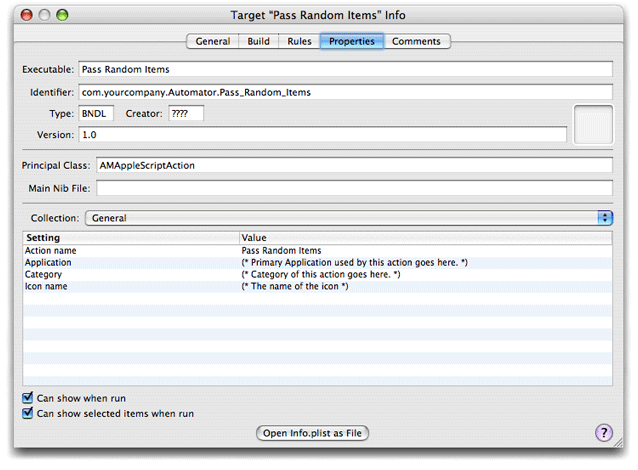
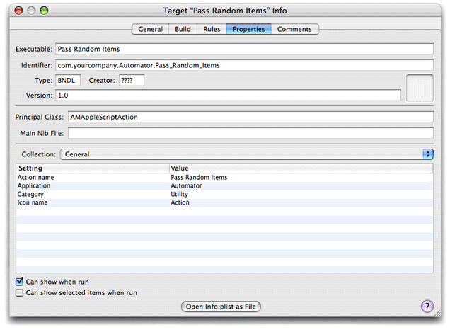
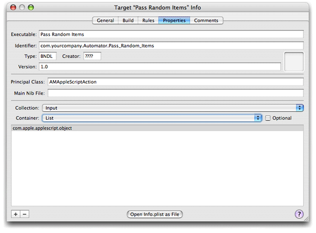
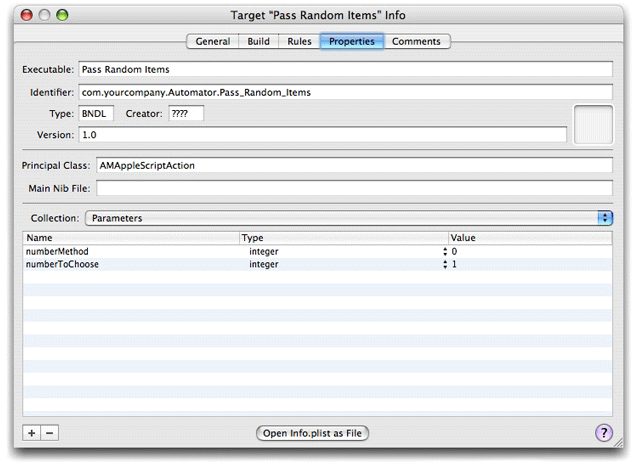
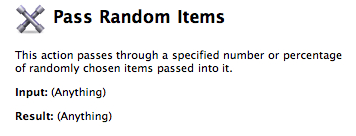

> 导航：[总目录](../../../README.md) · [documentation](../../../_indexes/documentation.md) · [Automator AppleScript Actions Tutorial](Introduction%20to%20Automator%20AppleScript%20Actions%20Tutorial.md)

[Next](Writing%20the%20Action%20Script.md)[Previous](Establishing%20Bindings.md)

# Configuring the Action

Every bundle in OS X—and that includes applications, frameworks, and loadable bundles such as actions—has an information property list. This property list, which is contained in a file named `Info.plist`, is a series of key-value pairs in XML format. The standard information property list defines such properties of the bundle as its identifier, its type code, and its main class.

Information property lists can contain properties other than the standard ones. Such is the case with Automator. In the `Info.plist` file of an action project you can (and in some cases must) specify properties that characterize the action, enabling Automator to display information about the action and handle it properly. For example, some Automator properties provide the name and description of an action and others indicate what types of data the action operates on (or produces). The following sections describe the basic approach to completing the action-specific properties and steps you through the properties that you must specify for Pass Random Items.

For complete descriptions of the Automator properties, see “[Automator Action Property Reference](https://developer.apple.com/library/archive/documentation/AppleApplications/Conceptual/AutomatorConcepts/Articles/AutomatorPropRef.html#//apple_ref/doc/uid/TP40001515)” in _[Automator Programming Guide](../Automator%20Programming%20Guide/Introduction%20to%20Automator%20Programming%20Guide.md#apple-f4xwc4dqnrsv64tfmyxwi33df52wszbpkridimbqgaytinjq)_.

Automator action projects take advantage of a special inspector built into Xcode for viewing and editing the action’s information property list. To access this editor, choose Edit Active Target ‘Pass Random Items’ from the Project menu. Then, click the Properties tab in the Target Info window to display the property inspector, which is shown in Figure 5-1.

__Figure 5-1__  The property inspector for Automator actions (general collection)

The first thing to note about the property inspector for actions is that it is divided into two parts. The upper half of the window contains general bundle properties, such as the name of the executable, the bundle identifier, and the principal class. You shouldn’t have to change any of these values.

The lower half of the window is the area for viewing and editing Automator-specific properties. The Collection pop-up list displays various groupings of properties. The first displayed is the General group. Note that the action name (and the last part of the bundle identifier) are automatically assigned the name of the Xcode project. (This automatic name assignment was introduced in Xcode 2.1.) You are going to keep the name for the action, but assign values to the Application, Category, and Icon name properties.

1. Double-click the cell under Value containing the comment for the Application property. This selects the cell and makes it editable.
2. Replace the comment with “Automator”.

   The application named here is either the one that the action primarily sends scripting commands to or the application that the action is most closely associated with.
3. Replace the comment for Category with “Utility”.

   Automator uses an action’s category in searches, along with keywords.
4. Replace the comment for Icon name with “Action”.

   This value requests a generic icon for actions to be displayed next to the action name in Automator.
5. Uncheck the check box labeled “Can show selected items when run.” Leave the check box “Can show when run” checked.

   This pair of settings allows you to specify values in the action’s user interface when the workflow containing it is executed; the entire user interface is displayed, not a subset of it. For more on the show-when-run feature, see “[Show When Run](https://developer.apple.com/library/archive/documentation/AppleApplications/Conceptual/AutomatorConcepts/Articles/ShowWhenRun.html#//apple_ref/doc/uid/TP40001567)” in _[Automator Programming Guide](../Automator%20Programming%20Guide/Introduction%20to%20Automator%20Programming%20Guide.md#apple-f4xwc4dqnrsv64tfmyxwi33df52wszbpkridimbqgaytinjq)_.

When you have finished these steps, the General collection of properties should look like the example in Figure 5-2.

__Figure 5-2__  The completed General collection of Automator properties)

Every action must specify what types of data it accepts from the action before it in the workflow and what types of data it provides to the next action in the workflow. The `AMAccepts` and `AMProvides` properties of the information property list allow you to do this. The Automator property inspector of Xcode shows these properties as the Input and Output collections.

Choose the Input collection from the pop-up list to display the view of the inspector shown in Figure 5-3.

__Figure 5-3__  Automator property inspector—Input collection

The main view for the Input collection is a single-column, headingless table. You click the plus (+) button to add a cell for a new entry and click the minus button (-) to delete the selected entry. The entries in this table are UTI-style type identifiers specifying the types of data the action can accept. The `Types` subproperty of the `AMAccepts` property for AppleScript action projects is initialized to `com.apple.applescript.object`, which means that the action can accept any type of AppleScript object as input. Since this fits the type of data that the Pass Random Items action can process—it merely passes on a random subset of the items passed it—you do not need to modify contents of the table.

When you are developing your own actions, you will probably want to specify different types of identifiers. For example, if your action handles iTunes songs, you would specify `com.apple.itunes.track-object`. If your action can handle URLs, you would enter `public.url` in the Input table. It’s best to be as specific as possible about the types of data that your action can accept and provide. For a listing of supported type identifiers for actions, see “[Automator Action Property Reference](https://developer.apple.com/library/archive/documentation/AppleApplications/Conceptual/AutomatorConcepts/Articles/AutomatorPropRef.html#//apple_ref/doc/uid/TP40001515)” in _[Automator Programming Guide](../Automator%20Programming%20Guide/Introduction%20to%20Automator%20Programming%20Guide.md#apple-f4xwc4dqnrsv64tfmyxwi33df52wszbpkridimbqgaytinjq)_.

The Input collection part of the inspector has two additional controls: a Container pop-up list and an Optional check box. These controls correspond to two subproperties of `AMAccepts`: `Container` and `Optional`. The former indicates whether the input data is a single item or a list of items; this control is almost always left as List. The latter control indicates whether input is optional for the action. Leave both controls unchanged.

The settings of the Output collection for Pass Random Items are identical to those for the Input collection. The type identifier is `com.apple.applescript.object` and Container is set to List.

The `AMDefaultParameters` property allows you to specify initial values for action controls when the action first appears in a workflow. In the Automator property inspector, you edit this property through the Parameters collection. The table for this property has three columns:

- Name — the key identifying the control and its associated property in the parameters dictionary
- Type — the type of data represented by the control
- Value — the initial value for the control

To set the initial value for the text field containing the number or percentage, do the following:

1. Click the plus button (+) below the table to insert a new row into the table.
2. Double-click the cell under the Name column to open it for editing.
3. Type “numberToChoose” in the cell; this is the same name that you gave the binding key in Interface Builder.
4. In the Type column of the same row, select “integer” from the pop-up list attached to the cell.
5. Double-click the cell under Value in the same row and type “1”.

Repeat the same procedure for the radio-button matrix, entering “numberMethod” for the name, “integer” for the type, and “0” for the value. When you are finished, the inspector window should look like the example in Figure 5-4.

__Figure 5-4__  The default parameters for the Pass Random Items action

When users browse through the actions available for Automator, they can see a brief description for each selected action in a small view in the lower-left corner of the application. When users select the Pass Random Items action, you want them to see the description shown in Figure 5-5.

__Figure 5-5__  The description for the Pass Random Items action

Descriptions can be simple like this one, or they can include things like requirements and warnings. The Automator property for descriptions is `AMDescription`; it has several subproperties for the various components of description: `AMDAlert`, `AMDInput`, `AMDNote`, `AMDOptions`, `AMDRelatedActions`, `AMDResult`, and `AMDSummary`.

For the Pass Random Items action you need only set one of these subproperties, `AMDSummary`, which is the short description of what the action does. The icon, title, Input, and Result parts of the description are automatically supplied by, respectively, the `AMIconName`, `AMActionName`, `AMAccepts`, and `AMProvides` properties. (You can provide your own description for the latter two properties in addition to the defaults, if you want.)

To set the `AMDSummary` property, do the following:

1. Choose the Description collection in the property inspector.
2. Double-click the cell under the Value column for the Summary row.
3. Replace the comment with the sentence shown in [Figure 5-5](#apple-f4xwc4dqnrsv64tfmyxwi33df52wszbpkridimbqgazdamjqfvbuqmrqgywueq2jivdeoqsb).

There are several other Automator properties which you can access through the Collection pop-up list. One very useful property to supply values for is the Keywords property (`AMKeywords`). The Keywords collection part of the inspector provides a simple table to which you can add a list of words that identify the action in Automator searches for actions. Other collections are Required Resources (`AMRequiredResources`), Warning (`AMWarning`), and Related Actions (`AMRelatedActions`). Read “[Automator Action Property Reference](https://developer.apple.com/library/archive/documentation/AppleApplications/Conceptual/AutomatorConcepts/Articles/AutomatorPropRef.html#//apple_ref/doc/uid/TP40001515)” in _[Automator Programming Guide](../Automator%20Programming%20Guide/Introduction%20to%20Automator%20Programming%20Guide.md#apple-f4xwc4dqnrsv64tfmyxwi33df52wszbpkridimbqgaytinjq)_ to learn more about these properties.

[Next](Writing%20the%20Action%20Script.md)[Previous](Establishing%20Bindings.md)

