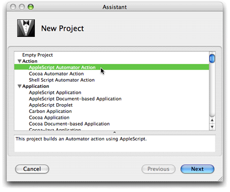
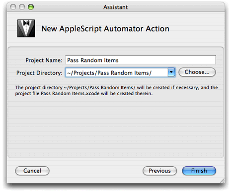
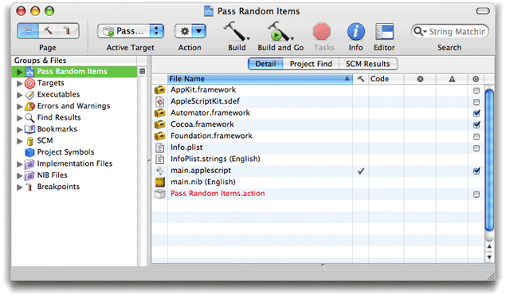

> 导航：[总目录](../../../README.md) · [documentation](../../../_indexes/documentation.md) · [Automator AppleScript Actions Tutorial](Introduction%20to%20Automator%20AppleScript%20Actions%20Tutorial.md)

[Next](Creating%20the%20User%20Interface.md)[Previous](Before%20You%20Start.md)

# Creating the Project

When you create an AppleScript action project, you start by selecting an Xcode template that provides all necessary project files and initial project settings.

The steps for creating a AppleScript action project are few and simple:

1. Launch the Xcode application.

   You can find Xcode in `/Developer/Applications`.
2. Choose New Project from the File menu.

   Xcode displays the New Project assistant (see Figure 2-1). The Automator action project templates are near the top of the displayed list.

   __Figure 2-1__  Selecting the AppleScript action project template

   
3. Select AppleScript Automator Action and click Next.
4. In the New AppleScript Automator Action assistant, enter a project name and select a file-system location for the project (see Figure 2-2).

   For the tutorial project, the project name is Pass Random Items.

   __Figure 2-2__  Specifying project name and location

   

After you complete this step, Xcode displays the new project in its window, shown in Figure 2-3.

__Figure 2-3__  The files of an AppleScript action project in Xcode

Almost all of the items in the project folder have special significance in the development process.

**Frameworks**
: Any action project must import the Cocoa umbrella framework, which includes the Foundation and Application Kit frameworks. It also imports the Automator framework, which defines the programmatic interface for all Automator actions. See _[Automator Objective-C Reference](https://developer.apple.com/documentation/automator)_ for documentation of this interface.

**`main.applescript`**
: The main AppleScript script file whose `on run` handler is called by Automator when the action runs in a workflow. You will write your AppleScript code in this file. An AppleScript action project can also have other (“helper”) AppleScript scripts, often to manually synchronize user settings with the action internal record of those settings.

**`Info.plist` and `InfoPlist.strings (English)`**
: The `Info.plist` file is the information property list for the action bundle. It contains configuration information that is generally related to the bundle and more specifically related to the action. The `InfoPlist.strings` file contains English translations of items in `Info.plist` that might be displayed to the user. If your action is to be localized for languages or locales besides English, you will have to add an `InfoPlist.strings` file to the project for each additional translation.

**`main.nib (English)`**
: The nib file for the English version of the action. A nib file is an archive containing the view, controls, and other user-interface objects used by an executable, as well as the connections between those objects. You use the Interface Builder to create and maintain nib files. If your action is to be localized for languages or locales besides English, you will have to add a `main.nib` file for each additional localization.

The `Pass Random Items.action` item shown in the project window is the action bundle. When the action project is built, the text color of the item will change from red to black to indicate that the bundle now exists in the build directory. All Automator action bundles must have an extension of `action`.

[Next](Creating%20the%20User%20Interface.md)[Previous](Before%20You%20Start.md)

