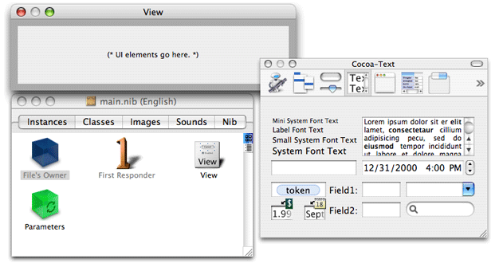
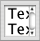
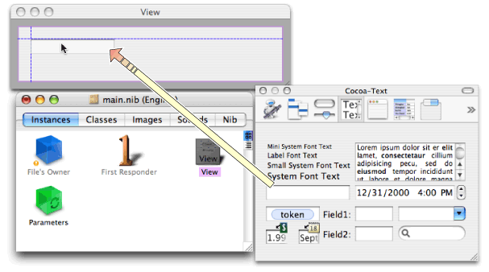
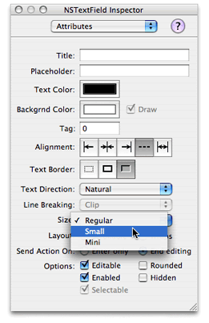
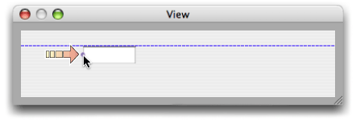
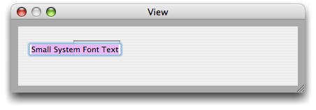
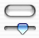
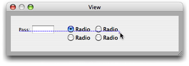
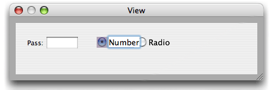
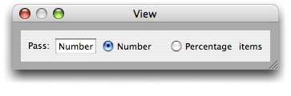

> 导航：[总目录](../../../README.md) · [documentation](../../../_indexes/documentation.md) · [Automator AppleScript Actions Tutorial](Introduction%20to%20Automator%20AppleScript%20Actions%20Tutorial.md)

[Next](Establishing%20Bindings.md)[Previous](Creating%20the%20Project.md)

# Creating the User Interface

In this part of the tutorial, you will create the user interface of the Pass Random Items action. This phase of development includes not only placing, resizing, and configuring the objects of the user interface, but establishing the bindings between those objects and the parameters property of the action.

The nib file is an Interface Builder archive holding the objects of a user interface and any connections between those objects. (A nib file can also contain custom class definitions and resources such as images and sounds, but the Pass Random Items action doesn’t use these things, so we’ll leave it at that.) The nib file for an action has the default name `main.nib`.

To open `main.nib`, double-click the  icon next to the file in the project window for Pass Random Items (see [Figure 2-3](Creating%20the%20Project.md#apple-f4xwc4dqnrsv64tfmyxwi33df52wszbpkridimbqgazdamjqfvbuqmrqgmwueqsdizeukq2f). The Interface Builder launches (if it isn’t running already) and displays the windows related to the nib file (see. Figure 3-1).

__Figure 3-1__  The nib file window, initial action view, and palette

The nib file window in this illustration is the one containing the File’s Owner, First Responder, View, and Parameters icons in the Instance pane. (There are other panes for classes, images, and sounds, but you can ignore those for now.) The window with the grey rectangular area is the view of the action; here is where you will place the fields, controls, and other objects of the action view. The third window is the palette window containing palettes with various kinds of objects.

Before you start adding objects to the action view, however, make sure that the Cocoa-Automator palette is loaded. This palette contains several kinds of user-interface objects that are special to Automator. You won’t need these objects for this tutorial, but you might need them for other actions. At the top of the palette window is a row of icon buttons. See if the Automator icon is one of them.

__Figure 3-2__  Automator icon

If the Automator icon isn’t there, load the Cocoa-Automator palette:

1. Choose Preferences from the Interface Builder menu.
2. Click the Palettes button to display the list of currently loaded palettes.
3. Click the Add button.
4. In the file browser, navigate to `/Developer/Extras/Palettes` and select the `AMPalette.palette` item.

The user interface of the Pass Random Items action is simple, consisting of only a few text fields and one matrix object holding two radio buttons. Simplicity is one of the design principles for all actions. “[Design Guidelines for Actions](https://developer.apple.com/library/archive/documentation/AppleApplications/Conceptual/AutomatorConcepts/Articles/AMDesignGuidelines.html#//apple_ref/doc/uid/TP40001510) in the _[Automator Programming Guide](../Automator%20Programming%20Guide/Introduction%20to%20Automator%20Programming%20Guide.md#apple-f4xwc4dqnrsv64tfmyxwi33df52wszbpkridimbqgaytinjq)_ discusses guidelines for action views.

Let’s begin. Select the text palette by clicking the text button icon at the top of the palette window:

The text palette contains various types of objects related to text: editable text fields, labels, token fields, search fields, forms, and so on. First place a text field on the action view; users will enter a number or a percentage in this field, depending on the radio button selected.

1. Drag the text field from the palette to the upper-left corner of the action view.

   Interface Builder uses blue lines to show you the proper location for object placement according to _Apple Human Interface Guidelines_. Make sure the top and left side of the text field are adjacent to the blue lines that appear (see [Figure 3-3](#apple-f4xwc4dqnrsv64tfmyxwi33df52wszbpkridimbqgazdamjqfvbuqmrqgqwueq2jizfeerkh)).
2. Release the mouse button to “drop” the object.

__Figure 3-3__  Placing a text field by dragging it from the palette

Note that after you drop an object in a view, you can still select it and move it within the view.

Many of the objects in a user interface—for example, text fields, buttons, and table columns—have three predefined sizes: mini, small, and regular (or system). Objects in an action view should always be small. The text field that you just placed is not. To change the text field to a small size, do the following;

1. Select the text field.
2. Choose Show Inspector from the Tools menu.
3. Select the Attributes pane from the pop-up list of the inspector.

   The Attributes pane shows all of the configurable options for whatever object is selected. For text fields, these options include color, alignment, and the fields enabled and editable states.
4. Choose Small from the Size pop-up list (see Figure 3-4).

__Figure 3-4__  Setting the size attribute of the text field

A couple of other things are not quite right with the text field. It is wider than we need for a simple number or percentage. And the field should have the label “Pass:” just to its left. We can solve these problems by resizing the text field to the right.

1. Select the text field.

   When it’s selected, you see tiny round handles on each side and on each corner. You can use these handles to make an object larger or smaller in the given horizontal, vertical, or diagonal direction.
2. Press the mouse pointer down on the handle on the left side of the text field (not the corner handles).
3. Drag the handle toward the right until the text field is about half the original size (see Figure 3-5).

__Figure 3-5__  Resizing the text field

A label is a text field that has a neutral background and that is non-editable. To create the label for the text field:

1. Drag the object on the text palette that reads “Small System Font Text” and drop it in the upper-left corner of the action view.
2. Double click this generic label to select the text (see Figure 3-6).
3. Edit the text to say “Pass:”.

__Figure 3-6__  Changing the string in a in a non-editable text field (a label)

The next step is adding the radio buttons labeled “Number” and “Percentage”. Radio buttons are on the Cocoa Controls and Indicators palette. You can access this palette by clicking the following icon button at the top of the palette window:

Radio buttons are preconfigured compound objects. They are designed to work with a group of identical buttons in a way that ensures only one of them is enabled at any time. The object that holds these multiple objects together is a matrix.

1. Drag the palette object with two “Radio” buttons onto the action view just to the right of the text field.

   Even though the objects are labeled “Radio”, this is a matrix object.
2. With the radio-button matrix selected, press the middle handle on the right side of the matrix.
3. Option-drag the matrix to the right until two more “Radio” buttons appear (see Figure 3-7).

   “Option-drag” means to press the option key while dragging the object handle.
4. Select the lower-middle handle of the matrix.
5. Option-drag the matrix upward until the two bottom “Radio” buttons disappear.

Now there are two buttons on the same row.

__Figure 3-7__  Changing the number of radio buttons in a matrix (radio buttons)

The user interface is looking much better, but you still have some work to do. The buttons are too large, and they need the correct titles. Fortunately, you can solve both of these problems at the same time for each button:

1. Double-click a radio button (a cell) to select its text.
2. Change the text to “Number” or “Percentage” (see Figure 3-8).
3. In the Attributes pane of the inspector for the button cell, change the size to Small.

__Figure 3-8__  Changing the title of a button

The user interface of the Pass Random Items action needs one final object. Add a small label after the “Percentage” radio button that reads “items”.

But you’re not finished yet. The action view is too big for the objects it contains. To resize the view, click and press the lower-right corner of the view window, then move the window in toward the upper left corner of the view until all objects are just contained. Make sure that the objects on the view conform to the blue guidance lines. Then add back a 10-pixel border around the user-interface objects on all sides; this border is required by the user-interface guidelines for actions. The final action view should look like the example in Figure 3-9.

__Figure 3-9__  Final user interface of Pass Random Items action

[Next](Establishing%20Bindings.md)[Previous](Creating%20the%20Project.md)

