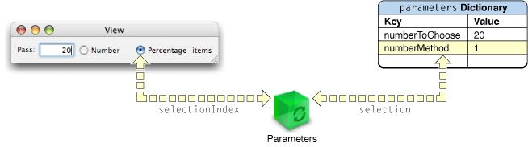
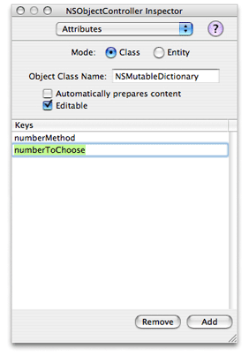
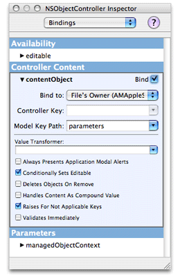
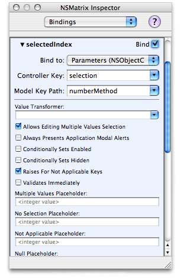

> 导航：[总目录](../../../README.md) · [documentation](../../../_indexes/documentation.md) · [Automator AppleScript Actions Tutorial](Introduction%20to%20Automator%20AppleScript%20Actions%20Tutorial.md)

[Next](Configuring%20the%20Action.md)[Previous](Creating%20the%20User%20Interface.md)

# Establishing Bindings

The objects on an action view are only part of what’s involved in creating the user interface of an action. If users click a button or enter something into a text field, nothing much happens until you communicate those events to other objects in the action that know how to deal with the events. Even though you are creating an AppleScript action, the underlying framework of Automator is Cocoa-based. Cocoa gives you two general mechanisms for enabling communication between view objects and other objects in a action:

- Outlets and target-action (“action” here does not denote an Automator action)
- Bindings

The preferred approach for managing an action’s user interface is to use the Cocoa bindings technology; that is how actions projects are initially configured in the project templates and that is the procedure this tutorial shows. But you can manage the user interface using an alternate approach that makes use of outlets and possibly target-action. [Alternatives to Bindings](#apple-f4xwc4dqnrsv64tfmyxwi33df52wszbpkridimbqgazdamjqfvbuqmrqguwueqsdjffekrcc) summarizes this approach.

A binding in Cocoa automatically synchronizes the value between an attribute of a user-interface object (say, the displayed value of a text field) and a property of a data-bearing object (usually termed a model object). This means that whenever a user edits a control or clicks a button, that change is automatically communicated to the bound property of the object maintaining that value internally. And whenever that internal value changes, the change is automatically communicated to the bound attribute of a user-interface object that then displays it.

For actions the data-bearing object is a dictionary owned by the action object itself. For AppleScript actions, the action object is almost always an instance of AMAppleScriptAction. Every action, regardless of the programming or scripting language it uses, maintains an internal dictionary that captures the choices users have made in the user interface. (The AppleScript equivalent for a dictionary is a record.) This dictionary is called the parameters dictionary. It stores values users make in the user interface along with an arbitrary key for each value. When Automator runs an AppleScript action in a workflow, it passes it a `parameters` record in the `on run` handler in `main.applescript` (See [Writing the Action Script](Writing%20the%20Action%20Script.md#apple-f4xwc4dqnrsv64tfmyxwi33df52wszbpkridimbqgazdamjqfvbuqmrqg4wueqkkinceiqkb) for more about the `on run` handler.)

When you establish a binding between a user-interface control and a property of the action’s parameters dictionary, the binding is made through a property of an intermediary object called a controller. In the `main.nib` file for an action, this intermediary object appears in the Instance view of the nib file window as the Parameters instance. When you look at a binding in Interface Builder in the Bindings pane of the inspector (see [Figure 4-4](#apple-f4xwc4dqnrsv64tfmyxwi33df52wszbpkridimbqgazdamjqfvbuqmrqguwueqsdijeuuqkh) for an example), you can see it as a combination of user-interface attribute, controller property, and parameters property.

Figure 4-1 illustrates the case of the radio-button matrix of the Pass Random Items action; here the matrix attribute `selectionIndex` is connected to the controller’s `selection` property, which is connected to the `numberMethod` property of the parameters dictionary. The value of `numberMethod` reflects the zero-based index of the selected radio button in the matrix (1 indicates the “Percentage” button in the example).

__Figure 4-1__  Binding between the pop-up list and a property of the parameter dictionary

To establish bindings for the Pass Random Items action, complete the following steps with the action’s `main.nib` file open in Interface Builder:

1. Select the Parameters instance in the nib file window.

   Parameters is an instance of NSObjectController, which implements controller behavior.
2. Open the inspector window (Tools > Show Inspector) and choose Attributes from the pop-up list.
3. In the Attributes pane for the Parameters instance, click Add.

   A `newKey` placeholder appears in the Keys table.
4. Double-click `newKey` to select the word and make it editable.
5. Type `numberMethod`, replacing `newKey`.
6. Click Add again, and add another key named `numberToChoose`.

   See Figure 4-2 for an example.

   __Figure 4-2__  Adding keys as attributes of the Parameters instance.

   

The Parameters controller instance is now initialized with the keys that will be used in the bindings between attributes of two of the user-interface objects and properties of the parameters dictionary. Note that the project template for all types of actions is preconfigured to make a binding between the Parameters instance and the action’s parameters dictionary. To see this binding:

1. Select the Parameters instance in the nib file window.
2. Choose Bindings from the inspector’s pop-up list.
3. Click the disclosure triangle next to `contentObject` to expand the view.

   Figure 4-3 shows the binding between the controller object and the `parameters` property of the action object (File’s Owner).

__Figure 4-3__  Binding between the controller and the parameters dictionary

The final stage of establishing bindings requires you to bind the attributes of two of the user-interface objects to the corresponding properties of the parameters dictionary via the `selection` property of the Parameters controller.

1. Select the radio-button matrix in the action view.
2. Choose Bindings from the inspector’s pop-up list.
3. Click the disclosure triangle next to the `selectedIndex` attribute of the matrix.
4. Make sure the Bind to pop-up list is set to Parameters.
5. Make sure the Controller Key combo box is set to `selection`.
6. Set the value of the Model Key Path combo box to `numberMethod`.
7. Make sure the Bind check box in the upper-right corner of the `selectedIndex` view is checked.

   The Bindings inspector pane should look like the example in [Figure 4-4](#apple-f4xwc4dqnrsv64tfmyxwi33df52wszbpkridimbqgazdamjqfvbuqmrqguwueqsdijeuuqkh) at this point.
8. Select the text field to the left of the matrix.
9. In the Bindings pane of the inspector, click the disclosure triangle next to the value attribute.
10. Make sure the Bind to combo box contains Parameters and the Controller Key combo box contains `selection`.
11. Set the Model Key Path combo box to `numberToChoose`.
12. Make sure the Continuously Updates Value check box is checked.

    Checking this control tells the bindings mechanism to synchronize the value in the text field without waiting for the user to press the Return or Tab keys.
13. Make sure the Bind check box is checked.

__Figure 4-4__  The selectedIndex attribute in the bindings inspector

Although bindings are the preferred technique for enabling communication the objects of an action, there are alternatives to bindings. For example, you can use outlets and target-action to facilitate the communication of data between objects in the action view and the parameters dictionary owned by the action object. In this case you also use a controller object, but instead of bindings it maintains persistent references to other objects known as outlets. Thus it can always send a message to, say, a text field to obtain its value. User-interface objects and controllers can also be set up to use target-action. In this mechanism a control object (such as a button) is configured with a target of a message—usually the controller—and a selector that designates the message to send. When users activate the control object, a message is automatically sent to the controller. You can establish outlet and target-action connections in Interface Builder, which archives these connections in the nib file.

Automator provides a third alternative for synchronizing the values in the parameters and the settings users make in the action’s user interface. It defines the `update parameters` and `parameters updated` commands, which you can attach to an action’s view using AppleScript Studio. Automator sends the `update parameters` command when an action’s parameters need to be refreshed from the values on the user interface. It sends `parameters updated` when there are any changes to the action’s parameters dictionary. “[Implementing an AppleScript Action](https://developer.apple.com/library/archive/documentation/AppleApplications/Conceptual/AutomatorConcepts/Articles/ImplementScriptAction.html#//apple_ref/doc/uid/TP40001512)” in _[Automator Programming Guide](../Automator%20Programming%20Guide/Introduction%20to%20Automator%20Programming%20Guide.md#apple-f4xwc4dqnrsv64tfmyxwi33df52wszbpkridimbqgaytinjq)_ describes this procedure in detail.

[Next](Configuring%20the%20Action.md)[Previous](Creating%20the%20User%20Interface.md)

