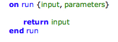
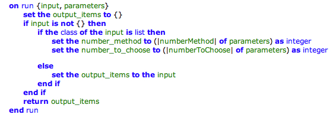
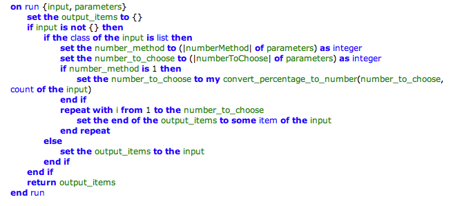
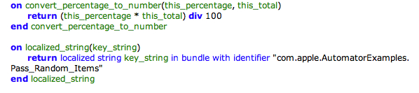

> 导航：[总目录](../../../README.md) · [documentation](../../../_indexes/documentation.md) · [Automator AppleScript Actions Tutorial](Introduction%20to%20Automator%20AppleScript%20Actions%20Tutorial.md)


[Next](Building%20and%20Testing%20the%20Action.md)[Previous](Configuring%20the%20Action.md)

# Writing the Action Script

The next stage of developing the Pass Random Items action is writing the script itself. This chapter describes how to write the command handler that all AppleScript actions must implement and discusses subroutines and other aspects of scripting for actions.

For more information on this subject, see “[Implementing an AppleScript Action](https://developer.apple.com/library/archive/documentation/AppleApplications/Conceptual/AutomatorConcepts/Articles/ImplementScriptAction.html#//apple_ref/doc/uid/TP40001512)” in _[Automator Programming Guide](../Automator%20Programming%20Guide/Introduction%20to%20Automator%20Programming%20Guide.md#apple-f4xwc4dqnrsv64tfmyxwi33df52wszbpkridimbqgaytinjq)_.

In the Xcode project window for the Pass Random Items action project, locate the `main.applescript` file and double-click it. The file opens in an editor much like Script Editor. It contains a “skeleton” `on run` command handler, as shown in Figure 6-1.

__Figure 6-1__  The template for the `on run` handler



Let’s briefly look at this command handler before writing anything. Automator invokes the handler when it is an action’s turn in a workflow to run. The handler has two parameters: `input` and `parameters`. The `input` parameter is the data provided by the previous action in the workflow. The template `on run` handler simply returns the input as its output. The `parameters` parameter is a record that contains the settings users have made in the action’s view.

Start by initializing a list of items to return as output and extracting the settings users have made from the parameters record. Figure 6-2 shows you the scripting code to write.

__Figure 6-2__  Initializing local output and parameter variables



The first line initializes a list named `output_items` and the last line returns this list. In between, the script tests whether the input object is an empty list or is a single item instead of list and returns that as output (if a single item, it adds it to the `output_items` list first).

The other lines of the script in Figure 6-2 assign to local variables the values in the parameters record that are bound to the action’s user-interface controls. Note that in the expression

```
(|numberToChoose| of parameters)
```

that `numberToChoose` is one of the keys you added to the attributes of the Parameters instance in Interface Builder when you established the bindings of the action. In the script you are using this key to access the value corresponding to the choice the user made in the user interface.

Finally, add the remaining lines shown in Figure 6-3 to complete the `on run` command handler.

__Figure 6-3__  The final `on run` handler



These lines of the script test whether the user selected the Number or Percentage radio button in the user interface; if it is Percentage, the script calls a subroutine to get the specified percentage of the input items as a number. Then in a loop it adds a random selection of input items—limited by the specified or computed number—to the output items.

The `main.applescript` file for the Pass Random Items action includes two subroutines. The first, `convert_percentage_to_number`, you have already encountered when writing the `on run` handler script. This subroutine performs the simple calculation shown in Figure 6-4.

__Figure 6-4__  Subroutines called by the main script



The second subroutine, `localized_string`, does something very important despite the fact that it’s not called by the `on run` command handler you have written. Through the `localized string` command, the subroutine returns a string (identified by `key_string`) for a preferred localization specified by the current user in System Preferences. You can use this string in dialogs and error messages. To use this subroutine effectively you must first internationalize your action for all supported localizations. To find out how to do this, see the relevant section in [Developing Actions](https://developer.apple.com/library/archive/documentation/AppleApplications/Conceptual/AutomatorConcepts/Articles/DevelopAction.html#//apple_ref/doc/uid/TP40001511) of the _[Automator Programming Guide](../Automator%20Programming%20Guide/Introduction%20to%20Automator%20Programming%20Guide.md#apple-f4xwc4dqnrsv64tfmyxwi33df52wszbpkridimbqgaytinjq)_.

[Next](Building%20and%20Testing%20the%20Action.md)[Previous](Configuring%20the%20Action.md)

