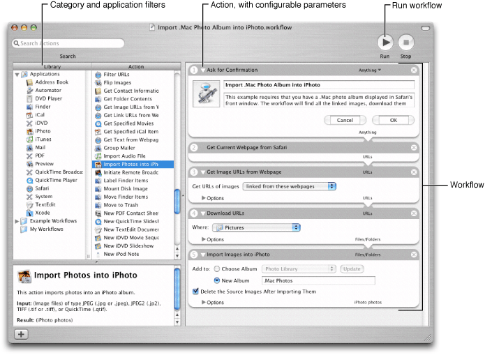

> 导航：[总目录](../../../README.md) · [documentation](../../../_indexes/documentation.md) · [Automator Programming Guide](Introduction%20to%20Automator%20Programming%20Guide.md)

[Next](How%20Automator%20Works.md)[Previous](Introduction%20to%20Automator%20Programming%20Guide.md)

# Automator and the Developer

Automator is an Apple application that lets users automate repetitive procedures performed on a computer. With Automator, users can quickly construct arbitrarily complex sequences of configurable tasks that they can set in motion with a click of a button. And they do not need to write a single line of code to do so.

All kinds of OS X users, including system administrators and developers, can derive huge benefits from Automator. It enables them to accomplish in a few seconds a complex or tedious procedure that manually might take many minutes. Developers can contribute to what Automator offers users in two ways: by making their applications scriptable and by creating loadable bundles specifically designed for Automator.

As a developer, you can best appreciate how to integrate your software products with Automator by understanding how users might use the application, which is located in `/Applications`. Figure 1 shows a typical Automator workflow.

__Figure 1__  A typical Automator workflow

A workflow in Automator consists of a sequence of discrete tasks called actions. An Automator action is a kind of functional building block. An Automator workflow hooks the actions together so that—in most cases—the output of one action is the input of the subsequent action. Clicking the run button in the upper-right corner of the window causes Automator to invoke each action of the workflow in turn, passing it (usually) the output of the previous action.

To create a workflow, users choose each action they want from the browser on the left side of the application window and drag it into the layout view in the right side of the window. They can search for specific actions by application, category, or keyword. Once dropped, an action presents a view which, in almost all cases, contains text fields, buttons, and other user-interface elements for configuring the action. In addition to configuring each action, users can move actions around in the workflow to put them in the desired sequence. They can then save the workflow as a document that can be run again and again in Automator.

Actions can be virtually anything that you can do on an OS X system (version 10.4 and later). You can have an action that copies files, an action that crops an image, an action that burns a DVD, or an action that builds a project in Xcode. Actions can either interact with applications or draw on system resources to get their work done. By stringing actions together in a meaningful sequence—that is, in a workflow—a user can accomplish complex and highly customized procedures with a click of a button. Apple provides dozens of actions for use in Automator (OS X version 10.4 and later).

A general description of Automator and its actions and workflows goes only so far to convey the power and flexibility of the application. To better appreciate what users can do with Automator—and how your actions can play a part in it—consider the following workflow scenarios:

- Workflow 1—Copies the content of all messages flagged in the currently displayed mailbox to a TextEdit document. This workflow consists of the following actions:

  1. Find Messages in Mail (Mail), configured to find messages whose flagged status is true
  2. Display Messages (Mail)
  3. Combine Messages (Mail)
  4. New TextEdit Document (TextEdit)
- Workflow 2—Imports images on a webpage (such as .Mac photo album) into iPhoto:

  This workflow requires users to go to the webpage in Safari before running the workflow.

  1. Get Current Webpage from Safari
  2. Get Image URLs from Webpage, configured to get the URLs linked from this webpage
  3. Download URLs, configured to a specified location on the local computer
  4. Import Images into iPhoto, configured to put them in a new or existing album
- Workflow 3—Finds people with birthdays in the current month and creates an iCal event for each person:

  1. Find People with Birthdays (Address Book), configured to this month.
  2. New iCal Event, configured to create one event for each person received. It is also configured with any relevant event information, such as calendar and alarm.

Given an automation tool as powerful and flexible as Automator, it’s clear that any action you develop for it benefits both you and the user, especially if that action accesses what your application has to offer. Users have an additional path to the features and services that make your products unique, and this in turn enhances the visibility and reputation of your products.

You don’t even have to be a programmer (in the traditional sense) to develop actions for Automator. You can write an action in AppleScript as well as in Objective-C (and AppleScript actions have full access to such things as Standard Additions). You can also mix AppleScript scripts and Objective-C code when you develop an action; the script can invoke Objective-C methods implemented for the action. AppleScript has the advantage of being easier to learn, but it requires that applications that are the targets of commands be scriptable. As an object-oriented superset of ANSI C, Objective-C is a full-fledged programming language, which makes it harder to master than AppleScript but allows you to take full advantage of the Cocoa Objective-C frameworks—as well as all C-based frameworks.

If have experience in UNIX environments, you can also write shell scripts, Perl scripts, or Python scripts to drive the behavior of actions. These kinds of actions are known as shell script actions. The scripts in these actions can also work together with AppleScript scripts and Objective-C classes in an action project.

In light of these language alternatives, there are three general types of Automator actions:

- An action that controls an application to get something done. AppleScript-based actions can do this if the application is scriptable. Objective-C actions can do this if the application has a public programmatic interface (as do, for example, Address Book and iChat).
- An action that uses system frameworks and other system resources to get something done. Actions that are strictly based on AppleScript cannot do this, but Objective-C actions—and actions that are a mixture of AppleScript and Objective-C—can. An Objective-C action, for example, could use the network-services classes NSNetService and NSNetServiceBrowser to implement an action that offers dynamic printer discovery. Shell script actions also fall into this category, because they have hundreds of BSD command-line tools at their disposal.
- An action that performs some small but necessary “bridge” function such as prompting the user for input, writing output to disk, or informing the user of progress. You can create these types of actions using AppleScript, Objective-C, and shell scripts (including Perl or Python).

From a developer’s perspective, actions have a common programmatic interface and a common set of properties. The programmatic interface is defined by four classes: AMAction, AMBundleAction, AMAppleScriptAction, and AMShellScriptAction (discussed in [How Automator Works](How%20Automator%20Works.md#apple-f4xwc4dqnrsv64tfmyxwi33df52wszbpkridimbqgaytkmbzfvbecssjizcesri)). Action properties, which are specified in an action bundle’s information property list (`Info.plist`), define characteristics such as:

- The types of data the action accepts and provides
- The application the action is associated with and the category of task it performs
- Other keywords to identify the action in searches
- The default parameters of the action
- Warnings given to users if the action, as configured, might result in loss of data

See [Automator Action Property Reference](Automator%20Action%20Property%20Reference.md#apple-f4xwc4dqnrsv64tfmyxwi33df52wszbpkridimbqgaytkmjvfvbegskkjbbeuqy) for further information on Automator action properties.

The Apple integrated development environment, Xcode, provides support for Automator action developers. There are Xcode project types for AppleScript, Objective-C, and shell script actions. Included in these project types are all required files and templates. For example, the default nib file (`main.nib`) contains an initial user interface, an instance of NSObjectController for establishing bindings, and File’s Owner already set up to be your action object. For more on the Automator action project types see [Developing an Action](Developing%20an%20Action.md#apple-f4xwc4dqnrsv64tfmyxwi33df52wszbpkridimbqgaytkmjrfvbecsscjfbuosa).

If you install actions as part of your product, be sure to install them in `/Library/Automator` (if they are to be available to all users of a system) or in `~/Library/Automator` (if they are to be available only to the current user). `/System/Library/Automator` is reserved for Apple-developed actions. You can also install actions in the bundle of the application that uses them. Automator also looks for actions in application bundles. If you provide actions, you may want to advertise them to your users so they can look forward to using them in new workflows.

A universal binary is executable code that can run on either PowerPC-based or Intel-based Macintosh computers. To move a PowerPC-only project to a universal-binary project may require work involving such programming details as endianness, alignment, and calling conventions. The amount of work generally depends on the level of the source code; lower-level source code (for example, the kernel) requires more work than higher-level code (for example, an application based on Carbon).

The need to make an Automator action a universal binary depends on the language used:

- AppleScript actions are platform-independent and do not require any changes to run on Intel processors.
- An action that contains Objective-C code, whether a Cocoa-only action or an action that contains a mix of Objective-C and AppleScript, must be built as a universal binary to run correctly on both Intel and PowerPC processors.

For information on making universal binaries, see _[Universal Binary Programming Guidelines, Second Edition](../../Mac%20OSX/Universal%20Binary%20Programming%20Guidelines%2C%20Second%20Edition/Introduction.md#apple-f4xwc4dqnrsv64tfmyxwi33df52wszbpkridimbqgazdemjx)_.

[Next](How%20Automator%20Works.md)[Previous](Introduction%20to%20Automator%20Programming%20Guide.md)

