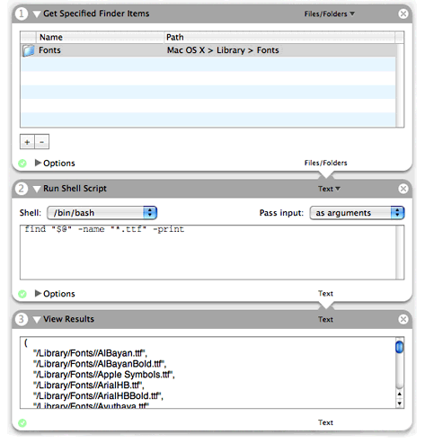
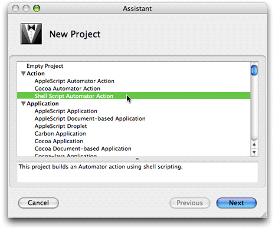
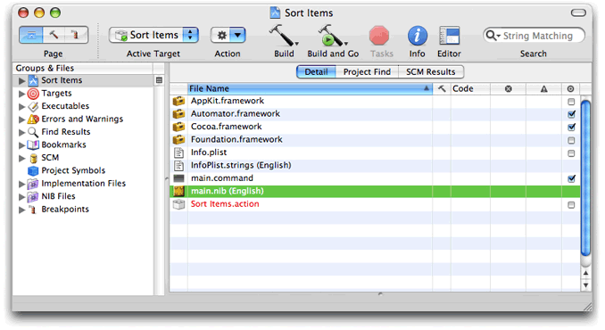
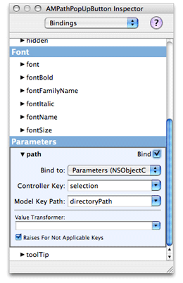

> 导航：[总目录](../../../README.md) · [documentation](../../../_indexes/documentation.md) · [Automator Programming Guide](Introduction%20to%20Automator%20Programming%20Guide.md)


[Next](Creating%20a%20Conversion%20Action.md)[Previous](Implementing%20an%20Objective-C%20Action.md)

# Creating Shell Script Actions

You can create actions for the Automator action that are based on scripting languages with a UNIX pedigree, including shell scripts, Perl, and Python. This article explains how to create such actions.

You can incorporate a shell script into an Automator workflow even without having to build an action bundle. The Run Shell Script action, as with the Run AppleScript action, is an action that lets you type and execute a script; in this case, however, it’s a shell script or a Python or Perl script. The Run Shell Script action in a workflow shows the action in a workflow that searches recursively in a Fonts folder for fonts with a specific extension.

__Figure 1__  The Run Shell Script action in a workflow



The Run Shell Script action in this simple example runs the `find` command in the `bash` shell. In the Shell pop-up menu you can select other shells (such as `csh` or `zsh`) or Python or Perl as your scripting environment. The “Pass input” pop-up menu lets you choose input in the form of standard input (`stdin`) or as shell arguments.

The Run Shell Script action is a useful tool, especially for rapid prototyping of scripts. But it has its limitations, especially when the workflow it’s in is made available to users. Users of the workflow (unless they are power users) may introduce errors into the script if they try to change options. And if you save the workflow as an application to eliminate the possibility of user error, the action becomes even more inflexible and hence less usable.

To make shell script–based actions for which users of a workflow can select options, you need to create a custom shell script action.

Shell script actions are conceptually different from AppleScript and Objective-C actions in important ways. The primary difference concerns the way input and user choices are conveyed to the action.

Instead of an input parameter, input is piped into the action via standard input (or passed as command-line arguments) and piped out of it via standard output. In addition, an action’s input and output, instead of being a list or array object, is a single string; individual items in the string (such as paths) are separated from each other by newline characters. (The newline character is the default; you can change the separating character programmatically.) The type identifier for a shell script action’s `AMAccepts` and `AMProvides` properties is always `com.apple.cocoa.string.`

Because shell script actions are limited to single type of data, they might not seem to work well with other actions that accept and provide incompatible data types. For example, how can a shell script action handle input from an action that deals in Address Book records? This is where conversion actions play an important role. Conversion actions convert between one type of data and another. Automator invisibly inserts the appropriate conversion action between actions with dissimilar types in a workflow—but only if the conversion action is available. Apple provides many conversion actions in `/System/Library/Automator` (the actions with extension `caction`), but these might not be suitable for your shell script action. You many want to consider creating your own conversion actions; see [Creating a Conversion Action](Creating%20a%20Conversion%20Action.md#apple-f4xwc4dqnrsv64tfmyxwi33df52wszbpkridimbqgaytkmjufvbeeq2kivauqsi) for the procedure.

The choices users make in the user interface of a shell script action are conveyed to the script as environment variables. These variables correspond to the keys specified for the Parameters object-controller instance in the nib file. When you are creating the user interface, you use these keys to establish bindings between controls on the user interface and the action’s parameters property.

A shell script in an action cannot directly display localized strings in, for example, error messages. However, a shell script action, which is a loadable bundle, can contain localized nib files and can localize its visible properties, such as the action name, application, and description. See [Internationalizing the Action](Developing%20an%20Action.md#apple-f4xwc4dqnrsv64tfmyxwi33df52wszbpkridimbqgaytkmjrfu4tqobzgy) for details.

Shell script actions have no direct access to the methods of the Automator framework or, for that matter, any other framework. There is no way within the script to manually synchronize the user interface and the parameters property (`updateParameters` and `parametersUpdated` methods). Neither can you implement the `opened` and `activated` methods (or corresponding AppleScript routines) to perform initialization and synchronization tasks. However, your shell script action project can include an Objective-C helper class or an AppleScript utility script that implements these methods or routines. Shell scripts can also run the `osascript` tool to execute individual AppleScript scripts.

To create an Xcode project for a shell script action, start by choosing New Project from the File menu. In the New Project assistant, select Shell Script Automator Action, as shown in Figure 2, and click Next.

__Figure 2__  Selecting the Shell Script Automator Action template



In the next assistant window, enter a project name and location and click Finish. For convenience, make the name of the project the same name you want the action to have; by default, the project name is assigned to the action name and the bundle identifier.

The project window of a shell script action displays most of the items that appear in the project windows of other action types (see Figure 3). These items include the required frameworks, `main.nib`, `Info.plist`, and `InfoPlist.strings`. The sole difference from other projects is the `main.command` file, which holds the script (shell, Perl, or Python) that you will write.

__Figure 3__  The project window of a shell script action



The `main.command` file in the template is initialized with a simple `cat` command to pipe the input from `stdin` to `stdout`.

Before you start working on the shell script action, become familiar with the guidelines for actions, which are documented in [Design Guidelines for Actions](Design%20Guidelines%20for%20Actions.md#apple-f4xwc4dqnrsv64tfmyxwi33df52wszbpkridimbqgaytkmjqfvbecsseirfecqq).

Constructing the user interface of a shell script action is a procedure that is the same as for other kinds of actions. Read [Constructing the User Interface](Developing%20an%20Action.md#apple-f4xwc4dqnrsv64tfmyxwi33df52wszbpkridimbqgaytkmjrfu4tmobxg4) to learn about the procedure.

Remember that the keys you supply for bindings in the Attributes pane of the NSObjectController inspector (the Parameters instance in Interface Builder) become the environment variables that you refer to in the script (Figure 4). Through bindings, the settings of the various fields, buttons, and pop-up menus are converted into the values of these environment variables.

__Figure 4__  The parameter keys in the NSObjectController inspector



If you are going to make the action available in multiple localizations, you must internationalize and localize the nib file; see [Internationalizing the Action](Developing%20an%20Action.md#apple-f4xwc4dqnrsv64tfmyxwi33df52wszbpkridimbqgaytkmjrfu4tqobzgy).

The properties of shell script actions (in the `Info.plist` file) are little different than the properties of AppleScript and Objective-C actions. The differences are the following:

- The `AMAccepts` and `AMProvides` properties take UTI identifiers of `com.apple.cocoa.string` only.
- The `AMApplication`, `AMCategory`, and `AMIconName` properties are preset with the value “Terminal” in the project template. You can either keep this value or change it to something else, such as “TextEdit”.

You set all other Automator and regular bundle properties the same as in other kinds of actions. See [Specifying Action Properties](Developing%20an%20Action.md#apple-f4xwc4dqnrsv64tfmyxwi33df52wszbpkridimbqgaytkmjrfuytamrsga3q) for more information.

When you write a shell script or a Perl or Python script for an action, you do nothing different from what you normally would, except for two things:

- You learn about the choices users have made in the action’s user interface through environment variables.
- Input to the script is implicitly standard input; you handle it (usually) as lines—that is, a list of newline-terminated strings.

The parameters of an action are the settings users have made in the controls and text fields of the action’s user interface. Actions are implemented to hold them as values in a dictionary. You access these values through keys that you specify when you establish the bindings of the action. In AppleScript and Objective-C actions the parameters dictionary is passed into the action, and the code in each case directly obtains a setting value using one of the bindings keys. Because the only thing passed into a shell script action is standard input, you must obtain the settings in another way. When a shell script action is run in a workflow, the AMShellScriptAction class converts the items in the parameters dictionary into environment variables; the name of each environment variable is a bindings key. Listing 1 shows how you access the environment-variable values in a script.

__Listing 1__  A sample shell script for an action

```
PATH=/bin:/usr/bin:/sbin:/usr/sbin export PATH

case "$sortDirection" in
0)  dir=        ;;
1)  dir="-r     ";;
esac

case "$sortStyle" in
0)  s=  ;;
1)  s="-n       ";;
esac

# note when you use "-k", the first column is 1, not 0

sort $dir $s -k $sortColumn

exit 0
```

This shell script makes sure the `PATH` environment variable is properly set. It then interprets two environment variables in case statements and sets arguments of the `sort` command accordingly. It then executes the sort command, using the value of a third environment variable as the final command-line argument.

Some commands in shell scripts, such as `sort` in the above example, are designed to handle multiple lines of input at once. Other commands can only handle one line of input at a time. For these commands, input must be handled in a loop, such as the following:

```
while read line; do
    cp “$line” /tmp
    echo $line
done
```

Perl scripts and Python scripts have to follow the same general guidelines as shell scripts. Listing 2 shows an example of such a Perl script, which filters text based on parameters such as range of lines and range of fields.

__Listing 2__  A Perl script for an action

```perl
#!/usr/bin/env perl
# Filter Text by Position
# Pick out particular lines and fields of the input text.

# Grab values we care about from the UI and make sure they're integers
$line1 = $ENV{'firstLine'} + 0;
$line2 = $ENV{'lastLine'} + 0;
$f1 = $ENV{'firstField'} + 0;
$f2 = $ENV{'lastField'} + 0;
$sepnum = $ENV{'fieldSeparator'} + 0;
$outputSepNum = $ENV{'outputSeparator'} + 0;

# Figure out the right regex for our separator.  (whitespace, blank, tab, colon, characters)
# Later we will split the input lines on this pattern.  Splitting on "" conveniently breaks
# the line apart on character positions.

@regexes = ( "\\s+", " ", "\t",  ":", "" );
$regex = $regexes[ $sepnum ];

# And what output separator to use  (blank, tab, colon, nothing)
@oseps = ( " ", "\t", ":", "" );
$osep = $oseps[ $outputSepNum ];

# Grab all our input

@lines = <>;
$linecount = $#lines + 1;

# Adjust line numbers. 0 = last line, -1 = 2nd last, etc.

if ( $line1 <= 0 ) {
    $line1 = $linecount - $line1;
}
if ( $line2 <= 0 ) {
    $line2 = $linecount - $line2;
}

# And get them in the right order.
if ( $line1 > $line2 ) {
    $x = $line1; $line1 = $line2; $line2 = $x;
}


# Output the desired lines


for ( $l = $line1 ; $l <= $line2; $l++ ) {
    # note we are counting the first line as 1

    $line = $lines[$l - 1];

    if ( $f1 == 1 && $f2 == 0 ) {
        print $line;
    } else {
        @fields = split($regex, $line);
        $fieldcount = $#fields + 1;
        # Adjust field numbers. 0  = last field, -1 = 2nd last, etc
        if ( $f1 <= 0 ) {
            $f1 = $fieldcount - $f1;
        }
        if ( $f2 <= 0 ) {
            $f2 = $fieldcount - $f2;
        }

        # Get fields in right order too
        if ( $f1 > $f2 ) {
            $x = $f1; $f1 = $f2; $f2  = $x;
        }


        undef @out;
        for ( $i = $f1; $i <= $f2; $i++ ) {
            push( @out, $fields[ $i - 1 ]);
        }

        # Output the desired fields joined by the desired output separator.
        print join($osep, @out) . "\n";
    }

}
exit(0);
```


For general advice for debugging actions, see [Testing and Debugging Strategies](Developing%20an%20Action.md#apple-f4xwc4dqnrsv64tfmyxwi33df52wszbpkridimbqgaytkmjrfuytamzrhaya).

You cannot use `gdb` or any other debugger to debug shell script actions. However, you have a couple of alternatives to consider:

- If your shell action exits with a non-zero status code, the workflow will stop and anything your action wrote to `stderr` will show up in the Automator log view. For example, a simple, always-fail shell action might include these lines:

```
echo This action always fails 1>&2
exit 1
```
- Test your script by itself in the Terminal application. You can set environment variables to duplicate the variables that Automator would set. For example,

```
$ sortDirection=1 sortStyle=0 ./main.command
```
- Individual scripting languages might have their own debugging facilities. For instance, `bash` scripts can echo each line as it is about to be executed and can print the values of expanded variables in a script. If you add the following code to a script:

```
set -xv
```

  you can request `sh` and `bash` scripts to display a log of the commands that are actually executed. The log is written to the shell’s standard error stream (which is normally discarded by Automator).
- Because only standard output is passed to the next action, so you might want to capture the log information in a separate file ( for example, `/tmp/myAction.log`) or, preferably in the console log, which is displayed by the Console application. If you add a line like the following to the script:

```
exec 2>>/dev/console
```

  the log information appears in the console log. As your action runs, you can view in Console every command your script is trying to execute.
- You can also use the `printenv` command to show the value of all environment variables, which includes the values of action bindings.

Listing 3 shows the same sorting shell script in [Listing 1](#apple-f4xwc4dqnrsv64tfmyxwi33df52wszbpkridimbqgazdanzyfu4tqmjtgmwueqsdi5beerki) with debugging statements added.

__Listing 3__  The sorting shell script for an action, with debugging statements

```
PATH=/bin:/usr/bin:/sbin:/usr/sbin export PATH

# Turn on shell debugging, and arrange for our standard error stream
# to be redirected to the console device, where it will appear in Console.app's console log window

set -xv
exec 2>/dev/console


# We can have our own debug messages too; by adding 1>&2 we are arranging for the
# output of this command to go to standard error (the console log) rather than standard out
# (which becomes the input to the next stage.)

echo starting stage 1>&2

# Check the value of all our environment variables - which will show us all our bindings

printenv 1>&2

case "$sortDirection" in
0)    dir=        ;;
1)    dir="-r        ";;
esac

case "$sortStyle" in
1)    s="-n        ";;
esac

# Note when you use "-k", the first column is 1, not 0
# Note that these debug statements go to standard error and thus to /tmp/log

echo About to sort input 1>&2
echo The command is:  sort $dir $s -k $sortColumn 1>&2

sort $dir $s -k $sortColumn

echo All finished sorting 1>&2

exit 0
```

Check the man page or other documentation for a scripting language to see what debugging facilities are available.

[Next](Creating%20a%20Conversion%20Action.md)[Previous](Implementing%20an%20Objective-C%20Action.md)

