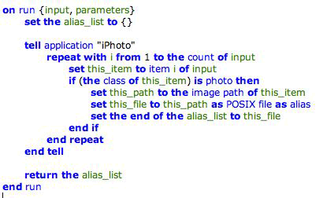

> 导航：[总目录](../../../README.md) · [documentation](../../../_indexes/documentation.md) · [Automator Programming Guide](Introduction%20to%20Automator%20Programming%20Guide.md)


[Next](Defining%20Your%20Own%20Data%20Types.md)[Previous](Creating%20Shell%20Script%20Actions.md)

# Creating a Conversion Action

A conversion action acts as a kind of bridge between two actions whose types of provided data (`AMProvides` property) and accepted data (`AMAccepts`) do not match. The conversion action converts between one type and another, usually from an internally defined data type (such as an iTunes track object, specified by the UTI identifier `com.apple.itunes.track-object`) to an externally defined public type (such as a file, specified by `public.item`).

Automator does not display conversion actions and users do not have to bother placing them between actions. The application determines if there is a data-type mismatch between two actions and, if a suitable conversion action is available, it inserts it invisibly between them. Conversion actions have a bundle extension of `.caction` and are installed in the usual system directories for actions.

You create a conversion action just as you would a “normal” action (as described in [Developing an Action](Developing%20an%20Action.md#apple-f4xwc4dqnrsv64tfmyxwi33df52wszbpkridimbqgaytkmjrfvbecsscjfbuosa)) but with just a few differences:

- Set the extension of the produced bundle to `.caction`. To do this, select the action target and choose Get Info from the Project menu. In the Build pane of the Info window (Customized Settings collection), set the Wrapper Extension to “caction”.
- In the information property list (`Info.plist`) for the bundle be sure to do the following:

  - The `AMAccepts` type identifier should specify the type of data converted _from_.
  - The `AMProvides` type identifier should specify the type of data converted _to_.
  - The `AMCategory` property should have a value of “Converter/Filter”.
  - The `AMApplication` property value should be “Automator”.

  See Listing 1 for an example.
- Of course, there is no need for an action description, nib file, or similar resource.

__Listing 1__  Typical Automator properties for conversion actions

```xml
<?xml version="1.0" encoding="UTF-8"?>
<!DOCTYPE plist PUBLIC "-//Apple Computer//DTD PLIST 1.0//EN" "http://www.apple.com/DTDs/PropertyList-1.0.dtd">
<plist version="1.0">
<dict>
    <key>AMAccepts</key>
    <dict>
        <key>Container</key>
        <string>List</string>
        <key>Types</key>
        <array>
            <string>com.apple.iphoto.photo-object</string>
        </array>
    </dict>
    <key>AMApplication</key>
    <string>Automator</string>
    <key>AMCategory</key>
    <string>Converter/Filter</string>
    <key>AMDefaultParameters</key>
    <dict/>
    <key>AMIconName</key>
    <string>(* The name of the icon *)</string>
    <key>AMName</key>
    <string>Convert Photo object to Alias object</string>
    <key>AMProvides</key>
    <dict>
        <key>Container</key>
        <string>List</string>
        <key>Types</key>
        <array>
            <string>public.item</string>
        </array>
    </dict>
    <!- other properties here -->
</dict>
</plist>
```

As the final step, write the script or Objective-C source code to do the conversion. The script example in Figure 1 converts iPhoto objects representing photo images to paths to those images in the file system.

__Figure 1__  A typical conversion script



[Next](Defining%20Your%20Own%20Data%20Types.md)[Previous](Creating%20Shell%20Script%20Actions.md)

