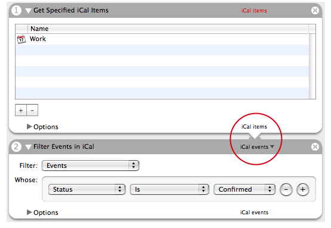
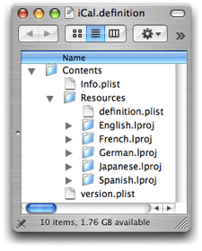
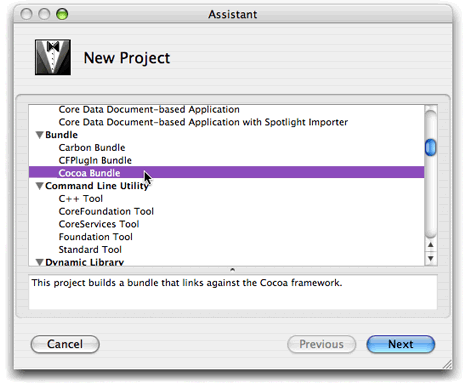
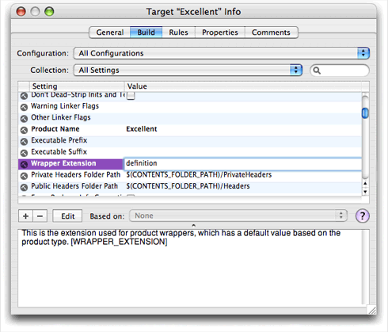
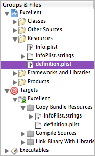
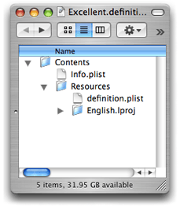
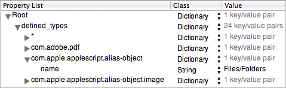

> 导航：[总目录](../../../README.md) · [documentation](../../../_indexes/documentation.md) · [Automator Programming Guide](Introduction%20to%20Automator%20Programming%20Guide.md)


[Next](Automator%20Action%20Property%20Reference.md)[Previous](Creating%20a%20Conversion%20Action.md)

# Defining Your Own Data Types

The following sections offer guidelines for when to define a custom data type, describe the procedure for creating a definition bundle, explain how to specify the `defined_types` property, and summarize the procedure for providing localizations.

Apple defines dozens of special data types for Automator actions, each with its own unique Uniform Type Identifier (UTI). You use these UTIs in an action's information property list to specify the kinds of data an action accepts and provides. The special data types defined by Apple designate such things as generic AppleScript objects, iTunes track objects, and Cocoa strings. They are described in "[Type Identifiers](Automator%20Action%20Property%20Reference.md#apple-f4xwc4dqnrsv64tfmyxwi33df52wszbpkridimbqgaytkmjvfuytamjygazq)," along with the supported public UTIs.

There might be times, however, when none of these default Automator data types can adequately describe the data that your action must deal with. The common case would be a scriptable application that your action messages with AppleScript commands. If, for example, this is a spreadsheet application and it has data objects representing such entities as worksheets and graphs, none of the Apple-defined data types could accurately represent these items of data. In cases such as this you can define your own data types for Automator.

However, you are not required to define a custom data type in these situations. You can always use one of the more generic types—for example, using a generic AppleScript object type to represent a spreadsheet object. This is especially true if only one action is involved. When you are creating a set of actions that uses application-specific data, then you might consider defining a custom type for that data. Automator can then provide more guidance to users about which actions work well with each other.

If you define custom data types, you might have to create conversion actions to convert data between your custom type and one or more public or common types. See [Creating a Conversion Action](Creating%20a%20Conversion%20Action.md#apple-f4xwc4dqnrsv64tfmyxwi33df52wszbpkridimbqgaytkmjufvjvomi) for the procedure for making a conversion action.

You specify custom data types in a definition bundle, which is a codeless loadable bundle with an extension of `.definition`. So if, for example, you are defining types of data native to the (fictional) Excellent application, you might name the definition bundle `Excellent.definition`.

A data type is essentially defined in an XML property list. But if this is the case, why not have a simple file for the property list instead of a bundle? The reason for putting data-type definitions in a bundle is that bundles support internationalization. The definition includes the strings that identify the data accepted and provided in an action's user interface (see circled area in [Figure 1](#apple-f4xwc4dqnrsv64tfmyxwi33df52wszbpkridimbqgazdimjtfvjvomi)). These strings should be localized for all supported languages and locales.

__Figure 1__  The names of action input and output



You can get an idea of the internal structure of a definition bundle by looking at any such bundle installed in `/System/Library/Automator`. [Figure 2](#apple-f4xwc4dqnrsv64tfmyxwi33df52wszbpkridimbqgazdimjtfvjvomq) shows what the `iCal.definition` bundle looks like inside its opaque package. (To look inside a bundle, Control-click it in Finder and choose Show Package Contents from the contextual menu.)

__Figure 2__  The contents of `iCal.definition`



This definition bundle supports localizations in five languages. The example shows that the `definition.plist` file, which contains the property list defining the data types, is stored just under the bundle's `Resources` folder. [Adding a Localization](#apple-f4xwc4dqnrsv64tfmyxwi33df52wszbpkridimbqgazdimjtfvjvona)" discusses localizations in definition bundles in more detail.

To create a definition bundle in Xcode, start by choosing New Project from the File menu. In the New Project assistant window, select the Cocoa Bundle project type under Bundle (see [Figure 3](#apple-f4xwc4dqnrsv64tfmyxwi33df52wszbpkridimbqgazdimjtfvjvomy)). Click Next and in the subsequent assistant window provide a name and location for your project; click Next again to have Xcode display the project window.

__Figure 3__  Select the generic Cocoa bundle project type



From this point, it takes four steps to create a definition bundle:

1. Specify the extension of the bundle.
2. Add the property-list file to the project.
3. Specify the properties of data types in the property-list file.
4. Add localizations to the definition bundle.

To change the extension of the bundle, double-click the target icon in the Groups and Files list in Xcode. This action opens the Info window for the target. Select the Build pane of this window and scroll down the table of settings until you find the Wrapper Extension build setting. Double-click the cell under Value for this setting and change the value to "definition" (see [Figure 4](#apple-f4xwc4dqnrsv64tfmyxwi33df52wszbpkridimbqgazdimjtfvjvoni) for an example).

__Figure 4__  Changing the bundle extension



Next add the property-list file to the definition bundle:

1. Select the project's Resources folder in the Groups and Files list.
2. Choose New File from the File menu.
3. In the New File assistant, select Empty File in Project from the list of file types.
4. In the next window of the assistant (New Empty File in Project), type "definition.plist" in the File Name field.
5. Make sure that the correct project location, project name, and target are selected and click Finish.

Disclose the contents of the Resources folder in the Groups and Files list to find the `definition.plist` file you have just added. [Figure 5](#apple-f4xwc4dqnrsv64tfmyxwi33df52wszbpkridimbqgazdimjtfvjvonq) shows what it should look like. (If `definition.plist` is not under Resources, move it there.)

__Figure 5__  The `definition.plist` file in the Groups and Files list



You might also notice that `definition.plist` (once it's added to Resources) also appears under the Copy Bundle Resources build phase under the target in the Groups and Files list. If you build the definition bundle at this point and then look inside the bundle package, you can see the initial layout of your bundle.

__Figure 6__  Initial layout for a bundle package



You are ready now to specify the properties of your custom data types and localize the human-readable parts of those properties; see "[Specifying Defined Types](#apple-f4xwc4dqnrsv64tfmyxwi33df52wszbpkridimbqgazdimjtfvjvony)" and "[Adding a Localization](#apple-f4xwc4dqnrsv64tfmyxwi33df52wszbpkridimbqgazdimjtfvjvona)," respectively, for the relevant information.

Once you finish creating your definition bundle, it is ready for installation. You install definition files in the same locations you install actions: `/Library/Automator`, `/Network/Library/Automator`, `Library/Automator` in users' home directories, or inside the application bundle. See "[Installing Actions](Developing%20an%20Action.md#apple-f4xwc4dqnrsv64tfmyxwi33df52wszbpkridimbqgaytkmjrfuytamzsheza)" for more information.

Giving a file an extension of `.plist` doesn't make it a property-list file, let alone one for defining Automator data types. A property list on OS X must have the proper XML header. In addition, a property list in a definition bundle must have the `defined_types`property.

The quickest way to start writing the property list for your definition bundle is to copy the contents of an existing `definition.plist` file and then modify it appropriately. The `definition.plist` file in `/System/Library/Automator/Automator.definition` is good source for this. Copy the contents of the file and paste it into your own `definition.plist`. The property list should look like the example in [Listing 1](#apple-f4xwc4dqnrsv64tfmyxwi33df52wszbpkridimbqgazdimjtfvjvooa).

__Listing 1__  The contents of `definition.plist` — Automator definition bundle (partial)

```xml
<?xml version="1.0" encoding="UTF-8"?>
<!DOCTYPE plist PUBLIC "-//Apple Computer//DTD PLIST 1.0//EN" "http://www.apple.com/DTDs/PropertyList-1.0.dtd">
<plist version="1.0">
<dict>
    <key>defined_types</key>
    <dict>
        <key>*</key>
        <dict>
            <key>name</key>
            <string></string>
        </dict>
        <key>com.adobe.pdf</key>
        <dict>
            <key>name</key>
            <string>PDF files</string>
        </dict>
        <key>com.apple.applescript.alias-object</key>
        <dict>
            <key>name</key>
            <string>Files/Folders</string>
        </dict>
        <key>com.apple.applescript.alias-object.image</key>
        <dict>
            <key>name</key>
            <string>Image files</string>
        </dict>
        // more defined types here
    </dict>
 </dict>
 </plist>
```

Replace the key-value pairs in the `defined_types` dictionary with your own key-value pairs, deleting the unused ones. The key of each data-type definition is a Uniform Type Identifier in a specific notational form: `com.`_companyName_`.`_applicationName_`.`_dataTypeName_. The value of the UTI key is another dictionary containing a key-value pair defining the human-readable name of the data type.

Because Automator displays the strings provided as values to the `name` key in a small area of the action user interface, they should be as short as possible. In addition, the initial letter of the string should be uppercase and every other letter should be lowercase (except for proper names and acronyms).

So if, for example, you have a data type of the Excellent application that you want to define—let's say a spreadsheet worksheet—you might define the following `defined_types` property (assuming the company's name is Acme):

```
<key>com.acme.excellent.worksheet</key>
<dict>
    <key>name</key>
    <string>Excellent worksheets</string>
</dict>
```

An easier and less error-prone alternative to editing the property list in Xcode is to edit it in the Property List Editor application—but only after you have added the XML header information. To open the `definition.plist` file in Property List Editor, Control-click the file in Xcode and select Open In Finder from the contextual menu. (Property List Editor is the default application for XML files.)

__Figure 7__  Editing the defined types in Property List Editor



This section summarizes the procedure for adding localized strings for a defined data type. For more about internationalization and localization of actions, see [Internationalizing the Action](Developing%20an%20Action.md#apple-f4xwc4dqnrsv64tfmyxwi33df52wszbpkridimbqgaytkmjrfu4tqobzgy). To learn more about internationalization in Cocoa generally, read _[Internationalization and Localization Guide](../../Mac%20OSX/Internationalization%20and%20Localization%20Guide/About%20Internationalization%20and%20Localization.md#apple-f4xwc4dqnrsv64tfmyxwi33df52wszbpgeydambqge3tc2i)_.

In Xcode choose New File from the File menu, select the Empty File in Project type, and give the file the name "Localizable.strings". Move the file under the Resources project folder in the Groups and Files list.

Next open the `Localizable.strings` file in Xcode and, for each data type's `name` property, add four items in the format shown in [Listing 2](#apple-f4xwc4dqnrsv64tfmyxwi33df52wszbpkridimbqgazdimjtfvjvooi):

- A comment or identifier of the localized word or phrase
- Under the comment, the value of a `name` key in the `definition.plist` file, quoted; this is the data-type name, used here as a key.
- An equal sign to the right of the data-type name
- The localized equivalent of the data-type name, quoted

__Listing 2__  Contents of a `Localizable.strings` file

```
/* worksheet */
"worksheet" = "tableau";
/* graph */
"graph" = "graphique";
```

Next internationalize the `Localizable.strings`file by assigning it to a certain language folder (that is, one with an extension of `.lproj` To do this, select the file in Xcode and choose Get Info from the FIle menu. Open the General pane of the Info window. If the language of the localization is not listed in the table of current localizations, click Add Localization and type or select a localization (French in the case of the above example). Then select a localization listed in the table.

[Next](Automator%20Action%20Property%20Reference.md)[Previous](Creating%20a%20Conversion%20Action.md)

