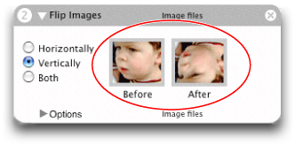

> 导航：[总目录](../../../README.md) · [documentation](../../../_indexes/documentation.md) · [Automator Programming Guide](Introduction%20to%20Automator%20Programming%20Guide.md)

[Next](Developing%20an%20Action.md)[Previous](How%20Automator%20Works.md)

# Design Guidelines for Actions

As with other parts of the human interface in OS X, actions should have a consistent look and feel so that users can easily use them. The following guidelines will help you achieve that consistent look and feel.

For concrete examples of well designed actions, look at the action project examples installed in `/Developer/Examples/Automator` .

Perhaps the most important guideline is to keep your action as simple and focused as possible. An action should _not_ attempt to do too much; by doing so it runs the risk of being too specialized to be useful in different contexts. An action should perform a narrowly defined task well. If an action you’re working on seems like it’s unwieldy, as if it’s trying to do too much, consider breaking it into two or more actions. Small, discrete actions are better than large and complex actions that combine several different elements.

An action should inform the user what is going on, and if it encounters errors, it should tell users about any corrective steps that they might take. If an action takes a particularly long period to complete, consider displaying a determinate progress indicator. (Automator displays a circular indeterminate progress indicator when an action runs.)

You should provide an action in as many localizations as possible. See [Developing an Action](Developing%20an%20Action.md#apple-f4xwc4dqnrsv64tfmyxwi33df52wszbpkridimbqgaytkmjrfvbecsscjfbuosa) for further information on internationalizing actions.

Interoperability is critical in the implementations of actions. An action’s usefulness is limited by the types of data it can accept from other actions and give to other actions in a workflow. You specify these data types in the `AMAccepts` and `AMProvides` properties of actions using Uniform Type Identifiers (UTIs). The following guidelines apply to action input and output.

- Make the types of data the action provides and accepts as specific as possible. For example, if an image is coming from iPhoto, use `com.apple.iphoto.photo-object` as the UTI identifier instead of `public.image`.
- Specify multiple accepted and provided types, unless that is not appropriate for the action.
- Ideally, an action should accept and provide a list (or array) of the specified types.
- If your action doesn’t require input and doesn’t provide output (such as the Pause action), it should not list any input or output types. The framework will then route the flow of data around the action.
- Even if your action requires input it should still be prepared to handle gracefully the case where it doesn’t get input.

For more on the `AMAccepts` and `AMProvides` properties and the supported UTIs, see [Automator Action Property Reference](Automator%20Action%20Property%20Reference.md#apple-f4xwc4dqnrsv64tfmyxwi33df52wszbpkridimbqgaytkmjvfvbegskkjbbeuqy).

The following guidelines apply to the names of actions:

- Use long, fully descriptive names (for example, Add Attachments to Front Mail Message).
- Start the name with a verb that specifies what the action does.
- Use plural objects in the name—actions should be able to handle multiple items, whether that be URLs or NSImage objects.

  - However, you may use the singular form if the action accepts only a single object (for example Add Date to File Names, where there can be only one date).
- Don’t use “(s)” to indicate one or more objects (for example, Add Attachment(s). Use the plural form.

The user interface of an action should adhere to the following guidelines:

- Keep it simple:

  - Refrain from using boxes.
  - Minimize the use of vertical space; in particular, use pop-up menus instead of radio buttons even if there are only two choices.
  - Avoid tab views; instead, use hidden tab views to swap alternate sets of controls when users select a top-level choice.
  - Don’t have labels repeat what’s in the action title or description.
- Keep it small and consistent:

  - Use 10-pixel margins.
  - Use small controls and labels.
  - Give buttons the standard Aqua “Push Button” style.
  - Follow the Aqua guidelines (as suggested in Interface Builder).
  - Implement behavior expected in a user interface—for example, tabbing between multiple text fields.
- Provide feedback and information to users:

  - Use determinate progress indicators when a user-interface element needs time to load its content; for example, an action that presents a list of current iCal calendars might need many seconds to load them.
  - Present examples of what the action will do where possible. For instance, the Make Sequential File Names action has an area of the view labeled “Example” that shows the effect of action options; the examples have the same font size and color as the rest of the action’s user interface. Figure 1 shows an action that uses images for its example.

    __Figure 1__  An action that includes an example of its effect

    
- Streamline file and folder selection and display:

  - Insert a pop-up menu that includes standard file-system locations, such as Home, Startup Disk, Documents, Desktop, and so on.
  - The Cocoa-Automator palette includes pre-configured pop-up menus for selecting applications, directories, and files; use these objects where appropriate. See [Using the Cocoa-Automator Palette](Developing%20an%20Action.md#apple-f4xwc4dqnrsv64tfmyxwi33df52wszbpkridimbqgaytkmjrfuytenjyga4a) for details.

[Next](Developing%20an%20Action.md)[Previous](How%20Automator%20Works.md)

