> 导航：[总目录](../../../README.md) · [documentation](../../../_indexes/documentation.md) · [Automator Programming Guide](Introduction%20to%20Automator%20Programming%20Guide.md)


[Next](Show%20When%20Run.md)[Previous](Design%20Guidelines%20for%20Actions.md)

# Developing an Action

It’s easy to develop an Automator action. Because an action is a loadable bundle, its scope is limited and hence the amount of code you need to write is limited. Apple also eases the path to developing an action because of all the resources it places at your disposal. When you create an action project, the Xcode development environment provides you with all the necessary files and settings to build an action. You just need to follow certain steps—described in this document—to arrive at the final product.

The steps for developing an action don’t necessarily have to happen in the order given below. For example, you can write an action description at any time and you can specify the Automator properties at any time.

To create an Automator action project, launch the Xcode application and choose New Project from the File Menu. From the first window of the New Project assistant, select one of the two Automator action projects, depending on your language choice:

- AppleScript Automator Action
- Cocoa Automator Action
- Shell Script Automator Action

Figure 1 shows the selection of the Cocoa Automator action.

__Figure 1__  Choosing a Cocoa Automator Action project type in Xcode

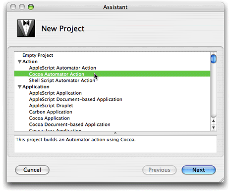

Complete the remaining window of the New Project assistant as usual—specify a file-system location for the project and enter a project name. When you finish, an Xcode window similar to the one in Figure 2 is displayed.

__Figure 2__  Template files for a Cocoa Automator Action project

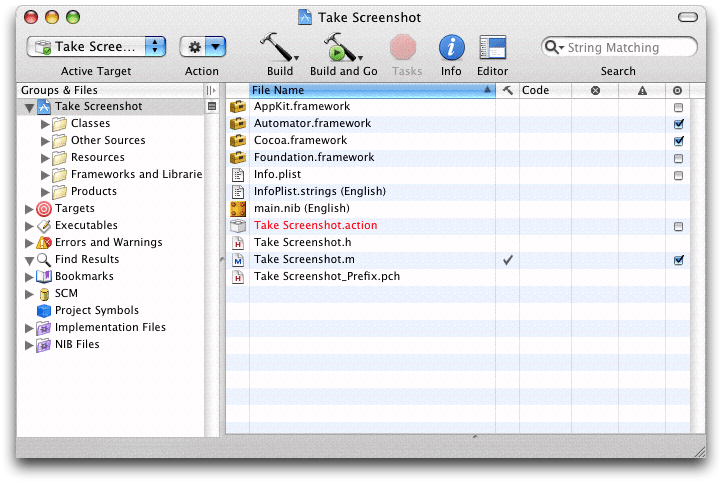

You’ll become more familiar with many of the files and file wrappers displayed here in the sections that follow. But here is a summary of the more significant items:

- `Automator.framework`—The project automatically adds the Automator framework to the project.
- `Info.plist`—The information property list for the bundle includes the Automator properties; comments inserted in the value elements provide helpful hints. See [Specifying Action Properties](#apple-f4xwc4dqnrsv64tfmyxwi33df52wszbpkridimbqgaytkmjrfuytamrsga3q) for further information.
- _projectName_`.h` and _projectName_`.m`—A Cocoa action project includes header and implementation template files prepared for an AMBundleAction subclass (including a null implementation of `runWithInput:fromAction:error:`).

  An AppleScript action project includes a template `main.applescript` file instead of Objective-C template files. A shell script action project includes a `main.command` file instead.
- `main.nib`—The bundle’s nib file, partially prepared for the action. See [Constructing the User Interface](#apple-f4xwc4dqnrsv64tfmyxwi33df52wszbpkridimbqgaytkmjrfu4tmobxg4) for details.

In the Xcode project browser, double-click `main.nib` to open the nib file of the action in Interface Builder. The nib file contains the usual File’s Owner and First Responder instances, but it also contains two other items specific to actions:

- A blank NSView object (known as the content view of the action, or simply, action view) on which you set the controls, text fields, and other user-interface elements for setting the parameters of the action.
- An instance of the NSObjectController class named Parameters. The Parameters instance is used for establishing bindings between objects on the user interface and the action instance.
- For AppleScript-based actions, an AppleScript Info instance that AppleScript Studio uses to contain the names and event handlers for objects in the nib file.

Several objects and relationships in `main.nib` are already initialized for you. For example, File’s Owner is set in the Custom Class pane of the Info window to be an instance of the AMBundleAction class (as shown in Figure 3). (If your project is for an AppleScript Automator action, File’s Owner is set instead to AMAppleScriptAction.) With File’s Owner still selected, if you choose the Connections pane of the Info window, you will see that the `view` outlet of the AMAction object has been connected to the action’s view.

__Figure 3__  FIle’s Owner set to an instance of AMBundleAction

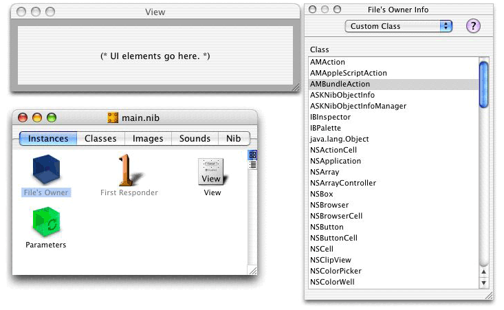

Construct the user interface of the action as you would for any view in Interface Builder. However, keep in mind that actions, because they share space in an Automator workflow with other actions, should be compact, even minimal. Place only those controls, text fields, and other user-interface objects that are absolutely necessary. And try to be conservative in your use of vertical space; for example, prefer pop-up menus over radio buttons for presenting users with a choice among multiple options. For more on user-interface guidelines for actions, see [The User Interface of an Action](Design%20Guidelines%20for%20Actions.md#apple-f4xwc4dqnrsv64tfmyxwi33df52wszbpkridimbqgaytkmjqfu4tombrha) in [Design Guidelines for Actions](Design%20Guidelines%20for%20Actions.md#apple-f4xwc4dqnrsv64tfmyxwi33df52wszbpkridimbqgaytkmjqfvbecsseirfecqq).

An important feature of Automator actions is Show When Run. This feature enables the users of workflows (as distinct from the _writers_ of workflows) to set the parameters of actions when they run the workflow as an application. By default, actions have an Options disclosure button in their lower-left corner that, when enabled, exposes additional controls; these controls allow a workflow writer to select the parts of an action’s view that are presented to users when the workflow is executed. Developers can customize the Show When Run feature; see [Show When Run](Show%20When%20Run.md#apple-f4xwc4dqnrsv64tfmyxwi33df52wszbpkridimbqgaytknrxfvbecssfi5eeurq) for details.

The Automator development environment includes an Interface Builder palette with user-interface objects designed for actions. This palette is named Cocoa-Automator. To load this palette, select the Palettes pane in the Interface Builder preferences, click Add, and select `AMPalette.palette` in `/Developer/Extras/Palettes`.

The Cocoa-Automator palette (see Figure 4) contains three specially implemented pop-up menus for presenting easily configurable lists of applications, directories, and files to users.

__Figure 4__  Cocoa-Automator palette

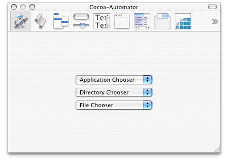

These lists provide access to standard or frequently accessed applications, folders, and files in the file system. For example, the Directories pop-up menu in an action looks something like the example in Figure 5.

__Figure 5__  The Directories pop-up menu in an action

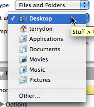

You can also configure the pop-up menus so that users can locate items other than the standard ones on the list or (in the case of the Directories pop-up menu) create new items.

To place one of these pop-up menus, simply drag it from the palette to the action view. Then to configure the pop-up menu, choose Show Inspector from the Tools menu and select the Attributes pane (Figure 6). The Attributes pane of Interface Builder allows you to configure a user-interface object in various ways.

__Figure 6__  Attributes inspector for Cocoa-Automator palette objects

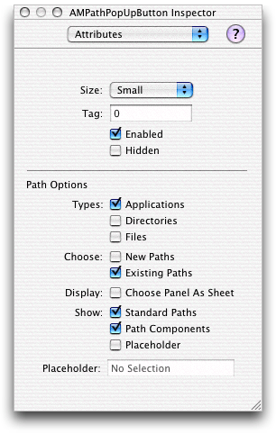

For Automator pop-up menus (AMPathPopUpButton objects), the special path options are the following:

__Types__: Allows users to choose either applications, directories, or files, or any combination of the three types. For example, if you check Directories and Files, users are able to select both directories and files from the pop-up menu.

__Choose__: Selecting New Paths adds a New item at the bottom of the pop-up menu. In the Directories pop-up menu, this allows users to create a new directory using a file-system browser; the New item does not appear in the other kinds of pop-up menus.

Selecting Existing Paths adds an Other item at the bottom of the pop-up menu. In all pop-up menu types, this item allows users to select anything in a file-system browser.

__Display__: When either the New or Open item is chosen and the Choose Panel as Sheet option is selected, the action displays the file-system browser as a worksheet-window-modal sheet rather than as an application-modal dialog.

__Show__: When the Standard Paths option is selected, the pop-up menu has the following items, depending on its type:

- If it is a Directories pop-up menu, standard locations such as Home, Desktop, Movies, and Pictures are included.
- If it is an Applications pop-up menu, the list of items includes all applications in `/Applications`.
- If it is a Files pop-up menu, nothing happens.

When the Path Components option is selected, the full path of the current chosen item is displayed.

When the Placeholder option is selected, whatever you enter in the Placeholder text field directly under the option is displayed as the first pop-up item. This placeholder is typically a string such as “Choose an application” or “No selection”.

Before an AMPathPopUpButton pop-up menu can properly function in an action view, you must establish a binding between the pop-up menu and a property of the action parameters. To do this, specify a key for the property as an attribute of the Parameters instance (see [Establishing Bindings](#apple-f4xwc4dqnrsv64tfmyxwi33df52wszbpkridimbqgaytkmjrfuytenzxg43a) for the procedure). Finally, select the pop-up menu in the user interface and then specify the key in the Bindings pane of the inspector, using the path binding; see Figure 7 for an example.

__Figure 7__  The path binding for the pop-up menu

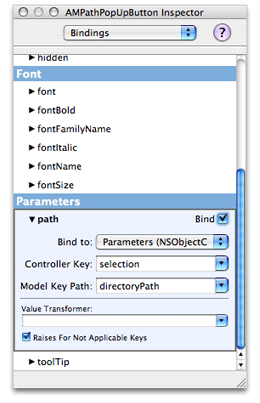

After constructing the action’s view, establish the bindings between the objects on the user interface and the action object. Bindings are a Cocoa technology conceptually based in the Model-View-Controller paradigm. In Model-View-Controller, objects in a well-designed program assume one of three roles: view objects that present data and receive user input; model objects that contain data and operate on that data; and controller objects that mediate the transfer of data between view and model objects. The bindings mechanism automatically synchronizes the exchange of data between view and model objects, reducing the need for custom controller objects and all the “glue” code they usually entail. Automator actions use bindings to communicate data between objects in an action’s view and the parameters dictionary (or record) that all actions have to record the settings users specify for an action.

The project templates for Automator actions are pre-configured to use bindings instead of the target-action and outlet mechanisms (for Cocoa-based actions) or event handlers specified in the AppleScript pane of Interface Builder for AppleScript-based actions. If you prefer, you may use these mechanisms along with the Automator framework’s “update parameters” API to update an action’s parameters manually. For information on this approach, see [Updating Non-bound Parameters](Implementing%20an%20AppleScript%20Action.md#apple-f4xwc4dqnrsv64tfmyxwi33df52wszbpkridimbqgaytkmjsfu4tqmzvgq) (for AppleScript-based actions) or [Updating Action Parameters](Implementing%20an%20Objective-C%20Action.md#apple-f4xwc4dqnrsv64tfmyxwi33df52wszbpkridimbqgaytkmjtfu4tqojtgu) (for Objective-C actions).

The following steps summarize what you must do to establish the bindings of an action in Interface Builder. For a thorough description of the Cocoa bindings technology, see _[Cocoa Bindings Programming Topics](../../Cocoa/Cocoa%20Bindings%20Programming%20Topics/Introduction%20to%20Cocoa%20Bindings%20Programming%20Topics.md#apple-f4xwc4dqnrsv64tfmyxwi33df52wszbpgeydambqge3do2i)_.

1. Select the Parameters instance in the nib file window and choose the Attributes pane of the Info window. In the table labeled “Keys” add the keys for each user-interface object whose setting or value you need to access. See Figure 8 for an example.

   __Figure 8__  Adding the keys of the Parameters instance (NSObjectController)

   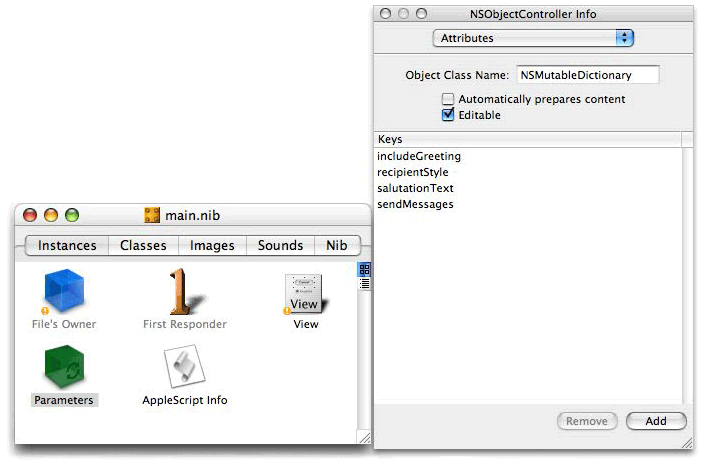

   The keys that you specify here are used elsewhere in the action to identify the controls of the action. You must therefore use the same strings you used for the binding keys in the following places in the action project:

   - As the keys for the `AMDefaultParameters` property of Automator. (The `AMDefaultParameters` property specifies the initial settings of an action; see [Specifying Action Properties](#apple-f4xwc4dqnrsv64tfmyxwi33df52wszbpkridimbqgaytkmjrfuytamrsga3q) and [Automator Action Property Reference](Automator%20Action%20Property%20Reference.md#apple-f4xwc4dqnrsv64tfmyxwi33df52wszbpkridimbqgaytkmjvfvbegskkjbbeuqy) for details.) A matching `AMDefaultParameters` entry must be added for each key used with a binding.
   - As the names of outlet instance variables and accessor methods in Objective-C actions
   - As the keys to the parameters record passed into an AppleScript-based action in its `on run` handler; see [The Structure of the on run Command Handler](Implementing%20an%20AppleScript%20Action.md#apple-f4xwc4dqnrsv64tfmyxwi33df52wszbpkridimbqgaytkmjsfu4tomjuha) for further information.
   - As the environment variables set for a shell script action; see [Creating Shell Script Actions](Creating%20Shell%20Script%20Actions.md#apple-f4xwc4dqnrsv64tfmyxwi33df52wszbpkridimbqgazdanzyfvbegskcifcucqy) for details.
2. With the Parameters instance still selected, choose the Bindings pane of the Info window and expand the “contentObject” subpane. Set the “Bind to” pop-up item to File’s Owner and enter `parameters` in the “Model Key Path” field.

   The parameters key path refers to the `parameters` property defined by the AMBundleAction class—that is, the dictionary or record used to capture the settings users make in an action’s view.
3. For each user-interface object of the action, establish a binding to the appropriate parameters key. For example, Figure 9 shows the binding for a pop-up menu.

   __Figure 9__  Establishing a binding for a pop-up menu

   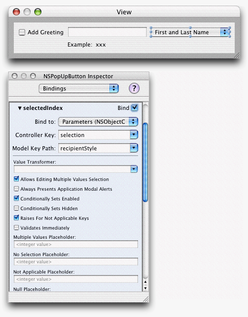

   The binding varies by type of user-interface object. For example, pop-up menus usually work off the index of the item (`selectedIndex`), check boxes have a Boolean `value`, and text fields have a string `value`.

When you are finished with the action’s user interface, save the nib file and return to the Xcode project.

The Automator application uses special properties in an action’s information property list (`Info.plist`) to get various pieces of information it needs for presenting and handling the action. This information includes:

- The name of the action
- The icon for the action
- The application, category, and keywords for the action
- The types of data the action accepts and the types of data it provides
- The description of the action

Automator properties have the prefix “AM”. The project template for actions includes almost all of the properties you need (or may need) to specify. As shown in Figure 10, the template provides helpful comments as placeholders for key values. In creating an action, you need to supply real values for these keys. [Automator Action Property Reference](Automator%20Action%20Property%20Reference.md#apple-f4xwc4dqnrsv64tfmyxwi33df52wszbpkridimbqgaytkmjvfvbegskkjbbeuqy) describes the Automator properties, including their purpose, value types, and representative values.

Because the values of some Automator properties appear in the user interface, you should include translations of them in an `Infoplist.strings` file for each action localization you provide. See [Internationalizing the Action](#apple-f4xwc4dqnrsv64tfmyxwi33df52wszbpkridimbqgaytkmjrfu4tqobzgy) for further information.

In addition to properties that are specific to Automator, an action’s `Info.plist` file contains properties that are common to all bundles, including applications as well as action bundles. The values of most of these generic bundle properties are supplied automatically when you create a project. However, you must specify the value of the `CFBundleIdentifier` property. Automator uses this property to find an action and its resources. The identifier needs to be unique, and should use the standard format:

`com.`_CompanyName_`.Automator.`_ActionIdentifier_

For example, if your company’s name is Acme and your action is named Find Foo Items, a suitable `CFBundleIdentifier` would be `com.Acme.Automator.FindFooItems`.

The Automator project templates preset two properties, `AMName` and the action-identifier portion of `CFBundleIdentifier`, with placeholder text. When you create a project, the name of the project is substituted for the placeholders. (If the project name contains spaces, Xcode substitutes underscore character for the spaces in the bundle identifier.)

__Figure 10__  Part of the template for the Automator properties in Info.plist

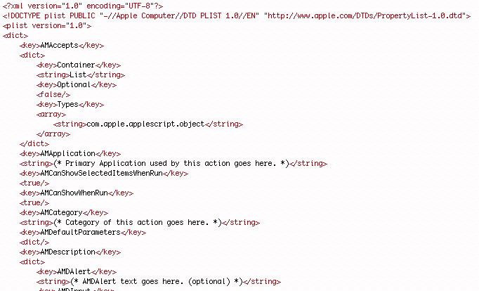

To edit `Info.plist` manually in an Xcode window, just double-click the filename in the project window. If you would like always to open up the `Info.plist` file in a different editor for property lists, such as the Property List Editor application or BBEdit, use the Finder’s Get Info window to set the default application for files with extension `.plist`. Then in Xcode, use the contextual menu command Open with Finder. However, the preferred tool for editing Automator properties is to use the built-in Automator property Inspector, which was introduced in Xcode 2.1.

You can edit the information property list as a text file in Xcode. Just double-click the `Info.plist` file in the project window and the file will open in a separate window or pane. However, syntax errors can frequently happen when you edit a property list by hand. Instead you can use the Automator property inspector, which makes the entering of property values easier and less susceptible to error.

This inspector is built into Xcode for all Automator project types. To access the inspector, do the following:

1. Choose Edit Active Target ‘_Target_’ from the Project menu.
2. Click the Properties tab.

The lower part of the inspector, which is usually reserved for specifying document types, is here used for Automator-specific properties. The inspector breaks the properties into logical collections; the first collection shows the General properties (Figure 11).

__Figure 11__  Automator property inspector—General properties

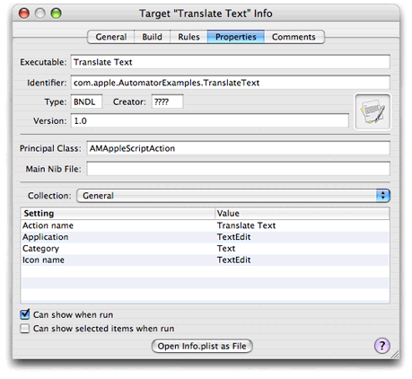

In an inspector view such as the one in Figure 11, double-click a cell under Value to open the cell for entering a value. If, for example, you want to enable the Show When Run feature for the action, click the appropriate check boxes.

If you expose the Collection pop-up menu, you’ll see other logical collections of Automator properties. Figure 12 shows the collection for the `AMAccepts` property (Input).

__Figure 12__  Automator property inspector—Input properties

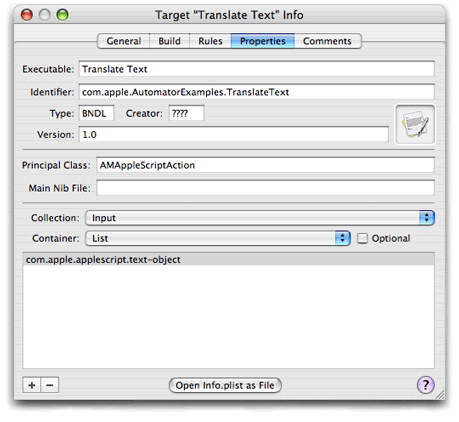

When the property is an array, as with `AMAccepts`, click the plus sign in the lower left corner of the inspector to open a new field for editing. Enter the value (in this case a type identifier). To delete an item from the array, select it and click the minus sign.

A small but important part of action development is writing the action description. Automator displays the description it its lower-left view whenever the user selects the action. The description briefly describes what the action does and tells users anything else they should know about the action. Figure 13 shows what a typical description looks like.

__Figure 13__  An sample action description

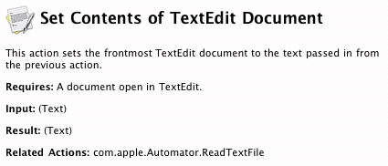

Because the description fits into a relatively small area of the Automator window, you should make it as concise and brief as possible. Ideally the user should not have to scroll the description view to see all of the text.

A description has several parts, each of which you specify through an Automator property in the bundle’s information property list (`Info.plist`):

- _Icon_. A 32 x 32 pixel TIFF image displayed in the upper-left corner of the description. It is the application icon that the `AMIconName` property specifies (see [Property Keys and Values](Automator%20Action%20Property%20Reference.md#apple-f4xwc4dqnrsv64tfmyxwi33df52wszbpkridimbqgaytkmjvfu4tsojxgm)).
- _Title_. The string that you specify for the `AMName` property (see [Property Keys and Values](Automator%20Action%20Property%20Reference.md#apple-f4xwc4dqnrsv64tfmyxwi33df52wszbpkridimbqgaytkmjvfu4tsojxgm)).
- _Summary_. A sentence or two directly under the title that succinctly states what the action does.
- _Input_ and _Result_. States the types of data that the action accepts and provides. Automator enters default values for these sections if you do not specify anything.
- _Options_. Summarizes the configuration options on the action’s user interface.
- _Requires_. Describes any requirement for the action to work properly—for example, Safari must be displaying a web page.
- _Alert_. Warns the user of any likely consequence of the action—for example, if it will delete a calendar.
- _Note_. Presents additional information that is not as critical as an alert.
- _Related actions_. Indicates actions that are related to this one—for example, an Import Image action might mention an Export Image action.

A description’s icon, title, summary, input, and result sections are required or strongly recommended. All of the properties listed above, except for icon and title, are subproperties of the description-specific `AMDescription` property. The `AMDescription` example in Listing 1 shows the subproperties specified for the Send Birthday Greeting description depicted in [Figure 13](#apple-f4xwc4dqnrsv64tfmyxwi33df52wszbpkridimbqgaytkmjrfuytamjvgu4s2qsbjjbuqrshie).

__Listing 1__  AMDescription properties for Send Birthday Greetings description

```
    <key>AMDescription</key>
    <dict>
        <key>AMDInput</key>
        <string>Address Book entries from previous action.</string>
        <key>AMDOptions</key>
        <string>Birthday message. Choice of picture.
            Randomly chosen picture. </string>
        <key>AMDSummary</key>
        <string>This action sends an email birthday greeting, with a
            picture, to each of the Address Book entries.</string>
    </dict>
```

See [Property Keys and Values](Automator%20Action%20Property%20Reference.md#apple-f4xwc4dqnrsv64tfmyxwi33df52wszbpkridimbqgaytkmjvfu4tsojxgm) for further information on the `AMDescription` keys and values.

The most important step in creating an action is writing the Objective-C or AppleScript code (or Objective-C _and_ AppleScript code) that implements the logic for your action. The project template for Automator actions gives you template files for action implementation:

- _projectName_`.h` and _projectName_`.m` files for Objective-C actions
- `main.applescript` for AppleScript actions
- `main.command` for shell script actions

The template files fill out as much of the required structure as possible. The Objective-C header file, for example, has the necessary framework imports and an `@interface` declaration showing inheritance from AMBundleAction. The Objective-C implementation includes a null implementation of the method that all actions must implement, `runWithInput:fromAction:error: ` (see Figure 14). The `main.applescript` file, on the other hand, has a skeletal structure for the `on run` command handler that all AppleScript-based actions must implement.

__Figure 14__  Template for an Objective-C action implementation

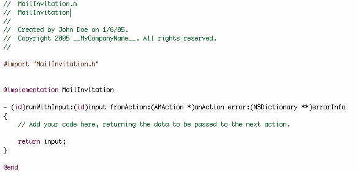

See [Implementing an AppleScript Action](Implementing%20an%20AppleScript%20Action.md#apple-f4xwc4dqnrsv64tfmyxwi33df52wszbpkridimbqgaytkmjsfvbuuqskivfeeri) and [Implementing an Objective-C Action](Implementing%20an%20Objective-C%20Action.md#apple-f4xwc4dqnrsv64tfmyxwi33df52wszbpkridimbqgaytkmjtfvbegskdincugqy) for requirements, suggestions, and examples related to implementing an Automator action. For guidelines on implementing shell script actions, see [Writing the Script](Creating%20Shell%20Script%20Actions.md#apple-f4xwc4dqnrsv64tfmyxwi33df52wszbpkridimbqgazdanzyfu4tqmjrg4).

Most polished applications that are brought to market feature multiple localizations. These applications not only include the localizations—that is, translations and other locale-specific modifications of text, images, and other resources—but have been internationalized to make those localizations immediately accessible. Internationalizing involves a number of techniques that depend on a “preferred languages” user preference and a system architecture for accessing resources in bundles. Loadable bundles (which, of course, are bundles just as applications are) depend upon the same mechanisms for internationalization.

The following sections summarize what you must do to internationalize your actions. For the complete picture, see _[Internationalization and Localization Guide](../../Mac%20OSX/Internationalization%20and%20Localization%20Guide/About%20Internationalization%20and%20Localization.md#apple-f4xwc4dqnrsv64tfmyxwi33df52wszbpgeydambqge3tc2i)_ for a general description of internationalization and _[Internationalization and Localization Guide](../../Mac%20OSX/Internationalization%20and%20Localization%20Guide/About%20Internationalization%20and%20Localization.md#apple-f4xwc4dqnrsv64tfmyxwi33df52wszbpgeydambqge3tc2i)_, for a discussion that is specific to Cocoa.

If your action programmatically generates strings and you want localized versions displayed, you need to internationalize your software using access techniques that are different for Objective-C actions and script-based actions.

Both Objective-C and AppleScript actions require you to create for each localization a strings file, which is a file with an extension of `.strings`. (The conventional, or default, name for a strings file is `Localizable.strings`.) Each entry in a strings file contains a key and a value; the key is the string in the development language and the value is the translated string. An entry can also have a comment to aid translators. Use a semicolon to terminate an entry. Here are a few examples:

```
/* Title of alert panel which brings up a warning about
saving over the same document */
"Are you sure you want to overwrite the document?" =
“Souhaitez-vous vraiment écraser le document ?";

/* Encoding pop-up entry indicating automatic choice of encoding */
"Automatic" = "Automatique";

/* Button choice allowing user to cancel. */
"Cancel" = "Annuler";
```

When you have completed a `Localizable.strings` file for a localization, you must internationalize it just as you would any other language- or locale-specific resource file of the bundle. See [Internationalizing Resource Files](#apple-f4xwc4dqnrsv64tfmyxwi33df52wszbpkridimbqgaytkmjrfu4tsmjsgm) for a summary.

For Objective-C code, use the `NSLocalizedString`macro or one of the other `NSLocalizedString...` macros to request a localization appropriate for the current user preference. Listing 2 gives an example that shows the use of `NSLocalizedString` in conjunction with the NSString `stringWithFormat:` method.

__Listing 2__  Using NSLocalizedString in Objective-C code

```objc
- (NSString *)displayName
{
    int cnt = [pdfView pageCount];
    NSString *name;

    if (cnt == 1) {
        NSString *format = NSLocalizedString(@"%@ (1 page)",
            @"Window title for a document with a single page");
        name = [NSString stringWithFormat:format, fileName];
    } else {
        NSString *format = NSLocalizedString(@"%@ (%d pages)",
            @"Window title for a document with multiple pages");
        name = [NSString stringWithFormat:format, fileName, cnt];
    }

    return name;
}
```

For AppleScript scripts the command equivalent to `NSLocalizedString` is `localized string`. One good approach is to have a local subroutine that takes the string to localize as a parameter and uses the `localized string` command on it, as in Listing 3.

__Listing 3__  Script handler for localizing strings

```
on localized_string(key_string)
return localized string key_string in bundle with identifier "com.apple.Automator.myAction"
end localized_string
```

Elsewhere in `main.applescript` and in other scripts for the action, call this subroutine when you need to get a string in the current localization:

```
    if the calendar_name is my localized_string("No Calendars") then        error my localized_string("The copy of iCal on this computer contains no calendars to clear.")
```


A standard variant of a strings file for projects is `Infoplist.strings`. In this file you assign localized strings (that is, translations) to the keys that appear in the `Info.plist` file. For Automator, this includes not only the top-level properties such as `AMName` but subproperties of Automator properties. For example, the following excerpt is from the `Infoplist.strings` file for the Crop Images action:

```
AMName = "Crop Images";
ApplyButton = "Add";
IgnoreButton = "Don't Add";
Message = "This action will change the image files passed into it.  Would you like to add a Copy Files action so that the copies are changed and your originals are preserved?";
```

The key-value pairs in this example include not only an English-localized value for the `AMName` property but localized strings for the subproperties of the `AMWarning` property.

You should internationalize any file in your action project that contains data that is specific to a language or locale. These files include:

- Nib files
- Image files
- Strings files (`Localizable.strings`)
- `Infoplist.strings`

Internationalization of a resource file simply entails the assignment of a language or locale to the file. When you build the action project, Xcode automatically puts the resource in a localization subdirectory of the bundle’s `Resources` directory. Localization subdirectories have an extension of _.lproj_ (for example, `French.lproj`).

To internationalize a resource file, do the following:

1. Select the Resources folder in Xcode.
2. Add the file to the project (Project > Add Files).
3. Select the file and choose Get Info from the Project menu.
4. Click Make File Localizable.
5. Click Add Localization and enter or select a language or locale.

An action project is automatically set up in Xcode so that when you choose the Run or Debug commands, Xcode launches the Automator action and adds your action to the set of actions loaded by Automator. To see how this is done, select Automator in the Executables smart group and choose Edit Active Executable from the Project menu. As you can see, in the General pane of the inspector the “Executable path” value is set to `/Applications/Automator.app`. Select the Arguments pane of the inspector and note that the `-action` launch-time argument has been set to your action (Figure 15).

__Figure 15__  Setting the launch argument for Automator

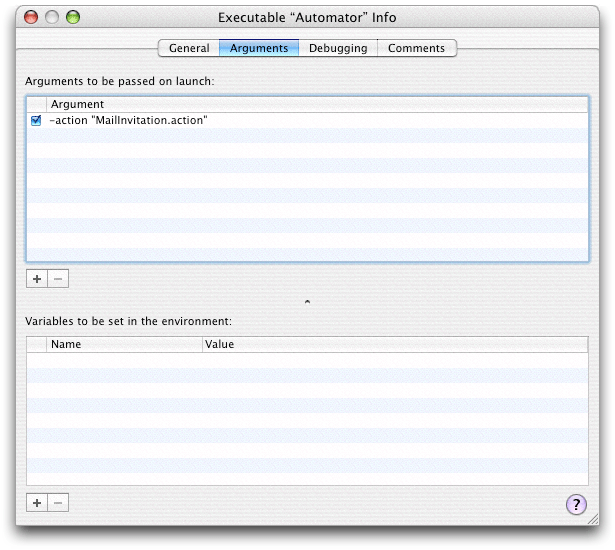

To test your action, build and run the action project (Build > Build and Run). As Automator builds the project it runs the `amlint` utility in a build phase. The `amlint` tool performs integrity checks to make sure the action is properly constructed; for example, it verifies that all required Automator properties have been set. It integrates its warning messages with the other messages in the Xcode Build Results window. Although amlint does not generate error messages (thereby halting the build), you should investigate and fix all reported problems before you build a deployment version of the action. To find out more about `amlint`, see the man page for it (which you can access from Xcode’s Help menu).

When Automator launches, you should create a workflow which contains your action. Run the workflow and observe how your action performs. To get better data from testing, consider the following steps:

- Use the View Results action to see the output of prior actions.
- Use the Confirmation Dialog action to pause or cancel execution of the workflow.
- Add one each of the above two actions between each action.

If the action is based on AppleScript, you can use the Run AppleScript action to test your `on run` command handler as you write it.

If your action is based on an Objective-C implementation, you can debug an action just as you would any other Objective-C binary. Simply set a breakpoint in Xcode. When your action is run in Automator, the breakpoint will trigger in `gdb`. You can also debug AppleScript actions using a special graphical debugger, which is preset for AppleScript action projects. This debugger looks and behaves very much like the graphical debugger for `gdb` does. It stops at breakpoints, displays variables, and lets you step through the script. The variables include globals, locals, and properties. Figure 16 shows the AppleScript debugger in action.

__Figure 16__  The AppleScript debugger

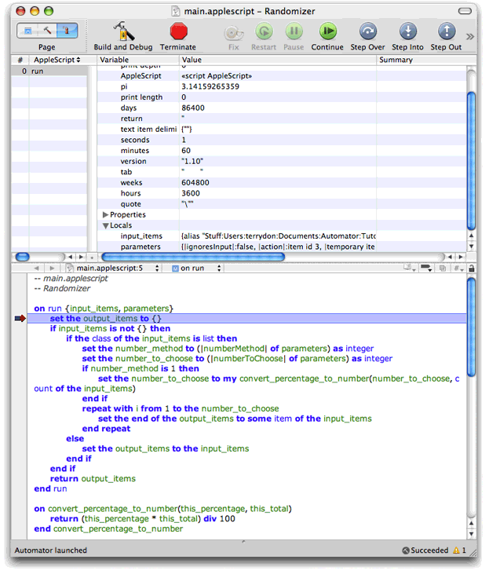

To debug AppleScript actions, you can also insert `log` or `display dialog` statements in the code. If the log statement is inside an application `tell` block, use the `tell me to log` expression instead of the simple `log`.

When your action has been thoroughly debugged and tested, build a deployment version of the bundle (using the proper optimizations). Then create an installation package for the action (or add the action to your application’s installation package). The installer should copy the action to `/Library/Automator` or `~/Library/Automator`, depending on whether access to the action should be system wide or restricted to the installing user.

Instead of installing your action separately, you can put it inside the bundle of your application, especially if the action uses the features of that application. When Automator searches for actions to display, it looks inside registered applications as well in the standard Automator directories. The advantage of packaging your actions inside an application is that you don’t need to create a separate installation package to install the actions. To install the actions, users need only drag the application to a standard location.

Action bundles should be stored inside the application wrapper at `Contents/Library/Automator`. Thus, if your action is `MyAction.action` and your application is `MyApp.app`, the path inside the application would be:

```
MyApp.app/Contents/Library/Automator/MyAction.action
```

You can either manually copy an action into this location (after creating the necessary subdirectories) or you have Xcode copy it using a Copy Files build phase. If you copy an action into an application bundle but the application is already installed on a system, you must get Launch Services to recognize that the application has new content to register (that is, the new action) by changing the application’s modification date. You can do this by entering the `touch` command in the Terminal application.

```
$> sudo touch /Applications/MyApp.app
```

Or you can rename the application in Finder to something else, change it back to the original name, and then launch the application once.

_Question:_ How can I determine which version of an action Automator is using if multiple versions of my application (possibly containing multiple versions of the action) are installed (locally or on my network)?

_Answer:_ There is no way to _specify_ which version of your application Automator should get actions from if multiple versions of the application are installed. However, there are several ways to _determine_ the version of an action that is actually being used:

- In OS X v10.5, when you select an action in the Action list, you can see its version in the description view. You can also Control-click an action in the workflow view and choose Show in Finder to see where the action is located, so that you can examine it directly.
- In OS X v10.4, Automator does not show the action version in the description view or allow you to show the action in the Finder. A possible work around is to delete any unwanted actions, if that option is available to you, so that only the desired version of the action is available.

_Question:_ How can I view log or error messages?

_Answer:_ If you are developing a shell script action, and the action exits with a non-zero status code, anything your action wrote to `stderr` will show up in the Automator log, as described in [Debugging and Testing Shell Script Actions](Creating%20Shell%20Script%20Actions.md#apple-f4xwc4dqnrsv64tfmyxwi33df52wszbpkridimbqgazdanzyfu4tqnzqgu).

If you are developing an AppleScript action, output of AppleScript statements such as `log` or `tell me to log` appear in the Console log (not in the Automator log).

If you are developing a Cocoa action, output from `NSLog` statements will also appear in the Console log.

[Next](Show%20When%20Run.md)[Previous](Design%20Guidelines%20for%20Actions.md)

