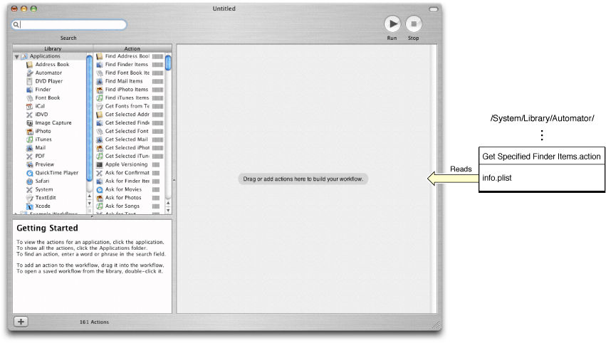
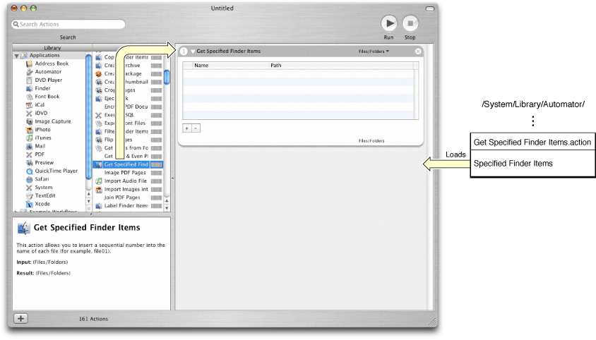
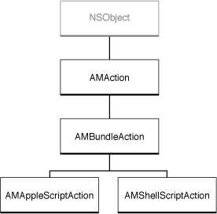
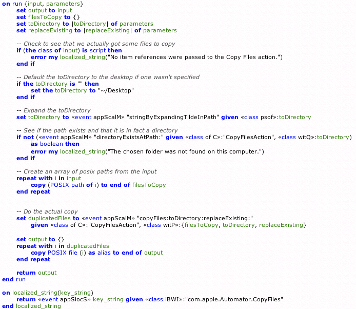

> 导航：[总目录](../../../README.md) · [documentation](../../../_indexes/documentation.md) · [Automator Programming Guide](Introduction%20to%20Automator%20Programming%20Guide.md)


[Next](Design%20Guidelines%20for%20Actions.md)[Previous](Automator%20and%20the%20Developer.md)

# How Automator Works

The following sections describe the development environment, runtime architecture, and class hierarchy for Automator actions.

The Xcode development environment integrates a number of technologies to make action programming as efficient as possible:

- Xcode project templates—Apple defines a project type for each of the languages used to implement actions: AppleScript, Objective-C, and shell script. Each project type contains all required files and resources, and supplies placeholder code and default configurations for the action-bundle project.
- AppleScript Studio—A powerful tool that helps you to create Mac apps that support the Aqua user interface guidelines and that can execute AppleScript scripts.
- Interface Builder—A tool for creating graphical user interfaces from palettes of standard objects. Automator supplies its own palette (Cocoa-Automator) containing pop-up menus for files and folders. The action project template includes a preconfigured nib file.
- Cocoa bindings—Actions by default are designed to use the Cocoa bindings mechanism to communicate data automatically between an action’s view and its internal parameters; an action’s nib file is configured to support bindings.
- Objective-C frameworks—Support for Automator actions is implemented in Objective-C. Consequently, the Foundation, Application Kit, and Automator frameworks—all Objective-C frameworks—are automatically imported into and linked with action projects.

The final product of all these components, when an action is built, is a loadable bundle.

The Automator application is based on a loadable bundle architecture. It loads loadable bundles called actions and executes the code they contain in the sequence determined by the current workflow, piping the flow of data from one action to the next.

Each action is packaged as a loadable bundle—or in the case of AppleScript-based actions, a potentially loadable bundle. A loadable bundle contains resources of various kinds and usually binary code, but it is not capable of executing that code on its own. The internal structure of a Cocoa bundle is in a form that an NSBundle object “understands.” Using an NSBundle object, an application or framework can load the resources and code of a loadable bundle at runtime and integrate them with what it already contains. Loadable bundles are essentially a plug-in architecture.

When it launches, Automator immediately scans the currently installed action bundles and extracts from each bundle’s information property list (`Info.plist`) the information necessary to display it and prepare it for use (see Figure 1). Automator actions (in the form of loadable bundles) are stored in standard file-system locations:

- `/System/Library/Automator` — Apple-provided actions
- `/Library/Automator` — third-party actions, general use
- `~/Library/Automator` — third-party actions, private use

Automator also looks for actions that are stored inside the bundles of any registered applications. See [Testing, Debugging, and Installing the Action](Developing%20an%20Action.md#apple-f4xwc4dqnrsv64tfmyxwi33df52wszbpkridimbqgaytkmjrfu4tsmjugy) for information on installing actions in the bundles of their related applications.

__Figure 1__  When launched, Automator gets information about available actions



When it launches, Automator also loads any Mach-O code it finds in action bundles—which in this case are Objective-C actions only— resolving external references in the process. If the action is based on Objective-C, an instance of AMBundleAction (or a subclass of that class) is unarchived from the nib. However, if an action is entirely driven by AppleScript or a shell script, Automator instead retains a reference to the bundle since there is no Mach-O code to load. When a user drags such an action into Automator’s workflow area for the first time, the application loads the action, unarchiving its nib file, and displays the action's view (see Figure 2).

__Figure 2__  When user drags AppleScript-based action into workflow, Automator loads bundle



The architectural details hereafter differ slightly based on whether the workflow is created for the first time or is unarchived.

When the user creates a new workflow by dragging one or more actions into the workflow layout view, Automator does a couple of things:

- If the action is AppleScript-based it creates an instance of AMAppleScriptAction as the owner of the bundle; it also loads the script so AppleScript Studio can perform some initialization. If the action is based on a shell script, Automator creates an instance of AMShellScriptAction instead.
- It gets the content view contained in the action’s bundle and displays it within an action view in the workflow area, setting the default values of text fields and controls as defined by the action’s `AMDefaultParameters` property.

Users modify the parameters of an action by choosing pop-up items, clicking buttons, entering text into text fields, and so on. When the workflow is ready, they click the run button to execute the workflow. With Automator acting as a coordinator, the application and each action perform the following steps in the workflow sequence:

- Automator invokes the `runWithInput:fromAction:error: ` method of the action, passing it the output of the previous action as input.

  The AMAppleScriptAction and AMShellScriptAction classes provide default implementation of this method for script-based actions. The AMAppleScriptAction implementation calls the `on run` AppleScript handler.
- The settings made in the user interface of the action are propagated as parameters to the action object via Cocoa bindings.
- The action object (in most cases) takes the input and, based on the parameters, transforms it or does whatever its stated role is (such as importing it into an application or displaying output).
- As its last step, the action returns the result of its work (its output). If it does not affect the data passed it as input, it simply returns it unchanged.

While each action is busy, Automator displays a spinning progress indicator in the action view. If an error occurs in an action, the action view displays a red “X” and may display an error message. If the action successfully completes, its view displays a green check mark. When the last action has finished its task, the workflow execution is over.

When users save a workflow or copy one via the pasteboard (clipboard), the workflow and all of its actions are archived. Automator invokes the `writeToDictionary:` method of each of the actions in the workflow, passing in a mutable dictionary of the action’s parameters and other information. The action may choose to modify the contents of the dictionary before returning from `writeToDictionary:`. Then the combined dictionaries of each action of the workflow are encoded and archived.

When Automator reads a workflow archive from disk or the pasteboard, it sends a `initWithDefinition:fromArchive:` message to each action in the workflow. In the first parameter of the message is a dictionary from which the action can re-create its state, particularly the last-selected parameters. The second parameter tells the newly created action object whether its definition is coming from an archive.

Once all actions in the workflows have been reinitialized from the archive, the workflow is ready to use. Users can select parameters in actions and run the workflow. Things continue on at this point as described in [A New Workflow](#apple-f4xwc4dqnrsv64tfmyxwi33df52wszbpkridimbqgaytkmbzfu4tomrtga).

The loadable bundle architecture of Automator has some implications for action programming, especially when the development language is Objective-C. These implications concern bundles, nib file unarchiving, and namespaces.

One issue with bundles arises from a distinction between the main bundle of an application such as Automator and the bundles that are loaded by the application. If you ask for the main bundle in your action’s code—for example:

```
NSBundle *theBundle = [NSBundle mainBundle];
```

you get the main bundle of the Automator application, not the bundle of the action calling `mainBundle`. For the action bundle, you must send a `bundle` message to the action object (which is usually `self` in the code implementing the action):

```
NSBundle *theBundle = [self bundle];
```

The `bundle` method is declared by the AMBundleAction class, which all action objects inherit from, directly or indirectly (see [The Automator Classes](#apple-f4xwc4dqnrsv64tfmyxwi33df52wszbpkridimbqgaytkmbzfu4tmojqgq)).

Cocoa programs frequently implement the `awakeFromNib` method (whose counterpart for AppleScript Studio programs is the `awake from nib` command handler). The `awakeFromNib` method is invoked when all objects in a program’s nib file have been unarchived. It gives the program an opportunity to perform any initialization that requires the presence of all unarchived objects.

However, the `awakeFromNib` method is invoked in an action when Automator is launched. At this time Automator reads in any binary code of the actions in standard Automator locations and it directly unarchives objects in the nib files that it _directly_ owns. However, these objects don’t include the objects in the nib files of actions. The nib file of an action is not loaded and its objects are not unarchived until users drag the action into a workflow. If you want to perform initializations that require the presence of all objects and connections in an action’s nib file, implement the `opened` method instead of `awakeFromNib`.

An Objective-C class defines a namespace for the methods and instance variables it declares. Because of this, identically named methods and instance variables in other classes do not cause conflicts within a process. However the name of a class itself exists in a namespace occupied by all classes loaded by a process. In addition, all global symbols (such as functions and data types) share the same namespace within a process.

For Automator, with its loadable bundle (or plug-in) architecture, the potential for namespace collisions—and hence runtime exceptions—is significant. Automator can potentially load hundreds of actions from different sources and, for example, if two action classes have the same name or declare a string constant with the same name, there is the potential for namespace conflict when those actions are loaded by Automator.

To avoid namespace collisions, it is recommended that you assign prefixes to all classes and global types that are distinctive as possible. For example, if your company’s name is Acme, you might name a class AC_FilterImages.

To improve runtime stability and give AppleScript-based actions access to resources such as Standard Additions, Automator has a threading architecture that puts different types of program activity on separate threads. Automator starts a workflow on a secondary thread (that is, a thread other than the main thread). But as it cycles through the actions of the workflow, it runs each action on a different thread depending on whether the action is based on AppleScript or Objective-C:

- If the action is based on AppleScript, it is executed on the main thread. The implementation permits users to cancel the execution of the action on this thread by clicking the stop button or pressing Command-. (period).
- If the action is based on Objective-C or a shell script, it is executed on the secondary thread.

This threading architecture imposes restrictions on both writers of AppleScript-based and Objective-C actions. If an AppleScript-based action uses the `do shell script` command, the user interface is rendered unresponsive until the script completes; the only way users can cancel execution is to press Command-period. If Objective-C actions are to display windows, they must do so on the main thread using a method such as `performSelectorOnMainThread:withObject:waitUntilDone:`.

Automator as a technology includes not only the application and its actions but the Automator framework (`Automator.framework`). The framework implements much of the common behavior of actions and also provides a public interface defined by four classes: AMAction, AMBundleAction, AMAppleScriptAction, and AMShellScriptAction. These classes are hierarchically related (in terms of inheritance) as shown in Figure 3.

__Figure 3__  The Automator public classes



AMAction is an abstract class that specifies the interface and attributes essential to all actions. A major attribute of an action (as defined by AMAction) is its definition, a dictionary derived from the action properties specified in the bundle’s information property list. The designated initializer of AMAction includes the action’s definition in its signature: `initWithDefinition:fromArchive: `. The major method in an action’s programmatic interface (as defined by AMAction) is `runWithInput:fromAction:error:`, which is briefly described in [Loadable Bundle Architecture](#apple-f4xwc4dqnrsv64tfmyxwi33df52wszbpkridimbqgaytkmbzfu4tmobxgi).

The AMBundleAction class directly inherits from AMAction and provides a concrete implementation of it. AMBundleAction defines the interface and common behavior of actions that are loadable bundles. AMBundleAction objects have three essential properties:

- An outlet connection to their associated view
- A reference to their bundle
- The parameters of the action—that is, the configuration choices users make in the action’s user interface (stored in an NSDictionary object).

Bundled actions are designed to present a view, access the resources of the bundle, and access the parameters for the action. The implementation of the AMBundleAction class makes it possible for actions to be copied, pasted, and encoded for archiving. Objective-C action objects are always instantiated from custom subclasses of AMBundleAction.

AMAppleScriptAction and AMShellScriptAction are subclasses of AMBundleAction. They extend loadable action bundles so that AppleScript scripts or shell scripts can drive the action’s logic instead of Objective-C code (although AppleScript, Objective-C, and even shell script code can be mixed in the implementation of an action). The sole outlet of AMAppleScriptAction is an OSAScript object representing the script; by default, this outlet is set to an object representing `main.applescript`.

You can create your own subclasses at the last two levels of the Automator class hierarchy—that is, AMBundleAction on down—to get objects with the characteristics and capabilities that you need. If you want to create loadable action bundles whose behavior is determined by scripting languages other than AppleScript, shell scripts, Perl, or Python, you would subclass AMBundleAction.

Conceptually, the two fundamental external factors for an action are the input object passed it by the previous action (if any) and the parameters specified by users through the controls and text fields of the action’s view. An instance of AMBundleAction accesses the input object in its implementation of `runWithInput:fromAction:error:` and obtains parameters directly from the user interface through the Cocoa bindings mechanism. For an AppleScript-based action (represented by an AMAppleScriptAction instance), the input object and parameters are even more explicit. They occur as the passed-in values in the `on run` handler, as shown in Figure 4.

__Figure 4__  A typical action script



For information that clarifies aspects of this scripting code, see [Implementing an AppleScript Action](Implementing%20an%20AppleScript%20Action.md#apple-f4xwc4dqnrsv64tfmyxwi33df52wszbpkridimbqgaytkmjsfvbuuqskivfeeri).

[Next](Design%20Guidelines%20for%20Actions.md)[Previous](Automator%20and%20the%20Developer.md)

