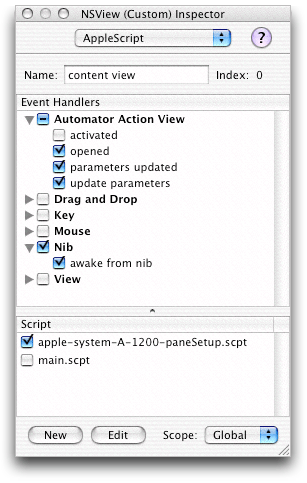

> 导航：[总目录](../../../README.md) · [documentation](../../../_indexes/documentation.md) · [Automator Programming Guide](Introduction%20to%20Automator%20Programming%20Guide.md)


[Next](Implementing%20an%20Objective-C%20Action.md)[Previous](Show%20When%20Run.md)

# Implementing an AppleScript Action

The Xcode template for an AppleScript Action project includes an uncompiled script file named `main.applescript`. An AppleScript-based action must, at the minimum, add to `main.applescript` the scripting code that accesses the services of one or more applications and completes the stated purpose of the action. An AppleScript-based action can also rely on other components for its implementation, such as:

- Other AppleScript script files, particularly for handling user-interface events
- Objective-C classes, particularly for accessing system resources
- Command-line tools or shell scripts

Regardless of the possible implementation components, an AppleScript-based action always has a `main.applescript` file and an invisible instance of AMAppleScriptAction. This instance owns the action bundle’s nib file, has access to `main.applescript`, and provides a default implementation of the method used to run the action behind the scenes, `runWithInput:fromAction:error:`. (AMBundleAction, the superclass of AMAppleScriptAction, declares this method.)

The template `main.applescript` contains only the following skeletal structure of the `on run` command handler:

```
on run {input, parameters}
    -- your code goes here
    return input
end run
```

This `on run` command handler has two positional parameters, `input`, and `parameters`, The `input` parameter contains (in most instances) the output of the previous action in the workflow; it is almost always in the form of a list. The `parameters` parameter contains the settings made in the action’s user interface; the values in `parameters` (a record object) are typically set via the Cocoa bindings mechanism but can also be manually updated. The template code finally returns `input` as its output; your action should always return something as output, even if it what is given it as input.

You can use any valid AppleScript command, object, reference, expression, and statement in `main.applescript`. However, the following steps are suggested for an action’s `run` handler (not all steps are applicable to every kind of action).

- Set local variables to the values of the current parameters. To extract the values from the `parameters` parameter, use the keys specified for bindings. For example:

```
set multiple_selection to |multipleSelection| of parameters
set prompt_message to |promptMessage| of parameters
set default_location to |defaultLocation| of parameters
```

  You use these parameters to control the logic of the script.
- Set a local variable for output to an empty list. For example:

```
set output to {}
```
- In a `repeat` loop, perform whatever transformations are necessary on the items in the input list and add each transformed item to the output list. For example:

```
repeat with i in input
    copy (POSIX path of i) to end of filesToCopy
end repeat
```
- As the last step, return the output list.

Some actions specify in their `AMAccepts` property that their input is optional (that is, the `Optional` subproperty is set to `<true/>`). This setting allows users to select a “Ignore Result From Previous Action” pop-up item in the action’s view. If your action has made input optional in its `AMAccepts` property, you need to determine if the user has made this choice by testing the `ignoresInput` field of `parameters`; if it is set to `true`. then you do not need to do anything with the input object.

You can include subroutines in `main.applescript` . For example, you might want to write a subroutine for returning localized strings (described in [Localized Strings](Developing%20an%20Action.md#apple-f4xwc4dqnrsv64tfmyxwi33df52wszbpkridimbqgaytkmjrfu4tsmbrge)).

You can execute command-line tools or shell scripts for your script. The following script fragment runs the `screencapture` tool:

```
set screencapture to "/usr/sbin/screencapture "
-- here set up arguments of screencapture
do shell script screencapture
```

A caveat about using the `do shell script` command is that, because of the threading architecture, it makes the user interface unresponsive until the shell script completes or the user presses Command-. (period).

An action’s scripts can also invoke Objective-C methods that you have implemented in a custom class; for example, the following statement calls a class method named `isDVDPlayerRunning`:

```
set dvdRunning to call method "isDVDPlayerRunning" of class "TakeScreenshot"
```

[Hybrid Actions](#apple-f4xwc4dqnrsv64tfmyxwi33df52wszbpkridimbqgaytkmjsfu4tmobzg4) discusses actions that contain a mix of AppleScript and Objective-C code.

An AppleScript action can contain scripts other than `main.applescript`. These additional scripts typically contain two types of handlers:

- AppleScript Studio-specified event handlers for managing the user interface of the action. For example, in an event handler you can modify the presentation of the user interface based on the user’s choices.
- Handlers for the Automator-defined commands `update parameters` and `parameters updated`, which are attached to an action’s view. These handlers are an alternative to Cocoa bindings: you can use them to store user settings made in the action parameters and to refresh those settings from existing parameters. For more on these handlers, see [Updating Non-bound Parameters](#apple-f4xwc4dqnrsv64tfmyxwi33df52wszbpkridimbqgaytkmjsfu4tqmzvgq).
- Handlers for the Automator-defined commands `activated` and `opened`, which are attached to an action’s view. The `on activated` handler is called when the action’s workflow is activated, and the `on opened` is called when the user adds the action to the workflow. You should use the `on opened` handler when you need to populate your action with data that takes some time to get and consequently need to display a progress indicator.

AppleScript Studio allows you to request handlers for the `update parameters`, `parameters updated`, `activated`, and `opened` commands in the Automator Action View group in the AppleScript pane of the Interface Builder inspector.

As an example of AppleScript Studio event handlers, consider a pop-up menu for various date formats. When the user chooses a item from this pop-up menu, the action changes an example showing the effect of this format change. Listing 1 shows an event handler that is invoked when the user chooses a pop-up item for saving a screen capture to a “Specific File”.

__Listing 1__  An event handler for displaying a Save panel

```
on clicked theObject
    if name of theObject is "choose output" then
        -- Setup the properties in the 'save panel'
        tell save panel
            set title to "Choose an output file to save the screenshot to"
            set prompt to "Save"
            set required file type to "pdf"
            set treat packages as directories to false
        end tell

        if (display save panel in directory "" with file name "") is equal to 1 then
            set contents of text field "output file" of super view of theObject to path
                name of save panel
            set contents of popup button "output choice" of super view of theObject to 1
            set enabled of button "choose output" of super view of theObject to true
            set enabled of text field "output file" of super view of theObject to true
        end if
    end if
end clicked
```


An action implementation can contain a mix of AppleScript and Objective-C code. Usually such hybrid actions are AppleScript-based—in other words, they have a `main.applescript` file containing the `run` command handler. However, it is possible to have Objective-C actions that use the Cocoa scripting classes to load (or create) and execute scripts. See [Implementing an Objective-C Action](Implementing%20an%20Objective-C%20Action.md#apple-f4xwc4dqnrsv64tfmyxwi33df52wszbpkridimbqgaytkmjtfvbegskdincugqy) for a discussion of the latter type of hybrid action.

Why would you want to create a hybrid action? One reason is to have greater control of the user interface. An Objective-C class that links with the Application Kit has access to the full range of programmatic resources for managing the appearance and behavior of user-interface objects.

But perhaps the most common reason for hybrid actions is to get access to system resources that a script could not get on its own. Scripts can call Objective-C instance methods with the `call method` command, but only if the target object is something that the script can address (for example, `call method “title” of window 1`). Sometimes, an AppleScript Studio script does not have access to a valid object for a `call method` command. To get around this limitation, you can create a simple custom class that implements one or more class methods. The first argument of these methods is the target (receiver) of an instance method that the class method wraps. Listing 2 illustrates this approach.

__Listing 2__  Implementing a custom Objective-C method to be called by a script

```objc
#import "CreatePackageAction.h"

@implementation CreatePackageAction

+ (BOOL)writeDictionary:(NSDictionary *)dictionary withName:(NSString *)name
{
    return [dictionary writeToFile:name atomically:YES];
}

@end
```

In a script you can then use a `call method “`_m_`” of class “`_c_`“ with parameters`_{_ _y_`,`_z_`}` statement to call this method (Listing 3).

__Listing 3__  A script calling the Objective-C method

```
set descriptionRecord to
        {|IFPkgDescriptionTitle|:packageTitle,|IFPkgDescriptionVersion|:packageVersion,
        |IFPkgDescriptionDescription|:description,
        |IFPkgDescriptionDeleteWarning|:deleteWarning}
set rootName to call method "lastPathComponent" of rootFilePath
set descriptionFilePath to temporaryItemsPath & rootName & "description.plist"
call method "writeDictionary:withName:" of class "CreatePackageAction" with parameters
     {descriptionRecord, descriptionFilePath}
```


A property of all actions, including AppleScript-based ones, is a record (equivalent in Objective-C to a dictionary) containing values reflecting the settings users have made in the action’s user interface. When Automator runs an AppleScript action by calling its `run` command handler, it passes in these values in the `parameters` parameter. Most actions use the Cocoa bindings mechanism to set the parameters property. However, you may choose to forgo bindings in favor of more direct approach.

The Automator application defines several commands for AppleScript Studio. Among these are `update parameters` and `parameters updated`, which can be attached to an action’s view. The `update parameters` command is sent when the an action’s parameters record need to be refreshed from the values on the user interface. The `parameters updated` command is sent when the parameters record changes any of its values.

To specify handlers for these commands in Interface Builder, follow the usual AppleScript Studio procedure:

1. Select the action’s view.
2. In the AppleScript pane of the Info window, expose the commands under Automator Action View (see Figure 1).
3. Click the check boxes for `update parameters` and `parameters updated`.
4. Specify a script file for the command handlers.

__Figure 1__  Selecting the parameters-related handlers for action views



Automator calls the handler for `update parameters` just before it runs the action. In this handler, the action should get the settings from the user interface and update the parameters record with them. Listing 4 provides an example of an `update parameters` handler.

__Listing 4__  An “update parameters” command handler

```
on update parameters theObject parameters theParameters
    set |destinationPath| of theParameters to (the content of text field "folder path" of the destination_folder_box) as string
    set |textInput| of theParameters to (the content of text field "text input" of the text_source_box) as string
    set |fileName| of theParameters to (the content of text field "file name" of the file_name_box) as string
    set |chosenVoice| of theParameters to the title of popup button "voice popup" of voice_box
    set |textSource| of theParameters to ((the current row of matrix "source matrix" of the text_source_box) as integer) - 1
    return theParameters
end update parameters
```

Always return the updated parameters object as the final step in this handler (`theParameters` in the above example).

[Next](Implementing%20an%20Objective-C%20Action.md)[Previous](Show%20When%20Run.md)

