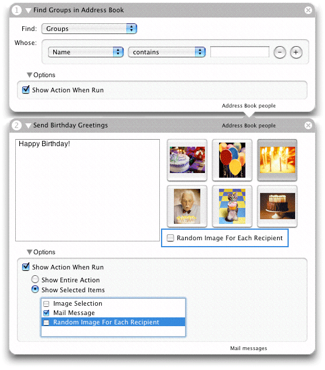
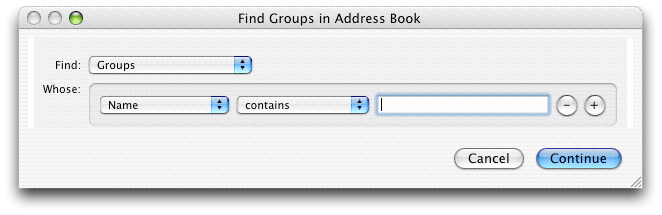
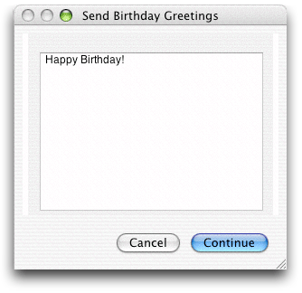
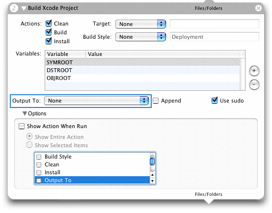
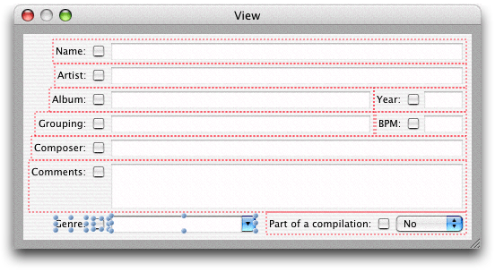
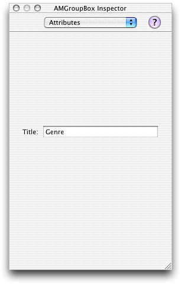

> 导航：[总目录](../../../README.md) · [documentation](../../../_indexes/documentation.md) · [Automator Programming Guide](Introduction%20to%20Automator%20Programming%20Guide.md)

[Next](Implementing%20an%20AppleScript%20Action.md)[Previous](Developing%20an%20Action.md)

# Show When Run

Automator has two categories of users. The first is a user who creates a workflow by putting actions in a sequence that accomplishes a certain goal. This type of user can then save the workflow as an application which another user—a user of the second kind—can then double-click to run. If the workflow creator is the only user who can set the parameters of workflow actions (by choosing items and entering values in action views), users in the second category are at a disadvantage. They are compelled to accept the choices of the workflow creator.

To get around this problem, Automator has the Show When Run feature. If this feature is turned on for an action in a workflow, when Automator executes the workflow it displays the user interface (in whole or part) for the action when execution reaches that point. The workflow user—as opposed to the workflow creator—can then make the required settings before the action proceeds.

The following sections describe Show When Run in more detail, show what it looks like, and explain how developers can modify the default behavior.

The views of most actions in a workflow include a triangular disclosure button in their lower-left corner labeled “Options”. When a workflow creator clicks this control, the bottom of the view expands to expose a new set of controls. The number of controls in this disclosed view vary according to how the action view is configured. Figure 1 illustrates the two kinds of control sets.

__Figure 1__  The Show Action When Run option in two actions

In both exposed Option subviews, the first control is a check box labeled “Show Action When Run.” However, in the first action that check box is also the only control. If the check box is clicked in the first Option subview and the workflow is run, the action displays its entire user interface in a separate window, as shown in Figure 2.

__Figure 2__  Action displaying entire user interface in a window

The user makes selections and fills in information in this window and clicks Continue to have the action proceed.

In the second Option subview (as shown in [Figure 1](#apple-f4xwc4dqnrsv64tfmyxwi33df52wszbpkridimbqgaytknrxfu4tombthawueqkkizauor2f)), when the user selected “Show Action When Run”, the two radio buttons under it were enabled. He or she then clicked the “Show Selected Items” button and selected the “Mail Message” check box in the table. As shown in Figure 3, when Automator reaches this action in the workflow, it displays this portion of the action view in a separate window.

__Figure 3__  Action displaying part of its user interface in a window

In summary, an action may present one of three styles of the Show When Run feature:

- No Options disclosure button is presented. This Show When Run style is for actions where only the workflow creator can decide what the action parameters should be.
- The action displays the Options disclosure button and, when that is clicked, only the Show Action When Run check box. This style is used when Automator should present all controls of the action to users when the workflow executes.
- The action displays the Options disclosure and, when that is clicked, the “Show Entire Action” and “Show Selected Items” radio button along with the selected-items table view. This style of Show When Run is appropriate for actions where workflow users should be able to make only some action settings. This style is the default configuration,

In the default Show When Run configuration, Automator displays the Options disclosure button and allows workflow creators to select one or more parts of the action view for Automator to display when the action is run in a workflow. Developers can refine the default appearance and behavior of the Show When Run feature in two ways: by specifying new values for certain Automator properties and by grouping controls in special boxes in Interface Builder.

These three general styles of the Show When Run feature discussed in [The Show Action When Run Option](#apple-f4xwc4dqnrsv64tfmyxwi33df52wszbpkridimbqgaytknrxfu4tmojxgi) are controlled by two Automator properties:

- `AMCanShowWhenRun` with a value of `<true/>` tells Automator to display at least the Options disclosure button and the “Show Action When Run” check box for the action. If the value is `<false/>`, the button does not appear in the action view.
- `AMCanShowSelectedItemsWhenRun` with a value of `<true/>` tells Automator to include the radio buttons “Show Entire Action” and “Show Selected Items” radio buttons along with the table view of control subsets. If the value is `<false/>` only the “Show Action When Run” check box is shown.

  This property has no effect if `AMCanShowWhenRun` is `<false/>`.

The default Show When Run configuration for actions is to have both properties turned on (that is, Automator assumes a value of `<true/>`.) In this style, the Option button is displayed, and when that button is clicked all “Show Action When Run” options are presented, including the table allowing workflow writers to select groups of controls to display to end users.

If you want only the “Show Action When Run” check box to appear in the exposed view under Options, specify `<false/>` for `AMCanShowSelectedItemsWhenRun`. If you don’t want the Options disclosure button to appear at all, specify `<false/>` for `AMCanShowWhenRun`.

By default, Automator populates the selected-items table with check box items using the following algorithm:

1. It goes through the items in the top level of the action view looking for eligible objects (such as pop-up menus, text fields, and buttons).
2. When it finds an eligible object, it determines if there is a label to the left of the object; it there is, it uses the label in the selected-items table view.
3. If it cannot find an associated label it uses an appropriate name such as “Text field 1” or “Item 3”. (The bottom action displayed in [Figure 1](#apple-f4xwc4dqnrsv64tfmyxwi33df52wszbpkridimbqgaytknrxfu4tombthawueqkkizauor2f) includes an “Item 1” check box in its table.)

These semi-arbitrary names that Automator assigns to some items in the table are often confusing to users. What does “Text field 1” refer to, especially if there is more than one text field? Moreover, it sometimes makes more sense to group related controls under one item. For example, if selection of an item in a pop-up menu results in a text field being enabled, the text field and the menu item belong together.

Interface Builder has been enhanced to give developers of Automator actions the ability to group individual objects on action views under a given name. When you have completed the procedure in Interface Builder, the Options subview presented to workflow creators will look more like the example in Figure 4, which contains no items with names such as “Item 1”.

__Figure 4__  An action with assigned groups in the selected-items table

To make named groups of action-view objects, complete the following procedure with the `main.nib` file open in Interface Builder:

1. Make sure that the Automator palette is loaded. If the palette window does not have a palette named Cocoa-Automator, choose Tools > Palettes > Palette Preferences and load `AMPalette.palette`.
2. Select the objects you want in the group by Shift-clicking each object in turn (Figure 5).

   __Figure 5__  Selecting objects for an action group

   
3. Choose Layout > Make subview of > Automator Box. The grouped objects are enclosed by a colored rectangle.

   The Automator Box menu item is not available until the Cocoa-Automator palette has been loaded. To load this palette, select the Palettes pane in the Interface Builder preferences, click Add, and select `AMPalette.palette` in `/Developer/Extras/Palettes`.
4. In the Attributes inspector (Command-1) enter a title for the group (Figure 6). This title is what appears in the selected-items table to identify the group.

   __Figure 6__  Assigning a title to the action group

   

The box that groups a set of controls in an action view is an instance of AMGroupBox, a subclass of NSBox created specifically for actions. Developers whose actions are based on AppleScript should keep in mind that the AMGroupBox instance changes the view hierarchy of the objects in an action view. However, because AMGroupBox is a subclass of NSBox, the “box” terminology still works in scripts.

[Next](Implementing%20an%20AppleScript%20Action.md)[Previous](Developing%20an%20Action.md)

