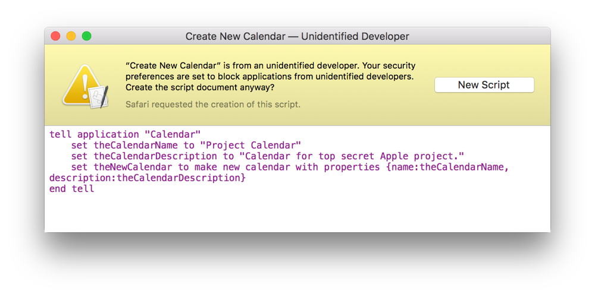

> 导航：[总目录](../../../README.md) · [documentation](../../../_indexes/documentation.md) · [Calendar Scripting Guide](index.md)

## About this Guide

This guide doesn’t provide examples for every possible task that can be scripted in the Calendar app. Instead, it covers automating a range of commonly performed functions. The examples provided can be used for guidance when attempting to automate other scriptable tasks.

Many of the examples in this guide have been written modularly, allowing them to be copied and pasted into your own scripts, where they may be used as is or modified to meet your unique needs. Most examples are commented and relatively easy to follow, even with little or no prior scripting experience.

The majority of examples in this guide are provided in both AppleScript and JavaScript format. A language label precedes each example, making its language easily distinguishable at a glance.

> [!NOTE]
> 

### Open Examples in Script Editor

Links have been provided throughout this guide to open example code directly in Script Editor. To open an example, click the “Open in Script Editor” link above a code listing. Depending on the security settings on your Mac, you may be prompted to confirm you want to open the script in Script Editor. If you receive this prompt, click the New Script button to create a new document. See Figure 2-1 and Figure 2-2.

__Figure 2-1__The dialog that opens when you click the “Open in Script Editor” link

__Figure 2-2__Example of a script that opens after you click the New Script button

> [!NOTE]
> 

[About Calendar Scripting](index.md#apple-f4xwc4dqnrsv64tfmyxwi33df52wszbpkridimbqge3dmnbwfvbuqmjqguwvgvzr)

[Creating a Calendar](Calendar-CreateaCalendar.md#apple-f4xwc4dqnrsv64tfmyxwi33df52wszbpkridimbqge3dmnbwfvbuqobzfvjvomy)
