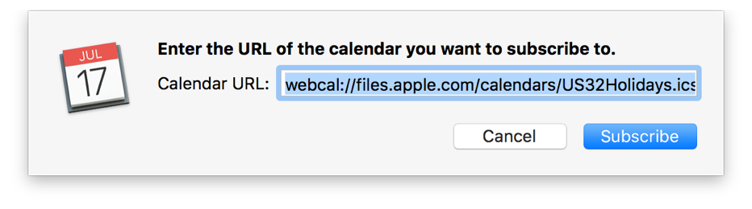

> 导航：[总目录](../../../README.md) · [documentation](../../../_indexes/documentation.md) · [Calendar Scripting Guide](index.md)

## Subscribing to a Calendar

You can use the `GetURL` command to subscribe to a remote calendar with a specified URL, as shown in Listing 5-1 and Listing 5-2.

__APPLESCRIPT__

[Open in Script Editor](applescript://com.apple.scripteditor?action=new&name=Subscribe%20to%20a%20Calendar&script=tell%20application%20%22Calendar%22%0D%09GetURL%20%22webcal%3A%2F%2Ffiles.apple.com%2Fcalendars%2FUS32Holidays.ics%22%0Dend%20tell)

__Listing 5-1__AppleScript: Subscribing to a calendar URL

1. `tell application "Calendar"`
2. `GetURL "webcal://files.apple.com/calendars/US32Holidays.ics"`
3. `end tell`

__JAVASCRIPT__

[Open in Script Editor](applescript://com.apple.scripteditor?action=new&name=Subscribe%20to%20a%20Calendar&script=var%20Calendar%20%3D%20Application%28%22Calendar%22%29%0DCalendar.geturl%28%22webcal%3A%2F%2Ffiles.apple.com%2Fcalendars%2FUS32Holidays.ics%22%29)

__Listing 5-2__JavaScript: Subscribing to a calendar URL

1. `var Calendar = Application("Calendar")`
2. `Calendar.geturl("webcal://files.apple.com/calendars/US32Holidays.ics")`

Unlike some of Calendar app’s other commands, the `GetURL` command doesn’t produce a result. It also causes Calendar to display a confirmation dialog, which must be manually accepted by the user before the subscription is complete. See Figure 5-1.

__Figure 5-1__Calendar URL subscription confirmation

[Finding a Calendar](Calendar-FindaCalendar.md#apple-f4xwc4dqnrsv64tfmyxwi33df52wszbpkridimbqge3dmnbwfvbuqojqfvjvomy)

[Switching Calendar Views](Calendar-SwitchCalendarViews.md#apple-f4xwc4dqnrsv64tfmyxwi33df52wszbpkridimbqge3dmnbwfvbuqojsfvjvomy)
