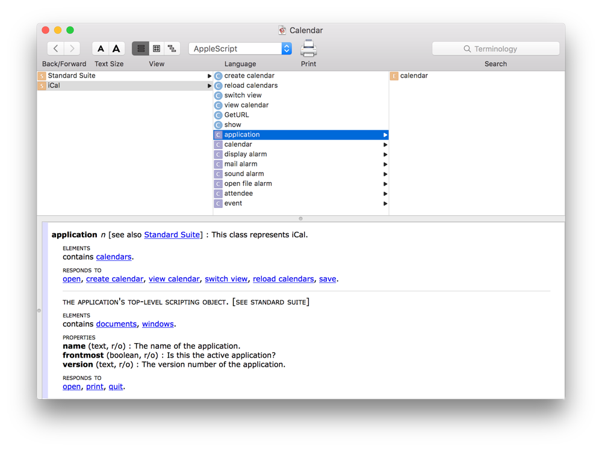

> 导航：[总目录](../../../README.md) · [documentation](../../../_indexes/documentation.md)

## About Calendar Scripting

In OS X, scripting allows you to automate complex, repetitive, and time-consuming tasks by writing scripts that control apps, processes, and the operating system.

The OS X Calendar app has scripting support for interacting with and manipulating calendars and events using AppleScript or JavaScript. Through scripting, you can create calendars and events, subscribe to remote calendars, add attendees to events, set alarms, locate and display specific events, and more. These tasks can be performed on their own, or they can be combined with tasks in other apps to construct powerful workflows that save time and increase productivity.

> [!TIP]
> 

### Accessing Scripting Terminology for Calendar

An app’s scripting terminology is described in a scripting dictionary, which describes the commands, classes, and properties the app supports. Figure 1-1 shows terminology for the `application` class in the Calendar scripting dictionary.

__Figure 1-1__The Calendar scripting dictionary

__To view the Calendar scripting dictionary__

1. Launch Script Editor, found in `/Applications/Utilities/`.
2. Choose File > Open Dictionary.
3. Select Calendar, and click Choose.

For detailed information about viewing and navigating the scripting terminology of apps, see [Access Scripting Terminology](../../Mac%20Automation%20Scripting%20Guide/AboutScriptingTerminology.md#apple-f4xwc4dqnrsv64tfmyxwi33df52wszbpkridimbqge3demzzfvbuqoi) in _[Mac Automation Scripting Guide](https://developer.apple.com/library/archive/documentation/LanguagesUtilities/Conceptual/MacAutomationScriptingGuide/index.html#//apple_ref/doc/uid/TP40016239)_.

[About this Guide](AboutthisGuide.md#apple-f4xwc4dqnrsv64tfmyxwi33df52wszbpkridimbqge3dmnbwfvbuqmjqgywvgvzr)
