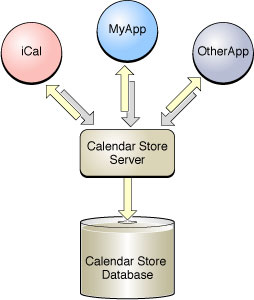
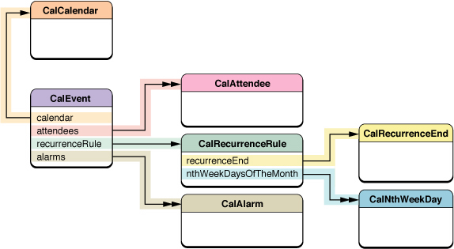
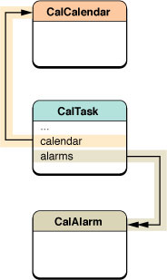

> 导航：[总目录](../../../README.md) · [documentation](../../../_indexes/documentation.md) · [Calendar Store Programming Guide](Introduction%20to%20Calendar%20Store%20Programming%20Guide.md)

[Next](Fetching%20Objects.md)[Previous](Introduction%20to%20Calendar%20Store%20Programming%20Guide.md)

# Calendar Store Overview

The goal of Calendar Store is to provide robust and reliable access to some iCal data for applications that want to integrate iCal features—such as displaying events or tasks—but don’t need read/write access to every record used by iCal. For this reason, Calendar Store only allows you to programmatically create objects that you can create using the iCal controls—for example, using this framework you can not create more sophisticated recurring events than you can using iCal. Calendar Store greatly simplifies the tasks of fetching, updating, and saving records—you do not need to implement your own persistent storage to use Calendar Store.

Applications that use the Calendar Store framework have the ability to fetch and save a subset of the records used by iCal. Your application, as well as iCal, are clients of the Calendar Store server as depicted in Figure 1.

There is one Calendar Store server and Calendar Store database for each user on each computer. The Calendar Store database stores the local copies of records belonging to the Calendars schema. If MobileMe system preferences are configured to sync the Calendars schema, then your changes to these records, using the Calendar Store programming interface, are also synced.

__Figure 1__  Calendar Store architecture

The Calendar Store database stores records, but the Calendar Store programming interface returns objects to your application. These objects hide the complexity of the Calendars schema and encapsulate a common subset of the data useful to most applications. The primary objects you fetch from Calendar Store are calendars, events, and tasks.

Figure 2 depicts the relationships between an event object, an instance of `CalEvent`, and other objects. An event object has a to-one relationship to its calendar and a to-many relationship to its attendees and alarms. Attendees are instances of `CalAttendee` that may correspond to a person in the Address Book.

The other classes in the diagram help describe the recurrence rule for recurring events—for example, an event that occurs every Tuesday and Thursday of the week for the next two months. A `CalRecurrenceEnd` object describes how a recurring event ends, and a `CalNthWeekDay` object helps describe the recurring pattern.

__Figure 2__  CalEvent object diagram

Figure 3 depicts the relationships between a task object, an instance of `CalTask`, and other objects. A task object is much simpler than an event object. A task has just a to-one relationship to a calendar and a to-many relationship to its alarms.

Both events and tasks can have multiple alarms. The `CalAlarm` class encapsulates information on the type of alarm and how it is triggered.

Notice that events and tasks have a to-one relationship to a calendar, but there is not an inverse to-many relationship from a calendar to its events and tasks. This is purposely done to make fetching objects more efficient. Fetching a calendar object does not automatically fetch its events and tasks. This would be grossly inefficient, and in some cases impossible, because recurring events can result in an infinite number of event objects—recurrences are represented by multiple event objects with the same unique identifier (UID).

Instead you fetch the calendars, events, and tasks separately by sending messages to a shared `CalCalendarStore` object. The `CalCalendarStore` object is a direct interface to the Calendar Store database. The `CalCalendarStore` class provides many convenience methods for fetching just the calendars, events, and tasks your application needs.

__Figure 3__  CalTask object diagram

A predicate is an object used to define logical conditions to constrain a search or to filter objects. In database terminology, a predicate is equivalent to a query.

Predicates provide the maximum flexibility in specifying a subset of the objects you want to fetch. For example, using predicates, you can fetch events that occur on a single day, month, or year. Or specify an exact date/time range. You can also fetch events that belong to particular calendars. Similarly, you can fetch tasks that have specific completion dates or all tasks that have been completed by a specific date.

The `CalCalendarStore` class makes it simple to use predicates by providing convenience methods for creating common queries. Read Fetching Objects for more information on the different ways to fetch objects.

When designing your application, you need to decide if you are going to maintain strong references to the objects fetched by Calendar Store or use the data you obtain and discard references to the objects. Note that Calendar Store doesn’t automatically update objects that were previously fetched. Instead you register for notifications when Calendar Store objects change internally or externally—for example, when the user changes an event in iCal. Then implement your handler to apply the external changes to your local objects.

If you do not maintain strong references to the objects you fetch, then you should at least retain the unique identifier for each object. The notification object user information dictionary contains the unique identifier for the object that was either added, updated, or deleted. You can use the unique identifier to find the corresponding local object and apply the change.

Read [Observing Changes](Observing%20Changes.md#apple-f4xwc4dqnrsv64tfmyxwi33df52wszbpkridimbqga2tanrsfvjvomi) for more information on updating objects, including tips on using Cocoa bindings.

As stated above, for performance reasons, you cannot simply fetch all events. Recurring events are represented by multiple event objects, which are infinite in quantity if the recurring event never ends. Therefore, Calendar Store limits the time span for fetching recurring events to just four years. For example, if you define a predicate that fetches all events for a ten year span, the shared `CalCalendarStore` object fetches only recurring events for the first four years.

Because of this, you typically design your application to fetch events in batches. Use predicates to define a custom fetch that is efficient for your application. Basically, just fetch the events that your application needs at the moment. For example, fetch events for the current month and fetch events for the next month only when the user clicks the Next button.

[Next](Fetching%20Objects.md)[Previous](Introduction%20to%20Calendar%20Store%20Programming%20Guide.md)

