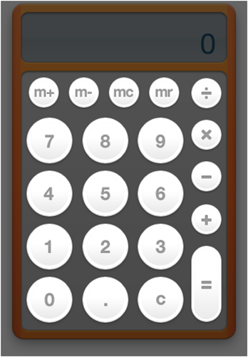
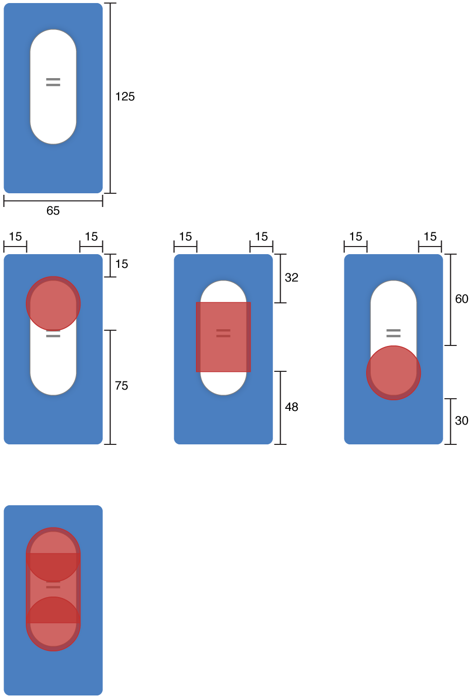

> 导航：[总目录](../../../README.md) · [documentation](../../../_indexes/documentation.md) · [Dashboard Programming Topics](Introduction%20to%20Dashboard%20Programming%20Topics.md)


[Next](Resizing%20Widgets.md)[Previous](Using%20Widget%20Events.md)

# Declaring Control Regions

Dashboard offers an extension to be used with style sheets. The `-apple-dashboard-region` lets you specify regions for certain purposes and are specific to widgets running inside of Dashboard.

A widget, by default, can be moved around Dashboard by clicking anywhere in it and dragging it around. In some situations, however, this may not be the most appropriate or desired behavior.

For instance, clicking and holding the mouse on a button should not move the window. Without any modification, however, a widget allows this to happen. To specify regions from which dragging is not allowed, you use control circles and rectangles.

The Calculator widget, as shown in [Figure 30](#apple-f4xwc4dqnrsv64tfmyxwi33df52wszbpkridimbqgaztanbvfvjvomi), provides an example of how to create control circles and rectangles. The highlighted regions are the areas from which dragging is not allowed.

__Figure 30__  The Calculator widget and its control circles and rectangles



When the Calculator specifies a button as a control region, it applies a style to the image. One of the properties of that style, and the one that specifies the control region, is the -`apple-dashboard-region` property. It takes the parameter `dashboard-region()` that itself requires two parameters:

__Table 12__  Required `dashboard-region()` parameters

| Parameter | Description |
| `label` | Required. Specifies the type of region being defined; `control` is the only possible value. |
| `geometry-type` | Required. Specifies the shape of the region, either `circle` or `rectangle`. |

There are also four optional parameters that let you specify offsets from the region boundaries. These parameters may be omitted; they will be set to `0` if not present.

__Table 13__  Optional `dashboard-region()` parameters

| Parameter | Description |
| `offset-top` | Optional. Specifies the offset from the top of the wrapped area from where the defined region should begin. Negative values not allowed. |
| `offset-right` | Optional. Specifies the offset from the left of the wrapped area from where the defined region should begin. Negative values not allowed. |
| `offset-bottom` | Optional. Specifies the offset from the bottom of the wrapped area from where the defined region should begin. Negative values not allowed. |
| `offset-left` | Optional. Specifies the offset from the right of the wrapped area from where the defined region should begin. Negative values not allowed. |

The `dashboard-region()` parameters need to be in this order:

```
dashboard-region(label geometry-type offset-top offset-right offset-bottom offset-left)
```

So if you were to specify a circular control region where the edges are inset 5 pixels on all sides from the edge of the element, the style would look like this:

```
.control-circle-example {
    ...
    -apple-dashboard-region: dashboard-region(control circle 5px 5px 5px 5px);
    ...
}
```

You can specify multiple `dashboard-region()` values per parameter to build complex shapes. For instance, the Calculator's "=" key may consist of a combination of circular and rectangular control regions:

```
.equals-button-example {
    ...
    -apple-dashboard-region:
        dashboard-region(control circle 15px 15px 75px 15px)
        dashboard-region(control rectangle 32px 15px 48px 15px)
        dashboard-region(control circle 60px 15px 30px 15px);
    ...
}
```

In this example, an element is 65 pixels wide by 125 pixels long. Two control circles have a diameter of 35 pixels, and the rectangle will be 35 pixels wide by 45 pixels long. These values map out as shown in [Figure 31](#apple-f4xwc4dqnrsv64tfmyxwi33df52wszbpkridimbqgaztanbvfvjvomq).

__Figure 31__  Control region example



Note that the circle regions are centered within the given bounds.

If you want to remove a control region from an element, set its `-apple-dashboard-region` property to `none`.

[Next](Resizing%20Widgets.md)[Previous](Using%20Widget%20Events.md)

