> 导航：[总目录](../../../README.md) · [documentation](../../../_indexes/documentation.md) · [Dashboard Programming Topics](Introduction%20to%20Dashboard%20Programming%20Topics.md)


[Next](Introduction%20to%20the%20Apple%20Classes.md)[Previous](Widget%20Basics.md)

# Designing Widgets

Now that you know how to assemble a basic widget, you can start thinking about which higher-level features you want to add to your own widget. Before going any further, you should consider how your widget presents itself to the user.

Generally speaking, widget interface design isn't as constrained to Apple Human Interface Guidelines as Cocoa or Carbon applications are. Despite this freedom, there are basic software design principles that should be followed. This chapter presents some guidelines that you should consider when creating your widget.

The main face of your widget is the front side (your widget displays preferences on its back). This is the side users recognize and interact with the most.

Follow these guidelines as you design your widget’s front side:

- The design of your widget should focus on immediately conveying its primary purpose.
- Make effective use of space. Strive to clearly show only useful information.
- Display your information immediately. Dashboard is shown and hidden quickly, so forcing the user to wait for content to display can be annoying and time-consuming.
- Design your widget to have a discrete functionality. It should require no explanation or configuration. Instead of creating a widget that does three things, try creating three widgets that do one thing each. This makes each task discrete and lets your users choose what is useful for them.

__Figure 8__  A cluttered widget is a jack of all trades, master of none

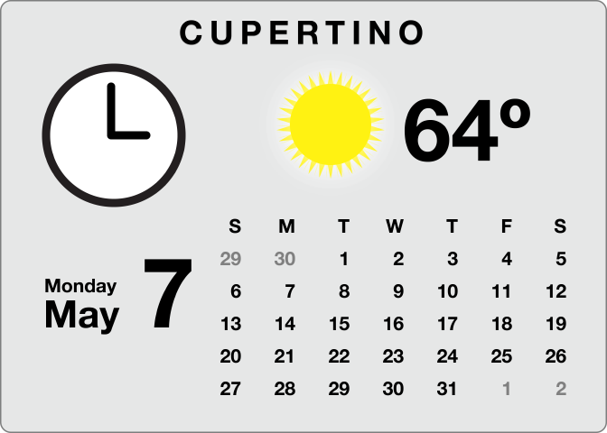

__Figure 9__  Three simple widgets, each focused on a single task

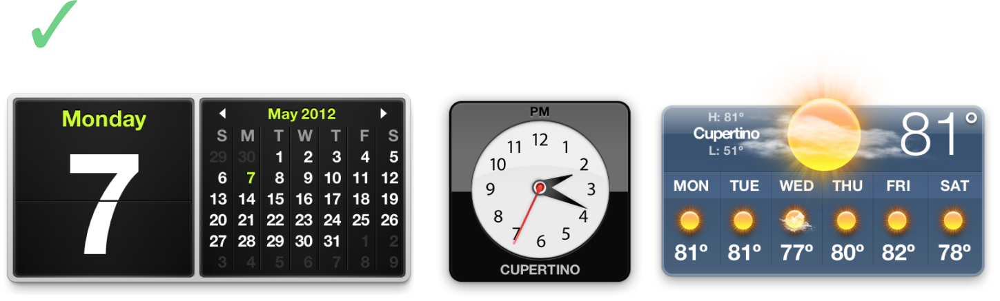

- Design widgets for small screens. Your design should be a good citizen and leave room for other widgets. Users have multiple widgets open at once, so you shouldn’t monopolize screen space. Otherwise, your widget may not be used because of an impractical size.

__Figure 10__  A large widget monopolizes valuable screen space

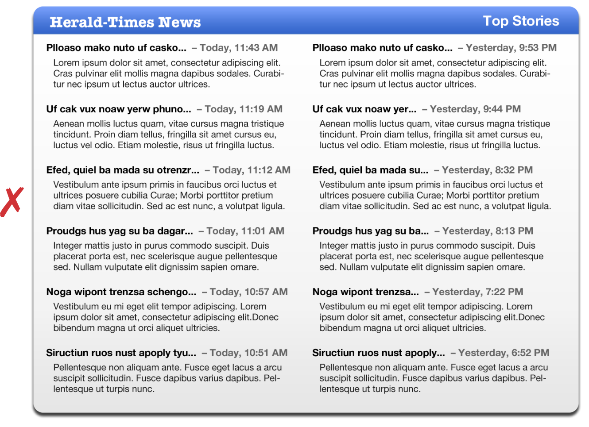

__Figure 11__  A small widget provides information and leaves room for other widgets

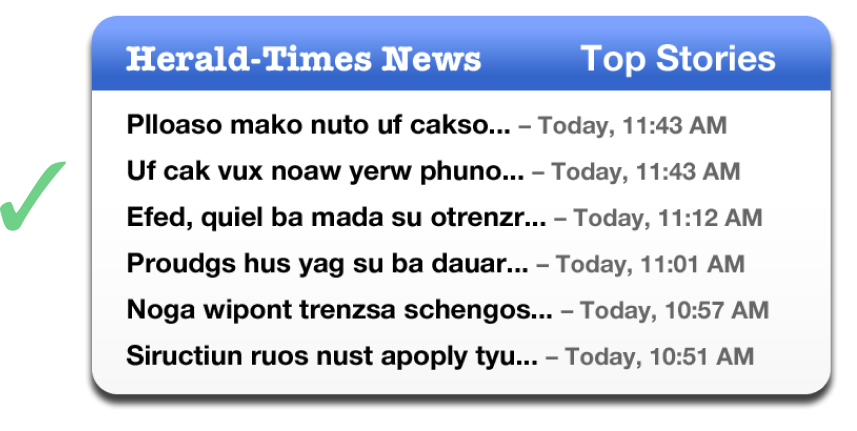

- Use scroll bars sparingly. The default set of information your widget displays should be minimal and should not required scrolling. If, however, the widget’s function is to provide a lot of information (e.g. a dictionary), using a scroll bar may be prudent to make the widget smaller overall. Consider offering a preference for a simple view that doesn’t require a scroll bar.
- Use color to distinguish your widget. A unique color scheme ensures that when users want to use your widget, it’s quickly recognized.

__Figure 12__  Color makes your widget stand out—can you spot the Calendar?

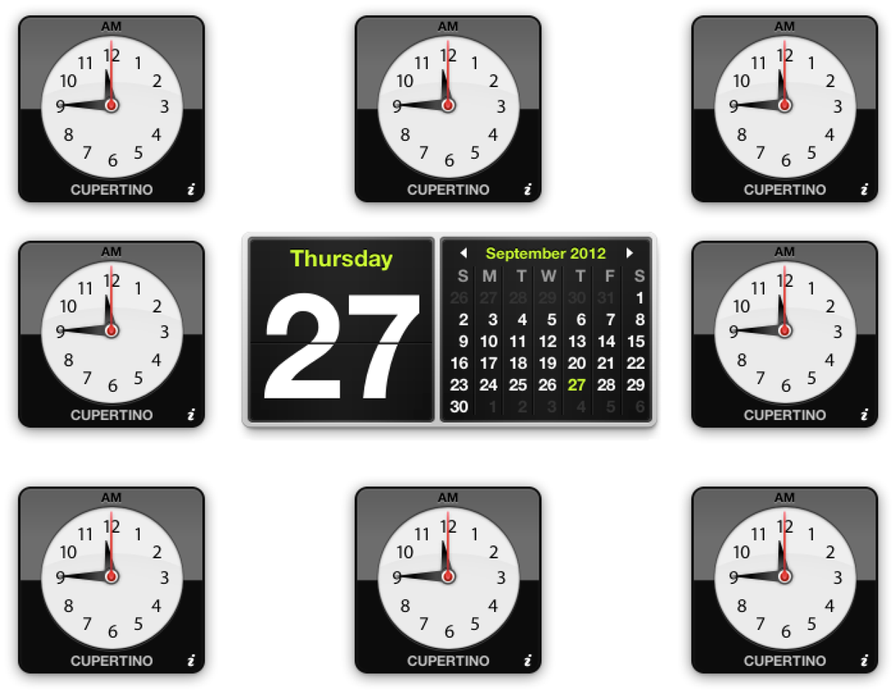

- Avoid garish color schemes. Contrasting colors can be offensive to users. Instead of mixing red, green, and purple in an interface, try out shades of the same color. Sometimes using various distinct colors may be appropriate, but most of the time, keeping your colors in one color space makes the widget more pleasing to the eye.

__Figure 13__  An offensive widget–be careful with color!

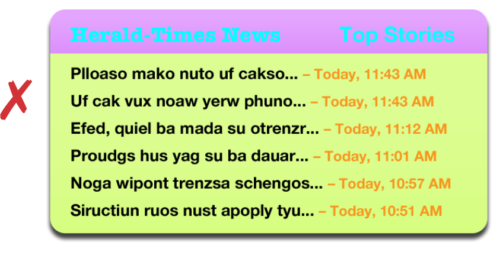

- Use clear, readable fonts. Users expect to obtain information quickly from widgets. Avoid sacrificing readability to achieve a particular appearance. Instead, focus on building the widget’s personality into its contours and controls. Try using bold san serif fonts, like Helvetica Neue, for labels and controls.
- Avoid using Aqua controls on your main interface. Aqua controls should only be used for the back side of your widget. Instead, design custom controls for your widget’s main interface. Ensure that controls look and behave like the objects they’re representing. A checkbox should look like a checkbox and buttons should look clickable even though they aren’t specifically Aqua controls. (To learn how to integrate a menu into your design, read [Integrated Menus](#apple-f4xwc4dqnrsv64tfmyxwi33df52wszbpkridimbqgaztanjtfvjvomi).)

__Figure 14__  Aqua controls don’t belong on the face of your widget

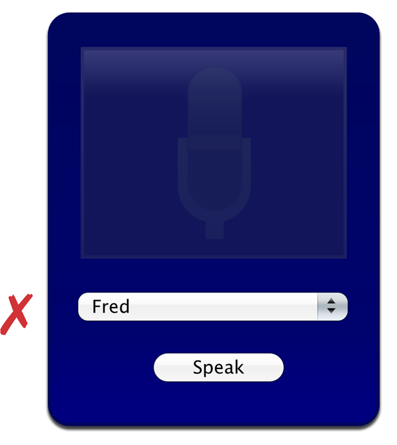

__Figure 15__  A widget with custom controls

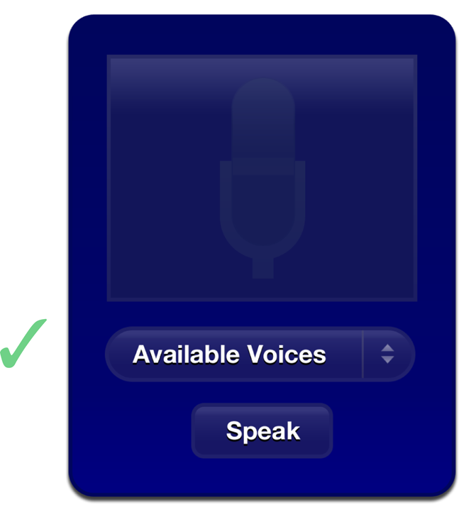

- Avoid advertising on the face of your widget. Branding your widget is acceptable and important, but advertising takes away valuable space in your widget. Presence on a user’s Dashboard is a privilege. Use the back of the widget for information that isn’t vital to the widget’s purpose, such as branding, licensing information, and copyright notices.

__Figure 16__  Don’t waste valuable space in your widget with advertising

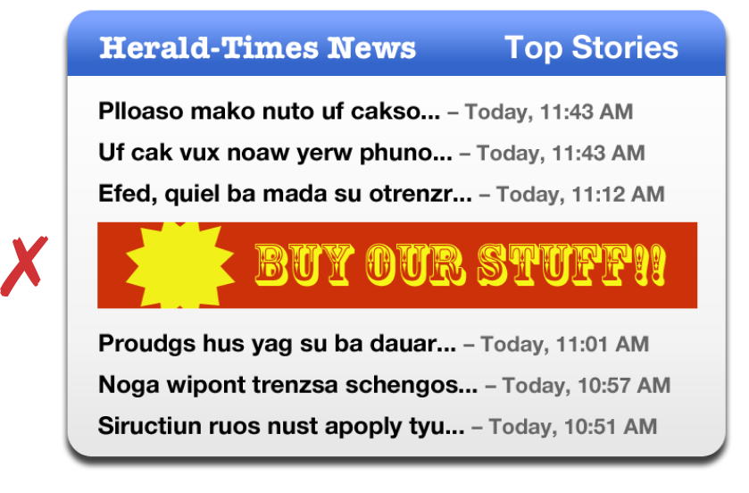

__Figure 17__  Put information not vital to the widget on the back

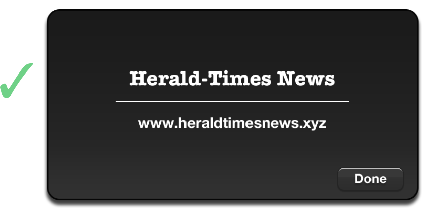

- Use the `CloseBoxInsetX` and `CloseBoxInsetY` Info.plist keys to place your widget’s close box over the top left of your widget’s artwork. Since many widgets have transparency around their edges, the default location of the close box may seem to be floating off to the side of the widget. It should be moved so that it’s located over the widget. This shows the relation between the close box and the widget.
- Support pasteboard operations whenever possible. Many users expect to be able to copy and paste elements between applications and expect the same of widgets.
- Support drag-and-drop where appropriate. Users may expect to drop files or other dragged items on your widget.
- Use standard graphics and controls whenever possible. Some standard controls are provided in `/System/Library/WidgetResources/`:

  - The Info Button (discussed in [Displaying a Widget’s Back](Widget%20Backs%20and%20Preferences.md#apple-f4xwc4dqnrsv64tfmyxwi33df52wszbpkridimbqgaztanbtfvjvomi))
  - Buttons (discussed in [The Apple Glass Button Subclass](Using%20an%20Apple%20Button.md#apple-f4xwc4dqnrsv64tfmyxwi33df52wszbpkridimbqgaztcobvfvjvona))
  - Resize control (discussed in [Live Resizing](Resizing%20Widgets.md#apple-f4xwc4dqnrsv64tfmyxwi33df52wszbpkridimbqgaztanbwfvjvomq))

If your widget requires configuration, you can display preferences on the back of your widget. Here are some tips for designing your widget’s back:

- Use the info button graphic to signify that you are using the back of your widget for preferences or information. The info button consists of an "i" with a circle that appears when the cursor is over it. Clicking the info button triggers the flip animation. The info button is a standard used across all widgets, so users immediately know what it stands for and what happens when it’s clicked.

__Figure 18__  A non-standard control for showing your widget’s back

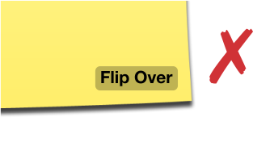

__Figure 19__  The standard info button—users know what this means

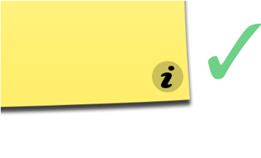

- Place the info button in the bottom-right corner of your widget whenever possible. It’s OK to place it in other corners, but the bottom-right corner is where most users expect to find this button.

__Figure 20__  Proper info button placement

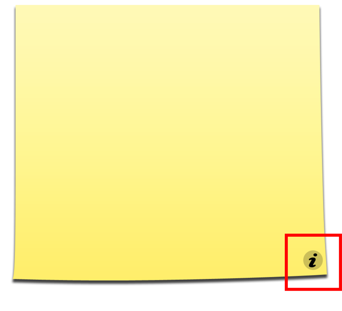

- Use the flip animation only to show your widget’s back. The back side is for showing preferences or important information that may interest your users. Overusing the animation makes your widget appear unprofessional.
- Use Aqua elements when displaying preferences. Small-sized versions of Aqua-styled controls are preferred. Unlike your main interface, your preferences should use standard Aqua controls. Here they provide a standard appearance and behaviors familiar to users, traits that are valuable since users won’t be dealing with them often and should be able to use them right away.

__Figure 21__  Aqua controls on a widget’s back

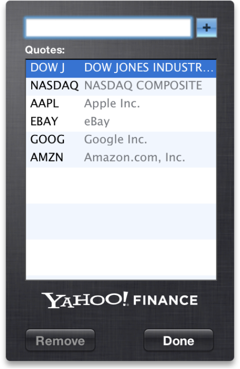

- Provide a Done button. When the user has finished setting the preferences, clicking the Done button should flip the widget back to its front side. Use the button graphics available in `/System/Library/WidgetResources/` for any buttons on the back of your widget.
- Use a darker or subdued background color for your widget’s back. Reusing the background color from your main interface is not advised because it leads to confusion about which side is the main interface.

__Figure 22__  Different backgrounds distinguish between front and back

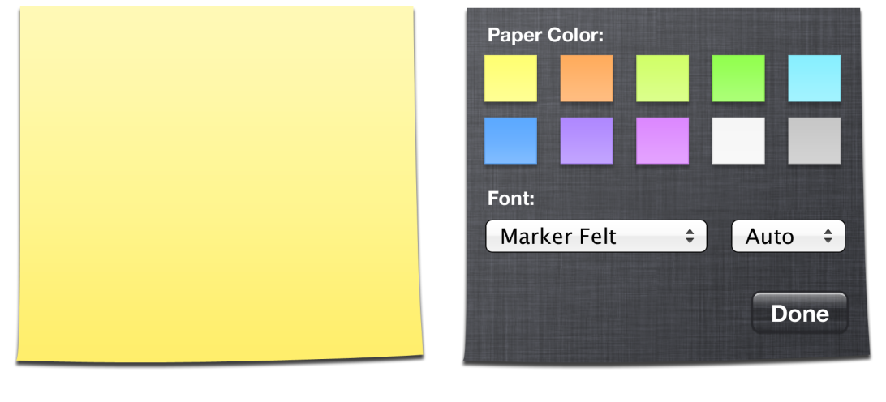

- If necessary, show licensing information, logos, and minimal help information on the back of your widget. As you did with the main interface, avoid placing advertising here.

__Figure 23__  Branding is appropriate on a widget’s back

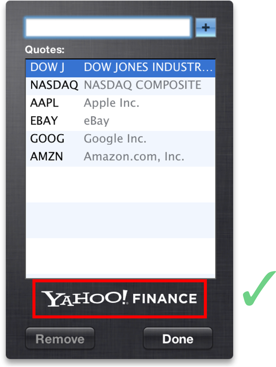

- Use standard graphics and controls, as found in `/System/Library/WidgetResources/`, whenever possible.

Widgets are represented by an icon in the widget bar. The dimensions below define the standard icon size and shadow for a widget bar icon:

- Body: 75 pixels by 75 pixels
- Drop shadow:
- - 50% opacity
  - 90 degree angle from horizontal
  - 3 pixel offset (distance from source)
  - 3 pixel size, using Gaussian blur

Follow these tips when designing and implementing your widget.

- Use JavaScript whenever possible. Animation and widget logic is possible using JavaScript and results in faster execution and a smaller memory footprint.
- Use custom Widget and WebKit plug-ins sparingly. Plug-ins add significant complexity to your widget and should only be used whenever a task isn’t possible using JavaScript.
- Avoid using Java applets, Flash animations, and QuickTime movies. They are heavyweight and take up a considerable amount of memory.

Widget backgrounds tend to feature drop shadows. The dimensions below define the standard drop shadow for a widget:

- 50% opacity
- 90 degree angle from horizontal
- 4 pixel offset (distance from source)
- 10 pixel size, using Gaussian blur

As previously noted, you should design unique, custom controls that integrate well into your widget’s overall design instead of using standard Aqua controls. Displaying a menu in this context is common and features an implementation that is a little unusual but not difficult to make work.

First, you need to design a custom control that resembles a popup menu, like the Voices sample code does:

__Figure 24__  Voice’s popup menu fits in with its design


Note the characteristics shared between an Aqua popup menu and the custom control used here: the arrow icons, the left aligned text, and a defining outline that specifies the bounds of the control. Also, note the differing color versus the widget’s background. These are all things to take into account when making your own custom menu control.

Three elements, one of which is unseen here, make this menu work: an image that represents the popup menu, a line of text that shows the current menu option, and, unseen here, a hidden `<select>` popup menu element that provides the actual menu used to select an option.

After designing your popup menu, you need to set up three elements in HTML: the popup image you designed, a text element that reflects the currently selected menu option, and a `<select>` element that holds your actual menu:

```

<div id="popupMenuText">Available Voices</div>
<select id='popupMenu' onchange='popupChanged(this);'>
        <option value="One">One</option>
        <option value="Two">Two</option>
</select>
```

Now that the elements are in place, position them using CSS. The menu image is placed first, with the text over it. The linchpin is the `<select>` element, which provides the menu when clicked; it’s placed over the text and image, but its opacity is set to zero.

```
.popupMenuImage {
    position: absolute;
    left: 28px;
    top: 169px;
    z-index: 18;
}

#popupMenuText {
    font: 13px "Helvetica Neue";
    font-weight: Bold;
    color: white;
    text-shadow: black 0px 1px 0px;
    position: absolute;
    left: 44px;
    top: 176px;
    z-index: 19;
}

#popupMenu {
    position:absolute;
    top: 169px;
    left: 28px;
    width: 163px;
    height: 30px;
    opacity: 0.0;
    z-index: 20;
}
```

Doing this makes your custom image look like the control being clicked, but in reality, the `<select>` receives the click and displays its menu. Rest assured that while the popup menu itself is transparent, the menu shown is opaque.

The final piece is changing the custom popup menu text when a user chooses an option in the menu. In the HTML, a function is set that’s called when the popup’s selection changes. This function changes the menu text to reflect the new selection:

```
function popupChanged(elem)
{
    var chosenOption = elem.options[elem.selectedIndex].value;
    document.getElementById("popupMenuText").innerText = chosenOption;

    // Other code that handles the menu selection change
}
```


Many widgets feature a search field that allows users to find content that your widget displays. WebKit offers a new type of `<input>` type, called `search` that provides the look and behavior of a standard search field for a widget:

```
<input type="search">
```

In addition to the `search` type of the `<input`> element, these attributes are available when this type is used:

__`placeholder`__: Allows you to specify placeholder text for the search field; this text is shown inside the field when it does not have key focus and should be a label indication what type of input it expects.

__`results`__: Allows you to specify how many results are saved. Saved search terms are displayed in a menu that’s displayed when the search field’s magnifying glass is clicked upon.

__`onsearch`__: Allows you to specify a handler that is called when the enter or return keys are pressed.

__`incremental`__: Including this attribute means that the `onsearch` handler is called every time a character is entered into the search field.

__`onkeypress`__: Allows you to specify a handler that is called when any key is pressed.

Many applications feature help tags that appear to users as they hold their cursor over an element. Your widget should display help tags for controls and any other elements that would benefit from further explanation. To provide a help tag for an element, use the `title` attribute:

```
<div id="helloText" title="This is a helpful explanation of this element">Hello, World!</div>
```


OS X v.10.4 "Tiger" includes a new feature named VoiceOver. VoiceOver is a system-wide screen reader that benefits visually impaired users by audibly describing the current window.

To ensure that VoiceOver properly describes your widget, you need to take two things into account when creating it:

- In your HTML, structure your elements logically. If your widget has a top-down orientation, make sure the corresponding HTML elements are in an order that reflects their orientation. Likewise, if your widget displays its information from the left to the right, make sure that the left-most element is the first in your HTML and that each subsequent section follows in the file’s structure.
- Use `alt` attributes to describe images. VoiceOver reads these aloud when it comes to an image in your widget:

```

```

[Next](Introduction%20to%20the%20Apple%20Classes.md)[Previous](Widget%20Basics.md)

