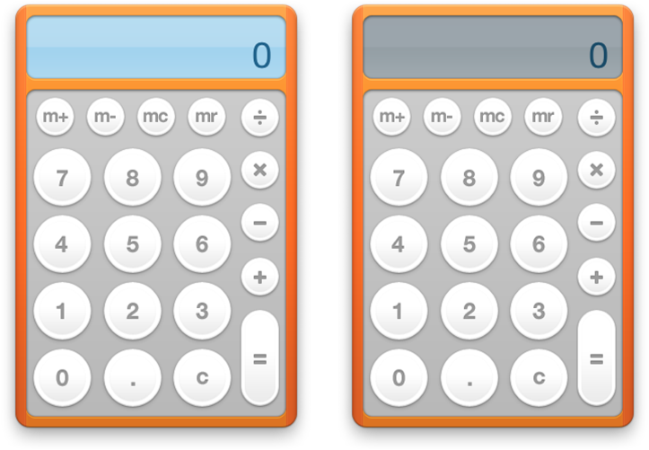

> 导航：[总目录](../../../README.md) · [documentation](../../../_indexes/documentation.md) · [Dashboard Programming Topics](Introduction%20to%20Dashboard%20Programming%20Topics.md)


[Next](Declaring%20Control%20Regions.md)[Previous](Syncing%20Widgets.md)

# Using Widget Events

Widgets may need to respond to certain events. If your widget is processor intensive, it shouldn't be running when Dashboard is hidden. If it shows focus by lighting up, it needs to be aware of when it receives focus. These events are useful for widget developers who want to be aware of widget and Dashboard events.

A widget can know when Dashboard is active. When Dashboard is hidden, your widget should not consume any CPU time or network resources. Assign methods to the properties `widget.onshow` and `widget.onhide` to notify your widget that Dashboard is active. For example, the World Clock widget assigns functions for starting and halting the display of time in its main JavaScript file.

```
if (window.widget)
{

    widget.onshow = onshow;
    widget.onhide = onhide;

}
```

When Dashboard is shown, `onshow` is called. This function sets a timer in motion:

```
function onshow () {
    if (timer == null) {
        updateTime();
        timer = setInterval("updateTime();", 1000);
    }
}
```

When Dashboard is hidden, `onhide` halts the timer:

```
function onhide () {
    if (timer != null) {
        clearInterval(timer);
        timer = null;
    }
}
```

Use these properties when your widget is resource intensive. If your widget continually fetches data from the Internet (examples are the Stocks and Weather widgets), or constantly draws data (for example, a clock), there's no need to have it active when Dashboard is hidden.

A widget can also know when it is in focus so that it can change behavior if it is the foremost widget. An example of this behavior is provided by the Calculator widget. Notice that when it is the foremost widget, as in Figure 3-2, its screen changes from gray to blue.

__Figure 29__  The Calculator widget, active and inactive



This event is handled by `window.onfocus` and `window.onblur`, two properties of the widget window. Here’s the code the Calculator widget uses to specify which functions to call on each event:

```
    window.onfocus = focus;
    window.onblur = blur;
```

The `focus` function makes the blue LCD visible:

```
function focus()
{
    document.getElementById("lcd-backlight").style.visibility =  "block";
    document.getElementById("calcDisplay").setAttribute("class", "backlightLCD");
}
```

The `blur` function hides the blue LCD:

```
function blur()
{
    document.getElementById("lcd-backlight").style.visibility = "none";
    document.getElementById("calcDisplay").setAttribute("class", "nobacklightLCD");
}
```


It might be appropriate for your widget to be aware of when it’s being dragged around Dashboard. Two properties are available to notify you of when drags start and end:

__`widget.ondragstart`__: Called when a widget is at the beginning of a drag.

__`widget.ondragend`__: Called when a widget is at the end of a drag.

You assign each of these listeners a handler for when the event that the widget is supposed to be aware of:

```
widget.ondragstart = widgetDragStartHandler;
widget.ondragend = widgetDragEndHandler;
```

The handlers are not passed any parameters.

Your widget can be notified when it is removed from Dashboard. This is useful for removing widget preferences that you don’t want to persist after your widget is dismissed, or for any situation where something needs to be performed upon the close of your widget.

The `onremove` listener takes a handler that’s called when your widget is closed:

```
widget.onremove = removalHandler;
```

[Next](Declaring%20Control%20Regions.md)[Previous](Syncing%20Widgets.md)

