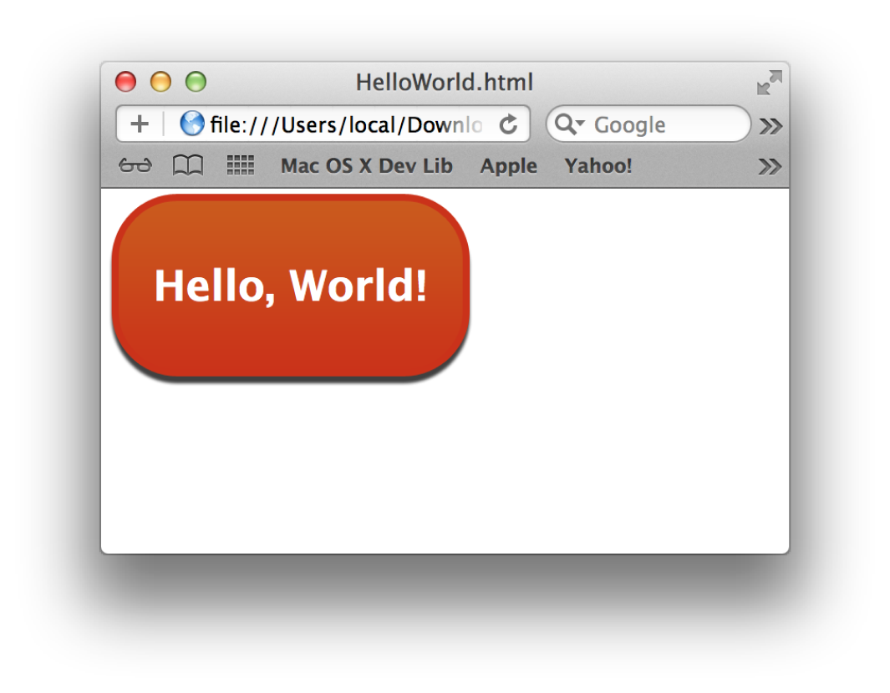

> 导航：[总目录](../../../README.md) · [documentation](../../../_indexes/documentation.md) · [Dashboard Programming Topics](Introduction%20to%20Dashboard%20Programming%20Topics.md)


[Next](Designing%20Widgets.md)[Previous](Introduction%20to%20Dashboard%20Programming%20Topics.md)

# Widget Basics

Dashboard widgets provide an easy way for people to access important information and perform simple tasks without disturbing their work on the desktop. The Dashboard application, available in OS X v10.4 and later, provides the environment widgets run in and allows users to manage their widgets. This article introduces the Dashboard environment and explains how to create a simple widget.

Users show Dashboard by using a key stroke, as specified in the Exposé & Spaces pane of System Preferences. By default, the key is F12. Alternatively, users can click the Dashboard icon in the Dock. When Dashboard runs, it overlays the windows currently visible on the desktop and displays the active widgets, as shown in Figure 1.

__Figure 1__  Dashboard displays active widgets in an area that floats above the desktop

!

Multiple widgets, including multiple instances of one widget, can exist in Dashboard at one time. Users have complete control over what widgets are visible and can freely move them anywhere they please in Dashboard. The widgets appear when Dashboard is launched and disappear when Dashboard is dismissed.

Dashboard also provides ways for users to manage their widgets. Clicking the button in the lower-left corner of Dashboard displays:

- The set of enabled widgets in the widget bar across the bottom of the screen, as shown in Figure 1. (Enabled widgets are those that are installed and ready to place in Dashboard.)
- The Manage Widgets button and the Widgets widget, both of which open a list of all installed widgets and give users an easy way to download more widgets.
- A close button at the upper-left of each widget in Dashboard (shown in Figure 1), which allows users to remove the widget from Dashboard without deleting it.

A widget is a mini application that exists exclusively in Dashboard. From the user’s perspective, it behaves as an application should: it shows useful information or helps them perform a simple task with a minimum of input. For example, Weather (shown in Figure 2) displays a 6 day weather forecast for the location the user selects.

__Figure 2__  The Weather widget displays the weather forecast for the user’s selected location

!

Despite the fact that widgets look like applications to the user, widgets are powered by web technologies and standards such as HTML, CSS, and JavaScript. In addition to web technology, Apple provides useful additions such as preferences, localization, and system access.

Above all, widgets are small, lightweight, and narrowly focused on a single task. Users reveal Dashboard when they want to check on something or perform a quick, simple task while they are in the midst of using their desktop applications. For this reason, users expect widgets to be instantly available, quick to use, and easy to dismiss.

To develop a widget you must work with the bundle structure, a property list, and some combination of HTML, CSS, and JavaScript. This section describes these components and helps you create a simple Hello World widget, similar to the one shown in Figure 3.

__Figure 3__  A simple Hello World widget is a good first project

!

As you create this widget, you become familiar with a widget's bundle structure, its information property list file, a basic style sheet, and the HTML file needed to make the widget function. You also learn how to put these pieces together and install the widget in the right place.

All of the files needed to implement this widget are available in the _[Hello World](../../../samplecode/Hello%20World/Hello%20World.md#apple-f4xwc4dqnrsv64tfmyxwi33df52wszbpirkfgmjqgaydgnrzg4)_ sample project.

Widgets are distributed as bundles. A bundle is a directory in the file system that groups related resources together in one place. A widget's bundle contains at least four files: an information property list file (`Info.plist`), an HTML file, and two PNG images. There may or may not be a fifth file that contains the style sheet for the widget.

For the Hello World widget, the bundle structure contains the following files:

```
Hello World.wdgt/
    Icon.png
    Info.plist
    Default.png
    HelloWorld.html
    HelloWorld.css
```


The HTML, CSS, and JavaScript files provide the implementation of the widget. In these files, you can use any technique or trick that you would use when designing a webpage. This includes, but is not limited to, HTML, CSS, and JavaScript. In general, you use HTML to define the structure of your widget, CSS to provide the visual style, and JavaScript to support interactivity.

Although you can place all of your HTML, CSS, and JavaScript code into one file, you may find it more manageable to split these into separate files, as shown in Table 1. Splitting your markup, design, and logic into separate files may also make localization easier, as discussed in [Localizing Widgets](Localizing%20Widgets.md#apple-f4xwc4dqnrsv64tfmyxwi33df52wszbpkridimbqgaztanbxfvjvomq). The file extensions listed in Table 1 are used to reflect the purpose of the file:

__Table 1__  File extension mappings for web technologies

| Technology | Purpose | File extension | Example |
| HTML | Structure | `.html` | `HelloWorld.html` |
| CSS | Design | `.css` | `HelloWorld.css` |
| JavaScript | Logic | `.js` | `HelloWorld.js` |

These file extensions are not enforced by Dashboard, but it is recommended that you adhere to these standards.

It is advisable to create a single HTML file for your widget. If a widget contains more than one HTML file, the resulting reloads can make your widget seem less like a mini application and more like a website.

To load your CSS and JavaScript, you need to import them inside of your HTML file. To import a style sheet (in other words, a CSS file), you add HTML code that looks similar to this:

```
<style type="text/css">
    @import "HelloWorld.css";
</style>
```

To load a JavaScript file, use the `<script>` tag:

```
<script type='text/javascript' src='HelloWorld.js'></script>
```

Note that if your widget does not use CSS or JavaScript, there is no need to use these includes or to include blank CSS or JavaScript files. Conversely, you can use multiple `@import` statements and `<script>` tags to include more than one CSS or JavaScript file.

Each widget must have an information property list (`Info.plist`) file associated with it. This file provides Dashboard with information about your widget. Dashboard uses this information to set up a space in which it can operate.

The `Info.plist` file contains the needed information. In a basic widget’s `Info.plist` file are five mandatory keys and four optional keys. These keys are listed in Table 2 along with their definitions and some example values used in the Hello World widget:

__Table 2__  Widget `Info.plist` properties

| Key | Example value | Definition |
| `CFBundleIdentifier` | `com.apple.widget.HelloWorld` | Required. A string that uniquely identifies the widget, in reverse domain format. |
| `CFBundleName` | `Hello World` | Required. A string that contains the name of your widget. Must match the name of the widget bundle on disk, minus the `.wdgt` file extension. |
| `CFBundleDisplayName` | `Hello World` | Required. A string that contains the actual name of the widget, to be displayed in the widget bar and the Finder. |
| `CFBundleVersion` | `1.0` | Required. A string that gives the version number of the widget. |
| `CloseBoxInsetX` | `16` | Optional. An integer between 0 and 100 that sets the placement of the widget’s close box on the x-axis. |
| `CloseBoxInsetY` | `14` | Optional. An integer between 0 and 100 that sets the placement of the widget’s close box on the y-axis. |
| `Height` | `126` | Optional. A number that gives the height, in pixels, of your widget. If not specified, the height of `Default.png` is used. |
| `MainHTML` | `HelloWorld.html` | Required. A string that gives the name of the HTML file that implements your widget. |
| `Width` | `235` | Optional. A number that gives the width, in pixels, of your widget. If not specified, the width of `Default.png` is used. |

Of note are the values for the `CloseBoxInsetX` and `CloseBoxInsetY` keys. These values determine the placement of the close box of your widget. You should position the close box so that the "X" is centered over the top-left corner of the widget.

The complete information property list file for the Hello World sample widget looks like this:

```xml
<?xml version="1.0" encoding="UTF-8"?>
<!DOCTYPE plist PUBLIC "-//Apple Computer//DTD PLIST 1.0//EN" "http://www.apple.com/DTDs/PropertyList-1.0.dtd">
<plist version="1.0">
<dict>
    <key>CFBundleDisplayName</key>
    <string>Hello World</string>
    <key>CFBundleIdentifier</key>
    <string>com.apple.widget.helloworld</string>
    <key>CFBundleName</key>
    <string>Hello World</string>
    <key>CFBundleShortVersionString</key>
    <string>1.0</string>
    <key>CFBundleVersion</key>
    <string>1.0</string>
    <key>CloseBoxInsetX</key>
    <integer>16</integer>
    <key>CloseBoxInsetY</key>
    <integer>14</integer>
    <key>MainHTML</key>
    <string>HelloWorld.html</string>
</dict>
</plist>
```

Note that in this `Info.plist` file, the `Width` and `Height` keys are omitted. As previously mentioned, these keys are optional. Because they aren’t included, this widget is automatically sized based on the dimensions of its default image.

There are more optional `Info.plist` keys than those described here; you can read about them in [Dashboard Info.plist Keys](https://developer.apple.com/library/archive/documentation/AppleApplications/Reference/Dashboard_Ref/DashboardPlist/DashboardPlist.html#//apple_ref/doc/uid/TP40001339-CH205). Of particular note are the access keys, which allow you to turn on access to external resources. [Using Access Keys](Specifying%20Access%20Keys.md#apple-f4xwc4dqnrsv64tfmyxwi33df52wszbpkridimbqgaztanbyfvjvomy) discusses these in more depth.

The two image files required in a widget are the icon and default image files. They need to be formatted as Portable Network Graphics (PNG) files and must be named `Icon.png` and `Default.png`, respectively.

The icon file, `Icon.png`, is used in the widget bar as a representation of your widget:

__Figure 4__  The Hello World widget bar icon


The default image, `Default.png`, is shown while your widget loads. It can be the background used by your widget or any other appropriate image. This file also sets the size of your widget if you don’t use the `Height` and `Width` properties in your `Info.plist` file.

__Figure 5__  The Hello World widget default image


For more on widget bar icon sizes and other design elements, see [Designing Widgets](Designing%20Widgets.md#apple-f4xwc4dqnrsv64tfmyxwi33df52wszbpkridimbqgaztanjtfvjvomy).

Your widget’s HTML file provides the implementation of the widget. You can name it anything you like, but it must reside at the root level of the widget bundle and must be specified in the `Info.plist` file. For the Hello World sample widget, the HTML file displays an image and the words "Hello, World!" The contents of the `HelloWorld.html` file is shown in Listing 1:

__Listing 1__  The Hello World HTML file

```
<html>
<head>
<style>
    @import "HelloWorld.css";
</style>
</head>

<body>

    
    <span class="helloText">Hello, World!</span>

</body>
</html>
```

The HTML for this widget specifies the image used as the background and the text to display. Notice, however, that the above HTML file doesn’t contain any style information. Instead, it imports another file that has this information: `HelloWorld.css`. As discussed in [HTML, CSS, and JavaScript Files](#apple-f4xwc4dqnrsv64tfmyxwi33df52wszbpkridimbqga4dcmjxfvjvoni), you don’t have to break your CSS and JavaScript out of the HTML file, but it is recommended. The file `HelloWorld.css` contains all of the style information for the widget, as shown in Listing 2:

__Listing 2__  The Hello World CSS file

```
body {
    margin: 0;
}

.helloText {
    font: 26px "Lucida Grande";
    font-weight: bold;
    color: white;
    position: absolute;
    top: 41px;
    left: 32px;
}
```

The style sheet defines the styles for the body and for an arbitrary span class called `helloText`. This class is applied to the "Hello, World!" text in the `HelloWorld.html` file.

Figure 6 shows what the code looks like when rendered in Safari.

__Figure 6__  The Hello World widget being previewed in Safari



In fact, when testing your widget, you can open it in Safari and get the same appearance you would get if it were loaded into Dashboard.

Now that you have completed the three basic components for the widget, you can assemble them into a bundle and load your widget into Dashboard.

First, create a new directory named `Hello World`. Then, place these files in it at the root level:

- `Default.png`
- `HelloWorld.html`
- `HelloWorld.css`
- `Icon.png`
- `Info.plist`

When the files are in place, rename the directory `Hello World.wdgt`.

After the bundle has been renamed, double click its icon in the Finder to install it. This displays an install dialog that, when you click Install, copies the widget to `~/Library/Widgets/` and opens it in Dashboard. It should look like the view in Figure 7.

__Figure 7__  The Hello World widget installed and running in Dashboard


Congratulations! You’ve just created your first Dashboard widget.

Now you're ready to enhance your widget with some of the features Apple provides in Dashboard and WebKit. Begin by reading about the guidelines that govern great widgets in [Designing Widgets](Designing%20Widgets.md#apple-f4xwc4dqnrsv64tfmyxwi33df52wszbpkridimbqgaztanjtfvjvomy). Then, read other articles in this document to learn about details that interest you, such as [Using Animation](Using%20Animation.md#apple-f4xwc4dqnrsv64tfmyxwi33df52wszbpkridimbqgaztcobxfvjvomi) or [Accessing External Resources](Accessing%20External%20Resources.md#apple-f4xwc4dqnrsv64tfmyxwi33df52wszbpkridimbqgaztanbzfvjvomi).

[Next](Designing%20Widgets.md)[Previous](Introduction%20to%20Dashboard%20Programming%20Topics.md)

