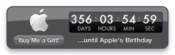
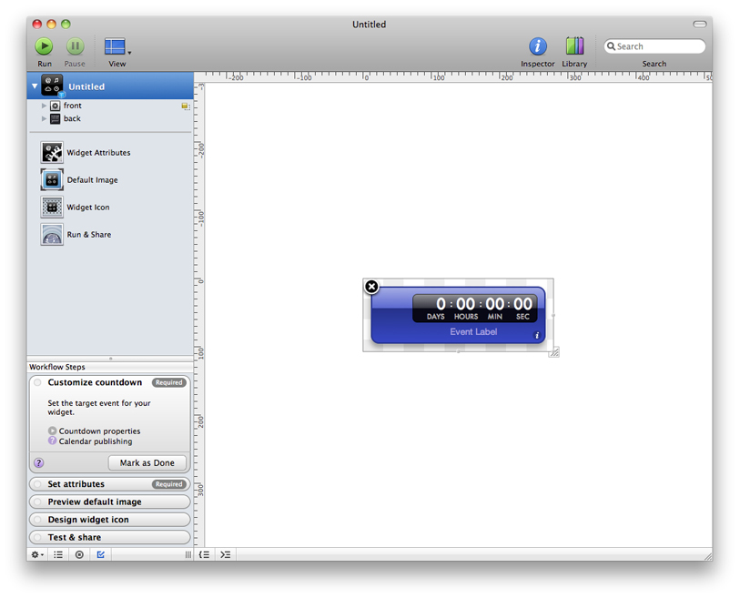
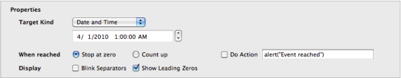
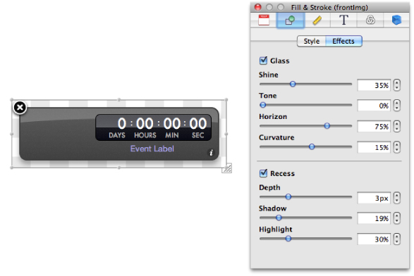
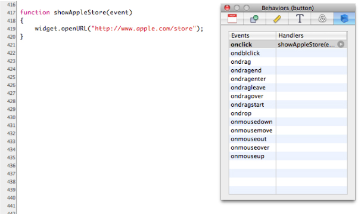

> 导航：[总目录](../../../README.md) · [documentation](../../../_indexes/documentation.md) · [Dashcode User Guide](Introduction%20to%20Dashcode%20User%20Guide.md)


[Next](Mobile%20Safari%20Web%20Application%20Tutorial.md)[Previous](Introduction%20to%20Dashcode%20User%20Guide.md)

# Dashboard Widget Tutorial

This tutorial walks you through using Dashcode to create a Dashboard widget. As you follow the steps, you learn how to choose a widget template, customize your widget’s appearance and code, and share your widget with others. Completing this tutorial is a quick and easy way to get started building Dashboard widgets in Dashcode.

This document includes two additional tutorials, [Mobile Safari Web Application Tutorial](Mobile%20Safari%20Web%20Application%20Tutorial.md#apple-f4xwc4dqnrsv64tfmyxwi33df52wszbpkridimbqga2dmojsfvbuqmjyfvjvomi) and [Dual-Product Web Application Tutorial](Dual-Product%20Web%20Application%20Tutorial.md#apple-f4xwc4dqnrsv64tfmyxwi33df52wszbpkridimbqga2dmojsfvbuqmjzfvjvomq), which follow this one. The remainder of the document delves more deeply into the Dashcode development environment, describing how it supports both widget and web application development. If you don’t want to learn how to create a web application, you can continue learning more about Dashcode by reading [Starting a Project](Starting%20a%20Project.md#apple-f4xwc4dqnrsv64tfmyxwi33df52wszbpkridimbqga2dmojsfvbuqnbnknltc).

In this tutorial, you build a Dashboard widget that counts down to your birthday, similar to the widget shown in Figure 1-1.

__Figure 1-1__  The Birthday widget



Before continuing, make sure that you have Dashcode installed on your Mac. If you don’t have Dashcode installed, read [Getting and Running Dashcode](Introduction%20to%20Dashcode%20User%20Guide.md#apple-f4xwc4dqnrsv64tfmyxwi33df52wszbpkridimbqga2dmojsfvbuqmjnknlte) to learn how to get and install Dashcode.

To start, double-click the Dashcode icon to open it. A new project window opens and displays a dialog in which you first select the type of project you’re interested in—in this case, Dashboard—and then, the kind of widget you want to create from an assortment of templates. _Templates_ are handy starting points for creating common types of widgets. Select a template’s icon to show a short description of what that template does.

To make the Birthday widget, this tutorial uses the Countdown template. Select its icon and click Choose. A project window opens with a new widget based on the Countdown template, as shown in Figure 1-2.

__Figure 1-2__  A project window showing a new Dashboard widget



Along the left side of the project window is the _navigator_, which you use to switch between the various tools available when you’re designing a widget. The main portion of the window is the _canvas_, which you use to design your widget’s interface.

At the bottom of the navigator in Figure 1-2 you can see the _Workflow Steps list_, which guides you through the widget development process. Each step is a milestone in creating a widget, telling you what to do and where to do it. When you complete a step, mark it as done and move on to the next step.

The Countdown template gives you a Dashboard widget with all the elements and code needed to count down to an event. All you need to do is tell the widget the target date. To set the target date, select Widget Attributes in the navigator. The canvas is replaced by the _widget attributes pane_, in which you specify important values that your widget needs.

In the Properties section of the widget attributes pane, choose Date and Time in the Target Kind pop-up menu and enter the date of your next birthday, as shown in Figure 1-3.

__Figure 1-3__  The Countdown template’s properties



Your new Dashboard widget is already fully functional. To prove this, choose Debug > Run to run the widget. Dashcode can run a widget without opening it in Dashboard, making it a handy place to test your widget and fix any problems you encounter. After the widget loads, it starts counting down towards your next birthday.

When you’re satisfied that your widget is working as you expect, choose Debug > Stop to stop it.

Now is a good time to save your widget project. Choose File > Save to save the project. Give your project a name and select a location to save it in. Your widget is saved in a widget project that encapsulates the widget and information Dashcode needs to create the widget for you.

Although you now have a fully functioning Dashboard widget that’s ready to share, you might want to personalize it to make it unique. Dashcode’s design tools make it easy to customize your widget’s interface. Select the widget item in the navigator (it should display the name you gave it when you saved the project). The widget attributes pane is replaced with the canvas.

First, change your widget’s body color. Select the widget body (also called the front image or `frontImg`) on the canvas and then choose Window > Show Inspector. The _inspector window_ allows you to modify a selected element’s properties, such as its appearance and behavior. Click the Fill & Stroke button at the top of the inspector window (it’s the second from the left). If it’s not already selected, click the Style tab to reveal fill, stroke, corner roundness, and opacity values. Click the color well and choose a new color in the Colors window that appears. Try different fill styles until you find a combination that you like. If you want to try changing other effects, such as the glass appearance, click the Effects tab to reveal these values, as shown in Figure 1-4.

__Figure 1-4__  Tweaking the front image using the Fill & Stroke inspector



When you’re finished customizing your widget’s body, add a photo of yourself from iPhoto to the widget. Your iPhoto library is available from the _Library window_. To show your iPhoto library, choose Window > Show Library; then click the Photos button. Find a photo and drag it to your widget on the canvas. Resize it by dragging any of the resize handles on the photo.

Finally, change the Event Label text to something like “...days until my birthday.“ You can do this by selecting the Event Label text, clicking the Attributes button in the inspector window (it’s the leftmost button), and entering the text in the Value field, or by double-clicking the text in the widget body itself and entering the new text.

Now that you have a personalized Dashboard widget that counts down to your birthday, add a button that, when clicked, shows the Apple Store (so your friends and family can buy you a birthday present!). To add a button to your widget, use a button _part_. Parts are controls and views used on a widget’s interface.

To find a button part, choose Window > Show Library and click Parts. You can use the search field at the bottom of the window to help you find a particular part or type of part. From the list of parts, drag the Lozenge Button part from the Library window to your widget’s body. Double-click the button to select its label text, enter the text “Buy me a gift” and press Return. You'll probably need to resize the button to fit the new label.

To make the button take the user to the Apple Store when it’s clicked, you need to add a behavior to the button. In the inspector window, click the Behaviors button (it’s the rightmost button). This shows the Behaviors pane, in which you assign handler functions to events on an object. Select the button on the canvas and double-click in the Handlers column next to the `onclick` event name. Enter the name of a new function, such as `showAppleStore`, and press Return. Click the arrow next to the function name you entered to reveal the _source code editor_ below the canvas. Here you write code to add functionality to your widget. Clicking the arrow reveals the `showAppleStore` function Dashcode inserted in your widget’s code. Between the braces (`{ .. }`) enter the following line of code:


```
widget.openURL("http://store.apple.com/");
```

The code in the source code editor should look like that in Figure 1-5.

__Figure 1-5__  A function in the source code editor



Test your widget again by choosing Debug > Run. Click the button you added and make sure a new Safari window opens with the Apple Store website displayed. Be sure you save your project often to preserve the changes you make.

Congratulations! You’ve created your first complete Dashboard widget using Dashcode.

To open your widget in Dashboard, choose File > Deploy Widget. Click Install in the dialog that appears to view your widget in Dashboard.

To share your widget with the world, select Run & Share in the navigator. The pane that appears displays the widget project name you chose in [Test the Countdown](#apple-f4xwc4dqnrsv64tfmyxwi33df52wszbpkridimbqga2dmojsfvbuqmznknltcmq), but you can replace this with a different name if you want. You can also set the minimum version of OS X your widget should run in. Click Save to Disk to save your widget. You can now email it to friends or post it on your webpage. You can use the File > Compress command in the Finder to archive it.

[Next](Mobile%20Safari%20Web%20Application%20Tutorial.md)[Previous](Introduction%20to%20Dashcode%20User%20Guide.md)

