> 导航：[总目录](../../../README.md) · [documentation](../../../_indexes/documentation.md) · [FxPlug SDK Overview](About%20the%20FxPlug%20SDK.md)


[Next](Testing%20Your%20Plug-in.md)[Previous](Creating%20Pixel%20Transforms.md)

# Working with FxPlug Application Bundles

This chapter discusses how to create, package, register, and deprecate FxPlug 3.0 plug-ins. It also describes how to convert existing FxPlug 2.0 plug-ins to FxPlug 3.0 plug-ins.

Complete FxPlug plug-in examples are included in the FxPlug SDK.

FxPlug 3.0 application bundles can exist anywhere, but it’s suggested that you put them in the `/Applications` folder.

A completed FxPlug plug-in is packaged in an XPC bundle, which is contained within the plug-in’s application bundle. See Figure 7-1.

__Figure 7-1__  FxPlug 3 structure

!

A bundle also contains an `Info.plist` property list file that describes the plug-ins in the bundle. This description can be static or dynamic.

With a static list, the plug-ins are recognized and loaded automatically; for a dynamic list, the bundle’s principal class is asked to register the plug-ins. The distinction depends on the value of the Boolean tag `ProPlugDynamicRegistration` in the property list.

Dynamic registration incurs a plug-in scanning performance hit. Use static registration whenever possible. You can find more information about dynamic registration in `<PluginManager/PROPlugInBundleRegistration.h>.`

The first time an FxPlug 3.0 application bundle is launched, the system registers the plug-in and it becomes visible to the host applications.

If the FxPlug’s installer was properly signed with productsign(1) and a valid certificate, Gatekeeper will allow the plug-in to be registered regardless of whether it was launched previously.

Once registered, the host application can display the list of grouped FxPlug plug-ins in its user interface, allowing the user to choose and apply particular plug-ins to particular tracks.

Although plug-in registration takes place automatically via Launch Services, you can use the `pluginkit` command to manage plug-in registrations, for example for debugging purposes.

- To view the list of all registered plug-ins:

  `pluginkit -m`

  This command filters for unique matches and duplicate bundle identifiers aren’t shown. If you need to know the full list, and the locations of where Launch Services found them, use:

  `pluginkit -mAv`
- To register an FxPlug 3.0 plug-in:

  `pluginkit -a <pathToYourPluginApp>/Contents/PlugIns/*`
- To unregister an FxPlug 3.0 plug-in:

  `pluginkit -r <pathToYourPluginApp>/Contents/PlugIns/*`

It’s important to note that Launch Services is free to manage plug-ins as it pleases, and with the above commands you’re viewing and directly manipulating the PlugInKit registration database. If Launch Services rediscovers a plug-in after you’ve removed it, the plug-in is registered again. The surest way to control the loading behavior of Motion and Final Cut Pro while developing is to use priority and ignore paths, see [Loading FxPlug Plug-ins](Working%20with%20Entitlements.md#apple-f4xwc4dqnrsv64tfmyxwi33df52wszbpkridimbqgazdcobqfvbuqmrthawvgvzz).

For more information on the `pluginkit` command, refer to the `pluginkit` man page.

Older plug-ins may become obsolete when newer plug-ins come out. Users who have applied an older plug-in in an existing project want their projects to continue to render the same, but developers need a way to keep users from applying the plug-in in new projects when the new plug-in is installed.

The solution is to use the obsolete key. When you add the obsolete key to your plug-in’s Info.plist file with a value of YES, it tells the host application not to display its name in the list of available plug-ins. When a user opens an existing project, the plug-in’s user interface will still be available, and they will be able to copy and paste instances of the plug-in, but will have no way of creating a new instance of the plug-in from scratch. This allows you to use the same name for the new plug-in and ensures that only new instances are created going forward.

Likewise, when Final Cut Pro X loads a project that contains a Final Cut Effect which has an obsolete FxPlug in it, the obsolete plug-in will continue to work properly. Usually, developers will only ship the new template with the new plug-in, and only users who installed the old plug-in with the old template will be able to use the old one. This does mean, however, that the new template will have to have a different name from the old one, or be put into a different category. This is often handled by adding a version number to the template name, such as “My Cool Plugin v1.moef”.

```
<key>obsolete</key>
<string>YES</string>
```


There are two ways to create a new FxPlug Application Bundle plug-in: use the FxPlug Xcode template (added by the SDK installer), or start from a copy of the FxBrightness example in the SDK.

To create a new FxPlug application bundle using the FxPlug template

1. Open Xcode.
2. Choose File > New > Project.
3. Select FxPlug in the left-hand pane under OS X.
4. Select the FxPlug template in the right-hand pane, and click Next.

The following properties in a new project should be of interest to you:

- The `Principal class` key and `PlugInKit` dictionary in the `Info.plist` file of the XPC Service group. The `PlugInKit` dictionary in the XPC-`Info.plist` contains several key/value pairs that link the XPC to the plug-in. Among these are a key/value pair named PrincipalClass. This should contain the name of the class in (`<YourPlugInNameXPCService>.m`). If you change this class name, it must also be updated in this plist dictionary.
- The `Principal class` key in the `Info.plist` file of the PlugIn group. This property links your code to the plug-in, and if you change the name of the default class (`<YourPlugInNameXPCService>.m`), you must also update this property.
- The `ProPlugPlugInList` dictionary in the `Info.plist` file of the PlugIn group. This property is critical for identifying how your plug-in loads and displays in the host application.

To create a new FxPlug application bundle using the FxBrightness example

1. Make a copy of the FxBrightness example from the FxPlug SDK, and place it wherever you like.
2. Open the copy of the project in Xcode.
3. Change the product name, plug-in name, UUID in the filter bundle, and the principal class name in the XPC plist.

You must use a universally unique ID (UUID) for each plug-in you write, and manage similar UUIDs for groups to which you want to add your plug-in. When you create a new plug-in using the FxPlug Xcode template, the UUID is automatically generated—but if you create a new plug-in by copying an existing project, you must generate a new UUID.

The `ProPlugPlugInGroupList` dictionary holds the default group name for your plug-in in the `groupName` key.

The majority of the plug-in code is in the `<YourPlugInNamePlugIn>.m` class file and the `<YourPlugInNamePlugIn>.h` header file in the PlugIn group. This code provides a basic setup to demonstrate adding and retrieving parameters, rendering, and contacting an XPC service out-of-process.

This section describes how to convert an existing FxPlug 2.0 plug-in, that compiles and produces a plug-in bundle that Motion can load into an FxPlug 3.0 plug-in.

In addition to the existing FxPlug bundle (Embedded Principal), three new targets must be added to the existing FxPlug 2.0 project:

- An application
- An XPC Service (Service Principal)
- A protocol

Each target has build dependencies and copy phases (both under Build Phases) that produce the following structure:

```
<Application Bundle>.app/Contents/PlugIns/XPCBundle/Contents/PlugIns/<YourBundle>.fxplug
```

Your plug-in goes into the XPC Service bundle’s `PlugIns` folder, your XPC Service bundle goes into the application bundle’s `PlugIns` folder. See [Figure 7-1](#apple-f4xwc4dqnrsv64tfmyxwi33df52wszbpkridimbqgazdcobqfvbuqnbnknltgna).

Each new target also requires a few plist settings to help the host application (Motion, Final Cut Pro) find them and set their attributes.

Finally, two configuration files are needed to identify the frameworks at runtime.

This example takes the FxPlug 2.4 SDK Brightness example (GLSLFxPlug) and converts it to the new FxPlug 3 structure, step by step. This plug-in uses only its Embedded Principal.

The following are required to work through this example:

- Xcode 5.0 or later
- FxPlug 3.0 SDK
- Motion 5.1 or later
- The Brightness example from the FxPlug 2.4 SDK

Perform the following steps to convert the FxPlug 2.4 SDK Brightness example to FxPlug 3 format:

1. Verify the Brightness example.

   1. Open the Brightness example in Xcode.
   2. Build the Brightness example.
   3. Place the built FxPlug bundle in `/Library/Plug-Ins/FxPlug/`.
   4. Open Motion, and verify that the plug-in loads.
   5. Delete the files you just placed in `/Library/Plug-Ins/FxPlug/`.
2. Add three new targets to the Brightness project in Xcode.

   1. Select the project in the left navigation area.
   2. Click Add Target in the Targets section (or choose File > New > Target).

      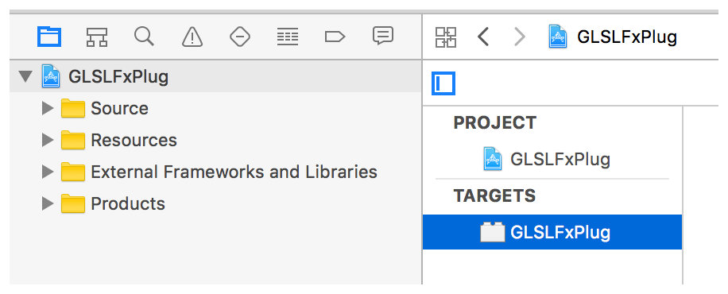
   3. Select an OS X Cocoa Application, and click Next.
   4. Enter `BrightnessFilter` for the product name.
   5. Enter a company identifier, and click Finish.

      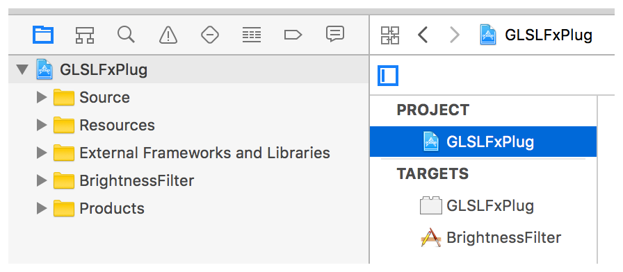
   6. Add the second new target, of type XPC Service, with product name _BrightnessXPC_.

      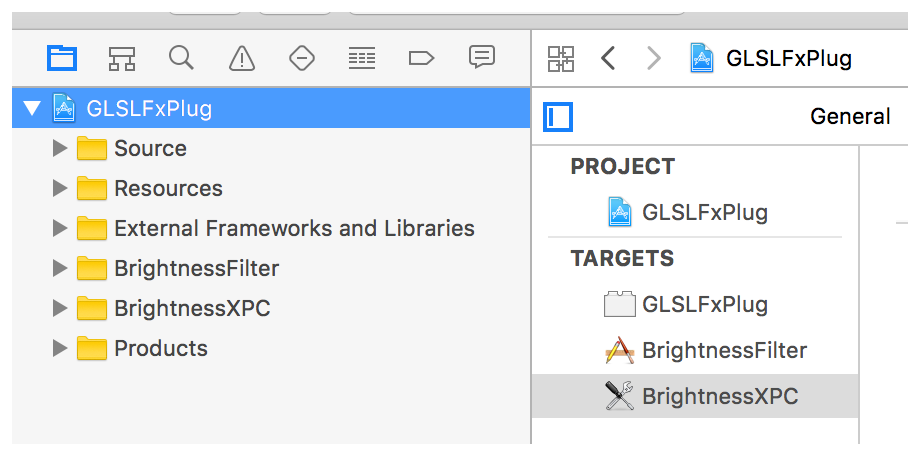
   7. Add a new file of Objective C class type, named BrightnessProtocol. Put both in the GLSLFxPlug and BrightnessXPC targets.

      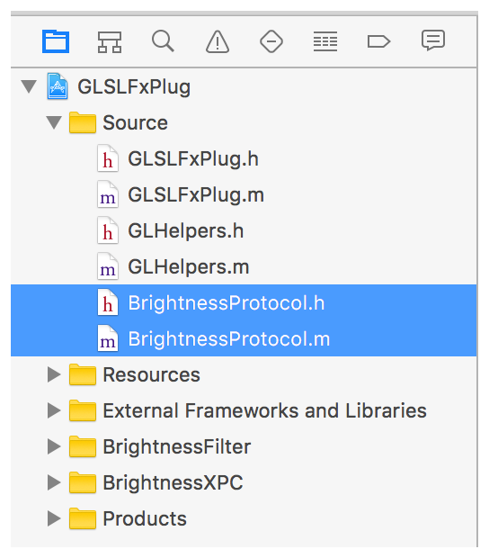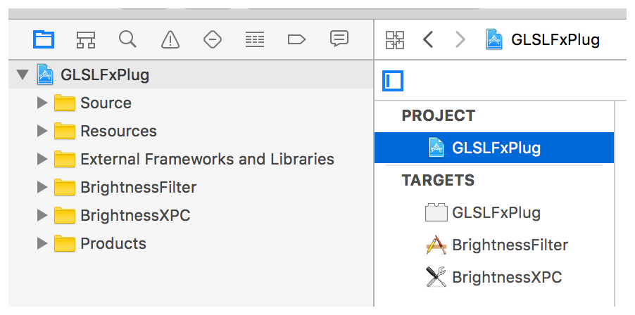
3. Specify the build and copy dependencies.

   1. Select the BrightnessFilter target application, and open the Build Phases tab.
   2. Open the Target Dependencies section, and click the Add items (+) button.
   3. Select BrightnessXPC, and click Add.

      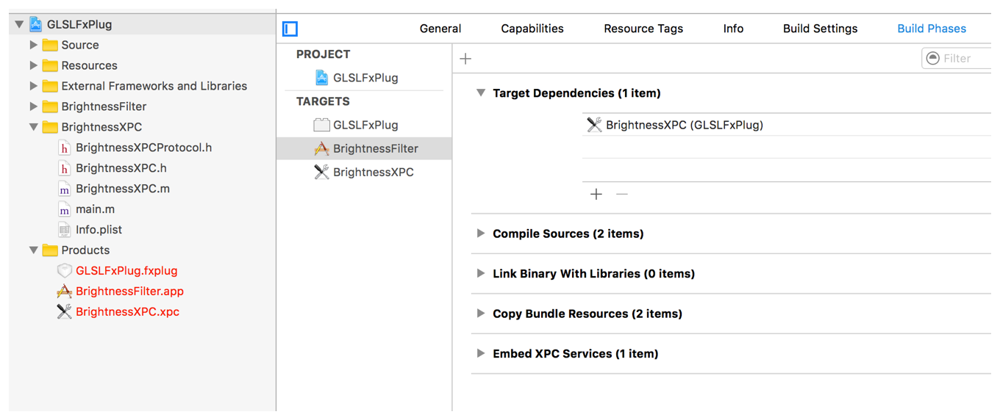
   4. Choose Editor > Add Build Phase > Add Copy Files Build Phase.
   5. Double-click the new phase title to rename it, and enter `Copy XPC Bundle`.
   6. Open the new Copy XPC Bundle phase, and choose PlugIns from the Destination drop-down menu.
   7. Click the Add items (+) button.
   8. Select the BrightnessXPC target from the Products list, and click Add.

      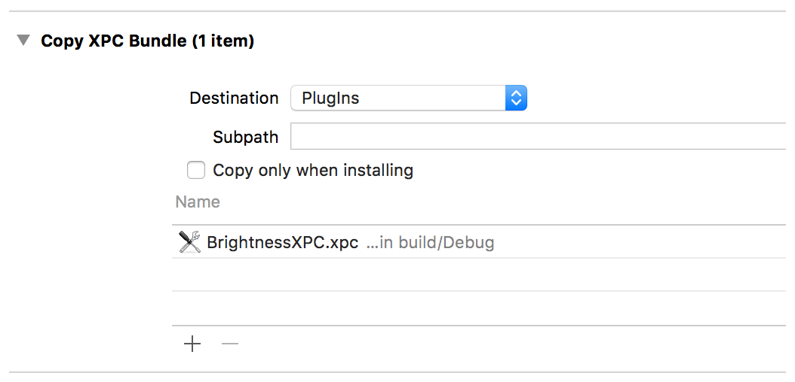
   9. Select the BrightnessXPC target XPC service, and open the Build Phases tab.
   10. Open the Target Dependencies section, and click the Add items (+) button.
   11. Select GLSLFxPlug, the existing FxPlug bundle, and click Add.

       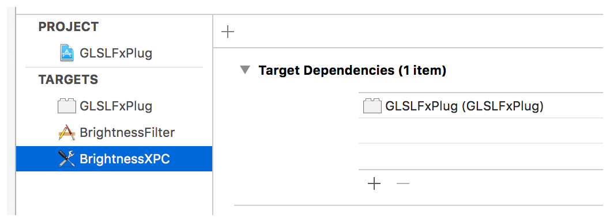
   12. Choose Editor > Add Build Phase > Add Copy Files Build Phase.
   13. Double-click the new phase title to rename it, and enter `Copy Embedded Plugin`.
   14. Open the new Copy Embedded Plugin phase, and choose PlugIns from the Destination drop-down menu.
   15. Click the Add items (+) button.
   16. Choose the GLSLFxPlug.fxplug target from the Products list, and click Add.

       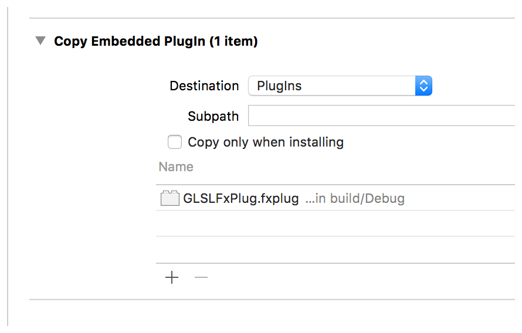
   17. Choose Editor > Add Build Phase > Add Copy Files Build Phase.
   18. Double-click the new phase title to rename it, and enter `Copy FxPlug Framework`.
   19. Open the new Copy FxPlug Framework phase, and choose Frameworks from the Destination drop-down menu.
   20. Click the Add items (+) button.
   21. Select the FxPlug.framework target from the External Frameworks and Libraries list, and click Add.
   22. Under the GLSLFxPlug and BrightnessXPC targets, be sure that `Protocols.m` is listed under the Compile Sources phase. If it is not in both locations, be sure to add it.
   23. Add the FxPlug framework to the BrightnessXPC build phase. Select the BrightnessXPC target. Drag and drop the FxPlug.framework from the External Frameworks and Libraries group to the Link Binary With Libraries build phase section.

       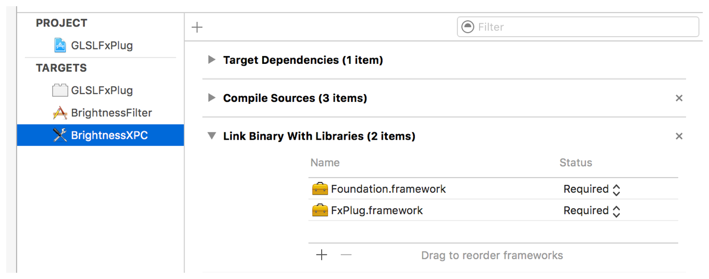
4. Set your scheme to build the `BrightnessFilter.app` file, build it, and verify.

   1. Select BrightnessFilter from the scheme drop-down menu, and choose your platform (32-bit or 64-bit).

      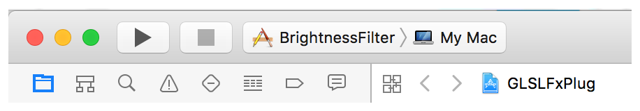
   2. Choose Product > Build (or press Command-B).
   3. Open the project’s debugging folder.
   4. Right-click (or Control-click) the BrightnessFilter application, and choose Show Package Contents.
   5. Navigate to `Contents/PlugIns`, and verify that the _BrightnessXPC_ XPC bundle is present.
   6. Right-click (or Control-click) the XPC bundle, and choose Show Package Contents.
   7. Navigate to `Contents/PlugIns`, and verify that _GLSLFxPlug.fxplug_ is present.

   If everything looks good, the basic FxPlug 3.0 structure is correctly setup; otherwise, check to make sure all the previous steps were completed as described before proceeding further.
5. Change the XPC bundle extension from `.xpc` to `.pluginkit`.

   1. Select the BrightnessXPC target, and open the Build Settings tab.
   2. Locate the Wrapper Extension setting, and change the value from _xpc_ to _pluginkit_.
6. Modify the Protocol (BrightnessProtocol) class.

   1. In `BrightnessProtocol.h`, replace:

```objc
@interface BrightnessProtocol : NSObject
```

      with:

```objc
@protocol BrightnessProtocol <NSObject>
```
   2. The Objective-C compiler and runtime perform some optimizations that trim unused protocols from the code. Because you want to leave this protocol alone, you must go the extra step of referring to it in the code to keep it from being trimmed out. In `BrightnessProtocol.m`, replace:

```objc
@implementation BrightnessProtocol

@end
```

      with:

```
void preserveProtocolFromBeingTrimmed()
{
    (void)@protocol(BrightnessProtocol);
}
```

      In `GLSLFxPlug.m`, add the following to `- initWithAPIManager`:

```objc
- (id)initWithAPIManager:(id)apiManager
{
    (void)@protocol(BrightnessProtocol);
...
}
```
   3. At the top of GLSLFxPlug.h, be sure to import your protocol:

```objc
#import "BrightnessProtocol.h"
```
7. Modify the Service Principal (BrightnessXPC) class.

   1. Right-click (or Control-click) the BrightnessXPC group, and choose New File to add the Principal Class to the XPC target.
   2. Select Objective-C class, and click Next.
   3. Enter `BrightnessServicePrincipal` in the Class field and click Next.
   4. Save the new file in the BrightnessXPC folder (group), and select the BrightnessXPC target.

      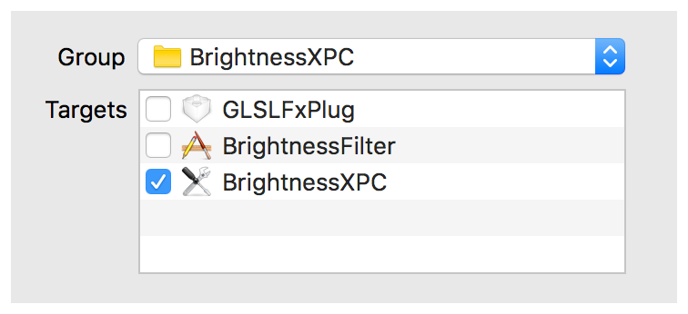
   5. Specify that this new class adheres to the BrightnessProtocol protocol. In `BrightnessServicePrincipal.h`, add:

```objc
#import "BrightnessProtocol.h"
```

      and replace:

```objc
@interface BrightnessServicePrincipal : NSObject
```

      with:

```objc
@interface BrightnessServicePrincipal : NSObject <BrightnessProtocol>
```
   6. Looking at the `main.m` file in the BrightnessXPC target shows that a lot of code was automatically added. Because FxPlug handles everything for you, this code isn’t needed. Therefore, replace the contents of this file with the following:

```objc
#import <FxPlug/FxPlugSDK.h>
#import "BrightnessServicePrincipal.h"

int main(int argc, const char *argv[])
{
    [FxPrincipal startServicePrincipal];
    return 0;
}
```
8. Each target depends on one another to produce a single application bundle. When the application is loaded, the internal structure is loaded from a set of plists. In this step, we add the necessary information so that the host applications know what’s being loaded.

   1. Open the `BrightnessXPC-Info.plist` file in the Supporting Files folder for the BrightnessXPC target group.
   2. Choose Editor > Add Item.
   3. Enter `PlugInKit` for the name. (Notice that the P, I, and K are capitalized, and nothing else.)
   4. Set the type to _Dictionary_.
   5. Add the following items to the PlugInKit dictionary:

| Key Name | Type | Value |
| --- | --- | --- |
| Protocol | String | BrightnessProtocol |
| PrincipalClass | String | BrightnessServicePrincipal |
| EmbeddedCode | String | GLSLFxPlug.fxplug |
| Attributes | Dictionary | N/A  Add the following item to the Attributes dictionary:  - Key Name: com.apple.protocol - Type: String - Value: FxPlug |

      The final plist looks like this:

      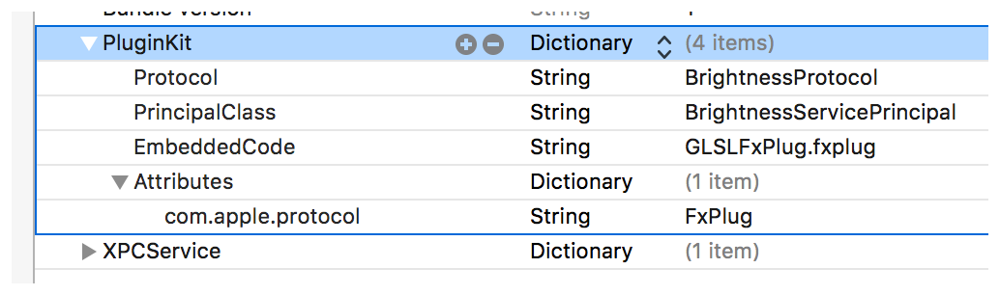

      If you do not intend to use an XPC, and thus do not have a useful protocol defined, you may see an error upon loading in the console. This error suggests that the named protocol was not found. List NSObject as the value for Protocol in this case.
9. Apply a code signature in the project build settings. Be sure to set the code signature at the project level, and not just for a single target. If you already have an existing code signature identity, choose that; otherwise, you may use an ad hoc code signature. For more information on code signing, see _[Code Signing Guide](../../Security/Code%20Signing%20Guide/About%20Code%20Signing.md#apple-f4xwc4dqnrsv64tfmyxwi33df52wszbpkridimbqga2tsmrz)_.

   1. Select the project in the left navigation area.
   2. Open the project Build Settings tab.
   3. Locate the Code Signing Identity setting.
   4. Set the value to the applicable certificate (your own or the one you just created).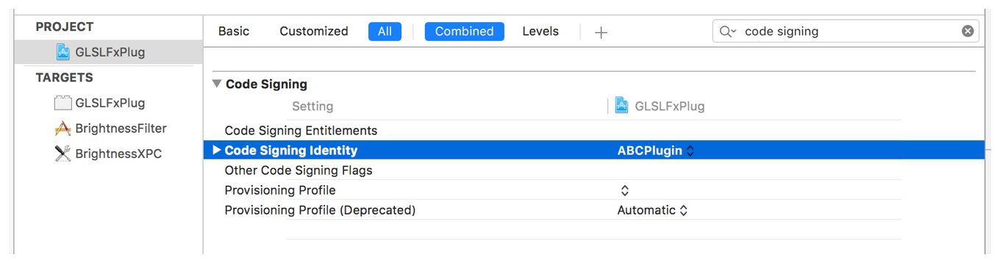
10. Perform a full project clean, and build your project.
11. Locate the built application and double-click it. A blank application appears; this space is free to use as you see fit.
12. Add two new configuration files to the Xcode project to ensure that the FxPlug frameworks can be found.

    1. Choose File > New.
    2. Select the Configuration Settings File template from the OS X > Other group, and click Next.
    3. Enter `PlugInConfig` for the filename.
    4. Click Create.
    5. Add the following:

```
LD_RUNPATH_SEARCH_PATHS = @loader_path/../../../../Frameworks
FRAMEWORK_SEARCH_PATHS = @loader_path/../../../../Frameworks
```
    6. Save the file.
    7. Choose File > New.
    8. Select the Configuration Settings File template from the OS X > Other group, and click Next.
    9. Enter `XPCConfig` for the filename.
    10. Click Create.
    11. Add the following:

```
LD_RUNPATH_SEARCH_PATHS = @loader_path/../Frameworks
FRAMEWORK_SEARCH_PATHS = @loader_path/../Frameworks
```
    12. Save the file.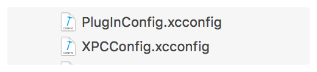
13. Configure the Xcode project to use the new configuration files.

    1. Select the project in the left navigation area.
    2. Open the project’s Info tab.
    3. Open the Configurations section.
    4. Set the FxPlug target to use the `PlugInConfig.xcconfig` file, and set the XPC target to use the `XPCConfig.xcconfig` file, as shown below.

       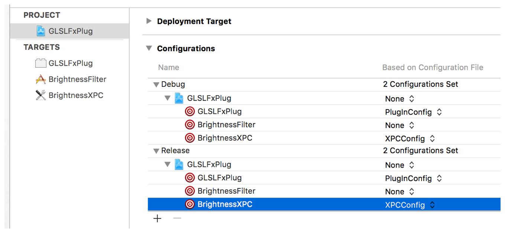
14. Perform a verification check to make sure the host application can load the plug-in.

    1. Launch the Motion application, and verify that the example filter loads successfully. From time to time, you may want to manually add or remove your plug-in from the PlugInKit database. You can do this through using the Terminal.app and the following commands. Do keep in mind that registration is handled by Launch Services in the background, so removing a plug-in does not guarantee that it won’t be added back shortly thereafter.
    2. Open a Terminal window, and enter the following command to register the plug-in:

```
pluginkit -a /<application_location>/BrightnessFilter.app/Contents/PlugIns/*
```
    3. To unregister the plug-in, enter the following command in a Terminal window:

```
pluginkit -r /<application_location>/BrightnessFilter.app/Contents/PlugIns/*
```

[Next](Testing%20Your%20Plug-in.md)[Previous](Creating%20Pixel%20Transforms.md)

