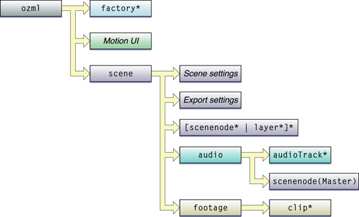
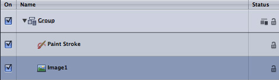

> 导航：[总目录](../../../README.md) · [documentation](../../../_indexes/documentation.md) · [Motion XML File Format](About%20This%20Document.md)


[Next](Elements%2C%20Subelements%2C%20and%20Attributes.md)[Previous](About%20This%20Document.md)

# Motion XML Overview

A Motion XML file is stored on disk as plain text document that you can view, parse, and edit on any platform. There are two types of Motion XML files: the Motion project file and the Motion library object file.

A Motion project file has these major components:

__Figure 2-1__  The Motion project file



- A declaration of the Motion XML version used in the file. A file using version 4.0 of Motion XML begins with the declaration: `<ozml version=”4.0”>`.
- A list of Motion factories used in the project. Factories are encoded with a `factory` element. They have a direct relation with objects in the scene graph. See [Factories](#apple-f4xwc4dqnrsv64tfmyxwi33df52wszbpkridimbqga3tinjvfvbuqnbnknlti).
- Information about Motion UI state—the state of windows, tabs, and so on—at the time a project was saved.
- The top-level `scene` element that encodes scene settings, export settings, and scene graph information.
- The Motion scene graph encoded with elements such as `scenenode`, `layer`, `audio`, `footage`, and so on.

The XML for a Motion scene graph has a hierarchical structure that replicates the hierarchical structure of a Motion project displayed in the Layer tab of the Project Pane in the Motion UI.

__Listing 2-1__  A Scene Graph Example

```
<layer name=”Group” id=”10000”>
   <scenenode name=”Paint Stroke” id=”10013” factoryID=”7” version=”4”>
   ...
   </scenenode>
   <scenenode name=”Image1” id=”10011” factoryID=”5” version=”4”>
   ...
   </scenenode>
   ...
   <aspectRatio>1</aspectRatio>
   ...
</layer>
```

In Listing 2-1, the `layer` element contains two attributes: `name=` and `id=`. There are three subelements of `layer`: a `scenenode` element representing a paint stroke, a second `scenenode` element representing an image, and an `aspectRatio` element representing a floating-point number. Note that the `aspectRatio` element is a subelement of the `layer` element and encodes a characteristic of the Motion layer, not the `Paint Stroke` or `Image1` elements. These have their own `aspectRatio` subelements (not shown here).

In the Motion UI, the group that generated the XML in [Listing 2-1](#apple-f4xwc4dqnrsv64tfmyxwi33df52wszbpkridimbqga3tinjvfvbuqnbnknltg), would appear as follows:



The group contains two elements, just as the `layer` XML element contains the Paint Stroke `scenenode` and the Image `scenenode`. Note that the hierarchy and ordering in the Layers tab matches that of the XML file. Note also that a `layer` element can be a subelement of a parent `layer` element. In other words, `layer` elements can be nested.

Generally, a Motion XML project file is verbose. All subelements of a scene object or parameter are written to the file, regardless of their actual use in the project. For instance, a file containing a movie clip contains the `“Retime Value”` parameter even if the movie clip is set to play at a constant speed.

A _channel_ is an element that encodes a specific value that determines some aspect of the appearance or behavior of a scene object. For example, an element such as:

```
<parameter name="X" id="1" flags="16" default="0" value="-166.0831249"/>
```

encodes a value for a channel called X.

A _channel folder_ is a collection of related channels that determine a particular aspect of appearance or behavior. For example:

```
<parameter name="Position" id="101" flags="4112">
  . . .
  <parameter name="X" id="1" flags="16" default="0" value="-166.0831249"/>
  <parameter name="Y" id="2" flags="16" default="0" value="-83.97980993"/>
  <parameter name="Z" id="3" flags="16" default="0" value="357.2331479"/>
</parameter>
```

The `Position` channel folder contains three channels (X, Y, Z) that specify the position of a scene object.

A reference to a channel folder in this document may be flagged with a “–>” symbol. For example: `Position`–>, `Brush Color`–>, or `Scale`–>.

Other parameters group related channels and channel folders together. For example:

```
<parameter name="Transform" id="100" flags="4112">
  <parameter name="Position" id="101" flags="4112">
    . . .
    <parameter name="X" id="1" flags="16" default="0" value="-166.0831249"/>
    <parameter name="Y" id="2" flags="16" default="0" value="-83.97980993"/>
    <parameter name="Z" id="3" flags="16" default="0" value="357.2331479"/>
  </parameter>
  <parameter name="Rotation" id="109" flags="4112">
  . . .
  <parameter name="Scale" id="105" flags="4112">
  . . .
  <parameter name="Shear" id="106" flags="4112">
  . . .
  <!-- and so on -->
</parameter>
```

The `Transform` parameter groups together several channel folders related to the transformation of a scene object: `Position`, `Rotation`, `Scale`, `Shear`, and so on.

At a higher level of the XML hierarchy, the `Properties` and `Object` parameters provide the complete specifications for the properties and definitions of a scene object. See [The Properties Parameter](The%20Properties%20Parameter.md#apple-f4xwc4dqnrsv64tfmyxwi33df52wszbpkridimbqga3tinjvfvbuqnznknltc) and [The Object Parameter](The%20Object%20Parameter.md#apple-f4xwc4dqnrsv64tfmyxwi33df52wszbpkridimbqga3tinjvfvbuqobnknltc).

You can specify the value of a channel as a constant, or use a `curve` element to make it vary over time.

__Listing 2-2__  Constant and Variable Channel Values Example

```
<parameter name="Properties" id="1" flags="4112">
  <parameter name="Transform" id="100" flags="4112">
    <parameter name="Position" id="101" flags="4112">
      <foldFlags>15</foldFlags>
      <parameter name="X" id="1" flags="16" default="0" value="22.5" />
      <parameter name="Y" id="1" flags="16">
       <curve type="1" default="0" round="0" value="20">
        <numberOfKeypoints>2</numberOfKeypoints>
        <keypoint flags="32">
          . . .
          <time>0</time>
          <value>20</value>
          . . .
          </keypoint>
          <keypoint flags="32">
          . . .
          <time>30</time>
          <value>100</value>
          . . .
        </keypoint>
       </curve>
      </parameter>
      <parameter name="Z" id="1" flags="16" default="0" value="10" />
    </parameter> ["Position"]
   . . .
  </parameter> ["Transform"]
 . . .
</parameter> ["Properties"]
```

The `X` channel uses the `value=` attribute to specify the X position of the scene object as a constant (22.5). In a similar fashion, the `Z` channel specifies the Z position as a constant (10).

The `Y` channel represents the Y position as a `curve` with values that change over time. It has two keypoints, one at time 0 and the second at time 30. Note that in this case the channel does not have a `value=` attribute.

Generally, a single-value channel is equivalent to a scene object in the Motion project that contains no keyframes. A parameter that contains a `curve` subelement is equivalent to a object in a Motion project that has one or more keyframes.

Motion factories are used to type Motion scene objects and parameters. They are listed at the top of the XML project file.

Scene objects and parameters refer to a factory by referencing its `id=` attribute in their own `factoryID=` attribute. Associating a scene object or parameter with a factory in this way tells Motion the type of subcomponents to expect during internal processing.

__Listing 2-3__  Factory Example

```
<ozml version=”4.0”>
  <factory id=”1” uuid=”66fc0d6af6a911d6a7a7000393670732">
    <description>Image</description>
    <manufacturer>Apple</manufacturer>
    <version>1</version>
  </factory>
  . . .
<layer name="Group" id="10000">
  <scenenode name="Movie1" id="10420" factoryID="1" version="4">
  . . .
  </scenenode>
  . . .
</layer>
```

In Listing 2-3, the XML file begins with a specification of an image `factory`. Then a `scenenode` is specified that references this `factory`. Specifically, the value of 1 for the `factoryID=` attribute in the `scenenode` references the `id=` attribute value of 1 in the `factory`. The `scenenode` is typed as an image. (An image can be a movie clip, an image, an image sequence, a PDF file, or other media.)

Because the name of a Motion object in the Layers list can be changed arbitrarily, you should use the `factoryID=` attribute to reference a `factory` element.

Here is a formal description of the `factory` element:

__**factory**__

**Description**
: A Motion factory used to type Motion scene objects in the Motion XML file.

**Attributes**
: `id=` : the factory’s unique ID in the project file. (This value may differ in a different project file.)

****
: `uuid=` : the factory’s UUID. You should not modify this value.

**Subelements**
: `description` : a string describing the type of Motion object that this factory represents.

****
: `manufacturer` : a string specifying the originating manufacturer of the factory.

****
: `version` : an integer encoding the version of this Motion factory.

A Motion library object file ends with the `.molo` extension and may contain several Motion objects such as custom presets, shapes, and text styles. The objects in this file share the same XML structure as those in a Motion project file with the addition of two unique elements:

- `primaryObjects` : an element specifying a Motion library object. It has a single `id` subelement.
- `primaryFactories` : an element specifying the factories associated with the Motion objects in the library file. It has a single `uuid` subelement.

Here is an example of a Motion library object file representing a saved shape style:

__Listing 2-4__  Motion library object example

```
<ozml version=”4.0”>
 <factory id=”1” uuid=”0e8d443513b611d89395000a95af9f7e”>
   <description>Channel</description>
   <manufacturer>Apple</manufacturer>
   <version>1</version>
 </factory>
 . . .
 <primaryObjects>
   <id>10055</id>
 </primaryObjects>
 <primaryFactories>
   <uuid>9f0e69d364f44d58b1f4502de48df903</uuid>
 </primaryFactories>
 <scenenode name=”Paint Stroke” id=”10055” factoryID=”6” version=”3”>
 ...
 </scenenode>
 <clip name=”Image” id=”10093”>
 ...
 </clip>
</ozml>
```

In Listing 2-4, a shape style saved in the library object file uses an image as its outline source. This is encoded in the `scenenode` element and `clip` elements. The `primaryObjects` element specifies an `id` subelement whose value (10055) references the `id=` of the Paint Stroke `scenenode`. The `primaryFactories` element contains a `uuid` subelement that specifies the primary Motion object in the file.

Data values in Motion XML include the following data types:

__Table 2-1__  Data Types

| Channel type | Valid values |
| float | Any floating-point number |
| integer | Any integer |
| unsigned integer | Any positive integer |
| id | An unsigned integer corresponding to the id attribute of some Motion object |
| Boolean | 0 or 1 |
| enumerated | A valid integer; see the specific channel description for valid integers |
| percent | Any floating-point number between 0.0 and 1.0, inclusive |
| angle | Any floating-point number, in radians or degrees as specified by the channel description |
| frame | A floating-point number, typically constrained to the number of frames in the scene node or project the channel is associated with unless otherwise specified |

[Next](Elements%2C%20Subelements%2C%20and%20Attributes.md)[Previous](About%20This%20Document.md)

