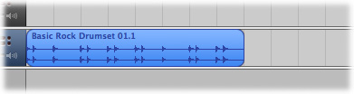
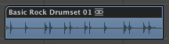
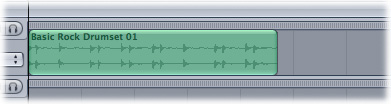
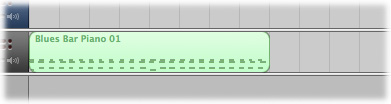
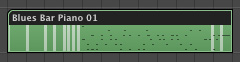
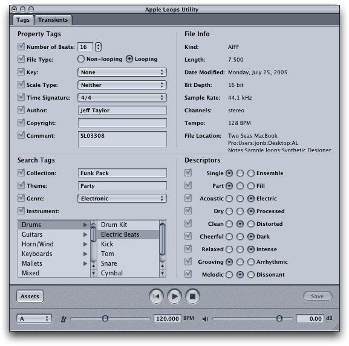
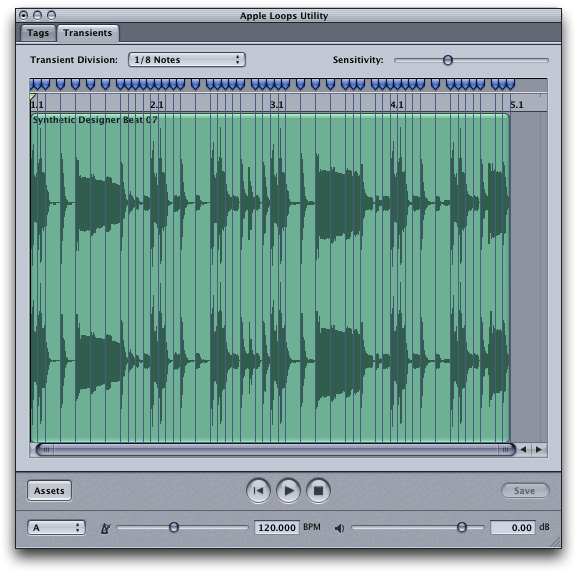

> 导航：[总目录](../../README.md) · [documentation](../../_indexes/documentation.md)

# Notes for Apple Loops Developers

An Apple Loop is a unique type of audio file that offers several advantages for searching and playback compared to standard audio files. Apple Loops are supported by the full range of Apple audio creation applications: Logic Pro, Logic Express, Soundtrack Pro, and GarageBand.

This document provides information about Apple Loops for audio content developers who may have a large collection of audio files they wish to convert to the Apple Loop format, or who are creating new Apple Loops for distribution to others.

Apple Loops are AIFF format audio files that contain uncompressed PCM audio data. You can use them in any audio application that supports AIFF files. Apple Loops can also contain additional information (metadata) that Apple audio creation applications can use for various purposes, including searching and indexing, time stretching, transposition, sound generation, and playback.

Apple Loops support two types of metadata: tags and transients. Certain tags combined with transients allow an audio creation application to optimize playback. Other tags let the user of an audio creation application run finely-targeted searches in a large loop library.

An Apple Loop can be a Real Instrument Apple Loop or a Software Instrument Apple Loop.

A Real Instrument Apple Loop (RIAL) contains uncompressed PCM audio data. It can also contain tags and transients. When imported into a Apple audio creation application, a RIAL appears as a rectangle displaying the audio waveform.

__Figure 1-1__  Real Instrument Apple Loop in GarageBand

__Figure 1-2__  Real Instrument Apple Loop in Logic

__Figure 1-3__  Real Instrument Apple Loop in Soundtrack Pro

A Software Instrument Apple Loop (SIAL) contains the same information as a RIAL and, in addition, MIDI data and software instrument and plug-in settings. When a SIAL is imported into GarageBand or Logic, the MIDI information is added to a software instrument track and the instrument and effects plug-in settings are loaded onto the channel strip for that track.

__Figure 1-4__  Software Instrument Apple Loop in GarageBand

__Figure 1-5__  Software Instrument Apple Loop in Logic Pro

When you import a SIAL into Soundtrack Pro, it appears as a RIAL. The application uses only the audio and metadata and ignores the MIDI, instrument, and plug-in data. (You can also import a SIAL as a RIAL into Logic or GarageBand to reduce the audio processing required for playback.)

An Apple Loop can have one of two file types: Looping or Non-looping. You set the file type for a loop using the Apple Loops Utility. See [Setting the File Type Tag](#apple-f4xwc4dqnrsv64tfmyxwi33df52wszbpjzxxizltn5xectcvfvjvomi).

- Loops that have musical content, especially repeatable musical patterns, are usually tagged as looping. These loops contain the transients that an Apple audio creation application uses to match the tempo and key of the loop to the project tempo and key during playback.
- Loops with no musical content (including sound effects, background sounds, and spoken dialogue) usually don’t repeat and are tagged as non-looping. These loops do _not_ contain transients and cannot be repeated or "looped." But they can still contain metadata tags that can optimize searching in an audio creation application. (A non-looping file is called a "one-shot" in GarageBand and Logic).

In general, Apple Loops tagged as looping are intended for music composition and arranging, while those tagged as non-looping are intended to add one-time or intermittent sounds to soundtracks or other projects.

The Apple Loops Utility lets you create and edit audio file metadata (tags and transients). The _Apple Loops Utility User Manual_ describes the features of this program in detail. It is available from the Help menu of the Apple Loops Utility. Please refer to this document for operational details.

You create and edit media tags for an audio file in the Tags pane of Apple Loops Utility. This pane is divided into four sections. In three of the sections, you edit property tags, search tags, and descriptor tags. In the fourth section, you can view read-only information about the file.

__Figure 1-6__  Tags Pane

You can add tags to AIFF or WAV format audio files. You can also add or edit tags to Apple Loops created with Logic or GarageBand. (The Apple Loops Utility does not currently support editing Core Audio Format files.)

You add and edit transients for an audio file in the Transients pane of the Apple Loops Utility.

__Figure 1-7__  Transients Pane

When you save a file after editing tags or transients, the file is saved as an Apple Loop in the AIFF format. A WAV file is converted to an AIFF file with the same filename as the original WAV file .

Note that the Apple Loops Utility lets you modify the tags of many audio files at the same time. See the section “Tagging Multiple Files” in the _Apple Loops Utility User Manual_.

Optimizing an audio file for playback includes two related operations in the Apple Loops Utility: correctly setting certain Property tags and adding, deleting, and editing transient markers.

The relevant Property tags are:

- File Type
- Number of Beats
- Key
- Time Signature

Setting these tags appropriately and fine-tuning the transients in a loop can optimize the playback sound in any Apple audio creation application (Logic Pro, Logic Express, GarageBand, or Soundtrack Pro).

The File Type tag determines if an application treats a file as a looping or non-looping file. Looping files are matched to the project tempo and key— if the Key tag is set to a value other than None. Non-looping files are not matched to the project tempo or key. (Untagged files added to a project are treated as non-looping.)

In most cases, you should tag files with musical passages featuring pitched musical instruments or voices or with rhythmic patterns as Looping. You should usually tag files with non-rhythmic elements, such as single drum beats or cymbal hits, sound effects, voiceovers and dialogue, or very long audio files, as Non-looping.

The Number of Beats tag controls how an application matches the tempo of a loop to the project tempo during playback. The value of the tag reflects the number of beats the musical phrase recorded in the loop contains, based on the beat value set in the Time Signature tag.

When you open a loop in Apple Loops Utility for the first time, the utility sets a default value for the number of beats, based on the length of the file. Apple Loops Utility sets a default value for the number of beats using the following two assumptions:

- The number of beats in the loop is a power of 2 (for example, 2,4, 8, 16, 32, or 64).
- The tempo of the loop is between 75 and 150 bpm (beats per minute).

In most cases, using these assumptions results in the correct value being set for the number of beats. However, if the number of beats recorded in the file is not a power of 2, or if the tempo is outside the 75–150 bpm range, the default setting for the number of beats will likely be incorrect. You should change the value for the Number of Beats tag in the Apple Loops Utility.

To determine if the default number of beats is correct:

- Play the loop against a straight 4/4 drum track in the same tempo. If the two files sound out of sync, it usually means that the number of beats is not a power of 2. If this is the case, count the number of beats against the drum track to determine the correct value.
- If the tempo of the loop is outside the default tempo range, the loop plays in sync with the beat, but either at half the tempo (if it is recorded at a tempo slower than 75 bpm) or at double the tempo (if it is recorded at a tempo faster than 150 bpm). If the loop's tempo is faster than 150 bpm, set the number of beats to double the default value. If the loop's tempo is slower than 75 bpm, set the number of beats to half the default value.

Because there is a direct relationship between the tempo of a loop and the number of beats it contains, changing the value of the Number of Beats tag causes the tempo value shown in the File Info area to change.

For example, consider a 4/4 loop recorded at a tempo of 160 bpm. If the loop is four measures long, Apple Loops Utility incorrectly sets the value for Number of Beats to 8, as though the loop were two measures long rather than four. If you add the loop to a project with a 120 bpm project tempo, it sounds too fast (and actually plays back at 240 bpm). If you change the value of the Number of Beats tag to 16 (the correct value, since 4 measures times 4 beats per measure equals 16 beats) the loop plays at the correct tempo.

Sometimes users may set drum patterns or other loops to play back at half or double their original tempo for an interesting musical effect. However, the Number of Beats tag should always reflect the original tempo at which the loop was recorded. Knowing the original tempo, advanced users can adjust to the tempo of a loop to achieve the sound they want in a particular situation.

The Key tag controls how an application matches the key (or pitch) of a loop to the project key during playback. When a loop is added to a project, the application matches the key of the loop, as set in the Key tag, to the project key, transposing the loop by the required number of semitones (half steps) between the two keys. The loop is transposed either up or down, whichever direction requires the smallest number of semitones. For example, if the project key is A, and a given loop has the Key tag set to F#/Gb, Soundtrack Pro transposes the loop up by three semitones, not down by nine semitones (although either would put the loop in the project key).

You should set the Key tag to the root note (tonic) of the loop. Most loops featuring musical instruments (other than drums and percussion) are recorded in a definite key, and the root note or chord is often emphasized in the loop. In some cases, the root may be ambiguous or the loop may contain a musical passage with no clear root. In these cases, set the Key tag to the most prominent note or chord in the loop.

For example, a piano loop might contain only the V (dominant) chord of a progression but not the I (tonic or root) chord. In this case, set the key to the root of the V chord. If a loop contains both the IV and V chords of a progression, determine which of the two chords is more prominent or emphasized in the loop. If the loop is part of a set of loops that are meant to be used together, set the Key tag to the root note even if some loops emphasize other chords or notes, so that the loops will play in the same key when used together.

Apple audio creation applications use a combination of transposition and tempo stretching to match loops to the project key. They perform pitch transposition by playing back the samples of a loop faster (to raise the pitch) or slower (to lower the pitch). This is the same technique used to transpose samples in wavetable-based synthesizers and other electronic instruments. Because this technique changes the tempo of the loop, applications use time stretching or time compressing algorithms to match the changed tempo to the current project tempo.

Using this type of pitch transposition can cause formant shifting, which can sometimes create audible distortion in the loop during playback. This distortion is much more noticeable with sampled acoustic instruments than with electronically generated sounds. Formant shifting changes the tone color (or "timbre") of a loop at different points during playback, and can be audible as a "warbling" sound as the tempo at which the file is played back increases and decreases.

When loops meant to be played in sequence have different values set in the Key tag, the amount of formant shifting is different for each loop, causing the tone color of each loop to sound different from the others. This means the loops do not sound consistent when played in sequence.

Other types of loops for which setting the correct Key tag value can create unusual situations include loops that have a key change, and loops not recorded in a definite key. For loops involving a key change, set the Key tag to the key that applies to the largest part of the loop. Listen to the loop and determine which key applies to most of the loop. For loops without a definite key—such as those with chromatic melodies or with slides, falls, or stabs that do not begin or end on a definite pitch—determine whether a particular key is most appropriate for the loop (for instance, if the loops are part of a series that includes loops with a definite key). If no key seems more appropriate than another, set the Key tag to None.

A Time Signature tag includes two pieces of information: the number of beats in each measure (the upper number in the time signature) and the note length used for each beat (the lower number).

Apple audio creation applications use the number of beats in a measure to display the measure and beat positions in the Beat ruler, but this value does not affect playback. However, the note length of a beat can affect playback. By default, Soundtrack Pro assumes that the beat value is 4, and that each quarter note gets a beat. GarageBand and Logic also assume the beat value is 4 if no other information is available. If you use a loop with a beat value of 8 (the other available beat value) rather than 4, the loop plays back at the wrong tempo. You need to set the Time Signature tag to correctly indicate the beat value.

Transients are spikes of high energy in a sound file. Transient markers are metadata in an Apple Loop that indicate the presence of a transient. Two controls in Apple Loops Utility determine the default placement of transient markers in a loop: the Transient Division pop-up menu and the Sensitivity slider. (For information on using these features, see "Working With Transients" in the Apple Loops Utility User Manual.)

When you open an audio file in the utility for the first time, the Transient Division pop-up menu is set to 1/16 notes, and the Sensitivity slider is set to a minimum value. In many cases, you can find the optimal placement of transient markers by adjusting these controls, without needing to add or adjust individual markers.

In general, an effective technique for improving playback is to refine the placement of transient markers by listening to the loop at its original tempo and pitch. Then listen at a different tempo and key see how the change in tempo affects playback. Repeat this procedure as you add and adjust markers to work towards optimum playback.

As you work with transient markers, keep the following guidelines in mind:

- Add a transient marker wherever a transient exists in the audio recorded in the file. In most cases, this means a marker should be placed at the beginning of every note, and at the end of every note except when the note decays quickly (for example, with drum beats and other short percussion sounds).
- Where the loop contains sustained notes or chords, add transient markers so that there is no period of time greater than a quarter note without a marker. During playback, applications speed up or slow down the tempo of a loop in areas where no transient markers exists. Adding transient markers to sustained notes and chords improves the sound of the loop by ensuring that these parts of the loop play back at the loop's original tempo.
- Add a transient marker at points of musical significance other than the beginning and end of notes. For example, if the loop includes a pitch bend or a glissando, place markers at the beginning and end of the pitch bend.
- Use the fewest number of transient markers necessary to conform to these guidelines. The audio processing an application performs to match a loop's tempo and key can introduce distortion at the transition points between transient markers—where the tempo is unchanged—and the areas between transient markers—where the tempo is altered.
- To determine that transient markers are placed accurately in a loop, listen to the loop as you view the file's waveform in the Transients pane. Observe the placement of transient markers in the waveform display and make sure a marker exists at each peak in the waveform as well as at the points recommended in these guidelines.

Each Apple audio creation application provides an interface that allows users to search for loops using keywords for genre, instrument, mood, and other descriptors. Users can also perform text searches for loops with matching filenames.

In GarageBand and Logic, this interface is called the Loop Browser; in Soundtrack Pro, it is the Search tab.

- In GarageBand, users who have installed one or more Jam Packs or third-party loop libraries can choose to show only certain loops in the Loop Browser. They can choose to show only the loops included with GarageBand, only those from a particular Jam Pack or third-party library, only user-created loops, or all loops.
- In Soundtrack Pro, users can use the file path as well as the filename when performing text searches. The Search field in the Search tab narrows search results to files for which the filename or file path that contain the matching text. Because Search uses the file path as well as the filename, the organization of loop libraries, particularly folder names, is important. As you organize loops into folders, keep in mind that the folder names can be used for searching. (The Search functions in Logic and GarageBand use only the file's name, not the path.)

The following tags are relevant for user searches:

- Scale Type
- Time Signature
- Genre
- Instrument
- Descriptors

Music uses a variety of scale types. The main scale types are the major and minor scale. Musical phrases in the same key (that is, with the same root note), but using different scale types, may not sound appropriate together. For example, a loop with a bass line in the key of C and another loop with a guitar chord progression also in the key of C, may not work together if the bass loop uses the C major scale and the guitar loop uses the C minor scale.

The Scale Type tag identifies which scale type the music recorded in the loop uses. The choices are Major, Minor, Good for Both, and Neither. Logic, GarageBand, and Soundtrack Pro users can restrict their search results to loops using a particular scale type.

Some loops contain music that uses neither the major nor the minor scale. For loops containing passages that can work in either scale–such as pentatonic scales, I–V (tonic-dominant) bass lines, power chords, and passages which do not contain the third of the I chord—set the Scale Type to Good for Both. For percussion loops, loops containing atonal melodies, and loops with music based on another scale or mode, set the Scale Type to Neither.

The Scale Type tag serves only to identify files when searching. It has no effect on the sound of the loop. Changing a Scale Type tag does not change the actual scale in the music recorded in the loop.

A Time Signature tag includes two pieces of information: the number of beats in each measure (the upper number in the time signature) and the note length used for each beat (the lower number).

Apple audio creation applications use the number of beats in a measure to display the measure and beat positions in the Beat ruler. As well, users of audio creation applications can search for loops with a particular time signature.

The Genre tag defines the type or style of music recorded in the loop.

The searchable list of musical genres is general and is not meant to be all-inclusive. It provides a workable set of musical categories that covers most cases. The list is not editable.

A two-column list lets you specify the Instrument tag for a loop. The left column contains instrument categories. The right column displays particular instruments in the selected category.

Descriptor tags are keywords that define the mood or feeling, or other characteristics of the music in a loop. Descriptor tags are an important aid for users searching for a particular type of loop, so take care to specify them appropriately.

In the Descriptors area of the Tags pane, each pair of descriptor keywords has three buttons. The left button selects the left word in the pair; the right button selects the right word; and the the middle button (the default setting) selects neither keyword.

Some tags are not relevant to user searches, but do provide information of interest to audio content developers.

The Author and Copyright tags provide content developers with a place to identify the author of the file and the copyright information for the file. This information appears in the appear in the Metadata area of the Details tab when a file is selected and in the Metadata area of the Project tab when a file is opened in the Audio File Editor.

The Comment field provides content developers with a place to include additional text comments about the audio file. Comments appear in Soundtrack Pro in the Description field in the Metadata area of the Details tab when a file is selected and in the Description field in the Metadata area of the Project tab when a file is opened in the Audio File Editor. Comments also appear when you open the file in the Apple Loops Utility. Comments don’t appear in other applications.

The Collection and Theme tags let you specify information you can use to search through your own loop libraries with the Apple Loops Utility. Currently, this metadata is not available for searching from any of the Apple audio creation applications.

You can use the Collection tag to specify collections such as “Funk Pack” or “Mood Pack.”

You can use the Theme tag to specify themes such as “Wedding” or “Party.”

The File Info section of the Tags pane in the Apple Loops Utility displays a variety of information about an audio file. (This information is read only and cannot be edited.)

- Kind: The file format, which can be either AIFF or WAV.
- Length: The length of the file in seconds.
- Date Modified: The most recent date when the file was modified.
- Bit depth: The number of bits in each recorded audio sample.
- Sample Rate: The original sample rate at which the file was recorded.
- Channels: The number of audio channels the file contains, either Mono or Stereo.
- Tempo: The original tempo at which the file was recorded.
- File Location: The file path

If you modify a loop (for example if you shorten it, resample it at a different sample rate, or convert it to a different file type), the new information appears the next time you open the loop in the Apple Loops Utility.

