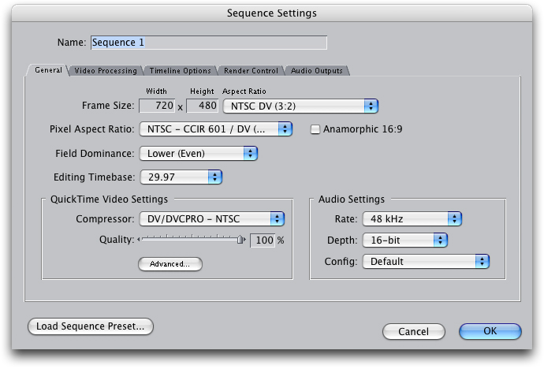
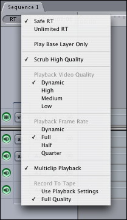
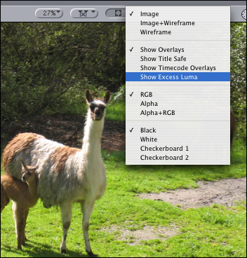

> 导航：[总目录](../../../README.md) · [documentation](../../../_indexes/documentation.md)


[Next](Document%20Revision%20History.md)

# Rendering FXPlug Effects in Final Cut

Rendering scenarios in Final Cut can change from moment to moment—shifting dynamically, for example, from high quality Real Time rendering to medium quality Real Time rendering, and then back again. This is the result of the core design of Final Cut—where image processing takes place on native video images exactly as they come out of the codec—and product evolution over time.

If you are creating an FxPlug effect running under Final Cut, you need to take these changing circumstances into account and structure your code accordingly so that your effect renders appropriately at all times.

This document describes Final Cut rendering scenarios where your FxPlug effect may need to adapt. It also specifies the relevant information from Final Cut that you can use to detect changing rendering circumstances.

This document does _not_ recommend particular strategies an effect might use to respond to a particular rendering scenario, since each effect may handle a particular scenario differently. For example, if an effect is running on a low-res proxy image in medium quality Real Time rendering, the general idea would be for the effect to adjust itself by the render scale to produce an image similar to what it would produce in full-res high-quality. In practice, this might mean that a blur would scale its kernel size by the render scale, a geometric effect would distort itself for half-height single fields, and a color corrector would do nothing.

Single-field images in Final Cut are not stretched to full-frame height. They are half the height of a full frame. Single-field images in Motion, on the other hand, _are_ stretched (line-doubled) to full-frame height. Your effect should handle both cases

You can use the -`upscalesFields` method in the FxHostCapabilities protocol to determine if single-field images are upscaled. This method returns a Boolean value: `TRUE` if the host application upscales single fields to full-frame dimensions; `FALSE` if the host application does not upscale single fields.

Also, because single-field images are half the height of full-frame images, their aspect ratios are adjusted as well. A single-field image in Final Cut has half the aspect ratio of the full frame. For example, a DV frame has an aspect ratio of 0.8888; a single DV field has an aspect ratio of 0.4444. Plugins that care about aspect ratio should be ready for this variation.

In general, the documentation for FxHostCapabilities in the FxPlug SDK spells out other differences between host applications.

The origin of an image in Final Cut is in the top-left corner. The origin of an image in Motion, on the other hand, is in the bottom-left corner. Your effect should handle both cases. You can use the `FxImageOrigin` enumeration defined in the header file `FxImage.h` to determine the orientation of an image and avoid rendering upside down. (You cannot simply assume one coordinate system or the other.)

```
enum {
   kFxImageOrigin_BOTTOM_LEFT = 0,
    kFxImageOrigin_TOP_LEFT = 2
};
typedef UInt32 FxImageOrigin;
```


Bitmaps in Final Cut have padded scanlines. FxPlug effects should use the -rowBytes accessor defined in FxBitmap.h to discover how many bytes are in each scanline of a bitmap. An effect should not overwrite any bytes in the padding of a scanline. In a single-field image, the padding may contain the other field of an interlaced frame.

During normal operation, your effect is called by Final Cut’s RT (RealTime) engine. The RT engine is responsible for updating the video displayed in the canvas window and on any external monitor. The RT engine is engaged during playback and during “scrubbing.”

In general, the RT engine renders images at their native resolution. This is because the same rendered frame is sent to both the canvas window and the external monitor. Even if the canvas is displaying only one field, or even if the canvas is not displaying the entire image due to zooming or panning, both fields of the image are rendered at 100% resolution.

The RT engine renders each field of an interlaced image individually. This is required since keyframed parameters may have different values in different fields.

The RT engine renders fields in temporal order: the temporally first field is rendered first, the temporally second field is rendered second.

There is an exception to these rules: if the RT engine drops to a lower quality, it may render at a lower resolution, or only render a single field, or both. (This is discussed in-depth in a later section.)

How does Final Cut call effects in a simple DV sequence? Here is an example.

DV NTSC footage has been added to a sequence created with the DV NTSC preset. Recall that the settings for DV NTSC are the following:



Now add an FxPlug filter effect to this item, and move the playhead to frame 5 of the sequence. The FxPlug filter is called to render twice: once for the first field of frame 5, and once for the second field of frame 5.

During the rendering process, the following information is available to the effect:

|  | FIrst Field | Second Field |
| --- | --- | --- |
| `renderInfo` |  |  |
| `frame` | `5.0` | `5.5` |
| `qualityLevel` | `kFxQuality_HIGH` | `kFxQuality_HIGH` |
| `fieldOrder` | `kFxFieldOrder_LOWER_FIRST` | `kFxFieldOrder_LOWER_FIRST` |
| `scaleX` | `1.0` | `1.0` |
| `scaleY` | `1.0` | `1.0` |
| `depth` | `kFxDepth_UINT8` | `kFxDepth_UINT8` |
| `inputImage` |  |  |
| -`-width` | `720` | `720` |
| `-height` | `240` | `240` |
| `-depth` | `8` | `8` |
| `-pixelAspect` | `0.444444` | `0.444444` |
| `-field` | `kFxField_LOWER` | `kFxField_UPPER` |
| `-fieldOrder` | `kFxFieldOrder_LOWER_FIRST` | `kFxFieldOrder_LOWER_FIRST` |
| `output` |  |  |
| -`-width` | `720` | `720` |
| `-height` | `240` | `240` |
| `-depth` | `8` | `8` |
| `-pixelAspect` | `0.444444` | `0.444444` |
| `-field` | `kFxField_LOWER` | `kFxField_UPPER` |
| `-fieldOrder` | `kFxFieldOrder_LOWER_FIRST` | `kFxFieldOrder_LOWER_FIRST` |

Note these general points:

- The input and output images are full-frame width, but half-frame height.
- The images’ aspect ratios have been divided by two.
- The temporally first field is rendered first.

When Final Cut renders the second field, the information is identical except that the frame number is been incremented by 0.5 because this is the temporally second field. The input and output images are now marked as the upper field of the frame.

Effects that pay attention to frame numbers should not be surprised to receive fractional frame numbers on interlaced sequences.

In some circumstances, sequences cannot play back in realtime on all machines. When this happens, the RT engine can adjust quality in several ways in order to maintain reasonable playback performance.

The RT menu in the timeline provides various options that let the user control RT performance. The “Playback Video Quality” section of the menu is the most interesting for FxPlug developers.



The setting for Playback Video Quality is passed as a hint to the codec when video is decompressed during playback. Depending on this setting, the codec may produce a smaller image at lower quality, or only decompress one field instead of an interlaced frame. The actual behavior is up to the codec.

In general, medium quality is half the resolution of high quality, and low quality (if the codec supports it) is one fourth the resolution of high quality.

By default, Playback Video Quality is set to Dynamic. This means that the RT engine, in order to maintain the frame rate, adjusts quality _during playback_. If the RT engine cannot maintain playback at high quality, it shifts to medium quality—and then may shift back to high quality subsequently if it detects that it can.

_The key point is this: your effect should be ready for quality changes in the middle of playback._ You should not assume that image dimensions and renderInfo.scale will be constant from one frame to another.

Also note that by default, the RT engine is set to “Scrub High Quality.” This means that rendering may drop to a lower quality during playback.

In “Safe RT” mode, the RT engine only renders effects during playback if it has profiled these effects and knows how fast they can render. Since the RT engine cannot profile third-party effects, including FxPlug effects, these effects are not rendered during playback in Safe RT mode. (Unprofiled effects are rendered during scrub.)

To display rendered FxPlug effects during playback, the Final Cut user must switch to the Unlimited RT setting. In this mode, the RT engine attempts to render everything as quickly as possible. (If the playback quality is set to Dynamic, the RT engine may degrade playback quality in order to maintain playback speed.)

__Tip__: To test your filter at lower quality settings, change the video playback quality to “Medium” or “Low” and turn “Scrub High Quality” off. In your render method, your plug-in should respond appropriately to changes in renderInfo.scale.

In the same DV sequence as Example 1, let’s switch the Playback Video Quality to Medium, turn off “Scrub High Quality,” and render frame 5 again. With Medium quality, the DV NTSC codec produces 360 x 240 progressive frames. By throwing away the temporally second field, and half of the pixels in the temporally first field, the codec greatly reduces the time needed to decompress a frame. This helps speed up playback.

|  | High Quality | Medium Quality |
| --- | --- | --- |
| `renderInfo` |  |  |
| `frame` | `5.0` | `5.0` |
| `qualityLevel` | `kFxQuality_HIGH` | `kFxQuality_MEDIUM` |
| `fieldOrder` | `kFxFieldOrder_LOWER_FIRST` | `kFxFieldOrder_LOWER_FIRST` |
| `scaleX` | `1.0` | `0.5` |
| `scaleY` | `1.0` | `0.5` |
| `depth` | `kFxDepth_UINT8` | `kFxDepth_UINT8` |
| `inputImage` |  |  |
| -`-width` | `720` | `360` |
| `-height` | `240` | `240` |
| `-depth` | `8` | `8` |
| `-pixelAspect` | `0.444444` | `0.888888` |
| `-field` | `kFxField_LOWER` | `kFxField_NONE` |
| `-fieldOrder` | `kFxFieldOrder_LOWER_FIRST` | `kFxFieldOrder_LOWER_FIRST` |
| `output` |  |  |
| -`-width` | `720` | `360` |
| `-height` | `240` | `240` |
| `-depth` | `8` | `8` |
| `-pixelAspect` | `0.444444` | `0.444444` |
| `-field` | `kFxField_LOWER` | `kFxField_NONE` |
| `-fieldOrder` | `kFxFieldOrder_LOWER_FIRST` | `kFxFieldOrder_PROGRESSIVE` |

The filter is only called to render once per frame. The right row of the table (MEDIUM QUALITY) displays the information passed to the filter. Note how this differs from rendering in high quality:

- The renderInfo’s scaleX and scaleY are set to 0.5.
- The input and output dimensions are half of the full resolution. (This matches the renderInfo.scale values.)
- The input and output images are set to kFxField_NONE.
- The output image is set to kFxFieldOrder_PROGRESSIVE.

The DV codec returns the same result for low quality as for medium quality. For an example a situation where low quality is different than medium quality, try one of the 1080i settings.

In addition to the RT engine, Final Cut has another display path which is sometimes used to draw video to the canvas window and external devices. This display path predates the RT engine, and is used for certain display options which aren’t supported by the RT display path. These options include:

- Show Excess Luma or Chroma.
- Display White or Checkerboard background.
- View individual channels (red, green, blue, or alpha).
- Use the Animation codec (specified in Sequence settings) rather than the DV codec.

Unlike the RT engine, the Non-RT display path does not display the same image in both the canvas window and the external monitor. When updating a frame, the Non-RT engine renders an image for display in the window, and then renders another image later to send to the external monitor. The external monitor is updated at idle time, so if you are scrubbing quickly you may notice that the canvas window updates more frequently than the external device.

When the Non-RT display path renders an image for the canvas window, it renders only what will be visible in the window. If a single field is being displayed in the window, the Non-RT path does not render both fields. If the window is zoomed so that the image in the window is smaller than the actual frame size, the Non-RT path renders a scaled-down version of the frame.

__Note__: the Non-RT path has another quirk. If the canvas is set to “Show as Square Pixels” (the default), the Non-RT path renders a frame that is horizontally scaled by the aspect ratio and that is marked as having an aspect ratio of 1.0. This is in keeping with the approach of rendering just what is displayed in the canvas window. Currently, the FxPlug rendering code stretches the image horizontally to undo this, so FxPlug effects do not need to handle this case.

To create an example using the Non-RT rendering path, you can turn on “Show Excess Luma:”



With the canvas window set to 87% of scale, frame 5 now renders with the Non-RT path, which returns the following information:

|  | RT Rendering | Non-RT Rendering |
| --- | --- | --- |
| `renderInfo` |  |  |
| `frame` | `5.0` | `5.0` |
| `qualityLevel` | `kFxQuality_HIGH` | `kFxQuality_HIGH` |
| `fieldOrder` | `kFxFieldOrder_LOWER_FIRST` | `kFxFieldOrder_LOWER_FIRST` |
| `scaleX` | `1.0` | `0.87` |
| `scaleY` | `1.0` | `0.87` |
| `depth` | `kFxDepth_UINT8` | `kFxDepth_UINT8` |
| `inputImage` |  |  |
| -`-width` | `720` | `626` |
| `-height` | `240` | `417` |
| `-depth` | `8` | `8` |
| `-pixelAspect` | `0.444444` | `0.888889` |
| `-field` | `kFxField_LOWER` | `kFxField_NONE` |
| `-fieldOrder` | `kFxFieldOrder_LOWER_FIRST` | `kFxFieldOrder_LOWER_FIRST` |
| `output` |  |  |
| -`-width` | `720` | `626` |
| `-height` | `240` | `417` |
| `-depth` | `8` | `8` |
| `-pixelAspect` | `0.444444` | `0.888889` |
| `-field` | `kFxField_LOWER` | `kFxField_NONE` |
| `-fieldOrder` | `kFxFieldOrder_LOWER_FIRST` | `kFxFieldOrder_PROGRESSIVE` |

There are several differences here. The most noticeable is that the image is smaller than DV size because the canvas window is set to 87% scale. As a result, renderInfo has a scale of 0.87, and the input and output dimensions are 87% of DV size.

Another difference: because the canvas window is not at 100% zoom, the Non-RT path only renders and displays one field.

__IMPORTANT:__ When you use the non-RT path, you may see some incorrect field order values associated with the input image. In the example here, the field order should be kFxFieldOrder_PROGRESSIVE. To avoid problems, you should only use the field order values from the output image.

If there is an external device connected, the FxPlug filter is called again to render the image for this external device. In this case, the information sent to the filter is easily understandable: the frame is DV size at 100% scale, both fields are rendered, and so on.

Mixed-format timelines have items that are in a format different from the timeline format. Common examples would be SD footage in an HD sequence, or a still image in a sequence.

The RT engine and the Non-RT engine handle mixed formats differently. When an effect is applied to a mixed format timeline, its render method is called one way for RT scrubbing and playback and another way for a movie. In the RT rendering engine, all items are scaled to sequence size before the effect is applied. In Non-RT rendering, the effect is applied to the item at its native resolution.

You can use the renderInfo.scale value to detect when an item is being scaled for RT display. However, this value is not set in the way you might expect.

Consider a 720p item in a DV NTSC sequence. In RT, the following information is sent:

|  |  |
| --- | --- |
| `renderInfo` |  |
| `scaleX` | `1.000000` |
| `scaleY` | `1.000000` |
| `inputImage` |  |
| `-width` | `720` |
| `-height` | `202` |
| `output` |  |
| `-width` | `720` |
| `-height` | `202` |

When the sequence is rendered, the following information is sent:

|  |  |
| --- | --- |
| `renderInfo` |  |
| `scaleX` | `1.777778202` |
| `scaleY` | `1.777778` |
| `inputImage` |  |
| `-width` | `1280` |
| `-height` | `360` |
| `output` |  |
| `-width` | `1280` |
| `-height` | `360` |

Note that in RT, the HD image is scaled to fit into a DV frame. The width / height aspect is maintained, so the (single-field) image is scaled to 720 x 202; this is to fit inside the 720 x 240 DV field.

In Non-RT rendering, the HD image is at full resolution. The scale value is set to a number greater than 1.0. This tells the effect that the image will be scaled down after render to fit into the sequence.

[Next](Document%20Revision%20History.md)

