> 导航：[总目录](../../../README.md) · [documentation](../../../_indexes/documentation.md) · [Safari Web Content Guide](Developing%20Web%20Content%20for%20Safari.md)


[Next](Customizing%20Style%20Sheets.md)[Previous](Optimizing%20Web%20Content.md)

# Configuring the Viewport

Safari on iOS displays webpages at a scale that works for most web content originally designed for the desktop. If these default settings don’t work for your webpages, it is highly recommended that you change the settings by configuring the viewport. You especially need to configure the viewport if you are designing webpages specifically for iOS. Configuring the viewport is easy—just add one line of HTML to your webpage—but understanding how viewport properties affect the presentation of your webpages on iOS is more complex. Before configuring the viewport, you need a deeper understanding of what the visible area and viewport are on iOS.

If you are already familiar with the viewport on iOS, read [Using the Viewport Meta Tag](#apple-f4xwc4dqnrsv64tfmyxwi33df52wszbpkridimbqga3dkmbzfvjvomrw) for details on the viewport tag and [Viewport Settings for Web Applications](#apple-f4xwc4dqnrsv64tfmyxwi33df52wszbpkridimbqga3dkmbzfvjvomjz) for web application tips. Otherwise, read the sections in this chapter in the following order:

- Read [Safari on iOS Viewport](#apple-f4xwc4dqnrsv64tfmyxwi33df52wszbpkridimbqga3dkmbzfvjvomzs) to learn about the available screen space for webpages on small devices.
- Read [What Is the Viewport?](#apple-f4xwc4dqnrsv64tfmyxwi33df52wszbpkridimbqga3dkmbzfvjvomrv) for a deeper understanding of the viewport on iOS.
- Read [Default Viewport Settings](#apple-f4xwc4dqnrsv64tfmyxwi33df52wszbpkridimbqga3dkmbzfvjvomrx) and [Using the Viewport Meta Tag](#apple-f4xwc4dqnrsv64tfmyxwi33df52wszbpkridimbqga3dkmbzfvjvomrw) for how to use the viewport meta tag.
- Read [Changing the Viewport Width and Height](#apple-f4xwc4dqnrsv64tfmyxwi33df52wszbpkridimbqga3dkmbzfvjvomry) and [How Safari Infers the Width, Height, and Initial Scale](#apple-f4xwc4dqnrsv64tfmyxwi33df52wszbpkridimbqga3dkmbzfvjvomrz) to understand better how setting viewport properties affects the way webpages are rendered on iOS.
- Read [Viewport Settings for Web Applications](#apple-f4xwc4dqnrsv64tfmyxwi33df52wszbpkridimbqga3dkmbzfvjvomjz) if you are designing a web application for iOS.

See [Supported Meta Tags](https://developer.apple.com/library/archive/documentation/AppleApplications/Reference/SafariHTMLRef/Articles/MetaTags.html#//apple_ref/doc/uid/TP40008193) for a complete description of the viewport meta tag.

The viewport on the desktop and the viewport on iOS are slightly different.

Safari on iOS has no windows, scroll bars, or resize buttons as shown on the right in Figure 3-1. The user pans by flicking a finger. The user zooms in by double-tapping and pinch opening, and zooms out by pinch closing—gestures that are not available for Safari on the desktop. Because of the differences in the way users interact with web content, the viewport on the desktop and on iOS are not the same. Note that these differences between the viewports may affect some of the HTML and CSS instructions on iOS.

__Figure 3-1__  Differences between Safari on iOS and Safari on the desktop

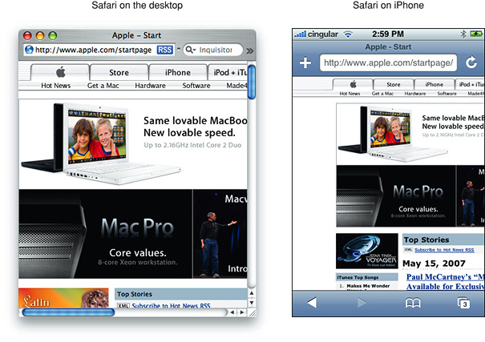

The viewport on the desktop is the visible area of the webpage as shown in Figure 3-2. The user resizes the viewport by resizing the window. If the webpage is larger than the viewport, then the user scrolls to see more of the webpage. When the viewport is resized, Safari may change the document’s layout—for example, expand or shrink the width of the text to fit. If the webpage is smaller than the viewport, it is filled with white space to fit the size of the viewport.

__Figure 3-2__  Safari on desktop viewport

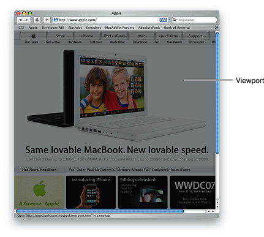

For Safari on iOS, the viewport is the area that determines how content is laid out and where text wraps on the webpage. The viewport can be larger or smaller than the visible area.

When the user pans a webpage on iOS, gray bars appear on the right and bottom sides of the screen as visual feedback to show the user the size of the visible area as compared to the viewport (similar to the length of scroll bars on the desktop). Using the double tap, pinch open, and pinch close gestures, users can change the scale of the viewport but not the size. The only exception is when the user changes from portrait to landscape orientation—under certain circumstances, Safari on iOS may adjust the viewport width and height, and consequently, change the webpage layout.

You can set the viewport size and other properties of your webpage. Mostly, you do this to improve the presentation the first time iOS renders the webpage.

Safari on iOS sets the size and scale of the viewport to reasonable defaults that work well for most webpages, as shown on the left in Figure 3-3. The default width is 980 pixels. However, these defaults may not work well for your webpages, particularly if you are tailoring your website for a particular device. For example, the webpage on the right in Figure 3-3 appears too narrow. Because Safari on iOS provides a viewport, you can change the default settings.

__Figure 3-3__  Default settings work well for most webpages

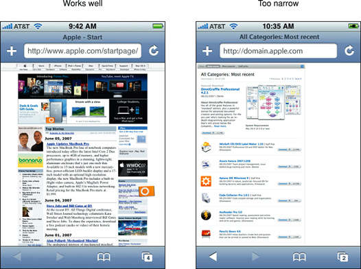

Use the `viewport` meta tag to improve the presentation of your web content on iOS. Typically, you use the `viewport` meta tag to set the width and initial scale of the viewport. For example, if your webpage is narrower than 980 pixels, then you should set the width of the viewport to fit your web content. If you are designing an iPhone or iPod touch-specific web application, then set the width to the width of the device. Refer to [Supported Meta Tags](https://developer.apple.com/library/archive/documentation/AppleApplications/Reference/SafariHTMLRef/Articles/MetaTags.html#//apple_ref/doc/uid/TP40008193) for a detailed description of the `viewport` meta tag.

Because iOS runs on devices with different screen resolutions, you should use the constants instead of numeric values when referring to the dimensions of a device. Use `device-width` for the width of the device and `device-height` for the height in portrait orientation.

You do not need to set every viewport property. If only a subset of the properties are set, then Safari on iOS infers the other values. For example, if you set the scale to `1.0`, Safari assumes the width is `device-width` in portrait and `device-height` in landscape orientation. Therefore, if you want the width to be 980 pixels and the initial scale to be 1.0, then set both of these properties.

For example, to set the viewport width to the width of the device, add this to your HTML file:

```
<meta name="viewport" content="width=device-width">
```

To set the initial scale to `1.0`, add this to your HTML file:

```
<meta name="viewport" content="initial-scale=1.0">
```

Use the Safari on iOS console to help debug your webpages as described in the _[Safari Web Inspector Guide](../Safari%20Web%20Inspector%20Guide/About%20Safari%20Web%20Inspector.md#apple-f4xwc4dqnrsv64tfmyxwi33df52wszbpkridimbqga3tqnzu)_. The console contains tips to help you choose viewport values—for example, it reminds you to use the constants when referring to the device width and height.

Typically, you set the viewport width to match your web content. This is the single most important optimization that you can do for iOS—make sure your webpage looks good the first time it is displayed on iOS.

The majority of webpages fit nicely in the visible area with the viewport width set to `980` pixels in portrait orientation, as shown in Figure 3-4. If Safari on iOS did not set the viewport width to `980` pixels, then only the upper-left corner of the webpage, shown in gray, would be displayed. However, this default doesn’t work for all webpages, so you’ll want to use the `viewport` meta tag if your webpage is different. See [Supported Meta Tags](https://developer.apple.com/library/archive/documentation/AppleApplications/Reference/SafariHTMLRef/Articles/MetaTags.html#//apple_ref/doc/uid/TP40008193) for more on `viewport`.

__Figure 3-4__  Comparison of 320 and 980 viewport widths

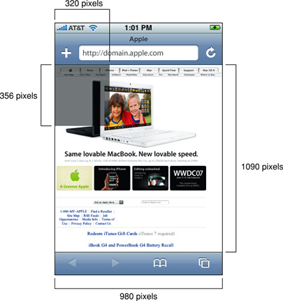

If your webpage is narrower than the default width, as shown on the left in Figure 3-5, then set the viewport width to the width of your webpage, as shown on the right in Figure 3-5. To do this, add the following to your HTML file inside the `<head>` block, replacing `590` with the width of your webpage:

```
<meta name="viewport" content="width=590">
```


__Figure 3-5__  Webpage is too narrow for default settings

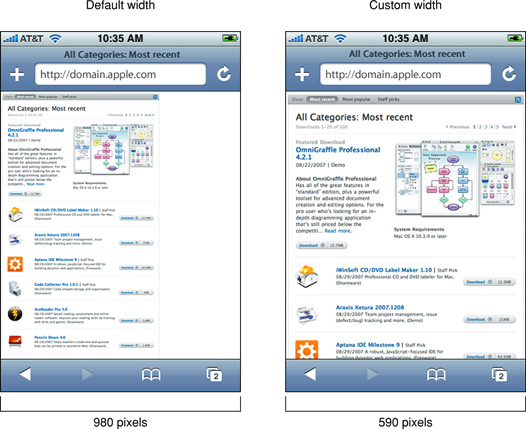

It is particularly important to change the viewport width for web applications designed for devices with smaller screens such as iPhone and iPod touch. Figure 3-6 shows the effect of setting the viewport width to `device-width`. Read [Viewport Settings for Web Applications](#apple-f4xwc4dqnrsv64tfmyxwi33df52wszbpkridimbqga3dkmbzfvjvomjz) for more web application tips.

__Figure 3-6__  Web application page is too small for default settings

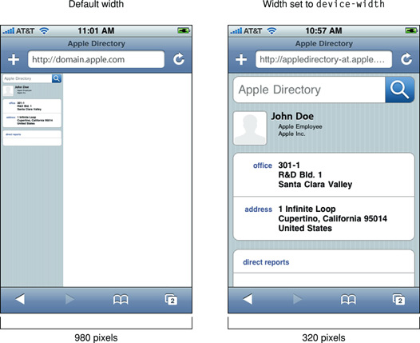

Similarly you can set the viewport height to match your web content.

If you set only some of the properties, then Safari on iOS infers the values of the other properties with the goal of fitting the webpage in the visible area. For example, if just the initial scale is set, then the width and height are inferred. Similarly, if just the width is set, then the height and initial scale are inferred, and so on. If the inferred values do not work for your webpage, then set more viewport properties.

Since any of the width, height, and initial scale may be inferred by Safari on iOS, the viewport may resize when the user changes orientation. For example, when the user changes from portrait to landscape orientation by rotating the device, the viewport width may expand. This is the only situation where a user action might resize the viewport, changing the layout on iOS.

Specifically, the goal of Safari on iOS is to fit the webpage in the visible area when completely zoomed out by maintaining a ratio equivalent to the ratio of the visible area in either orientation. This is best illustrated by setting the viewport properties independently, and observing the effect on the other viewport properties. The following series of examples shows the same web content with different viewport settings.

Figure 3-7 shows a typical webpage displayed with the default settings where the viewport width is 980 and no initial scale is set.

__Figure 3-7__  Default width and initial scale

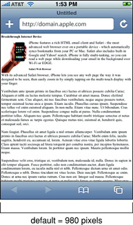

Figure 3-8 shows the same webpage when the initial scale is set to 1.0 on iPhone. Safari on iOS infers the width and height to fit the webpage in the visible area. The viewport width is set to `device-width` in portrait orientation and `device-height` in landscape orientation.

__Figure 3-8__  Default width with initial scale set to 1.0

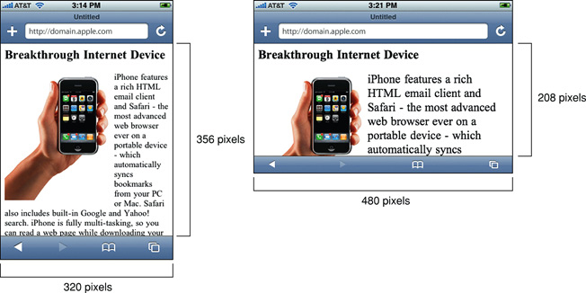

Similarly, if you specify only the viewport width, the height and initial scale are inferred. Figure 3-9 shows the rendering of the same webpage when the viewport width is set to 320 on iPhone. Notice that the portrait orientation is rendered in the same way as in [Figure 3-8](#apple-f4xwc4dqnrsv64tfmyxwi33df52wszbpkridimbqga3dkmbzfvjvomjq), but the landscape orientation maintains a width equal to `device-width`, which changes the initial scale and has the effect of zooming in when the user changes to landscape orientation.

__Figure 3-9__  Width set to 320 with default initial scale

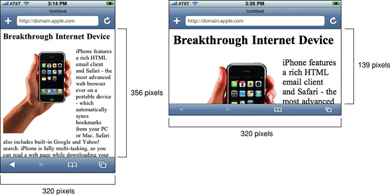

You can also set the viewport width to be smaller than the visible area with a minimum value of 200 pixels. Figure 3-10 shows the same webpage when the viewport width is set to 200 pixels on iPhone. Safari on iOS infers the height and initial scale, which has the effect of zooming in when the webpage is first rendered.

__Figure 3-10__  Width set to 200 with default initial scale

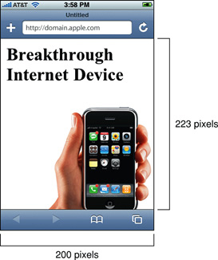

Finally, Figure 3-11 shows the same webpage when both the width and initial scale are set on iPhone. Safari on iOS infers the height by maintaining a ratio equivalent to the ratio of the visible area in either orientation. Therefore, if the width is set to 980 and the initial scale is set to 1.0 on iPhone, the height is set to 1091 in portrait and 425 in landscape orientation.

__Figure 3-11__  Width set to 980 and initial scale set to 1.0

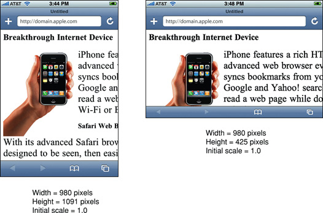

The `minimum-scale` and `maximum-scale` properties also affect the behavior when changing orientations. The range of these property values is from >0 to 10.0. The default value for `minimum-scale` is `0.25` and `maximum-scale` is `5.0`.

If you are designing a web application specifically for iOS, then the recommended size for your webpages is the size of the visible area on iOS. Apple recommends that you set the width to `device-width` so that the scale is 1.0 in portrait orientation and the viewport is not resized when the user changes to landscape orientation.

If you do not change the viewport properties, Safari on iOS displays your webpage in the upper-left corner as shown in Figure 3-12. Setting the viewport width should be the first task when designing web applications for iOS to avoid the user zooming in before using your application.

__Figure 3-12__  Not specifying viewport properties

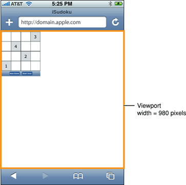

By setting the width to `device-width` in portrait orientation, Safari on iOS displays your webpage as show in Figure 3-13. Users can pan down to view the rest of the webpage if it is taller than the visible area. Add this line to your HTML file to set the viewport width to `device-width`:

```
<meta name="viewport" content="width=device-width">
```


__Figure 3-13__  Width set to device-width pixels


You may not want users to scale web applications designed specifically for iOS. In this case, set the width and turn off user scaling as follows:

```
<meta name = "viewport" content = "user-scalable=no, width=device-width">
```

[Next](Customizing%20Style%20Sheets.md)[Previous](Optimizing%20Web%20Content.md)

