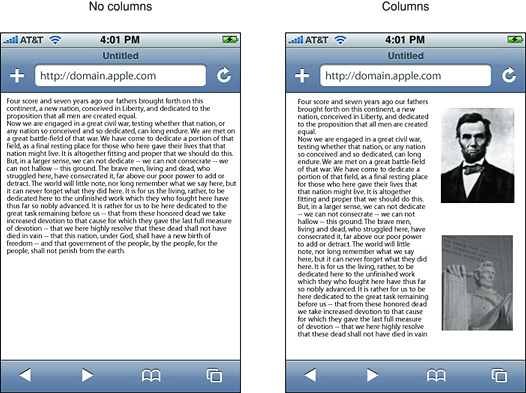
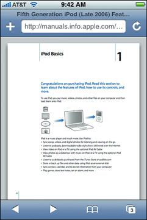

> 导航：[总目录](../../../README.md) · [documentation](../../../_indexes/documentation.md) · [Safari Web Content Guide](Developing%20Web%20Content%20for%20Safari.md)


[Next](Optimizing%20Web%20Content.md)[Previous](Developing%20Web%20Content%20for%20Safari.md)

# Creating Compatible Web Content

This chapter covers best practices in creating web content that is compatible with Safari on the desktop and Safari on iOS. Many of these guidelines simply improve the reliability, performance, look, and user experience of your webpages on both platforms. If your target is iOS, the first step is to get your web content working well on the desktop. If your target is the desktop, with minimal modifications, you can get your web content to look good and perform well on iOS too.

For example, you need to pay attention to the layout of your content and JavaScript performance on iOS. If you use conditional CSS, as recommended in [Optimizing Web Content](Optimizing%20Web%20Content.md#apple-f4xwc4dqnrsv64tfmyxwi33df52wszbpkridimbqga3dkmjxfvjvomi), your webpages optimized for iOS still work in other browsers. Read the rest of this document for how to optimize your web content for Safari.

The first design rule is to use web standards. Standards-based web development techniques ensure the most consistent presentation and functionality across all modern browsers, including Safari. A well-designed website probably requires just a few refinements to look good and work well on Safari.

The WebKit engine, shared by Safari on the desktop and Safari on iOS, supports all the latest modern web standards, including:

- HTML5
- CSS
- ECMAScript 6 (JavaScript)

The web is always evolving, and as it does, so does WebKit and Safari. You’ll want to keep informed of the evolving standards emanating from the Web Hypertext Application Technology Working Group (WHATWG) and World Wide Web Consortium (W3C) standards bodies. The WHATWG and W3C websites are a good place to start learning more about these standards and the upcoming HTML5:

- [www.whatwg.org](http://www.whatwg.org/)
- [www.w3.org](http://www.w3.org/)

Refer to Safari reference documents, such as _[Safari HTML Reference](../Safari%20HTML%20Reference/Introduction.md#apple-f4xwc4dqnrsv64tfmyxwi33df52wszbpkridimbqgazdanbz)_ and _[Safari CSS Reference](../Safari%20CSS%20Reference/Introduction%20to%20Safari%20CSS%20Reference.md#apple-f4xwc4dqnrsv64tfmyxwi33df52wszbpkridimbqgazdanjq)_, for availability of features on specific platforms.

You should follow well-established rules of good web design. This section covers a few basic rules that are critical for Safari. [Web Page Development: Best Practices](https://developer.apple.com/internet/webcontent/bestwebdev.html) for more general advice on designing webpages.

- Add a `DOCTYPE` declaration to your HTML files.

  Preface your HTML files with a `DOCTYPE` declaration, which tells browsers which specification to parse your webpage against. See [HTML Basics](HTML%20Basics.md#apple-f4xwc4dqnrsv64tfmyxwi33df52wszbpkridimbqgazdaobqfvjvomi) for how to do this.
- Separate your HTML, CSS, and JavaScript into different files.

  Your webpages are more maintainable if you separate page content into distinct files for mark-up, presentation, and interaction.
- Use well-structured HTML.

  You increase cross-platform browser compatibility by running your HTML files through a validator. You should fix common problems such as missing quotes, missing close tags, incorrect nesting, incorrect case, and malformed doctype. See [http://validator.w3.org](http://validator.w3.org/) or use the validator provided by your web development tools.
- Be browser independent.

  Use feature detection to determine if a browser supports a particular object, property, or method. Read [Detecting WebKit with JavaScript](http://trac.webkit.org/projects/webkit/wiki/DetectingWebKit) to learn how to detect specific WebKit versions. Also use the W3C standard way of accessing page objects—that is, use getElementByID("elementName"). Only as a last resort, use the user agent string as described to detect Safari on iOS.

Read [HTML Basics](HTML%20Basics.md#apple-f4xwc4dqnrsv64tfmyxwi33df52wszbpkridimbqgazdaobqfvjvomi) and [CSS Basics](CSS%20Basics.md#apple-f4xwc4dqnrsv64tfmyxwi33df52wszbpkridimbqga2tanbrfvjvomi) for how to write structured HTML and add CSS to existing HTML.

Safari on all platforms uses the same SSL implementation to provide end-to-end security. The same encryption that prevents listening on the wire is just as secure when used in a wireless situation, whether through Wi-Fi, 3G, or EDGE. Specifically, Safari supports:

- SSL 2, SSL 3, and TLS with many popular cipher suites
- RSA keys up to 4096
- HTTPS

To be compatible with iOS, use columns and blocks to lay out your webpage like many online newspapers. This makes your webpage more readable and also works better with double-tap to zoom on iOS.

Text blocks that span the full width of the webpage are difficult to read on iOS as shown on the left in Figure 1-1. Columns not only break up the webpage, making it easy to read, as shown on the right in Figure 1-1, but allow the user to easily double-tap objects on the page.

__Figure 1-1__  Comparison of no columns vs. columns



When the user double-taps a webpage, Safari on iOS looks at the element that was double-tapped, and finds the closest block (as identified by elements like `<div>`, `<ol>`, `<ul>`, and `<table>`) or image element. If the found element is a block, Safari on iOS zooms the content to fit the screen width and then centers it. If it is an image, Safari on iOS zooms to fit the image and then centers it. If the block or image is already zoomed in, Safari on iOS zooms out.

Your webpage works well with double-tapping if you use columns and blocks. Read [CSS Basics](CSS%20Basics.md#apple-f4xwc4dqnrsv64tfmyxwi33df52wszbpkridimbqga2tanbrfvjvomi) for how to add CSS to existing HTML.

Your webpage performing well on the desktop is no guarantee that it will perform well on iOS. Keep in mind that iOS uses EDGE (lower bandwidth, higher latency), 4G (higher bandwidth, higher latency), and Wi-Fi (higher bandwidth, lower latency) to connect to the Internet. Therefore, you need to minimize the size of your webpage. Including unused or unnecessary images, CSS, and JavaScript in your webpages adversely affects your site’s performance on iOS.

You also need to size images appropriately. Don’t rely on browser scaling. For example, don’t put a 100 x 100 image in a 10 x 10 `` element. Tile small backgrounds images; don’t use large background images.

Use windows and dialogs supported by Safari on iOS and avoid the others.

You can open a new window in JavaScript by invoking `window.open()`. Remember that the maximum number of documents—hence, the maximum number of open windows—is eight on iOS.

Supported JavaScript dialog methods include `alert`, `confirm`, `print`, and `prompt`. If you use these methods, Safari on iOS displays an attractive dialog that doesn’t obscure the webpage, as shown in Figure 1-2.

__Figure 1-2__  Confirm dialog


Be aware of the features you get for free in Safari on iOS by using supported content types and elements that tailor the presentation of content for small handheld devices with touch screens. In particular, Safari on iOS handles content types such as video and PDF files different from the desktop. Safari on iOS also has the ability to preview content types and launch another application if it is available to display that type of document. Following links such as phone numbers in your web content may launch applications too.

On iPhone and iPod touch, the video and audio is played back in fullscreen mode only. The video automatically expands to the size of the screen and rotates when the user changes orientation, as shown in Figure 1-3. The controls automatically hide when they are not in use. On iPad, the video and audio is played either inline in the webpage or in fullscreen mode. Read [Creating Video](Creating%20Video.md#apple-f4xwc4dqnrsv64tfmyxwi33df52wszbpkridimbqga3dkmjufvjvomi) for how to export video for iOS.

__Figure 1-3__  Playing video on iOS


PDF documents are easy to view using Safari on iOS and even easier to page through as shown in Figure 1-4. PDF documents linked from web content are opened automatically. The page indicator keeps track of where the user is in a document. And just as with video, the user can rotate iOS to view a PDF in landscape orientation.

__Figure 1-4__  Viewing PDF documents on iOS



Safari on iOS previews other content types like MS Office (Word, Excel and PowerPoint), iWork (Pages, Numbers, and Keynote), and RTF documents. If another application registers for a content type that Safari on iOS previews, then that application is used to open the document. For example, on iPad, Pages may be used to open Word and Pages documents that are previewed in Safari on iOS. If another application registers for a content type that Safari on iOS doesn’t support natively or preview, then Safari on iOS allows the document to be downloaded and opened using that application.

When the user taps certain types of links, Safari on iOS may launch a native application to handle the link—for example, Mail to compose an email message, Maps to get directions, and YouTube to view a video. If the user taps a telephone number link on a phone device, a dialog appears asking whether the user wants to dial that number. On the desktop, most of these links redirect to the respective website. Read _[Apple URL Scheme Reference](../../../featuredarticles/Apple%20URL%20Scheme%20Reference/About%20Apple%20URL%20Schemes.md#apple-f4xwc4dqnrsv64tfmyxwi33df52wszbpkridimbqga3tqojz)_ to learn more about using these types of links in your web content.

You can use the same canvas object used by Dashboard widgets to implement sophisticated user interfaces for web applications. The canvas object was introduced in Safari 2.0, is adopted by other browser engines, and is part of the WHATWG specification. Read _[WebKit DOM Programming Topics](https://developer.apple.com/library/archive/documentation/AppleApplications/Conceptual/SafariJSProgTopics/index.html#//apple_ref/doc/uid/TP40001483)_ to learn more about using the canvas object.

You can use the HTML5 `audio` and `video` elements to add audio and video to your webpages. On smaller devices like iPhone and iPad touch, the movie plays in full screen mode only and automatic playback is disabled so a user action is required to initiate playback. On iPad, the video plays inline in the webpage. When the video is played inline, you can create custom controls and receive media events—for example, pause and play events—to enhance the user experience. Use the [HTMLMediaElement](https://developer.apple.com/documentation/webkitjs/htmlmediaelement) class and its subclasses, described in _[DOMElement Additions Reference](https://developer.apple.com/documentation/webkit/document_object_models_api_legacy/domelement_additions)_, to do this. Read _[Safari HTML5 Audio and Video Guide](../../Audio%20Video/Safari%20HTML5%20Audio%20and%20Video%20Guide/About%20HTML5%20Audio%20and%20Video.md#apple-f4xwc4dqnrsv64tfmyxwi33df52wszbpkridimbqga4tkmrt)_ for more in-depth information on the `audio` and `video` elements. Read [Creating Video](Creating%20Video.md#apple-f4xwc4dqnrsv64tfmyxwi33df52wszbpkridimbqga3dkmjufvjvomi) for how to create media files compatible with Safari.

Table 1-1 lists the rich media MIME types supported by Safari on iOS. Files with these MIME types and filename extensions can be played on iOS.

__Table 1-1__  Supported iOS rich media MIME types

| MIME type | Description | Extensions |
| audio/3gpp | 3GPP media | 3gp, 3gpp |
| audio/3gpp2 | 3GPP2 media | 3g2, 3gp2 |
| audio/aiff  audio/x-aiff | AIFF audio | aiff, aif, aifc, cdda |
| audio/amr | AMR audio | amr |
| audio/mp3  audio/mpeg3  audio/x-mp3  audio/x-mpeg3 | MP3 audio | mp3, swa |
| audio/mp4 | MPEG-4 media | mp4 |
| audio/mpeg  audio/x-mpeg | MPEG audio | mpeg, mpg, mp3, swa |
| audio/wav  audio/x-wav | WAVE audio | wav, bwf |
| audio/x-m4a | AAC audio | m4a |
| audio/x-m4b | AAC audio book | m4b |
| audio/x-m4p | AAC audio (protected) | m4p |
| video/3gpp | 3GPP media | 3gp, 3gpp |
| video/3gpp2 | 3GPP2 media | 3g2, 3gp2 |
| video/mp4 | MPEG-4 media | mp4 |
| video/quicktime | QuickTime Movie | mov, qt, mqv |
| video/x-m4v | Video | m4v |

In general, Safari on iOS does not support any third-party plug-ins or features that require access to the file system. The following web technologies are not supported on iOS:

- Modal dialogs

  Don’t use `window.showModalDialog()` in JavaScript. Read [Use Supported JavaScript Windows and Dialogs](#apple-f4xwc4dqnrsv64tfmyxwi33df52wszbpkridimbqga3diobsfvjvonq) for a list of supported dialogs.
- Mouse-over events

  The user cannot "mouse-over" a nonclickable element on iOS. The element must be clickable for a `mouseover` event to occur as described in [One-Finger Events](Handling%20Events.md#apple-f4xwc4dqnrsv64tfmyxwi33df52wszbpkridimbqga3dkmjrfvjvony).
- Hover styles

  Since a `mouseover` event is sent only before a `mousedown` event, hover styles are displayed only if the user touches and holds a clickable element with a hover style. Read [Handling Events](Handling%20Events.md#apple-f4xwc4dqnrsv64tfmyxwi33df52wszbpkridimbqga3dkmjrfvjvomi) for all the events generated by gestures on iOS.
- Tooltips

  Similar to hover styles, tooltips are not displayed unless the user touches and holds a clickable element with a tooltip.
- Java applets
- Flash

  Don’t bring up JavaScript alerts that ask users to download Flash.
- QuickTime VR (QTVR) movies
- Plug-in installation
- Custom x.509 certificates
- WML

  Safari on iOS is not a miniature web browser—it is a full web browser that renders pages as designed—therefore, there is no need for Safari on iOS to support Wireless Markup Language (WML). Alternatively, it does support XHTML mobile profile document types and sites at `.mobi` domains.

  The XHTML mobile document type is:

```
<!DOCTYPE html PUBLIC "-//W3C//DTD XHTML Basic 1.1//EN"     "http://www.w3.org/TR/xhtml-basic/xhtml-basic11.dtd"> 
```
- File uploads and downloads

  Safari on iOS supports file uploading—that is, `<input type="file">` elements—on iOS 6 and later.

[Next](Optimizing%20Web%20Content.md)[Previous](Developing%20Web%20Content%20for%20Safari.md)

