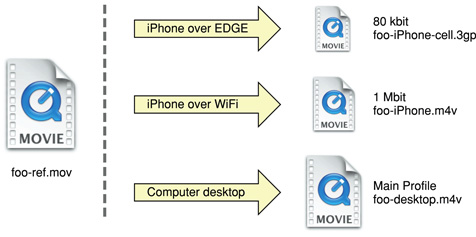

> 导航：[总目录](../../../README.md) · [documentation](../../../_indexes/documentation.md) · [Safari Web Content Guide](Developing%20Web%20Content%20for%20Safari.md)


[Next](Storing%20Data%20on%20the%20Client.md)[Previous](Configuring%20Web%20Applications.md)

# Creating Video

Safari supports audio and video viewing in a webpage on the desktop and iOS. You can use `audio` and `video` HTML elements or use the `embed` element to use the native application for video playback. In either case, you need to ensure that the video you create is optimized for the platform and different bandwidths.

iOS streams movies and audio using HTTP over EDGE, 3G, and Wi-Fi networks. iOS uses a native application to play back video even when video is embedded in your webpages. Video automatically expands to the size of the screen and rotates when the user changes orientation. The controls automatically hide when they are not in use and appear when the user taps the screen. This is the experience the user expects when viewing all video on iOS.

Safari on iOS supports a variety of rich media, including QuickTime movies, as described in [Use Supported iOS Rich Media MIME Types](Creating%20Compatible%20Web%20Content.md#apple-f4xwc4dqnrsv64tfmyxwi33df52wszbpkridimbqga3diobsfvjvony). Safari on iOS does not support Flash so don’t bring up JavaScript alerts that ask users to download Flash. Also, don’t use JavaScript movie controls to play back video since iOS supplies its own controls.

Safari on the desktop supports the same audio and video formats as Safari on iOS. However, if you use the `audio` and `video` HTML elements on the desktop, you can customize the play back controls. See _[Safari DOM Additions Reference](https://developer.apple.com/documentation/webkitjs)_ for more details on the `HTMLMediaElement` class.

Follow these guidelines to deliver the best web audio and video experience in Safari on any platform:

- Follow current best practices for embedding movies in webpages as described in [Sizing Movies Appropriately](#apple-f4xwc4dqnrsv64tfmyxwi33df52wszbpkridimbqga3dkmjufvjvony), [Don’t Let the Bit Rate Stall Your Movie](#apple-f4xwc4dqnrsv64tfmyxwi33df52wszbpkridimbqga3dkmjufvjvooa), and [Using Supported Movie Standards](#apple-f4xwc4dqnrsv64tfmyxwi33df52wszbpkridimbqga3dkmjufvjvooi).
- Use QuickTime Pro to encode H.264/AAC at appropriate sizes and bit rates for EDGE, 3G, and Wi-Fi networks, as described in [Encoding Video for Wi-Fi, 3G, and EDGE](#apple-f4xwc4dqnrsv64tfmyxwi33df52wszbpkridimbqga3dkmjufvjvona).
- Use reference movies so that iOS automatically streams the best version of your content for the current network connection, as described in [Creating a Reference Movie](#apple-f4xwc4dqnrsv64tfmyxwi33df52wszbpkridimbqga3dkmjufvjvoni).
- Use poster JPEGs (not poster frames in a movie) to display a preview of your embedded movie in webpages, as described in [Creating a Poster Image for Movies](#apple-f4xwc4dqnrsv64tfmyxwi33df52wszbpkridimbqga3dkmjufvjvomjq).
- Make sure the HTTP servers hosting your media files support byte-range requests, as described in [Configuring Your Server](#apple-f4xwc4dqnrsv64tfmyxwi33df52wszbpkridimbqga3dkmjufvjvonq).
- If your site has a custom media player, also provide direct links to the media files. iOS users can follow these links to play those files directly.

In landscape orientation on iOS, the screen is 480 x 320 pixels. Users can easily switch the view mode between scaled-to-fit (letterboxed) and full-screen (centered and cropped). You should use a size that preserves the aspect ratio of your content and fits within a 480 x 360 rectangle. 480 x 360 is a good choice for 4:3 aspect ratio content and 480 x 270 is a good choice for widescreen content as it keeps the video sharp in full-screen view mode. You can also use 640 x 360 or anamorphic 640 x 480 with pixel aspect ratio tagging for widescreen content.

When viewing media over the network, the bit rate makes a crucial difference to the playback experience. If the network cannot keep up with the media bit rate, playback stalls. Encode your media for iOS as described in [Encoding Video for Wi-Fi, 3G, and EDGE](#apple-f4xwc4dqnrsv64tfmyxwi33df52wszbpkridimbqga3dkmjufvjvona) and use a reference movie as described in [Creating a Reference Movie](#apple-f4xwc4dqnrsv64tfmyxwi33df52wszbpkridimbqga3dkmjufvjvoni).

The following compression standards are supported:

- H.264 Baseline Profile Level 3.0 video, up to 640 x 480 at 30 fps. Note that B frames are not supported in the Baseline profile.
- MPEG-4 Part 2 video (Simple Profile)
- AAC-LC audio, up to 48 kHz

Movie files with the extensions `.mov`, `.mp4`, `.m4v`, and `.3gp` are supported.

Any movies or audio files that can play on iPod play correctly on iPhone.

If you export your movies using QuickTime Pro 7.2, as described in [Encoding Video for Wi-Fi, 3G, and EDGE](#apple-f4xwc4dqnrsv64tfmyxwi33df52wszbpkridimbqga3dkmjufvjvona), then you can be sure that they are optimized to play on iOS.

Because users may be connected to the Internet via wired or wireless technology, using either Wi-Fi, 3G, or EDGE on iOS, you need to provide alternate media for these different connection speeds. You can use QuickTime Pro, the QuickTime API, or any Apple applications that provide iOS exporters to encode your video for Wi-Fi, 3G, and EDGE. This section contains specific instructions for exporting video using QuickTime Pro.

Follow these steps to export video using QuickTime Pro 7.2.1 and later:

1. Open your movie using QuickTime Player Pro.
2. Choose File > Export for Web.

   A dialog appears.
3. Enter the file name prefix, location of your export, and set of versions to export as shown in Figure 10-1.

   __Figure 10-1__  Export movie panel

   
4. Click Export.

   QuickTime Player Pro saves these versions of your QuickTime movie, along with a reference movie, poster image, and `ReadMe.html` file to the specified location. See the `ReadMe.html` file for instructions on embedding the generated movie in your webpage, including sample HTML.

A reference movie contains a list of movie URLs, each of which has a list of tests, as show in Figure 10-2. When opening the reference movie, a playback device or computer chooses one of the movie URLs by finding the last one that passes all its tests. Tests can check the capabilities of the device or computer and the speed of the network connection.

__Figure 10-2__  Reference movie components



If you use QuickTime Pro 7.2.1 or later to export your movies for iOS, as described in [Encoding Video for Wi-Fi, 3G, and EDGE](#apple-f4xwc4dqnrsv64tfmyxwi33df52wszbpkridimbqga3dkmjufvjvona), then you already have a reference movie. Otherwise, you can use the [MakeRefMovie](https://connect.apple.com/cgi-bin/WebObjects/MemberSite.woa/wa/getSoftware?bundleID=19980) tool to create reference movies. For more information on creating reference movies see _[Creating Reference Movies - MakeRefMovie](https://developer.apple.com/library/archive/technotes/tn2266/_index.html#//apple_ref/doc/uid/DTS40009989)_.

Also, refer to the _[MakeiPhoneRefMovie](../../../samplecode/MakeiPhoneRefMovie/MakeiPhoneRefMovie.md#apple-f4xwc4dqnrsv64tfmyxwi33df52wszbpirkfgmjqgaydinbrg4)_ sample for a command-line tool that creates reference movies.

For more details on reference movies and instructions on how to set them up see "Applications and Examples" in _[HTML Scripting Guide for QuickTime](../../Quick%20Time/HTML%20Scripting%20Guide%20for%20QuickTime/Introduction.md#apple-f4xwc4dqnrsv64tfmyxwi33df52wszbpkridimbqgaytkmrv)_.

The video is not decoded until the user enters movie playback mode. Consequently, when displaying a webpage with video, users may see a gray rectangle with a QuickTime logo until they tap the Play button. Therefore, use a poster JPEG as a preview of your movie. If you use QuickTime Pro 7.2.1 or later to export your movies, as described in [Encoding Video for Wi-Fi, 3G, and EDGE](#apple-f4xwc4dqnrsv64tfmyxwi33df52wszbpkridimbqga3dkmjufvjvona), then a poster image is already created for you. Otherwise, follow these instructions to set a poster image.

If you are using the `<video>` element, specify a poster image by setting the `poster` attribute as follows:

```
<video poster="poster.jpg" src="movie.m4v" ...> </video>
```

If you are using an `<embed>` HTML element, specify a poster image by setting the image for `src`, the movie for `href`, the media MIME type for `type`, and `myself` as the `target`:

```
<embed src="poster.jpg" href="movie.m4v" type="video/x-m4v" target="myself" scale="1" ...>
```

Make similar changes if you are using the `<object>` HTML element or JavaScript to embed movies in your webpage.

On the desktop, this image is displayed until the user clicks, at which time the movie is substituted.

HTTP servers hosting media files for iOS must support byte-range requests, which iOS uses to perform random access in media playback. (Byte-range support is also known as content-range or partial-range support.) Most, but not all, HTTP 1.1 servers already support byte-range requests.

If you are not sure whether your media server supports byte-range requests, you can open the Terminal application in OS X and use the `curl` command-line tool to download a short segment from a file on the server:

```
curl --range 0-99 http://example.com/test.mov -o /dev/null
```

If the tool reports that it downloaded 100 bytes, the media server correctly handled the byte-range request. If it downloads the entire file, you may need to update the media server. For more information on `curl`, see _OS X Man Pages_.

Ensure that your HTTP server sends the correct MIME types for the movie filename extensions shown in Table 10-1.

__Table 10-1__  File name extensions for MIME types

| Extensions | MIME type |
| `.mov` | video/quicktime |
| `.mp4` | video/mp4 |
| `.m4v` | video/x-m4v |
| `.3gp` | video/3gpp |

Be aware that iOS supports movies larger than 2 GB. However, some older web servers are not able to serve files this large. Apache 2 supports downloading files larger than 2 GB.

RTSP is not supported.

[Next](Storing%20Data%20on%20the%20Client.md)[Previous](Configuring%20Web%20Applications.md)

