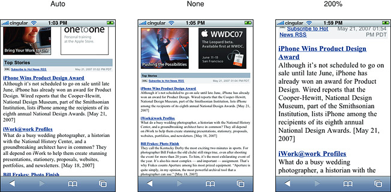
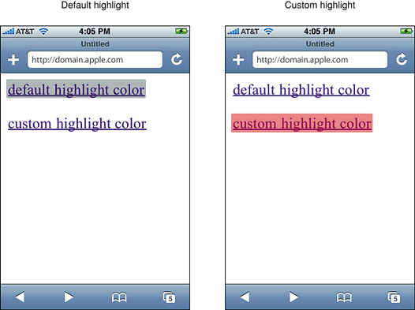

> 导航：[总目录](../../../README.md) · [documentation](../../../_indexes/documentation.md) · [Safari Web Content Guide](Developing%20Web%20Content%20for%20Safari.md)


[Next](Designing%20Forms.md)[Previous](Configuring%20the%20Viewport.md)

# Customizing Style Sheets

Although configuring the viewport is an important way to optimize your web content for iOS, style sheets provide further techniques for optimizing. For example, use iOS CSS extensions to control text resizing and element highlighting. If you use conditional CSS, then you can use these settings without affecting the way other browsers render your webpages.

Read [Optimizing Web Content](Optimizing%20Web%20Content.md#apple-f4xwc4dqnrsv64tfmyxwi33df52wszbpkridimbqga3dkmjxfvjvomi) for how to use conditional CSS and [CSS Basics](CSS%20Basics.md#apple-f4xwc4dqnrsv64tfmyxwi33df52wszbpkridimbqga2tanbrfvjvomi) for how to add CSS to existing HTML. See _[Safari CSS Reference](../Safari%20CSS%20Reference/Introduction%20to%20Safari%20CSS%20Reference.md#apple-f4xwc4dqnrsv64tfmyxwi33df52wszbpkridimbqgazdanjq)_ for a complete list of CSS properties supported by Safari.

There are many CSS3 properties available for you to use in Safari on the desktop and iOS. CSS properties that begin with `-webkit-` are usually proposed CSS3 properties or Apple extensions to CSS. For example, you can use the following CSS properties to emulate the iOS user interface:

**`-webkit-border-image`**
: Allows you to use an image as the border for a box. See [CSS Property Functions](https://developer.apple.com/library/archive/documentation/AppleApplications/Reference/SafariCSSRef/Articles/Functions.html#//apple_ref/doc/uid/TP40007955) for details.

**`-webkit-border-radius`**
: Creates elements with rounded corners. See [Customizing Form Controls](Designing%20Forms.md#apple-f4xwc4dqnrsv64tfmyxwi33df52wszbpkridimbqga3dkmjsfvjvona) for code samples. See [CSS Property Functions](https://developer.apple.com/library/archive/documentation/AppleApplications/Reference/SafariCSSRef/Articles/Functions.html#//apple_ref/doc/uid/TP40007955) for details.

In addition to controlling the viewport, you can control the text size that Safari on iOS uses when rendering a block of text.

Adjusting the text size is important so that the text is legible when the user double-taps. If the user double-taps an HTML block element—such as a `<div>` element—then Safari on iOS scales the viewport to fit the block width in the visible area. The first time a webpage is rendered, Safari on iOS gets the width of the block and determines an appropriate text scale so that the text is legible.

If the automatic text size-adjustment doesn’t work for your webpage, then you can either turn this feature off or specify your own scale as a percentage. For example, text in absolute-positioned elements might overflow the viewport after adjustment. Other pages might need a few minor adjustments to make them look better. In these cases, use the `-webkit-text-size-adjust` CSS property to change the default settings for any element that renders text.

Figure 4-1 compares a webpage rendered by Safari on iOS with `-webkit-text-size-adjust` set to `auto`, `none`, and `200%`. On iPad, the default value for `-webkit-text-size-adjust` is `none`. On all other devices, the default value is `auto`.

__Figure 4-1__  Comparison of text adjustment settings



To turn automatic text adjustment off, set `-webkit-text-size-adjust` to `none` as follows:

```
html {-webkit-text-size-adjust:none}
```

To change the text adjustment, set `-webkit-text-size-adjust` to a percentage value as follows, replacing `200%` with your percentage:

```
html {-webkit-text-size-adjust:200%}
```

Listing 4-1 shows setting this property for different types of blocks using inline style in HTML.

__Listing 4-1__  Setting the text size adjustment property

```
<body style="-webkit-text-size-adjust:none">
<table style="-webkit-text-size-adjust:auto">
<div style="-webkit-text-size-adjust:200%">
```


CSS controls the placement of content within the viewport. Use the `position` CSS property to keep portions of the layout in view regardless of page scrolling. To use fixed positioning set the margins, padding, and size of an object with CSS. Then add the `position` property with a value of `fixed` as follows:

```
#sticky_container {
     top: 200px;
     right: 0;
     width: 300px;
     height: 400px;
     overflow: hidden;
     position: fixed;
```

The fixed value enforces the other placement information regardless of scrolling and resizing.

For a demonstration of CSS positioning see [Understanding Layout and Gestures in Safari on iOS and Lion from WWDC2011](https://developer.apple.com/videos/wwdc/2011/?id=516). View _WWDC 2013: What’s New in Safari and WebKit for Web Developers_ for other layout features like columns, pagination, flexible boxes, and CSS regions.

By default, when the user taps a link or a JavaScript clickable element, Safari on iOS highlights the area in a transparent gray color. Using the `-webkit-tap-highlight-color` CSS property, you can either modify or disable this default behavior on your webpages.

The syntax for setting this CSS property is:

```
-webkit-tap-highlight-color:<css-color>
```

This is an inherited property that changes the tap highlight color, obeying the alpha value. If you don’t specify an alpha value, Safari on iOS applies a default alpha value to the color. To disable tap highlighting, set the alpha to `0` (invisible). If you set the alpha to `1.0` (opaque), then the element won’t be visible when tapped.

Listing 4-2 uses an alpha value of `0.4` for the custom highlight color shown on the right in Figure 4-2.

__Listing 4-2__  Changing the tap highlight color

```
<html>
<head>
    <meta name = "viewport" content = "width=200">
</head>

<body>
<a href = "whatever0.html">default highlight color</a><br><br>
<a href = "whatever0.html" style = "-webkit-tap-highlight-color:rgba(200,0,0,0.4);">custom highlight color</a>
</body>

</html>
```


__Figure 4-2__  Differences between default and custom highlighting



Note that changing this behavior does not affect the color of the information bubble when the user touches and holds.

You can also use the `-webkit-tap-highlight-color` CSS property in combination with setting a touch event to configure buttons to behave similar to the desktop. On iOS, mouse events are sent so quickly that the down or active state is never received. Therefore, the `:active` pseudo state is triggered only when there is a touch event set on the HTML element—for example, when `ontouchstart` is set on the element as follows:

```
<button class="action" ontouchstart="" style="-webkit-tap-highlight-color: rgba(0,0,0,0);">Testing Touch on iOS</button>
```

Now when the button is tapped and held on iOS, the button changes to the specified color without the surrounding transparent gray color appearing.

Read [Handling Events](Handling%20Events.md#apple-f4xwc4dqnrsv64tfmyxwi33df52wszbpkridimbqga3dkmjrfvjvomi) for the definition of a clickable element. See [-webkit-tap-highlight-color](../Safari%20CSS%20Reference/Supported%20CSS%20Properties.md#apple-f4xwc4dqnrsv64tfmyxwi33df52wszbpkridgmbqgaytenrwfvpxozlcnnuxix3umfyf62djm5ugy2lhnb2f6y3pnrxxe) to learn more about this property. Read [Handling Multi-Touch Events](Handling%20Events.md#apple-f4xwc4dqnrsv64tfmyxwi33df52wszbpkridimbqga3dkmjrfvjvomrs) for details on touch events.

[Next](Designing%20Forms.md)[Previous](Configuring%20the%20Viewport.md)

