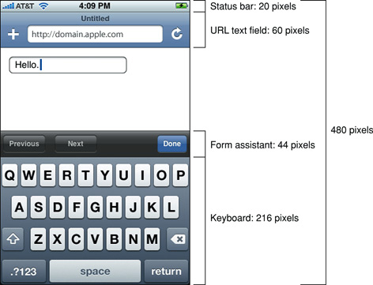
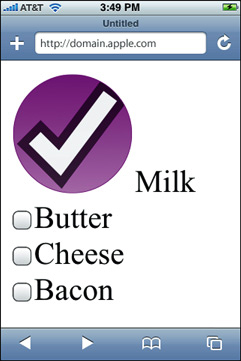
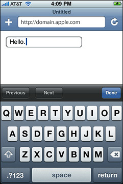

> 导航：[总目录](../../../README.md) · [documentation](../../../_indexes/documentation.md) · [Safari Web Content Guide](Developing%20Web%20Content%20for%20Safari.md)


[Next](Handling%20Events.md)[Previous](Customizing%20Style%20Sheets.md)

# Designing Forms

There are many adjustments you can make to your forms so that they work better on iOS. The forms should fit neatly on the iOS screen, especially if you are designing a web application specifically for iOS. Web applications can have a rich user interface and even look like native applications to the user. Consequently, the user may expect them to behave like native applications, too.

This chapter explains what you can do to make your forms work well on iOS:

- Take into account the available screen space when the keyboard is and isn’t displayed.
- Use CSS extensions to create custom controls.
- Control where automatic correction and capitalization are used.

See _iOS Human Interface Guidelines_ for more tips on laying out forms and designing web applications for iOS. Read [Hiding Safari User Interface Components](Configuring%20Web%20Applications.md#apple-f4xwc4dqnrsv64tfmyxwi33df52wszbpkridimbqgazdanjrfvbuqmznknlte) for how to use the full-screen like a native application.

The available area for your forms changes depending on whether or not the keyboard is displayed on iOS. You should compute this area and design your forms accordingly.

Figure 5-1 shows the layout of Safari controls when the keyboard is displayed on iPhone. The status bar that appears at the top of the screen contains the time and Wi-Fi indicator. The URL text field is displayed below the status bar. The keyboard is used to enter text in forms and is displayed at the bottom of the screen. The form assistant appears above the keyboard when editing forms. It contains the Previous, Next, and Done buttons. The user taps the Next and Previous buttons to move between form elements. The user taps Done to dismiss the keyboard. The button bar contains the back, forward, bookmarks, and page buttons and appears at the bottom of the screen. The tool bar is not visible when the keyboard is visible. Your webpage is displayed in the area below the URL text field and above the tool bar or keyboard.

__Figure 5-1__  Form metrics when the keyboard is displayed



Table 5-1 contains the metrics for the objects that you need to be aware of, in both portrait and landscape orientation, when laying out forms to fit on iPhone and iPod touch.

__Table 5-1__  Form metrics

| Object | Metrics in pixels |
| Status bar | Height = 20 |
| URL text field | Height = 60 |
| Form assistant | Height = 44 |
| Keyboard | Portrait height = 216  Landscape height = 162 |
| Button bar | Portrait height = 44  Landscape height = 32 |

Use this information to compute the available area for your web content when the keyboard is and isn't displayed. For example, when the keyboard is not displayed, the height available for your web content on iPhone is 480 - 20 - 60 - 44 = 356. Therefore, you should design your content to fit within 320 x 356 pixels in portrait orientation. If the keyboard is displayed, the available area is 320 x 140 pixels on iPhone.

Form controls in Safari on iOS are resolution independent and can be styled with CSS specifically for iOS. You can create custom checkboxes, text fields, and select elements.

For example, you can create a custom checkbox designed for iOS as shown in Figure 5-2 with the CSS code fragment in Listing 5-1. This example uses the `-webkit-border-radius` property—an Apple extension to WebKit. See _[Safari CSS Reference](../Safari%20CSS%20Reference/Introduction%20to%20Safari%20CSS%20Reference.md#apple-f4xwc4dqnrsv64tfmyxwi33df52wszbpkridimbqgazdanjq)_ for details on more WebKit properties.

__Figure 5-2__  A custom checkbox



__Listing 5-1__  Creating a custom checkbox with CSS

```
{
   width: 100px;
   height: 100px;
   -webkit-border-radius: 50px;
   background-color: purple;
}
```

Figure 5-3 shows a custom text field with rounded corners corresponding to the CSS code in [Listing 5-2](#apple-f4xwc4dqnrsv64tfmyxwi33df52wszbpkridimbqga3dkmjsfvjvony).

__Figure 5-3__  A custom text field



__Listing 5-2__  Creating a custom text field with CSS

```
{
   -webkit-border-radius: 10px;
}
```

Figure 5-4 shows a custom select control corresponding to the CSS code in [Listing 5-3](#apple-f4xwc4dqnrsv64tfmyxwi33df52wszbpkridimbqga3dkmjsfvjvooa).

__Figure 5-4__  A custom select element


__Listing 5-3__  Creating a custom select control with CSS

```
{
   background: red;
   border: 1px dashed purple;
   -webkit-border-radius: 10px;
}
```

Webkit offers a wide variety of form input types. Read [Supported Input Values](https://developer.apple.com/library/archive/documentation/AppleApplications/Reference/SafariHTMLRef/Articles/InputTypes.html#//apple_ref/doc/uid/TP40008055) for a complete listing.

You can also control whether or not automatic correction or capitalization are used in your forms on iOS. Set the `autocorrect` attribute to `on` if you want automatic correction and the `autocapitalize` attribute to a value if you want automatic capitalization. If you do not set these attributes, then the browser chooses whether or not to use automatic correction or capitalization. For example, Safari on iOS turns the `autocorrect` and `autocapitalize` attributes off in login fields and on in normal text fields.

For example, the following line turns the `autocorrect` attribute on:

```
<input type="text" name="field1" autocorrect="on">
```

The following line turns the `autocorrect` attribute off:

```
<input type="text" name="field2" autocorrect="off">
```

In iOS 5.0, the `autocapitalize` attribute allows finer control on how automatic capitalization behaves than just specifying `on` and `off` values. For example, if `autocapitalize` is `words`, each word is capitalized, as in "Jane Doe," appropriate for a first and last name input field. If `autocapitalize` is `characters`, each letter is capitalized, as in "NY" and "CA," appropriate for a state input field.

You can also use the `autocorrect` and `autocapitalize` attributes on `<form>` elements to give inner form controls (like `<input>` and `<textarea>` elements) default behavior. If the inner form controls have these attributes set, those values are used instead. If they don’t have these attributes set, the value is inherited from their parent `<form>` element. If neither element has these attributes set, the default value is used.

For example, the following code fragment sets the `autocapitalize` attribute to `words` on the form but to `characters` on the `state` and `none` on the `username` input fields. The `first-name` and `last-name` input fields inherit the `words` setting from the form element.

```
<form autocapitalize="words">
    First Name: <input name="first-name">
    Last Name: <input name="last-name">
    State: <input name="state" autocapitalize="characters">
    Username: <input name="username" autocapitalize="none">
    Comment: <textarea name="comment" autocapitalize="sentences"></textarea>
</form>
```

Refer to `autocorrect` and `autocapitalize` in _[Safari HTML Reference](../Safari%20HTML%20Reference/Introduction.md#apple-f4xwc4dqnrsv64tfmyxwi33df52wszbpkridimbqgazdanbz)_ for all possible values and defaults.

[Next](Handling%20Events.md)[Previous](Customizing%20Style%20Sheets.md)

