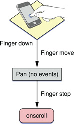
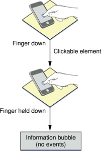
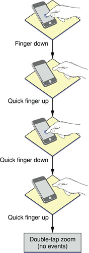
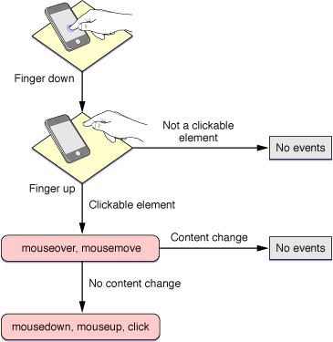
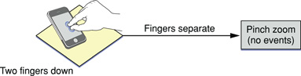
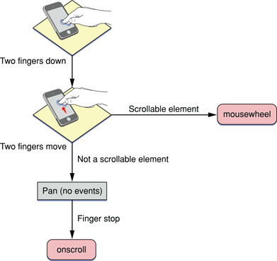

> 导航：[总目录](../../../README.md) · [documentation](../../../_indexes/documentation.md) · [Safari Web Content Guide](Developing%20Web%20Content%20for%20Safari.md)


[Next](Creating%20Pinned%20Tab%20Icons.md)[Previous](Designing%20Forms.md)

# Handling Events

This chapter describes the events that occur when the user interacts with a webpage on iOS. Forms and documents generate the typical events in iOS that you might expect on the desktop. Gestures handled by Safari on iOS emulate mouse events. In addition, you can register for iOS-specific multi-touch and gesture events directly. Orientation events are another example of an iOS-specific event. Also, be aware that there are some unsupported events such as cut, copy, and paste.

Gestures that the user makes—for example, a double tap to zoom and a flick to pan—emulate mouse events. However, the flow of events generated by one-finger and two-finger gestures are conditional depending on whether or not the selected element is clickable or scrollable as described in [One-Finger Events](#apple-f4xwc4dqnrsv64tfmyxwi33df52wszbpkridimbqga3dkmjrfvjvony) and [Two-Finger Events](#apple-f4xwc4dqnrsv64tfmyxwi33df52wszbpkridimbqga3dkmjrfvjvooa).

In addition, you can turn off the default Safari on iOS behavior as described in [Preventing Default Behavior](#apple-f4xwc4dqnrsv64tfmyxwi33df52wszbpkridimbqga3dkmjrfvjvomru) and handle your own multi-touch and gesture events directly. Handling multi-touch and gesture events directly gives developers the ability to implement unique touch-screen interfaces similar to native applications. Read [Handling Multi-Touch Events](#apple-f4xwc4dqnrsv64tfmyxwi33df52wszbpkridimbqga3dkmjrfvjvomrs) and [Handling Gesture Events](#apple-f4xwc4dqnrsv64tfmyxwi33df52wszbpkridimbqga3dkmjrfvjvomrt) to learn more about DOM touch events.

If you want to change the layout of your webpage depending on the orientation of iOS, read [Handling Orientation Events](#apple-f4xwc4dqnrsv64tfmyxwi33df52wszbpkridimbqga3dkmjrfvjvomjw).

See [Supported Events](#apple-f4xwc4dqnrsv64tfmyxwi33df52wszbpkridimbqga3dkmjrfvjvoni) for a complete list of events supported in iOS.

On iOS, emulated mouse events are sent so quickly that the down or active pseudo state of buttons may never occur. Read [Highlighting Elements](Customizing%20Style%20Sheets.md#apple-f4xwc4dqnrsv64tfmyxwi33df52wszbpkridimbqga3dkmjqfvjvoni) for how to customize a button to behave similar to the desktop.

It’s very common to combine DOM touch events with CSS visual effects. Read _[Safari CSS Visual Effects Guide](../../Internet%20Web/Safari%20CSS%20Visual%20Effects%20Guide/Introduction.md#apple-f4xwc4dqnrsv64tfmyxwi33df52wszbpkridimbqga4damzs)_ to learn more about CSS visual effects.

This section uses flow charts to break down gestures into the individual actions that might generate events. Some of the events generated on iOS are conditional—the events generated depend on what the user is tapping or touching and whether they are using one or two fingers. Some gestures don’t generate any events on iOS.

One-finger panning doesn’t generate any events until the user stops panning—an `onscroll` event is generated when the page stops moving and redraws—as shown in Figure 6-1.

__Figure 6-1__  The panning gesture



Displaying the information bubble doesn’t generate any events as shown in Figure 6-2. However, if the user touches and holds an image, the image save sheet appears instead of an information bubble.

__Figure 6-2__  The touch and hold gesture



Finally, a double tap doesn’t generate any events either as shown in Figure 6-3.

__Figure 6-3__  The double-tap gesture



Mouse events are delivered in the same order you'd expect in other web browsers illustrated in Figure 6-4. If the user taps a nonclickable element, no events are generated. If the user taps a clickable element, events arrive in this order: `mouseover`, `mousemove`, `mousedown`, `mouseup`, and `click`. The `mouseout` event occurs only if the user taps on another clickable item. Also, if the contents of the page changes on the `mousemove` event, no subsequent events in the sequence are sent. This behavior allows the user to tap in the new content.

__Figure 6-4__  One-finger gesture emulating a mouse



The pinch open gesture does not generate any mouse events as shown in Figure 6-5.

__Figure 6-5__  The pinch open gesture



Figure 6-6 illustrates the mouse events generated by using two fingers to pan a scrollable element. The flow of events is as follows:

- If the user holds two fingers down on a scrollable element and moves the fingers, `mousewheel` events are generated.
- If the element is not scrollable, Safari on iOS pans the webpage. No events are generated while panning.
- An `onscroll` event is generated when the user stops panning.

__Figure 6-6__  Two-finger panning gesture



Typical events generated by forms and documents include `blur`, `focus`, `load`, `unload`, `reset`, `submit`, `change` and `abort`. See [Supported Events](#apple-f4xwc4dqnrsv64tfmyxwi33df52wszbpkridimbqga3dkmjrfvjvoni) for a complete list of supported events on iOS.

You can use JavaScript DOM touch event classes available on iOS to handle multi-touch and gesture events in a way similar to the way they are handled in native iOS applications.

If you register for multi-touch events, the system continually sends `TouchEvent` objects to those DOM elements as fingers touch and move across a surface. These are sent in addition to the emulated mouse events unless you prevent this default behavior as described in [Preventing Default Behavior](#apple-f4xwc4dqnrsv64tfmyxwi33df52wszbpkridimbqga3dkmjrfvjvomru). A touch event provides a snapshot of all touches during a multi-touch sequence, most importantly the touches that are new or have changed for a particular target. The different types of multi-touch events are described in _[Touch Class Reference](https://developer.apple.com/documentation/webkitjs/touch)_.

A multi-touch sequence begins when a finger first touches the surface. Other fingers may subsequently touch the surface, and all fingers may move across the surface. The sequence ends when the last of these fingers is lifted from the surface. An application receives touch event objects during each phase of any touch.

Touch events are similar to mouse events except that you can have simultaneous touches on the screen at different locations. A touch event object is used to encapsulate all the touches that are currently on the screen. Each finger is represented by a touch object. The typical properties that you find in a mouse event are in the touch object, not the touch event object.

Note that a sequence of touch events is delivered to the element that received the original `touchstart` event regardless of the current location of the touches.

Follow these steps to use multi-touch events in your web application.

1. Register handlers for multi-touch events in HTML as follows:

```
<div
  ontouchstart="touchStart(event);"
  ontouchmove="touchMove(event);"
  ontouchend="touchEnd(event);"
  ontouchcancel="touchCancel(event);"
  ontouchforcechange="touchForceChange(event);"
></div>
```
2. Alternatively, register handlers in JavaScript as follows:

```
element.addEventListener("touchstart", touchStart, false);
element.addEventListener("touchmove", touchMove, false);
element.addEventListener("touchend", touchEnd, false);
element.addEventListener("touchcancel", touchCancel, false);
element.addEventListener("touchforcechange", touchForceChange, false);
```
3. Respond to multi-touch events by implementing handlers in JavaScript.

   For example, implement the `touchStart` method as follows:

```
function touchStart(event) {
  // Insert your code here
}
```
4. Optionally, get all touches on a page using the `touches` property as follows:

```
var allTouches = event.touches;
```

   Note that you can get all other touches for an event even when the event is triggered by a single touch.
5. Optionally, get all touches for the target element using the `targetTouches` property:

```
var targetTouches = event.targetTouches;
```
6. Optionally, get all changed touches for this event using the `changedTouches` property:

```
var changedTouches = event.changedTouches;
```
7. Access the `Touch` object properties—such as the target, identifier, and location in page, client, or screen coordinates—similar to mouse event properties.

   For example, get the number of touches:

```
event.touches.length
```

   Get a specific touch object at index `i`:

```
var touch = event.touches[i];
```

   Finally, get the location in page coordinates for a single-finger event:

```
var x = event.touches[0].pageX;
var y = event.touches[0].pageY;
```

You can also combine multi-touch events with CSS visual effects to enable dragging or some other user action. To enable dragging, implement the `touchmove` event handler to translate the target:

```
function touchMove(event) {
    event.preventDefault();
    curX = event.targetTouches[0].pageX - startX;
    curY = event.targetTouches[0].pageY - startY;
    event.targetTouches[0].target.style.webkitTransform =
        'translate(' + curX + 'px, ' + curY + 'px)';
}
```

Typically, you implement multi-touch event handlers to track one or two touches. But you can also use multi-touch event handlers to identify custom gestures. That is, custom gestures that are not already identified for you by gesture events described in [Handling Gesture Events](#apple-f4xwc4dqnrsv64tfmyxwi33df52wszbpkridimbqga3dkmjrfvjvomrt). For example, you can identify a two-finger tap gesture as follows:

1. Begin gesture if you receive a `touchstart` event containing two target touches.
2. End gesture if you receive a `touchend` event with no preceding `touchmove` events.

Similarly, you can identify a swipe gesture as follows:

1. Begin gesture if you receive a `touchstart` event containing one target touch.
2. Abort gesture if, at any time, you receive an event with >1 touches.
3. Continue gesture if you receive a `touchmove` event mostly in the x-direction.
4. Abort gesture if you receive a `touchmove` event mostly the y-direction.
5. End gesture if you receive a `touchend` event.

Multi-touch events can be combined together to form high-level gesture events.

[GestureEvent](https://developer.apple.com/documentation/webkitjs/gestureevent) objects are also sent during a multi-touch sequence. Gesture events contain scaling and rotation information allowing gestures to be combined, if supported by the platform. If not supported, one gesture ends before another starts. Listen for `GestureEvent` objects if you want to respond to gestures only, not process the low-level `TouchEvent` objects. The different types of gesture events are described in [GestureEvent](https://developer.apple.com/documentation/webkitjs/gestureevent) in _[WebKit JS Framework Reference](https://developer.apple.com/documentation/webkitjs)_.

Follow these steps to use gesture events in your web application.

1. Register handlers for gesture events in HTML:

```
<div
  ongesturestart="gestureStart(event);"
  ongesturechange="gestureChange(event);"
  ongestureend="gestureEnd(event);"
></div>
```
2. Alternatively, register handlers in JavaScript:

```
element.addEventListener("gesturestart", gestureStart, false);
element.addEventListener("gesturechange", gestureChange, false);
element.addEventListener("gestureend", gestureEnd, false);
```
3. Respond to gesture events by implementing handlers in JavaScript.

   For example, implement the `gestureChange` method as follows:

```
function gestureChange(event) {
  // Insert your code here
}
```
4. Get the amount of rotation since the gesture started:

```
var angle = event.rotation;
```

   The angle is in degrees, where clockwise is positive and counterclockwise is negative.
5. Get the amount scaled since the gesture started:

```
var scale = event.scale;
```

   The scale is smaller if less than `1.0` and larger if greater than `1.0`.

You can combine gesture events with CSS visual effects to enable scaling, rotating, or some other custom user action. For example, implement the `gesturechange` event handler to scale and rotate the target as follows:

```
onGestureChange: function(e) {
    e.preventDefault();
    e.target.style.webkitTransform =
        'scale(' + e.scale  + startScale  + ') rotate(' + e.rotation + startRotation + 'deg)';
}
```


The default behavior of Safari on iOS can interfere with your application’s custom multi-touch and gesture input. You can disable the default browser behavior by sending the `preventDefault` message to the event object.

For example, to prevent scrolling on an element in iOS 2.0, implement the `touchmove` and `touchstart` event handlers as follows :

```
function touchMove(event) {
    // Prevent scrolling on this element
    event.preventDefault();
    ...
}
```

To disable pinch open and pinch close gestures in iOS 2.0, implement the `gesturestart` and `gesturechange` event handlers as follows:

```
function gestureChange(event) {
    // Disable browser zoom
    event.preventDefault();
    ...
}
```


An event is sent when the user changes the orientation of iOS. By handling this event in your web content, you can determine the current orientation of the device and make layout changes accordingly. For example, display a simple textual list in portrait orientation and add a column of icons in landscape orientation.

Similar to a `resize` event, a handler can be added to the `<body>` element in HTML as follows:

```
<body onorientationchange="updateOrientation();">
```

where `updateOrientation` is a handler that you implement in JavaScript.

In addition, the `window` object has an [orientation](https://developer.apple.com/documentation/webkitjs/domwindow/1632568-orientation) property set to either `0`, `-90`, `90`, or `180`. For example, if the user starts with the iPhone in portrait orientation and then changes to landscape orientation by turning the iPhone to the right, the window’s `orientation` property is set to `-90`. If the user instead changes to landscape by turning the iPhone to the left, the window’s `orientation` property is set to `90`.

Listing 6-1 adds an orientation handler to the body element and implements the `updateOrientation` JavaScript method to display the current orientation on the screen. Specifically, when an `orientationchange` event occurs, the `updateOrientation` method is invoked, which changes the string displayed by the division element in the body.

__Listing 6-1__  Displaying the orientation

```
<!DOCTYPE html>

<html>
    <head>
        <title>Orientation</title>
        <meta name = "viewport" content="width=320, user-scalable=0">

        <script type="text/javascript" language="javascript">

            function updateOrientation()
            {
                var displayStr = "Orientation : ";

                switch(window.orientation)
                {
                    case 0:
                        displayStr += "Portrait";
                    break;

                    case -90:
                        displayStr += "Landscape (right, screen turned clockwise)";
                    break;

                    case 90:
                        displayStr += "Landscape (left, screen turned counterclockwise)";
                    break;

                    case 180:
                        displayStr += "Portrait (upside-down portrait)";
                    break;

                }
                document.getElementById("output").innerHTML = displayStr;
            }
    </script>
    </head>
    <body onorientationchange="updateOrientation();">
        <div id="output"></div>
    </body>
</html>
```


Be aware of all the events that iOS supports and under what conditions they are generated. Table 6-1 specifies which events are generated by Safari on iOS and which are generated conditionally depending on the type of element selected. This table also lists unsupported events.

__Table 6-1__  Types of events

| Event | Generated | Conditional |
| `abort` | Yes | No |
| `blur` | Yes | No |
| `change` | Yes | No |
| `click` | Yes | Yes |
| `copy` | No | N/A |
| `cut` | No | N/A |
| `drag` | No | N/A |
| `drop` | No | N/A |
| `focus` | Yes | No |
| `gesturestart` | Yes | N/A |
| `gesturechange` | Yes | N/A |
| `gestureend` | Yes | N/A |
| `load`  _Deprecated, use_ `pageshow` _instead._ | Yes | No |
| `mousemove` | Yes | Yes |
| `mousedown` | Yes | Yes |
| `mouseup` | Yes | Yes |
| `mouseover` | Yes | Yes |
| `mouseout` | Yes | Yes |
| `orientationchange` | Yes | N/A |
| `pagehide` | Yes | No |
| `pageshow` | Yes | No |
| `paste` | No | N/A |
| `reset` | Yes | No |
| `selection` | No | N/A |
| `submit` | Yes | No |
| `touchcancel` | Yes | N/A |
| `touchend` | Yes | N/A |
| `touchforcechange` | Yes | N/A |
| `touchmove` | Yes | N/A |
| `touchstart` | Yes | N/A |
| `unload`  _Deprecated, use_ `pagehide` _instead._ | Yes | No |

[Next](Creating%20Pinned%20Tab%20Icons.md)[Previous](Designing%20Forms.md)

