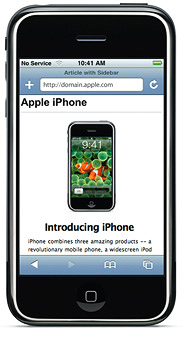
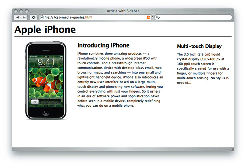

> 导航：[总目录](../../../README.md) · [documentation](../../../_indexes/documentation.md) · [Safari Web Content Guide](Developing%20Web%20Content%20for%20Safari.md)


[Next](Configuring%20the%20Viewport.md)[Previous](Creating%20Compatible%20Web%20Content.md)

# Optimizing Web Content

The first step in optimizing web content for iOS is to separate your iOS-specific content from your desktop content and the next step is to tailor the web content for iOS. You might want to follow these steps even if iOS is not your target platform so your web content is more maintainable in the future.

Use conditional CSS so that you can create iOS-specific style sheets as described in [Using Conditional CSS](#apple-f4xwc4dqnrsv64tfmyxwi33df52wszbpkridimbqga3dkmjxfvjvomq). You can also use object detection and WebKit detection as described in [Follow Good Web Design Practices](Creating%20Compatible%20Web%20Content.md#apple-f4xwc4dqnrsv64tfmyxwi33df52wszbpkridimbqga3diobsfvjvoni) to use extensions but remain browser-independent.

After optimizing your content, read the rest of the chapters in this document to learn how to set viewport properties, adjust text size, lay out forms, handle events, use application links, and export media for iOS. Finally, read the _[Safari Web Inspector Guide](../Safari%20Web%20Inspector%20Guide/About%20Safari%20Web%20Inspector.md#apple-f4xwc4dqnrsv64tfmyxwi33df52wszbpkridimbqga3tqnzu)_ for how to debug your webpages and watch [Optimizing Web Content in Your App](https://developer.apple.com/videos/play/wwdc2016/420/) for information on maximizing your effectiveness using the Web Inspector tools.

Once you use CSS to lay out your webpage in columns, you can use conditional CSS to create different layouts for specific platforms and mobile devices. Using CSS3 media queries, you can add iOS-specific style sheets to your webpage without affecting how your webpages are rendered on other platforms.

For example, Figure 2-1 shows a webpage containing conditional CSS specifically for iOS. Figure 2-2 shows the same webpage rendered on the desktop.

__Figure 2-1__  Small device rendering



__Figure 2-2__  Desktop rendering



CSS3 recognizes several media types, including print, handheld, and screen. iOS ignores print and handheld media queries because these types do not supply high-end web content. Therefore, use the screen media type query for iOS.

To specify a style sheet that is just for iOS without affecting other devices, use the `only` keyword in combination with the `screen` keyword in your HTML file. Older browsers ignore the `only` keyword and won’t read your iOS style sheet. Use `max-device-width`, and `min-device-width` to describe the screen size.

For example, to specify a style sheet for iPhone and iPod touch, use an expression similar to the following:

```
<link media="only screen and (max-device-width: 480px)" href="small-device.css" type= "text/css" rel="stylesheet">
```

To specify a style sheet for devices other than iOS, use an expression similar to the following:

```
<link media="screen and (min-device-width: 481px)" href="not-small-device.css" type="text/css" rel="stylesheet">
```

To load styles intended for users with Retina displays only, use an expression similar to the following:

```
<link media="only screen and (-webkit-min-device-pixel-ratio: 2)" href="retina.css" type="text/css" rel="stylesheet">
```

Alternatively, you can use this format inside a CSS block in an HTML file, or in an external CSS file:

```
@media screen and (min-device-width: 481px) { ... }
@media screen and (-webkit-min-device-pixel-ratio: 2) { ... }
```

Here are some examples of CSS3 media-specific style sheets where you might provide a different style for screen and print. Listing 2-1 displays white text on dark gray background for the screen. Listing 2-2 displays black text on white background and hides navigation for print.

__Listing 2-1__  Screen-specific style sheet

```

@media screen {
        #text { color: white; background-color: black; }
}
```


__Listing 2-2__  Print-specific style sheet

```

@media print {
        #text { color: black; background-color: white; }
        #nav  { display: none; }
}
```

For more information on media queries, see: [http://www.w3.org/TR/css3-mediaqueries/](http://www.w3.org/TR/css3-mediaqueries/).

[Next](Configuring%20the%20Viewport.md)[Previous](Creating%20Compatible%20Web%20Content.md)

