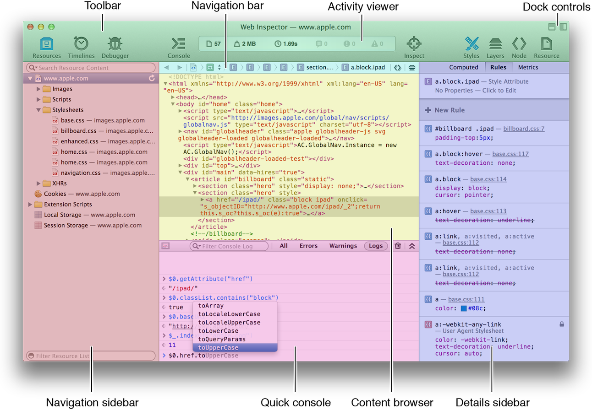

> 导航：[总目录](../../../README.md) · [documentation](../../../_indexes/documentation.md)

[Next](Get%20Oriented.md)

# About Safari Web Inspector

Web Inspector is an open source web development tool built into Safari that makes it easy to prototype, optimize, and debug your web content on iOS and OS X.

Read this guide to get started using Web Inspector.

This document is organized by areas of the Web Inspector interface.

### Get Started

Learn how to enable and customize the appearance of Web Inspector.

### Inspect the DOM and Resources

At the heart of Web Inspector is the ability to inspect the Document Object Model (DOM). Web Inspector shows you the structure of your DOM as perceived by Safari’s rendering engine, WebKit. But the DOM isn’t all you can inspect. External resources and locally stored data—such as scripts, stylesheets, and offline storage—can be inspected, providing insight to the data available to your web content.

### Measure and Improve Page Performance

Web Inspector provides a suite of tools you can use to quantify the speed of your webpages. You can monitor network requests as they download, observe page layout calculations performed by the WebKit rendering engine, and profile the efficiency of your JavaScript functions and CSS selectors.

### Debug JavaScript

Turn to Web Inspector when your front-end logic goes awry. Web Inspector offers a debugging environment that lets you pause script execution and observe the values of your variables as they are defined.

### Interact with the Console

Lift up the hood of your webpages and interact directly with your web content in the console.

When reading this document, follow along with Web Inspector open in Safari. It is recommended to actively use Web Inspector on this page while you read about its features for a hands-on learning experience.

- [WWDC 2013: Getting to Know Web Inspector](https://developer.apple.com/wwdc/videos/?id=601) provides a walkthrough of the Web Inspector UI.
- [WWDC 2013: Getting the Most Out of Web Inspector](https://developer.apple.com/wwdc/videos/?id=603) describes advanced concepts of harnessing the power of Web Inspector to your advantage.
- _[Safari Extensions Development Guide](https://developer.apple.com/library/archive/documentation/Tools/Conceptual/SafariExtensionGuide/Introduction/Introduction.html#//apple_ref/doc/uid/TP40009977)_ delivers step-by-step directions for creating Safari extensions using Extension Builder.
- _[Safari Extensions Reference](https://developer.apple.com/documentation/safariextensions)_ lists the JavaScript classes, methods, and properties you can access with Safari extensions.
- _[Safari Web Content Guide](../Safari%20Web%20Content%20Guide/Developing%20Web%20Content%20for%20Safari.md#apple-f4xwc4dqnrsv64tfmyxwi33df52wszbpkridimbqgazdanjr)_ offers guidance for developing web content for iOS.
[Next](Get%20Oriented.md)

