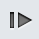
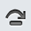
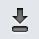
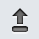

> 导航：[总目录](../../../README.md) · [documentation](../../../_indexes/documentation.md) · [Safari Web Inspector Guide](About%20Safari%20Web%20Inspector.md)

[Next](The%20Console.md)[Previous](Timelines.md)

# Debugger

If you are getting JavaScript errors on your webpage, you can use the Debugger navigation sidebar to assist you in finding the cause of the problem. By setting breakpoints throughout your code, you can inspect the values of your variables and observe the call stack during runtime.

Even if your JavaScript is minified, Web Inspector pretty-prints—or expands—all of your scripts, allowing you to set breakpoints on minified content.

Breakpoints are markers you set on JavaScript resources to indicate a pause in script execution. You may already be familiar with breakpoints if you have experience with compiled programming languages.

To add a breakpoint, select a JavaScript resource in the Resources navigation sidebar, and click a line number in the gutter of the content browser. A blue marker is set, indicating that script execution will pause here the next time this line runs. When a breakpoint is set, you can click it again to deactivate it, as shown in Figure 4-1.

__Figure 4-1__  An active breakpoint on line 17 and an inactive breakpoint on line 19

!

After one or more breakpoints are set, reload your page. Breakpoints retain their position across page loads, so your breakpoints won’t be lost. As soon as Safari’s JavaScript interpreter reaches a line of code that has a breakpoint on it, JavaScript execution halts, and the Scope Chain details sidebar appears. The Scope Chain contains a snapshot of variables available to the scope of the paused line, as well as their current values. For further information about the Scope Chain details sidebar, continue to [Scope Chain](#apple-f4xwc4dqnrsv64tfmyxwi33df52wszbpkridimbqga3tqnzufvbuqnjnknlto).

Every breakpoint you set across all your scripts appears under Breakpoints in the navigation sidebar, as shown in Figure 4-2. Clicking the line jumps the text in the content browser to the line with the breakpoint. The breakpoint icon to the right of the line number allows you to enable and disable the breakpoint without removing it.

__Figure 4-2__  All breakpoints are listed in the navigation sidebar

!

By clicking the breakpoint icon in the Breakpoints pane, you disable all breakpoints. The breakpoint locations are still saved, but JavaScript runs as if no breakpoints are set. Disabled breakpoints have a grayed-out appearance, as shown in Figure 4-3.

__Figure 4-3__  An active and inactive breakpoint when breakpoints are disabled

!

You can also set a breakpoint within `<script>` tags on HTML resources.

Delete a breakpoint by selecting it in the Breakpoints pane and pressing the Delete key. You can also drag the breakpoint out of the gutter to remove it.

You can set a breakpoint programmatically by calling the `debugger` keyword in your scripts. Don’t ship this code to your customers, though, because it will break the execution of your scripts at that point. It is meant for development purposes only.

When a script is paused, you can hover over objects in your script to reveal a token popover containing the object’s methods and properties and their values at the current time, as shown in Figure 4-4.

__Figure 4-4__  Hovering over a variable inspects the object

!

You can set breakpoints that are only active when a certain condition evaluates to be true. To do so, Right-click the breakpoint in the Debugger details sidebar and select Edit Breakpoint, as shown in Figure 4-5.

__Figure 4-5__  Editing a breakpoint

!

A popover appears, prompting you to enter a condition, as shown in Figure 4-6.

__Figure 4-6__  Setting a conditional breakpoint

!

The condition is scoped to the current context; any variables within current scope are available to use in this expression. If the condition evaluates to be true, the script pauses at the breakpoint; otherwise, the script continues.

The call stack lists the functions that have been called and have not yet finished returning. The most recently called functions are displayed at the top of the stack, as shown in Figure 4-7. Use this to view the order in which functions are called.

__Figure 4-7__  The call stack

!

When a script is paused, the call stack shows the chain of functions called to arrive at the paused line. Selecting an item in the stack jumps to where the line is declared in your scripts.

Use the buttons above the call stack to have line-by-line control of where the debugger pauses execution next. The buttons have the following behavior:

-  __Continue__—continues execution until the next breakpoint.
-  __Step over__—steps to the next line, without descending into any functions called on the current line.
-  __Step into__—steps to the next line, descending into any functions called on the current line first. If there are no function calls on the current line, this button behaves like the step over button.
-  __Step out__—steps to the preceding frame in the call stack.

The Scope Chain details sidebar displays all the variables set on the page and their values at the moment in time the script is paused. Variables are organized by their scope.

This includes all of the local variables available in the current function’s scope. All variables defined within the current function have their names printed here. Their values appear if they have been set at this point; otherwise, the value is undefined.

__Figure 4-8__  Variables defined within the scope of the immediate function

!

There are two variables that appear in the local variables section that you don’t declare explicitly: `arguments` and `this`. The `arguments` variable contains the values of the arguments that were passed into this function, including the implicitly available `event` object. `this` refers to the object this function is a member of (either the object that this method is attached to, or `window`).

If you set a breakpoint within a closure, or anonymous function, you see variables appear in the Closure Variables section, as shown in Figure 4-9. Closures have privileged access to the scope of the outer function that calls them.

__Figure 4-9__  Variables available to the current scope outside the immediate function

!

Variables attached to the global object `window` appear under the Global Variables section, as shown in Figure 4-10. This includes global variables you define in your scripts, global variables defined in installed extensions, and methods and properties of `window`.

__Figure 4-10__  Variables in the global scope

!

[Next](The%20Console.md)[Previous](Timelines.md)

