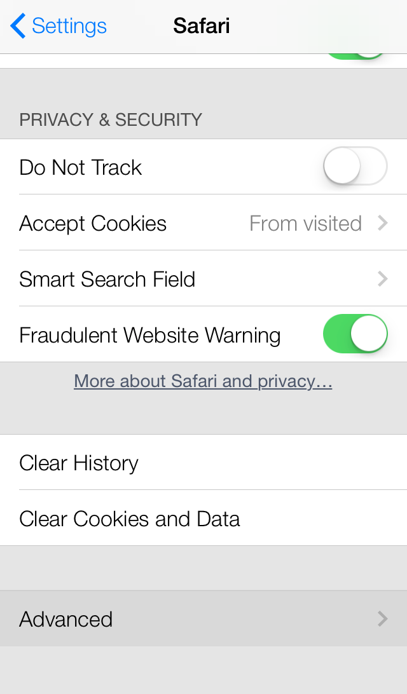
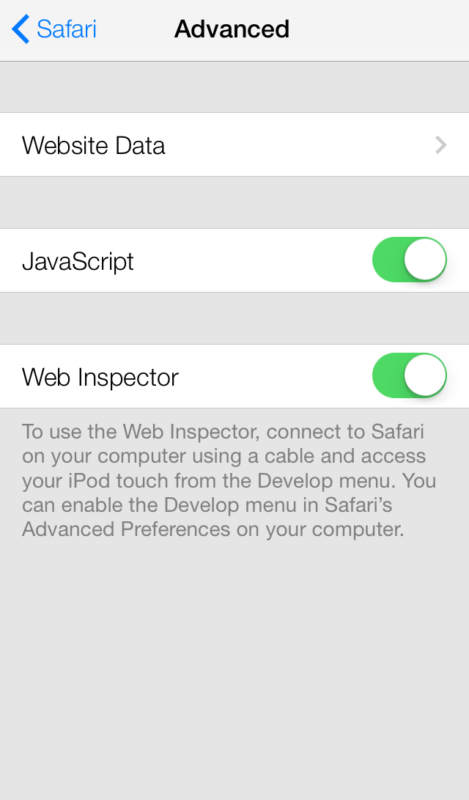
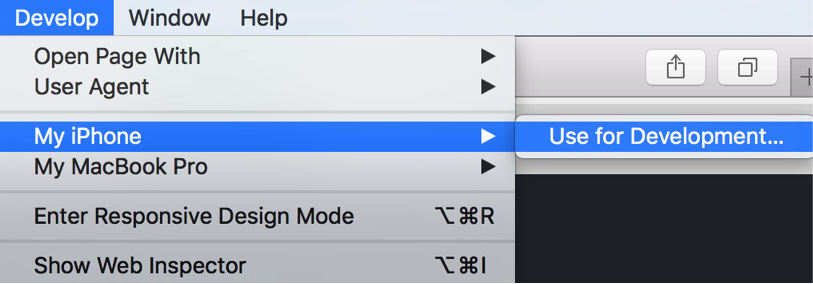
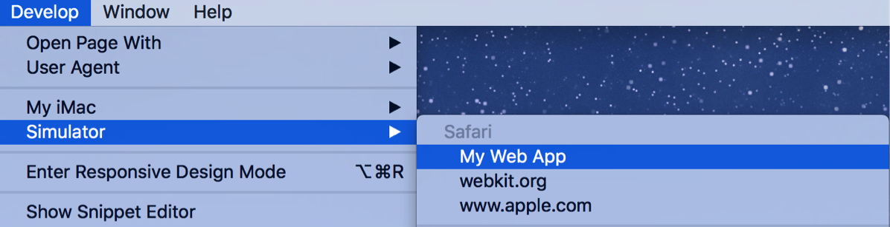

> 导航：[总目录](../../../README.md) · [documentation](../../../_indexes/documentation.md) · [Safari Web Inspector Guide](About%20Safari%20Web%20Inspector.md)


[Next](Resources%20and%20the%20DOM.md)[Previous](About%20Safari%20Web%20Inspector.md)

# Get Oriented

Before you start using Web Inspector, familiarize yourself with its organization and interface.

To start using Web Inspector, you must first enable the Develop menu. To do so, enable the “Show Develop menu in menu bar” setting found in Safari’s preferences under the Advanced pane, as shown in Figure 1-1.

__Figure 1-1__  The Advanced pane of Safari’s preferences

!

You can then access Web Inspector through the Develop menu that appears in the menubar, or by pressing Command-Option-I. You can also add the Web Inspector toolbar item to Safari’s toolbar by selecting View > Customize Toolbar.

__Figure 1-2__  The Web Inspector toolbar item

!

To enable the developer tools in a WebKit-based application other than Safari, enter the following into the Terminal:

```
defaults write com.bundle.identifier WebKitDeveloperExtras -bool true
```

Replace `com.bundle.identifier` with the bundle identifier of your app, and then launch your app. Web Inspector can now be accessed by a Control-click or right-click from within any web view. You must also enable contextual menus in your app.

You can use Web Inspector to debug web content on your device directly from your desktop.

1. Open the Settings app.
2. Tap Safari.
3. Scroll down and select Advanced.

   
4. Switch Web Inspector to ON.

   

After Web Inspector is enabled, connect your device to your desktop machine with a USB cable. The name of your device appears in the Develop menu of Safari.



Alternately, you can use iOS Simulator to take advantage of Web Inspector’s debugging capabilities, which comes free with Xcode from the Mac App Store. Use the same instructions,[To enable Web Inspector on iOS](#apple-f4xwc4dqnrsv64tfmyxwi33df52wszbpkridimbqga3tqnzufvbuqmrnknltema), from within the iOS Simulator’s Settings app.



If you have a development provisioning profile installed on your device, you can even inspect the web content of any `UIWebView` object in your app. The name of your app will appear as a submenu under the name of your device. When debugging web content in a web view, Web Inspector behaves in the same manner as debugging web content in Safari.

The toolbar icons listed in Table 1-1 are in order as they appear in Web Inspector, from left to right.

__Table 1-1__  Toolbar icons

| Icon | Name | Described in |
| ../Art/resources_2x.png | Resources navigation sidebar | [Resources and the DOM](Resources%20and%20the%20DOM.md#apple-f4xwc4dqnrsv64tfmyxwi33df52wszbpkridimbqga3tqnzufvbuqmznknltc) |
| ../Art/timelines_2x.png | Timelines navigation sidebar | [Timelines](Timelines.md#apple-f4xwc4dqnrsv64tfmyxwi33df52wszbpkridimbqga3tqnzufvbuqnbnknltc) |
| ../Art/debugger_2x.png | Debugger navigation sidebar | [Debugger](Debugger.md#apple-f4xwc4dqnrsv64tfmyxwi33df52wszbpkridimbqga3tqnzufvbuqnjnknltc) |
| ../Art/console_2x.png | Console | [The Console](The%20Console.md#apple-f4xwc4dqnrsv64tfmyxwi33df52wszbpkridimbqga3tqnzufvbuqnrnknltc) |
| ../Art/inspect_2x.png | Inspect | [Inspecting the DOM](Resources%20and%20the%20DOM.md#apple-f4xwc4dqnrsv64tfmyxwi33df52wszbpkridimbqga3tqnzufvbuqmznknltg) |
| ../Art/scopechain_2x.png | Scope Chain details sidebar | [Scope Chain](Debugger.md#apple-f4xwc4dqnrsv64tfmyxwi33df52wszbpkridimbqga3tqnzufvbuqnjnknlto) |
| ../Art/style_2x.png | Style details sidebar | [Style](Resources%20and%20the%20DOM.md#apple-f4xwc4dqnrsv64tfmyxwi33df52wszbpkridimbqga3tqnzufvbuqmznknltenq) |
| ../Art/layers_2x.png | Layers details sidebar | [Layout and Rendering](Timelines.md#apple-f4xwc4dqnrsv64tfmyxwi33df52wszbpkridimbqga3tqnzufvbuqnbnknlti) |
| ../Art/node_2x.png | Node details sidebar | [Node](Resources%20and%20the%20DOM.md#apple-f4xwc4dqnrsv64tfmyxwi33df52wszbpkridimbqga3tqnzufvbuqmznknltcmq) |
| ../Art/resource_2x.png | Resource details sidebar | [Resource](Resources%20and%20the%20DOM.md#apple-f4xwc4dqnrsv64tfmyxwi33df52wszbpkridimbqga3tqnzufvbuqmznknltcmy) |

There are three positions that Web Inspector can take: docked to the bottom of the window, docked to the right of the window, or in its own window. When inspecting web content on OS X, Web Inspector is docked to the bottom of the window by default. You can detach Web Inspector into its own window by pressing the detach button (). This mode is especially advantageous when working on a computer with multiple displays.

When in its own window, Web Inspector presents another button allowing you to dock Web Inspector to the right of the window. This is particularly useful for inspecting narrow web content on wide monitors. Press the Dock to Right button () to dock Web Inspector to the right side of the window.

Hold down the Option key to switch docking types.

You can change the look and feel of the toolbar to better suit your liking. Depending on the size of your screen, you might want to adjust your toolbar to take up less space. Right-clicking anywhere on the toolbar invokes a contextual menu which allows you to change the layout and size of the toolbar icons.

Possible toolbar appearances are shown in Table 1-2. By default, toolbar icons are presented with icons and text positioned vertically.

__Table 1-2__  Toolbar variants

| Para | Appearance |
| Icon and Text (Vertical) | ../Art/appearance_vertical_2x.png |
| Icon and Text (Horizontal) | ../Art/appearance_horizontal_2x.png |
| Icon only | ../Art/appearance_icon_2x.png |
| Text only | ../Art/appearance_text_2x.png |

You also have the option to make the icons smaller by selecting Small Icons from the contextual menu.

The activity viewer is like a heads-up display for the loaded page. It shows an at-a-glance summary of key information about the current page, as shown in Figure 1-3. Each label in the activity viewer is a button that, when clicked, takes you to an area of Web Inspector.

__Figure 1-3__  The activity viewer

!

__Table 1-3__  Buttons in the activity viewer

| Item | Description | Button action |
| ../Art/resource_count_2x.png Resource count | The total number of resources. | Opens the Resources navigation sidebar. See [Resources and the DOM](Resources%20and%20the%20DOM.md#apple-f4xwc4dqnrsv64tfmyxwi33df52wszbpkridimbqga3tqnzufvbuqmznknltc). |
| ../Art/file_size_2x.png Resource size | The total file size of all resources. | Opens the Networks Requests timeline. See [Network Requests](Timelines.md#apple-f4xwc4dqnrsv64tfmyxwi33df52wszbpkridimbqga3tqnzufvbuqnbnknltg). |
| ../Art/load_time_2x.png Load time | The time elapsed until the `load` event. | Opens the Networks Requests timeline. See [Network Requests](Timelines.md#apple-f4xwc4dqnrsv64tfmyxwi33df52wszbpkridimbqga3tqnzufvbuqnbnknltg). |
| ../Art/logs_2x.png Logs | The number of logs printed to the console. | Opens the console. See [The Console](The%20Console.md#apple-f4xwc4dqnrsv64tfmyxwi33df52wszbpkridimbqga3tqnzufvbuqnrnknltc). |
| ../Art/errors_2x.png Errors | The number of errors printed to the console. | Opens the console. See [The Console](The%20Console.md#apple-f4xwc4dqnrsv64tfmyxwi33df52wszbpkridimbqga3tqnzufvbuqnrnknltc). |
| ../Art/warnings_2x.png Warnings | The number of warnings printed to the console. | Opens the console. See [The Console](The%20Console.md#apple-f4xwc4dqnrsv64tfmyxwi33df52wszbpkridimbqga3tqnzufvbuqnrnknltc). |

[Next](Resources%20and%20the%20DOM.md)[Previous](About%20Safari%20Web%20Inspector.md)

