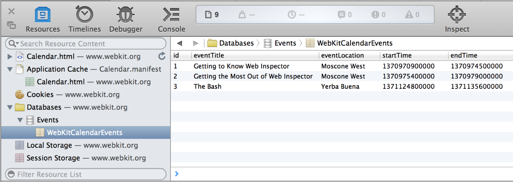
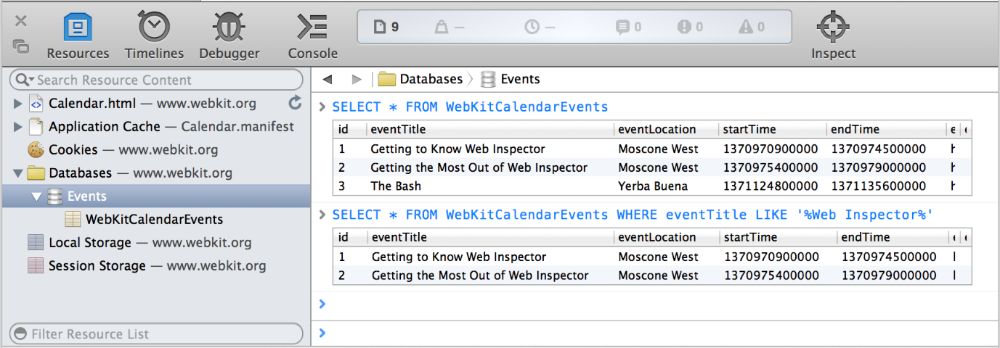
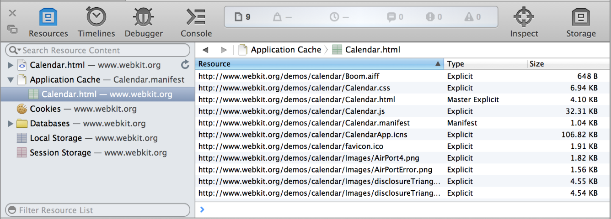

> 导航：[总目录](../../../README.md) · [documentation](../../../_indexes/documentation.md) · [Safari Web Inspector Guide](About%20Safari%20Web%20Inspector.md)

[Next](Timelines.md)[Previous](Get%20Oriented.md)

# Resources and the DOM

The Document Object Model (_DOM_) is the API between your JavaScript and HTML. Each HTML element is rendered as a _node_ in the DOM tree.

At the heart of Web Inspector is the ability to inspect, or locate within the DOM tree, a specific element on the page. After the specific element is selected in the DOM tree, details about the element become available, such as the element’s styles and event listeners.

Click the Inspect button, and start moving your mouse along the page. Notice that the elements you hover over becomes highlighted in a set of colors, and a tooltip appears, indicating the element’s tag and total dimensions. The colors that appear upon hover represent the element’s margin, border, padding, and dimensions, as illustrated in Figure 2-1.

__Figure 2-1__  Spacing properties are color-coded

!

With the Inspect button selected, click on this sentence. You can also right-click on this sentence and select Inspect Element in the contextual menu. Notice that the corresponding node becomes selected in the content browser.

The notions between a page’s source and a page’s DOM are similar, but different. The source is the raw HTML that is unadulterated by any client-side scripts. It is the direct response of the HTTP request to the server. The DOM, on the other hand, is the same HTML structure that has been modified by JavaScript.

Source Code reads the page’s HTML as if you opened it in a text editor. The source code reflects your HTML structure before any JavaScript is loaded. While the contents can’t be edited, it’s useful to see the HTML Safari receives from the server.

__Figure 2-2__  Viewing the source code

!

The DOM tree is fully editable. Of course, your edits are temporary, so any changes you make are lost in a browser refresh. To save changes you make to the DOM tree, select the root `html` node and press Command-C, which copies the DOM structure to you clipboard as HTML.

__Figure 2-3__  Viewing the DOM tree

!

You can switch between the page’s DOM tree and source code in the Navigation bar.

WebKit automatically inserts HTML in certain elements. For example, the placeholder of text inputs is actually another HTML element that is hidden within the input itself. These hidden elements are known as the Shadow DOM. You can enable viewing shadow nodes in the content browser by clicking on the Shadow DOM button ().

To edit the markup of an element, double-click an element name, attribute name, or attribute value. Alternately, you can press the Enter key to input a new attribute. You can also use the Tab key and Shift-Tab key combination to cycle through attributes.

For example, inspect this paragraph and press the Enter key. You’ll see a text field appear within the highlighted node. Type in `class="notebox"` and press Enter. A blue border appears surrounding the paragraph. That’s because the `notebox` class is already defined in the stylesheets included in this page. Deleting the `class` attribute or its value restores it to its original appearance.

Rearrange nodes with a simple drag and drop. Delete nodes by pressing the delete key. Try editing a couple nodes on this page—inspect this paragraph, then drag it above or below other nodes in the DOM tree. You’ll see the order of paragraphs change in the page to reflect the changed order in the DOM tree. All of your changes are local and won’t persist across pageloads. If you want to undo a change without losing other modifications you’ve made to the DOM, go to Edit > Undo (Command-Z) to undo your change.

The Style details sidebar shows all of the CSS styles that pertain to the selected element. It also contains a series of checkboxes representing the element’s active, focus, hover, and visited pseudo-state. You can select these checkboxes to enable the pseudo-state without interacting with the element directly. For example, selecting the Hover checkbox will change the appearance of the element as if the mouse cursor is hovering over it.

The computed styles show all CSS styles associated with the selected element. It shows properties set to this specific element, as well as properties inherited from other selectors.

__Figure 2-4__  The Computed tab in the Style details sidebar

!

The styles displayed in the Computed tab are read-only. To edit an element’s styles, go to the [Rules](#apple-f4xwc4dqnrsv64tfmyxwi33df52wszbpkridimbqga3tqnzufvbuqmznknlteoi) tab.

Next to every color in the Style sidebar is a color swatch. Clicking on the square swatch cycles through different formats of expressing that color. You can cycle through Hex, RGB, RGBA, HSL, HSLA, and named color values, depending on the color in context—for example, colors without alpha channels won’t cycle through RGBA or HSLA; colors that don’t represent an exact named color won’t cycle through the named color.

To see every CSS property, click on the Show All checkbox. This shows properties and their default values.

The Rules tab lists CSS rules that pertain to the selected element. The rules are collected from inline styles, attached stylesheets, and User Agent stylesheets. User Agent stylesheets are styles that Safari itself applies, such as a default margin.

Here, you can edit your styles as you would in a text editor. As you begin typing, notice that CSS properties auto-complete. As soon as your rule is valid, the style is automatically applied to the page. You can uncheck the checkbox that appears next to rules on hover to disable them, or press the Delete key to remove them entirely.

__Figure 2-5__  The Rules tab in the Style details sidebar

!

Inspect this paragraph, then click on New Rule. Web Inspector creates a rule with a selector that matches the selected element. In this case, the element is a paragraph, so Web Inspector chose the generic `p` tag. Type `color: red;` underneath the `p` selector, and notice that this entire paragraph instantly turns red.

The Box Model provides an easy way to visualize the dimensions of an element at a glance. From the center out, it shows the width and height, padding, border, and margin of the selected node. All of the values are editable; double-click and type in a value to see the change update immediately. As in the Rules tab, you can hold the Option key while pressing the up- or down-arrow keys to increment or decrement the current value.

__Figure 2-6__  The Metrics tab in the Style details sidebar

!

Inspect this sentence, and then click the Metrics tab. As you move your mouse over areas of the box model, you’ll see the corresponding areas on the page flash with color. Give the padding-bottom a value by double-clicking the hyphen directly underneath the dimensions. Type in a number (50, for example) and press Enter. You’ll notice the padding underneath this paragraph expand by 50 pixels. You do not need to supply a unit in the box model—all values are in pixels.

Adding values in the Metrics tab affects only the selected element. The values are applied as an inline style; look back in the content browser and notice that the selected node now has a `style` attribute. If you’d like the style applied to multiple elements, you’ll need to create a rule in the [Rules](#apple-f4xwc4dqnrsv64tfmyxwi33df52wszbpkridimbqga3tqnzufvbuqmznknlteoi) tab that matches a certain selector.

The Layer details sidebar provides information about what is composited as a layer. Elements that have a 3D transform, a fixed position, or overlap other composited elements are rendered in their own layer so that its movement during animations or scrolling can be hardware-accelerated for maximum performance.

However, each layer increases the memory footprint of your webpage (significantly for layers covering a large area). You should avoid having elements in their own layer unless absolutely necessary. If your page has poor scrolling or resizing performance, check to see if any nodes are being repainted on every scroll or resize event.

To see which elements on your page are rendered in their own layer, select the root `html` node in the content browser. Any elements composited in a layer appear here, as shown in Layers. Clicking on the row in this table causes a popover to appear, explaining the reasons for compositing. When possible, minimize the number of layers present by eliminating the element’s need for compositing. Clicking the arrow that appears on hover jumps to the node’s location in the content browser.

__Figure 2-7__  The Layer details sidebar

!

The number of element repaints is displayed next to the node name. A repaint occurs when the rendering engine assesses that a portion of the page’s visual presentation needs updating—for example, when a hovered link becomes underlined, or when a window resizes. Repaints are expensive operations that can negatively affect the responsiveness of your webpage as well as impact the user’s battery life.

To visualize the page’s layers and their repaints, click the Composite Borders button () in the Navigation bar. Clicking this button outlines each layer with a colored border. Large layers are divided into tiles, which also become outlined. Whenever a tile repaints, the counter in the tile’s upper-left corner increments.

The amount of memory the element consumes is also displayed in the Layer details sidebar. The amount of memory an element consumes is determined by multiplying the product of the element’s dimensions by 4 bytes (1 byte for each red, green, blue, and alpha channel).

The Node sidebar shows information relating to the selected element’s prototypal object, as shown in Figure 2-8.

__Figure 2-8__  The Node details sidebar

!

The Attributes section lists the names and values of HTML attributes of the selected node. These values are read-only; to edit an element’s attributes, double-click the node in the content browser.

The Properties section lists all available methods and properties available to the selected element, including methods and properties inherited from its parent objects.

The Event Listeners section lists all JavaScript events attached to this node and its ancestors. It presents the type of event, such as click or mouseover, as well as the name of the function it calls. If your JavaScript events aren’t firing as expected, check here to confirm that the element is indeed listening for the intended event and function.

The Resource sidebar shows information about the selected resource. You can view the full URL of the resource, as well as the server request and response headers that were sent with this resource, as shown in Figure 2-9.

__Figure 2-9__  The Resource details sidebar

!

Resources are grouped implicitly. If there are over a certain number of resources on a page, then images, scripts, stylesheets, fonts, frames, and XHRs (`XMLHttpRequest`s) coalesce into groups. These groups are represented by a folder. Groups do not reflect directory structure; that is to say, the organization of resources in the sidebar does not represent the path of the resource.

External JavaScript and CSS files are expanded by default. You might have minified some resources to reduce file size—a common practice on the web. Web Inspector automatically expands, or pretty-prints, your minified code in order to be easier to read. To toggle between pretty-print and original formatting, click the code formatting button ().

If source maps are present, Web Inspector splits production JavaScript and CSS into its original source files. Concatenated resources—for example, ones created by a CSS preprocessor or a build script—appear as a group, and the source files are listed as children. The names of source-mapped files appear throughout Web Inspector in italics; click the file name to jump to the position in the concatenated file, and Command-click the file name to jump to the position in the original source file.

JavaScript files allow you to set breakpoints in the left margin. To learn more about setting breakpoints, read [Breakpoints](Debugger.md#apple-f4xwc4dqnrsv64tfmyxwi33df52wszbpkridimbqga3tqnzufvbuqnjnknlte).

While it’s quicker to change an element’s CSS rules in the [Figure 2-11](#apple-f4xwc4dqnrsv64tfmyxwi33df52wszbpkridimbqga3tqnzufvbuqmznknltcmi) sidebar, you can also live-edit the stylesheet directly in the content browser. Select a CSS resource and begin typing, just as you would in a text editor.

Changes you make to JavaScript or CSS files can easily be saved onto disk by pressing Command-S. Saving external resources with Web Inspector allows you to rapidly prototype without the need to switch back to your text editor.

If your website uses cookies, they appear as an offline resource in the Resources navigation sidebar. As shown in Figure 2-10, cookies are displayed in a table that lists each cookie’s name, value, domain, path, expiration date, and size.

__Figure 2-10__  Cookies

!!

Entries in this table are read-only; if you want to edit a cookie’s value, you need to do so with the `document.cookie` object in JavaScript (you can use the Quick Console at the bottom of the content browser to modify the cookie and see the results update in real time). Pressing the Delete key while a cookie is selected deletes the cookie.

If your web app uses [HTML5 Web Storage](http://www.w3.org/TR/webstorage/), keys and values you set in your code appear in the Local Storage offline resource, as shown in Figure 2-11. Local storage is displayed as an editable data grid of key-value pairs. Double-click an empty row to create a new entry, and double-click an existing entry to edit its value. Pressing the Delete key on a selected entry removes the key-value pair. Local storage provides a database of up to 5 MB per domain that persists even after Safari is quit.

__Figure 2-11__  The Local Storage resource

!!

Session storage is also displayed as an editable data grid of key-value pairs. Unlike local storage, session storage persists for as long as the window or tab remains open.

If your webpage uses [Web SQL Databases](http://www.w3.org/TR/webdatabase/), they appear as an offline resource under Databases in the Resources navigation sidebar. Click the Databases disclose triangle to see a list of open databases and their tables. Selecting a database table displays a data grid containing all the columns and rows for that table.

In addition to inspecting HTML5 databases, you can interact with them by issuing SQL queries against any of the displayed databases. Select a database in the sidebar to see an interactive console for evaluating SQL queries.

The input to this console has auto-completion and tab-completion for table names in the database, as well as common SQL keywords.

Websites that provide a manifest file can have items stored in Safari’s offline application cache. On subsequent visits to the website, Safari loads these items from the cache instead of loading them from the website again. This provides a mechanism for websites to offer features such as canvas-based games that users can play, even when their device’s browser has no Internet connection.

You can inspect all the current contents of the application cache by clicking Application Cache. Safari shows a list of domains that have cached files. Select a domain to see the files in that domain’s cache, showing the URL from which they were loaded, the type of entry the resource was specified as (explicit, manifest, master, or fallback), and the file size.

When the Application Cache is selected, the Storage details sidebar is also shown. It reports if the target device is online or not, and its current status.

Any scripts that have loaded from an installed Safari extension appear in a group labeled Extension Scripts. For more information about Safari Extensions, read _[Safari Extensions Development Guide](https://developer.apple.com/library/archive/documentation/Tools/Conceptual/SafariExtensionGuide/Introduction/Introduction.html#//apple_ref/doc/uid/TP40009977)_.

[Next](Timelines.md)[Previous](Get%20Oriented.md)

