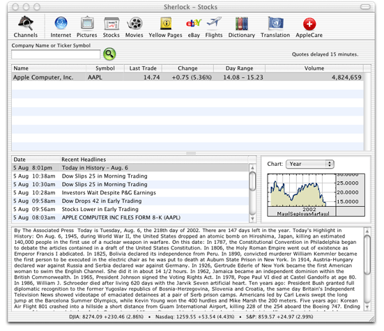
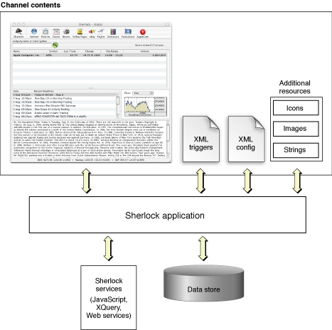
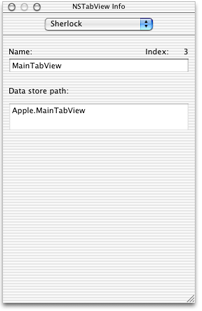
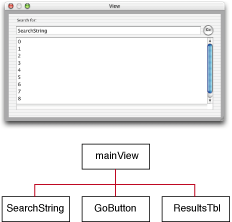
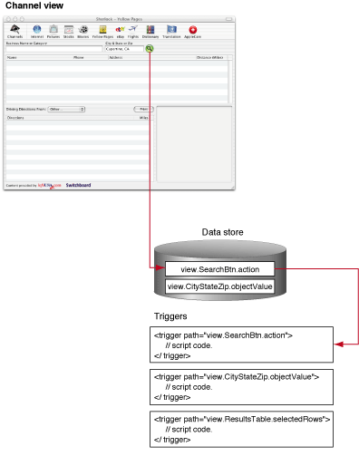

> 导航：[总目录](../../../README.md) · [documentation](../../../_indexes/documentation.md) · [Sherlock Channels](Introduction%20to%20Sherlock%20Channels.md)

[Next](Developing%20Channels.md)[Previous](Introduction%20to%20Sherlock%20Channels.md)

# Architecture of Sherlock Channels

This article provides an overview of Sherlock channels and their architecture. It describes the components involved in creating channels, how they fit together, and how they work within the Sherlock environment.

Sherlock is an application that incorporates Internet search capabilities into a flexible and extensible environment. The Sherlock application manages the infrastructure and support for _channels_, which do the work of gathering and displaying information.

A channel is a search-engine interface that uses the Sherlock infrastructure to access network-based resources and display the results to the user. Channels are not search engines in themselves; they take advantage of search engines on local intranets and the Internet to find information. However, channels can do more than just search for strings of characters. Channels can have a context in which to interpret the data they receive from a search engine. Using this context, the channel can then narrow the search criteria or perform additional searches to focus on information the user really wants.

You can develop channels to display a range of content, from movie showtimes to stock quotes, to yellow pages listings to news. You decide the level of detail you want to include in your channel and what context is required to achieve that detail. You then use that context to gather related information for the user. For example, a generic restaurant channel could use a postal code to provide restaurant listings in the user’s area. A more complex restaurant channel could then use other web services to obtain driving directions or restaurant reviews. Your job as a channel developer is to set up the channel context to acquire the relevant data.

Figure 1 shows Sherlock’s stock channel, which displays information about the user’s selected stocks, current prices, and news. When the user selects a stock, the channel displays a list of headlines. Selecting a headline then displays the article associated with that headline. All of this information is gathered dynamically by the channel. The only information the user provides is the stock symbol or company name.

__Figure 1__  Sherlock stock channel

Most of window content you see in Figure 1 is provided by the channel. Sherlock manages the interface and code provided by the channel but is not responsible for providing the channel’s behavior. The only portion of the window that Sherlock manages is the toolbar along the top edge. For more information on channel interfaces and how to create them, see [The Channel’s Interface](Developing%20Channels.md#apple-f4xwc4dqnrsv64tfmyxwi33df52wszbpgiydambrga4dgljrgeztmmbw).

The original architecture for Sherlock channels was relatively simple. The channel developer’s main job was to provide a direct mapping between Sherlock data fields and the developer’s search engine. The Sherlock application would then display search results as a weighted result set pulled from various sources. The new channel architecture gives you much more freedom to display information the way you want.

The goal of a Sherlock channel is to provide the user with relevant information for a specific topic. While you can use channels to act as a front-end for search engines, doing so does not take advantage of the power offered by Sherlock. The new architecture gives you a chance to create an intelligent search agent that gathers specific information and displays it in an intuitive way to the user.

The way you gather information in a channel is through a combination of search engines and web services. Search engines are a good starting point for finding basic text. However, web services are also becoming more prominent and are capable of offering more specific types of information. The script languages used by Sherlock make it easy to build XML queries and use them to communicate with SOAP services, among others.

Once you have the data you want, you must display it. Instead of the traditional search results table, Sherlock now supports the creation of custom user interfaces using Aqua controls. You can define an interface for your channel that is as complex or as simple as you want it to be. In either case, the result is a channel that behaves more like a Cocoa application than a web page of search results.

The way you create a channel has changed somewhat from previous versions of Sherlock. Whereas a channel used to consist of a mapping between the search engine syntax and the Sherlock syntax, channels now provide a user interface and script code to drive that interface. Sherlock still relies heavily on XML as a way of organizing the channel contents; however, channels also use the JavaScript and XQuery scripting languages to provide dynamic responses to data changes.

The channel itself now more closely resembles an application bundle containing resources and code files. The user interface for a channel is stored in a nib file that you create using Interface Builder. Your script code resides in an XML file, where it can be organized into small functions, called _triggers_, that respond to specific changes and events in your channel.

The Sherlock application provides the runtime environment in which channels operate. Sherlock provides a tremendous amount of infrastructure to support channels, including data storage, network services, and the script interpreters for your JavaScript and XQuery code. The most prominent piece of infrastructure is the _data store_, which acts as a repository for your channel’s data. The data store also acts as the connection point between your channel’s user interface and code, providing the place where the two exchange data.

Figure 2 shows the basic content of a channel and how that content relates to the Sherlock application and infrastructure. Each channel contains a nib file with the channel’s user interface. Code resides in the XML triggers file. Sherlock uses the channel’s XML configuration file to locate channel resources, including the nib file, XML triggers, and any additional resources. The Sherlock application coordinates interactions between your channel’s files and the Sherlock infrastructure.

__Figure 2__  Basic channel structure

Understanding the data store and what it does is important for the development of Sherlock channels. The main function of the data store is, as its name implies, to store the data created by your channel or entered by the user. However, the data store has other behaviors that are important to the design and implementation of channels.

When a user selects your channel, Sherlock loads your channel’s interface from the nib file you provide and incorporates it into the main Sherlock window. Because the Sherlock application runs the Sherlock window, your channel code has no direct connection to your user interface. Instead, Sherlock runs the interface and uses the data store as an intermediary for communications between the interface and your channel code.

Whenever the user interacts with your channel’s user interface, Sherlock updates the data store to reflect the interaction. The data store is both a repository of information and a source of notifications for your channel. If the user types a value in a text field, Sherlock stores that value in an appropriate location in the data store and generates a notification that the data changed. If the user clicks a button, Sherlock does not modify any data store values, but it does generate a notification.

Information in the data store is organized on the concept of paths. A _path_ is a string that uniquely identifies an object or property in the data store. Paths are not themselves objects that you manipulate. They are merely labels for data and services in the data store. You can use a path name to get or set the value for a control in your channel’s interface. You can also send a notification to a particular path. The result of sending a notification is that Sherlock executes the script code for the trigger that associates itself with the notified path.

Every relevant view and control in your user interface must have a path. You assign path names using a special palette in Interface Builder. This palette (available as part of the Sherlock SDK) adds a new tab to the Info Window that lets you enter path name information for the controls and views of your interface. The path information is stored in your nib file and read by Sherlock when it loads your channel. Figure 3 shows the Info Window with the Sherlock tab.

__Figure 3__  Sherlock tab of the Info Window

On the Sherlock tab, the control name is only part of the path name for that control. Your user interface must have a top-level view in which all other views and controls are embedded. The name of this view is prepended to the names of all other embedded views and controls. Sherlock includes only the top-level view in the path name for a control. It does not include the names of any other intervening views.

To access a property of a control, your script code must know the path to the control and the name of the desired property. Figure 4 shows a channel with a main view and several controls. The diagram to the right shows the organization and path names for each of the controls. To locate a property of a control, you would build a path with the name of the main view, the control name, and the property name, separating each name from the others with a period. For example, to access the data in the `SearchString` text field, you would create the path “`mainView.SearchString.objectValue`” and pass that path to the method for getting the data. For information on the properties defined for controls and views, see [Control Properties](Sherlock%20Reference.md#apple-f4xwc4dqnrsv64tfmyxwi33df52wszbpgiydambrga4dkljrgu4dombs).

__Figure 4__  Object containment hierarchy for a view

Sherlock defines specific paths for several predefined services and uses. Your channel can use these paths to store data persistently or to customize aspects of your channel such as its printing behavior. Some of these paths represent temporary variables, while others generate special notifications. You can define triggers for any of these paths to respond to its changes or notifications.

Channels do not share data with other channels or other instances of the same channel by default. Each window in Sherlock contains its own instantiation of a particular channel, and as such maintains its own separate copy of the data store. The only way to share data between channels is through the persistent storage paths of the data store. For more information, see [Persistent Storage Paths](Sherlock%20Reference.md#apple-f4xwc4dqnrsv64tfmyxwi33df52wszbpgiydambrga4dkljrgi2diojs).

A trigger is an event handler that responds to changes in the data store or to explicit notifications sent by Sherlock or your channel. You use triggers to respond to events in your channel’s user interface and to handle other explicit or implicit notifications. The implementation of your trigger defines the behavior of your channel.

You define a trigger using the `<trigger>` tag in your channel’s XML Triggers file. The content of this tag is the script code you want to execute. Every trigger must be associated with a specific path in the data store. Sherlock calls your trigger when a notification is sent to that path, whether because of a change in the data at that location or because of an explicit notification sent by Sherlock or your code. You specify the trigger’s path using the `path` attribute. You can include additional attributes to specify other information needed by the trigger. See [Trigger Tag Syntax](Sherlock%20Reference.md#apple-f4xwc4dqnrsv64tfmyxwi33df52wszbpgiydambrga4dkljrgm2domjw) for more information.

Figure 5 shows the relationship between a channel’s user interface and its triggers. The search button action has a specific path in the data store. When the user clicks the button, Sherlock generates a notification at that path to notify the channel that the button was pressed. Sherlock finds the trigger that responds to that path and executes its script code, passing in any additional information requested by the trigger.

__Figure 5__  Relationship between the channel interface and triggers

The script code for your triggers can be written using either JavaScript or XQuery, which is part of the XML Query specification. Each language has its strengths and weaknesses depending on the intended use. JavaScript is well suited for triggers that need to make dynamic decisions based on the current state of the channel. XQuery is well suited for performing operations that require complex text processing of data, such as generating query strings and parsing search results. Apple provides extensions to both languages for accessing Sherlock functionality. For more information on these extensions, see [Sherlock Reference](Sherlock%20Reference.md#apple-f4xwc4dqnrsv64tfmyxwi33df52wszbpgiydambrga4dklkciffeersjifcq).

Unlike previous versions of Sherlock, which required the user to download a plug-in and install it locally, Sherlock now supports channel deployment over the Web. Web deployment simplifies the task of installing channels and also provides an easy way to update the channel content automatically. Sherlock caches the files of a channel and downloads them again when it detects any changes.

Sherlock also supports the grouping of channels together into a subscription. Subscriptions let the user enable or disable a group of channels all at once. They also make it easier for the user to download a group of channels initially. For example, Apple provides a subscription for three development-related channels. You can enable these channels from the Debug menu, when it is enabled.

Although many developers will want to create channels for use in Sherlock, you can also create web services for use by channels. A web service is a routine or library of routines that performs a specific operation. Developing web services for your channels is a very simple process. All you do is place one or more routines in an XML file and deploy that file on your website.

Unlike many web services which run on the server, Sherlock web services run locally in the user’s environment. Sherlock web services are essentially script files that the user’s machine downloads and executes. A channel can include a web service file directly or it can use the `sherlock-function` routine from an XQuery script to access a specific routine of the web service.

In addition to developing your own web services, you can access existing web services by writing your own protocol wrappers. For examples of how to create and use web services, see the article [Using Web Services](Using%20Web%20Services.md#apple-f4xwc4dqnrsv64tfmyxwi33df52wszbpgiydambrga4dslkcineusrckirbq).

In order to improve performance, Sherlock provides caching facilities to store channel files and data locally. Because caching may not be appropriate all the time, Sherlock provides channel developers with some flexibility over when to employ it. This section discusses the caching strategies available to developers of Sherlock channels.

Although storing channel files on a server makes it easier to deploy updates to your channels, performance issues arise for users with slow network connections. Normally, when a channel is selected, Sherlock checks the modification dates of every file in the channel to see if any of the files changed. While it may not download every file, performing the network requests for these files can still take a noticeable amount of time. To eliminate this performance penalty, Sherlock supports the use of a checkpoint file to determine when a channel has changed.

If you implement checkpoint support, your channel configuration file acts as the checkpoint for your channel. The channel configuration file is the first file accessed by Sherlock when your channel is selected. This file contains a single `channel_info` tag with attributes telling Sherlock where to find your channel’s resources. With checkpoints enabled, Sherlock compares the modification date of the cached file with the one on the server. If the modification dates are the same, Sherlock knows that the channel has not changed and uses the cached files whose download date is later than the checkpoint file.

If you implement checkpoint support in your channel, it is your responsibility to touch the modification date of your channel configuration file whenever you modify your channel. If you do not, users may not receive updates to your channel.

If your company provides a subscription for several channels, you can also use checkpoints in your subscription files to further reduce the number of network requests. Subscription files contain links to one or more channels. If the modification date of the cached subscription file differs from the server-based file, Sherlock then proceeds to check for changes to the channels of the subscription; otherwise, it assumes all channels are up-to-date.

For more information on the `channel_info` tag and enabling checkpoints in channels, see [Channel Information Tag Syntax](Sherlock%20Reference.md#apple-f4xwc4dqnrsv64tfmyxwi33df52wszbpgiydambrga4dkljrgmztemjy). For information on creating a subscription, see [Setting Up Subscriptions](Accessing%20Channels.md#apple-f4xwc4dqnrsv64tfmyxwi33df52wszbpgiydambrga4doljrgeydgmzv).

Another place where Sherlock provides caching support is in the loading of files from the network. The `http-request` function in XQuery lets you request data from a network server. When you request a file for the first time using this method, Sherlock fetches it from the network and caches it. On subsequent requests, Sherlock compares the modification date of the cached file to the server file and returns the cached file if the dates are the same. However, you can eliminate this secondary network access by specifying some additional flags with the `http-request` function.

When you include the flag `FavorCache` in a request, Sherlock attempts to load the file from the cache. If the file is cached, Sherlock returns the cached copy without checking the network; otherwise, Sherlock loads the file from the network as usual. You can also use the `FavorCacheUpdate` flag to tell Sherlock to use the cached version now but to check the network for a newer version in the background. You may not get the newest file right away, but the next time you need it, the latest copy will be in the cache.

For more information on loading cached data files, see the description for [http-request](Sherlock%20Reference.md#apple-f4xwc4dqnrsv64tfmyxwi33df52wszbpgiydambrga4dkljrgi3dembr).

As new features are added to the Sherlock development environment, developers may be wary of adding those features to a channel because of problems with backwards compatibility. Because not all users will have the same version of Sherlock installed on their system, channels need a way to identify code with new features and prevent them from running in unsupported environments. Sherlock handles this through the use of version attributes on a channel’s tags. With version attributes, you can be sure that Sherlock runs new code in only those environments that support the new features.

Sherlock provides version information for three distinct portions of the system: the channel, the XQuery language, and the JavaScript language. Each tag that recognizes version information supports both a `version` and `maxVersion` attribute to specify the minimum and maximum supported versions, respectively. Table 1 shows the version information for Sherlock in different releases of Mac OS X.

__Table 1__  Sherlock version information

| Item | 10.2 | 10.2.2 | 10.2.3 | 10.2.5 | 10.3 |
| Channel | 1.0 | 1.1 | 1.2 | 1.3 | 1.4 |
| XQuery | 1.0 | 1.0 | 1.0 | 1.0 | 1.0 |
| JavaScript | 1.0 | 1.0 | 1.0 | 1.0 | 1.0 |

The channel version information is supported by the following tags:

- `<channel>` tags in a subscription file
- `<channel_info>` tag in a channel configuration file
- `<scripts>` tags in a code file

Although Sherlock performs version checks of tags internally, you can also get the channel version information programmatically if needed. To get the channel version, use the `channel-version` function from XQuery or the `ChannelVersion` function of the System object from JavaScript.

The XQuery and JavaScript version information is checked by the following tags:

- `<initialize>` tag in a channel code file
- `<trigger>` tags in a channel code file
- `<script>` tags in a code file

To get the current JavaScript version, use the `Version` method of the System object. To get the current XQuery version, use the `version` function.

For more information on tag syntax and version attributes, see [XML Tag Syntax](Sherlock%20Reference.md#apple-f4xwc4dqnrsv64tfmyxwi33df52wszbpgiydambrga4dkljrgmzdmmbt).

[Next](Developing%20Channels.md)[Previous](Introduction%20to%20Sherlock%20Channels.md)

