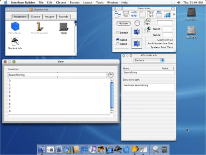

> 导航：[总目录](../../../README.md) · [documentation](../../../_indexes/documentation.md) · [Sherlock Channels](Introduction%20to%20Sherlock%20Channels.md)


[Next](Sherlock%20Scripting%20Language%20Support.md)[Previous](Architecture%20of%20Sherlock%20Channels.md)

# Developing Channels

This article describes the contents of a Sherlock channel. Channels are implemented using a combination of XML code, script code, and various resources. A standard Sherlock channel consists of the following files:

- A nib file containing the channel user interface.
- A TIFF or icon file containing an image to display in the Sherlock toolbar.
- One or more XML files containing the script code for the channel’s triggers
- An XML configuration file to tell Sherlock how to use the channel
- Localized versions of resources (including the Nib file, icons, and strings)

When you deploy your channel on a web server, you can organize these files in virtually any way you want. Your XML configuration file acts as a pointer to individual files, telling Sherlock where to find them. However, the section [Configuring Your Channel For Use](#apple-f4xwc4dqnrsv64tfmyxwi33df52wszbpgiydambrga4dgljrge3tcmbz) provides some general guidelines on how to organize your files in an efficient way.

The sections that follow describe the contents of these files and how you use them to define your channel.

The first step in creating a Sherlock channel is deciding the layout of your channel’s interface. Unlike previous versions of Sherlock, you can now define a custom interface for your channel using the Interface Builder application and Aqua-style controls. With these tools, you can display search results in a more intuitive and user-friendly way. And because it is implemented using Cocoa, your channel’s interface is much more responsive and flexible than before.

The main purpose of your channel’s nib file is to provide the layout and path information for your interface. Unlike traditional Cocoa applications, Sherlock channels do not use much of the resource information provided by Interface Builder. For example, channels do not rely on outlets or actions. Instead, Sherlock identifies your views and controls using path names, which you assign in Interface Builder. As a result, you can use an empty project file for any new channels you create in Interface Builder.

The main interface for a channel is always a custom view you create in Interface Builder. Because it hosts several channels, the Sherlock application provides the main window for the channel content. This window displays the Sherlock toolbar and contains an area in which to display the currently selected channel. When a new channel is selected, Sherlock looks for a custom view in the channel’s nib file, and when it finds it, loads that view into the main window.

Your channel interface is not limited to a single view. You can define additional views for printing or for other versions of your channel. You can also define windows to implement sheets. However, if your channel’s nib file contains multiple views, Sherlock needs to know which one to use in the main window. You tell Sherlock which channel you want to use by assigning the name of the main view to the path `mainViewIdentifier` in your channel’s initialization code. Sherlock checks this path and uses the value to load the view with the matching name. See [Initializing Your Channel](#apple-f4xwc4dqnrsv64tfmyxwi33df52wszbpgiydambrga4dgljrge3dqmzy) for more information on channel initialization.

It is important to provide path names for each of the relevant views and controls in your channel interface. You assign path names to controls using the Sherlock tab of the Info Window in Interface Builder. You must provide path names for each top-level view and for any controls or subviews that you plan to use. The path of each top-level view defines the context for identifying the view and its contained controls in the data store. When referring to a control, the path name of the control always includes the name of the top-level view.

Figure 1 shows a sample Interface Builder project file with a custom channel view. The channel view contains a text field, button, and table used to gather search criteria and display the results. The Info Window on the right shows the path name information for the currently selected control. You need only enter the name of the individual control. Interface Builder constructs the full path name for you and displays it below the control name.

__Figure 1__  Creating your channel interface in Interface Builder



You do not need to add a path name for static text or image controls unless you plan to change the information displayed by that control from within your channel. Similarly, you do not need to assign path names to any views that do not contain additional controls. However, you should always remember to assign a name to the top-level view containing your channel interface.

As you implement your channel interface, keep in mind how information flows in the interface. Channel script code reacts to changes in a control’s data, so it is a good idea to spend time laying out the flow of information from one control to the next. Knowing this flow ahead of time makes it easier to implement your script code.

Once you are satisfied with your user interface, you can save your nib file and exit Interface Builder. The next stage in channel development is writing the XML and script code that defines the runtime behavior of your channel interface. This process is described in the section [Writing Your Channel Code](#apple-f4xwc4dqnrsv64tfmyxwi33df52wszbpgiydambrga4dgljrge3dgojq).

For an example of how to build a simple channel interface, see the article [Creating a New Channel](Creating%20a%20New%20Channel.md#apple-f4xwc4dqnrsv64tfmyxwi33df52wszbpgiydambrga4dmlkcineusrckirbq).

Once you have defined the interface for your channel, you need to write the code to respond to events in that interface. Sherlock provides most of the infrastructure for managing your interface and informing your channel of changes. However, you are still responsible for implementing the specific behavior of your channel such as performing queries, organizing the resulting data, and updating the data store. You do this using triggers, which are described in the following sections.

Triggers make up the bulk of your channel’s code. While you can use web services to perform specific tasks, triggers are how you receive notifications from Sherlock that something has happened. It is up to you to decide how you want to respond to each notification you receive.

The controls of your channel interface have properties that you can access from your triggers to get information about the control. You can gather information from these properties and use it to determine what actions to perform. You can write data to these properties to update your channel’s interface. You can use these properties as targets for notifications and use them to execute other triggers.

Sherlock supports trigger scripts written using either JavaScript or XQuery. You can use one language or the other or you can mix calls between the languages using the objects and functions provided by Apple. For information on these languages, see [Sherlock Scripting Language Support](Sherlock%20Scripting%20Language%20Support.md#apple-f4xwc4dqnrsv64tfmyxwi33df52wszbpgiydambrga4dilkcijbugr2gindq). For information on the JavaScript and XQuery language extensions, see [Sherlock Reference](Sherlock%20Reference.md#apple-f4xwc4dqnrsv64tfmyxwi33df52wszbpgiydambrga4dklkciffeersjifcq).

For more information about triggers, see [Understanding Triggers](Architecture%20of%20Sherlock%20Channels.md#apple-f4xwc4dqnrsv64tfmyxwi33df52wszbpgiydambrga4deljrge3dinrz)

Each channel has one main code file that contains the triggers for the channel. The content of this file is a set of structured XML tags organizing the triggers and initialization code. A basic channel definition file has the following structure:

__Listing 1__  Contents of a channel definition file

```xml
<?xml version="1.0" encoding="UTF-8"?>
<channel>
    <initialize language="JavaScript">
        // Initialize any data store variables here.
    </initialize>
    <triggers>
        <trigger language="JavaScript" path="URL.search">
            // Trigger script code
        </trigger>
        <trigger language="XQuery" path="Control.action">
            {-- Trigger script code --}
        </trigger>

        <!-- Additional trigger definitions -->
    </triggers>
</channel>
```

The `<channel>` tag is the top-level tag for your code file. All of your code must be nested inside this tag. The channel tag can contain an `<initialize>` tag with the channel’s initialization code and a `<triggers`> tag with the channel’s triggers.

The `<initialize>` tag provides a convenient way to initialize data store paths and configure your channel for first use. Sherlock executes the code in your initialization block the first time your channel is loaded in a new window. You can initialize data values, send notifications, read in values from persistent storage, or perform any other actions you need to prepare the channel for use. See [Initializing Your Channel](#apple-f4xwc4dqnrsv64tfmyxwi33df52wszbpgiydambrga4dgljrge3dqmzy) for more information.

The `<triggers`> tag marks the beginning of the channel’s trigger definitions. Nested inside this tag are one or more `<trigger>` tags defining the triggers for your channel. Each trigger has a path attribute specifying the data store path monitored by the trigger. Changes to the data at a path cause Sherlock to execute the trigger with the matching path attribute. Similarly, notifications sent by your script code to that path result in the execution of any matching triggers. See [Trigger Tag Syntax](Sherlock%20Reference.md#apple-f4xwc4dqnrsv64tfmyxwi33df52wszbpgiydambrga4dkljrgm2domjw) for more information.

When Sherlock first loads your channel, it executes a special block of code in your XML Trigger file. This block is identified by the `<initialize>` XML tag and contains script code to execute during the loading of your channel. You can use this initialization block to perform any initial setup required by your channel. For example, you can initialize the values of any controls or data variables. If your channel uses multiple views, you can also use this block to specify the channel’s main view.

Sherlock executes your channel’s initialization code the first time your channel is loaded into a window. Sherlock does not call your initialization code when the user toggles between channels in the same window. However, Sherlock does call your initialization code again if the user opens a new window.

The following example shows the initialization code for the Yellow Pages channel. The code enables printing for the channel and then proceeds to adjust the controls to their initial values. The code sets some display parameters, sets some button images, and tells the data store to send notifications whenever the main search attributes change. The code also sets the temporary variable `Defaults.cityStateZip` to its initial state. The value in this variable is used by the channel’s triggers when the user does not specify a zip code, city, or state information.

__Listing 2__  Initializing a channel

```
<initialize language="JavaScript">
    DataStore.Set("mainViewIdentifier", "YellowPages");

    /* set up the data store to indicate that we want to handle printing */
    DataStore.Set("customPrint", 1);

    DataStore.Set("YellowPages.minViewSize", "{width=780; height=490}");
    DataStore.Set("Defaults.cityStateZip", "Cupertino, CA");
    DataStore.Set("YellowPages.CityStateZipField.updateValueOnTextChanged",
            true);
    DataStore.Set("YellowPages.MainQueryField.updateValueOnTextChanged",
            true);
    DataStore.Set("YellowPages.SearchButton.imageURL",
            "../shared/search.tiff");
    DataStore.Set("YellowPages.SearchButton.altImageURL",
            "../shared/searchDown.tiff");
    DataStore.Set("YellowPages.OpenLocations", false);

    DataStore.Set("YellowPages.PanX", 0);
    DataStore.Set("YellowPages.PanY", 0);
    DataStore.Set("YellowPages.MapZoom", 3);

    DataStore.Set("YellowPages.PanUp.imageURL", "panUp.tiff");
    DataStore.Set("YellowPages.PanDown.imageURL", "panDown.tiff");
    DataStore.Set("YellowPages.PanRight.imageURL", "panRight.tiff");
    DataStore.Set("YellowPages.PanLeft.imageURL", "panLeft.tiff");
    DataStore.Set("YellowPages.PanCenter.imageURL", "panCenter.tiff");

    /* Attribution */
    DataStore.Set("YellowPages.infousaImageButton.imageURL",
            "infousa.tiff");
    DataStore.Set("YellowPages.SwitchboardImageButton.imageURL",
            "Switchboard.tiff");
</initialize>
```

For more information on printing, see the article [Printing Your Channel’s Content](Printing%20Your%20Channel%E2%80%99s%20Content.md#apple-f4xwc4dqnrsv64tfmyxwi33df52wszbpgiydambrga4dqlkcineusrckirbq). For information on the DataStore object, see [DataStore Object](Sherlock%20Reference.md#apple-f4xwc4dqnrsv64tfmyxwi33df52wszbpgiydambrga4dkljrgyydmnrt).

An important consideration when writing your trigger code is reuse. If you have a complex channel, you may want to be able to initiate a particular action in several different ways. For example, a user could trigger the action using a control in your channel interface while an HTML page could trigger the action using a Sherlock URL. It is a good idea to separate out reusable pieces of code into separate functions that you can call from multiple triggers.

When you factor code, you do not have to include all of your subroutines in your channel’s main code file. Instead, you can declare your functions in a separate file and include it from your XML Trigger file. The content of an include file is usually only script code. To make it easy to include the file anywhere, you should always surround your code with a `<script>` tag containing a `language` attribute. The script tag ensures that the proper language is specified for your code. For example, if you create a file called `moreCode.xml` and use it to store some XQuery functions, the outline of your code file would look something like the following:

```
<scripts>
    <script language="XQuery">
        define function MyFunction($param1, $param2)
        {
            {-- Your code here. --}
        }
    </script>
</scripts>
```

To include this file in your XML Trigger file, you use the `<scripts>` tag in your `<triggers>` code block. You specify the file you want to load using the `src` attribute of the tag. The `src` attribute specifies the path to the include file, which can be a relative or fixed path. For example, to load the file `moreCode.xml` located in the subdirectory `services`, you would use the following code:

```
<triggers>
    <scripts src="services/moreCode.xml" />

    <!-- Additional triggers. -->
</triggers>
```


Sherlock supports channel localization using a mechanism similar to Mac OS X bundles. At the root level of your channel folder, you create subfolders for each of the localizations you support. The name of each subfolder consists of the two-letter ISO 639 language code followed by the `.lproj` extension. For example, the folder for English localized resources would be called `en.lproj`. Inside of each folder, you put the localized resources needed by your channel, including nib files, string resources, and image files.

When a user accesses your channel, Sherlock automatically checks the language preferences of that user and loads the appropriate nib file from your channel. To load localized resources from your script code, you can use the XQuery functions `localized-resource` and `localized-url`. To load localized resources from JavaScript, you must call these same functions using the XMLQuery object. See [XMLQuery Object](Sherlock%20Reference.md#apple-f4xwc4dqnrsv64tfmyxwi33df52wszbpgiydambrga4dkljrgyydsmzu).

String resources reside in a property list file called `LocalizedResources.plist` inside of each localized resource directory. Sherlock requires that the name of your channel be included in this file as a localized string with the key `CHANNEL_NAME`. You can include additional strings, dictionaries, and arrays as needed by your channel. The following listing shows the strings defined by the Dictionary channel.

__Listing 3__  Defined strings from the Dictionary channel

```xml
<?xml version="1.0" encoding="UTF-8"?>
<!DOCTYPE plist SYSTEM
        "file://localhost/System/Library/DTDs/PropertyList.dtd">
<plist version="0.9">
    <dict>
        <key>CHANNEL_NAME</key>
        <string>Dictionary</string>
        <key>SPELLING_SUGGESTIONS</key>
        <string>Spelling Suggestions</string>
        <key>AMERICAN_HERITAGE_DICTIONARY</key>
        <string>American Heritage Dictionary</string>
    </dict>
</plist>
```

To load a localized string, you use the `localized-resource` routine in XQuery. This routine accepts a key name and returns the string appropriate for the user’s current locale settings. The following code load shows how to use this routine in your XQuery code.

```
let $columnTitle = localized-resource("SPELLING_SUGGESTIONS")
```

If you are writing your channel code using JavaScript, you can use the XMLQuery object to evaluate any XQuery expressions, as shown in the following example:

```
columnTitle = XMLQuery.localized_resource(“"SPELLING_SUGGESTIONS");
```

For more information, see the description for [XMLQuery Object](Sherlock%20Reference.md#apple-f4xwc4dqnrsv64tfmyxwi33df52wszbpgiydambrga4dkljrgyydsmzu).

In order to make your channel available, you must tell Sherlock where to find it. Sherlock channels are distributed over the Web to make them easier to maintain and update. However, in order to distribute a channel over the web, Sherlock needs to know the location of your channel’s code and resources. You do this by specifying a channel configuration file. Links that refer to your channel point to this file so that Sherlock can load the information it needs.

The channel configuration file is an XML file containing a single `<channel_info>` XML tag. The attributes of this tag identify the location of your channel’s resource files relative to the configuration file itself. Listing 4 shows a sample channel directory structure with the channel’s code and resource files. In this listing the `MyChannel.xml` file is the channel configuration file while `channel.xml` is the main code file containing the channel’s triggers.

__Listing 4__  Channel directory structure

```
MyChannel/
    channel.xml
    en.lproj/
        channel.nib
        help/
            help.html
        localizedResources.plist
    mychannel.icns
    mychannel.tiff
MyChannel.xml
```

The following code listing shows the complete contents of the file `MyChannel.xml`. Sherlock loads this file and automatically interprets it as an XML tag. The attributes of the tag provide Sherlock with a way of uniquely identifying the channel, along with the location of the channel’s resources, here shown as relative paths on the Web server. See [Channel Information Tag Syntax](Sherlock%20Reference.md#apple-f4xwc4dqnrsv64tfmyxwi33df52wszbpgiydambrga4dkljrgmztemjy) for a complete description of the `channel_info` tag and attributes.

__Listing 5__  Channel info tag

```
<!-- My channel info file -->
<channel_info
    identifier="com.company.MyChannel"
    icon_url="MyChannel/mychannel.tiff"
    channel_url="MyChannel/channel.xml"
    localized_base_url="MyChannel/"
    nib_url="channel.nib/objects.nib"
    icns_icon_url="MyChannel/mychannel.icns"
    help_file="help/help.html"
/>
```

In addition to configuring your channel, you may also want to provide a description of your channel for the channel management portion of the Sherlock window. To specify this string, add the `CHANNEL_DESCRIPTION` key to the `LocalizedResources.plist` file in each of your localized directories. The value of this key is the description of your channel. See [Localizing Resources](#apple-f4xwc4dqnrsv64tfmyxwi33df52wszbpgiydambrga4dgljrgiytmmbw) for more information on localizing strings.

Once you have organized your project and created your configuration file, you can proceed to install your channel and debug it. For more information, see [Accessing Channels](Accessing%20Channels.md#apple-f4xwc4dqnrsv64tfmyxwi33df52wszbpgiydambrga4dolkcineusrckirbq).

The first step in using a channel is to make it accessible to users. Because Sherlock channels are small, they are ideally suited for deployment over the web. The minimal channel consists of two XML files, a nib file, a property list, and a TIFF image.

For testing purposes, you can deploy your web on your local machine using the personal web sharing feature of Mac OS X. With personal web sharing, you just need to drag your channel files into the current user’s `Sites` folder to make the files accessible on the web. When you are satisfied that your channel works as expected, you can deploy it to a more public server and establish links to the channel’s configuration file. For information on loading a channel from a URL, see [Loading a Channel From a URL](Accessing%20Channels.md#apple-f4xwc4dqnrsv64tfmyxwi33df52wszbpgiydambrga4doljrgeydembt).

Regardless of where you deploy your channel, the channel configuration file must contain valid paths to the files of your channel. For more information on creating a channel configuration file, see [Configuring Your Channel For Use](#apple-f4xwc4dqnrsv64tfmyxwi33df52wszbpgiydambrga4dgljrge3tcmbz).

[Next](Sherlock%20Scripting%20Language%20Support.md)[Previous](Architecture%20of%20Sherlock%20Channels.md)

