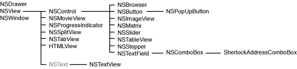

> 导航：[总目录](../../../README.md) · [documentation](../../../_indexes/documentation.md) · [Sherlock Channels](Introduction%20to%20Sherlock%20Channels.md)


[Next](Creating%20a%20New%20Channel.md)[Previous](Sherlock%20Scripting%20Language%20Support.md)

# Sherlock Reference

This article provides a reference for the various extensions and predefined data paths provided by Sherlock.

Sherlock channels use XML tags to organize and identify channel resources. The following sections describe the syntax for the XML tags you can use with Sherlock.

The channel configuration file constitutes the entry point to a channel. This file contains a single `channel_info` tag that identifies the key locations of the channel’s resource files. Sherlock uses the attributes of this tag to identify the channel and to load its resources. This file can also act as a checkpoint for determining when the channel files have changed.

Table 1 describes the attributes of the `channel_info` tag.

__Table 1__  channel_info attributes

| Attribute | Description |
| `channel_url` | Specifies the path to your channel’s main code file. This is the XML file containing your channel’s initialization code and triggers. |
| `check_point` | Specifies whether the file containing the `channel_info` tag should act as a check point for changes to the channel. If the value of this attribute is `true`, Sherlock compares the modification dates of the cached file and the file on the server. If they are the same, Sherlock assumes the channel has not changed and does not download any channel resources from the server. If the dates are different, Sherlock updates the channel resources from the server normally. |
| `help_file` | Specifies the location of a help file. The value of this attribute is the path to the HTML file relative to the localized resource directories in your channel folder. (Ignored on versions of Mac OS X earlier than version 10.3.) |
| `icns_icon_url` | Specifies the location of your channel’s file-system icon (`.icns`) file. This icon is downloaded and used when the user attempts to make a shortcut to the channel in the file system. The icon file you specify must contain an icon that is 128 pixels by 128 pixels in size. |
| `icon_url` | Specifies the path to the icon (`.icns`) or image file (`.tiff`) you want to use for your channel’s toolbar icon. Typically, this path is relative to the location of the channel configuration file. (A 32 pixel by 32 pixel TIFF image is preferred for this icon.) |
| `identifier` | Specifies a unique identifier for the channel. Sherlock uses this value to distinguish your channel from other channels. Typically, you encode your channel name and company domain name in this string using Java-style package naming conventions. |
| `localized_base_url` | Specifies the path to the parent directory containing your localized resource project directories. The directory you specify for this attribute should contain additional project directories for each language your channel supports. For example, if your project supports English and French locales, this directory would contain `en.lproj` and `fr.lproj` subdirectories. |
| `maxVersion` | Specifies the maximum channel version under which this trigger can execute. Use this attribute to prevent the loading and execution of a channel with a later version of Sherlock than the one supported. A value of “1.0” represents the channel version initially made available with Mac OS X version 10.2. (Note that support for this attribute was added in Mac OS X 10.2.2. Earlier versions of Sherlock will ignore the attribute.) |
| `nib_url` | Specifies the location of your channel’s interface objects without any preceding path information. This string is comprised of the name of your nib file followed by `/objects.nib`. Sherlock uses this attribute together with the `localized_base_url` and current user’s language settings to build a path to the appropriate nib file. |
| `version` | Specifies the minimum channel version required to run the channel. Use this attribute to prevent the loading and execution of a channel with an earlier version of Sherlock than the one supported. A value of “1.0” represents the channel version initially made available with Mac OS X version 10.2. (Note that support for this attribute was added in Mac OS X 10.2.2. Earlier versions of Sherlock will ignore the attribute.) |

For more information on using the `channel_info` tag, see [Configuring Your Channel For Use](Developing%20Channels.md#apple-f4xwc4dqnrsv64tfmyxwi33df52wszbpgiydambrga4dgljrge3tcmbz).

The following listing shows the format of the tags in a channel subscription file. The `<channels>` tag encloses one or more `<channel>` tags, each of which contains a URL to a channel configuration file. The `<localized-strings>` tag is optional and used primarily for the localization of the channel name itself.

```
<channels name="subscription_name" [check_point=<"true" | "false">] >
    [<channel url="channel_url" [version="min_version"]
                maxVersion="max_version"] />]+
    [<localized-strings>
        <localized-string language="2-letter_iso_code"
                key="key_name"
                string="value_for_key" />
    </localized-strings>]
</channels >
```

The following example shows a modified version of the channel subscription file provided by Apple for Sherlock development channels. In this example, the file includes a localized string for the subscription name. Sherlock displays the localized name for the subscription in the application preferences window. This example also includes two channels that support specific versions of Sherlock.

```
<channels name="Developer">
    <channel url="channels/xquery.xml" version="1.0" maxVersion="1.0" />
    <channel url="channels/javascript.xml"/>
    <channel url="channels/htmlview.xml" version="1.1" maxVersion="1.1" />
    <localized-strings>
        <localized-string language="en" key="Developer"
                string="Apple Developer Channels" />
    </localized-strings>
</channels >
```


The `scripts` and `script` tags let you modularize your channel’s source code and include additional web services. The `scripts` tag either loads a source file from server or encapsulates one or more `script` tags and makes the corresponding code available to your channel code. The `script` tag groups functions implemented using the same language into one location.

Table 2 describes the attributes of the `script` tag.

__Table 2__  script attributes

| Attribute | Description |
| `language` | Specifies language used to implement the enclosed code. The value of this tag can be either `JavaScript` or `XQuery`. |
| `maxVersion` | Specifies the maximum XQuery or JavaScript version under which this script code can execute. Use this attribute to limit the execution of script code to specific versions of Sherlock. |
| `version` | Specifies the minimum XQuery or JavaScript version required to run the trigger. Use this attribute to limit the execution of a trigger to specific versions of Sherlock. |

Table 3 describes the attributes of the `scripts` tag.

__Table 3__  scripts attributes

| Attribute | Description |
| `maxVersion` | Specifies the maximum channel version under which the code in this script file can execute. Use this attribute to limit the execution of script code to specific versions of Sherlock. A value of “1.0” represents the channel version initially made available with Mac OS X version 10.2. |
| `src` | Specifies the location of the script file to include. The value of this attribute can be either a full or partial path to the target file. |
| `version` | Specifies the minimum channel version required to run the code in this script file. Use this attribute to limit the execution of script code to specific versions of Sherlock. A value of “1.0” represents the channel version initially made available with Mac OS X version 10.2. |

The following example shows the use of the `scripts` and `script` tag to declare a function. This declaration could be placed inline with the channel’s triggers or in a separate file.

```
<scripts>
    <script language="XQuery">
        define function HTMLToText($html)
        {
            $html/source(.)
        }
    </script>
</scripts>
```

If you were to place the preceding code in a separate file and include it, you would use another `scripts` tag to include it in the code file containing your triggers. The URL you specify can be either a full path to the server with the file, or a relative path if the file is on the same server.

```
<scripts src="http://www.mycompany.com/services/webservices.xml"/>
```

For more information on using the `scripts` and `script` tags, see [Factoring Your Trigger Code](Developing%20Channels.md#apple-f4xwc4dqnrsv64tfmyxwi33df52wszbpgiydambrga4dgljrgiytanrx).

Triggers are a combination of XML tags and script code that you include in your channel’s XML Triggers file. A trigger is identified by the `<trigger`> XML tag. The attributes of this tag identify information about the trigger, such as the path it responds to, the language of the enclosed script code, and any other execution options. The content of the tag is the script code to execute in the language given by the tag attributes. Sherlock triggers support script code written in the JavaScript and XQuery languages. The basic syntax of the trigger tag is as follows:

```
<trigger language="trigger_language" path="data_store_path"
            [additional_trigger_attributes]>
    [script_code]
</trigger>
```

The following example shows a trigger definition from the Yellow Pages channel. This trigger receives the value from a text field and stores it in the channel’s preferences file. The path attribute of the trigger tag identifies the data store path to which the trigger responds—a text field with the name `CityStateZipField` in this case. The inputs attribute is a way of initializing local script variables with values from the data store.

```
 <trigger language="JavaScript"
        path="YellowPages.CityStateZipField.objectValue"
        inputs="cityStateZip=YellowPages.CityStateZipField.objectValue">
    DataStore.Set("PERSISTENT.cityStateZip", cityStateZip);
    DataStore.Set("YellowPages.ClickAgaintext.stringValue", " ");
</trigger>
```


Table 4 lists the `<trigger>` tag attributes you can use for all triggers. All attribute names are case-sensitive and optional unless otherwise noted.

__Table 4__  Common trigger attributes

| Attribute | Description |
| `fullPathInput` | Binds this trigger’s canonical full path to a local variable. For example, suppose your general script code assigns the value “`name`” to the path `Data.results[1].title`. If you define a trigger with the path `Data.results`, Sherlock binds the string “`Data.results.1.title` ” to the local variable you specify for the `fullPathInput` attribute. |
| `fullPathValue` | Binds the value located at the trigger’s path to a local variable. For example, suppose your general script code assigns the string “`name`” to the path `Data.results[1].title`. If you define a trigger with the path `Data.results`, Sherlock binds the string “`name` ” to the local variable you specify for the `fullPathValue` attribute. |
| `inputs` | Specifies a binding between one or more data store paths and local script variables. Use this attribute to transfer values from the data store to your scripts. To specify more than one binding, separate the entries with a comma. This parameter is used primarily if you are writing your trigger code using XQuery, which does not have direct access to the data store. You can also use this attribute in JavaScript to retain the original value of a path whose contents may change. |
| `language` | Assign the language in which the trigger script code is written to this attribute. Currently, this value can be either `JavaScript` or `XQuery`. This parameter is required. |
| `maxVersion` | Specifies the maximum XQuery or JavaScript version under which this trigger can execute. Use this attribute to limit the execution of a trigger to specific versions of Sherlock. |
| `mutex` | Identifies a mutex for the trigger. Only one trigger at a time may run with a given mutex. |
| `name` | Specifies the name of the trigger. This attribute is used primarily for debugging purposes. |
| `path` | Assign a data store path to this attribute. The data store executes the trigger script when the value at the specified path changes or receives a notification. For a complete list of control attributes that you can use as paths, see [Control Properties](#apple-f4xwc4dqnrsv64tfmyxwi33df52wszbpgiydambrga4dkljrgu4dombs). This parameter is required. |
| `pathInput` | Binds the path of this trigger to the specified local variable. You can use the resulting variable in your script code to identify the data store path to which this trigger responds. |
| `subPathInput` | Binds this trigger’s canonical subpath information to a local variable. The subpath information is the portion of a path that describes the instance and attribute information of the specific object being accessed. For example, suppose your general script code assigns the value “`name`” to the path `Data.results[1].title`. If you define a trigger with the path `Data.results`, Sherlock binds the string “`1.title`” to the local variable you specify for the `subPathInput` attribute. |
| `task` | Set this attribute to `true` to cancel any previously running instances of this trigger. This attribute is useful for a situation where you do not want to complete the current operation before moving to the next operation. For example, suppose the user is browsing a list of items in an NSBrowser control that updates its columns with child information. Without this attribute set, selecting an item would load all of the child information for that item before allowing a new selection. With this attribute set, selecting a new item would cancel the previous load operation and proceed to load the child information for the new item. |
| `timer` | Specifies that the trigger is to run at specified intervals. If this attribute is set to `true`, the data store uses the value at the trigger’s path as the execution interval (measured in seconds). For example, if you associate a trigger with the path `Data.results` and the value at that path is 2, the data store executes the trigger every two seconds. |
| `version` | Specifies the minimum XQuery or JavaScript version required to run the trigger. Use this attribute to limit the execution of a trigger to specific versions of Sherlock. |

Table 5 lists the `<trigger>` tag attributes available for triggers written using JavaScript. All attribute names are case-sensitive and optional unless otherwise noted.

__Table 5__  JavaScript trigger attributes

| Attribute | Description |
| `async` | If present, executes the trigger’s JavaScript code in parallel with the code of other triggers. This option is disabled by default, causing triggers to run synchronously. |

Table 6 lists the attributes available for triggers written using XQuery. All attribute names are case-sensitive and optional unless otherwise noted.

__Table 6__  XQuery trigger attributes

| Attribute | Description |
| `append` | Contains a boolean value specifying whether the trigger should append the output results to the specified path, rather than replace the original contents. |
| `noNotify` | Prevents a notification from being sent when the output value is returned to the data store. Normally, return of an output value generates a notification because it involves changing a field value. The inclusion of this attribute suppresses that notification. |
| `notify` | Contains a comma separated list of data store paths to be notified upon completion of the trigger. You can use this attribute to trigger other actions. |
| `output` | Specifies a binding between the return value of the function and a data store path. When the function finishes executing, Sherlock sets the value of the specified data path to the return value of the function. |
| `stream` | Contains a boolean value indicating that you want the trigger to return a partial result set initially and write the rest of the data out asynchronously. This feature improves performance when a search may take time due to network or server delays. |

The following example shows the use of several XQuery specific attributes. In this example, the trigger appends output data to the path “`Stocks.SymbolTable.dataValue`”. To prevent delays, the data is streamed out and a notification is sent to the path “`Stocks.action.updateQuotes`” when all of the data has been returned.

```
<trigger path="Stocks.action.symbols" language="XQuery"
            inputs="symbols= Stocks.action.symbols,
            table=Stocks.SymbolTable.dataValue"
            output="Stocks.SymbolTable.dataValue"
            notify="Stocks.action.updateQuotes"
            stream="true" append="true">
let $newSymbols := for $symbol in $symbols where
            empty($table/symbol[. = $symbol])
    return dictionary(("symbol", $symbol), ("id", string(unique-id())))
return $newSymbols
</trigger>
```


The data store includes several predefined paths that you can use to access or store data. This section describes these paths and explains how to use them.

Sherlock defines several trigger paths for determining when a channel’s interface is displayed or removed from the Sherlock window. Table 7 lists the paths along with a description of when the path is triggered.

__Table 7__  Nib file installation paths

| Path | Description |
| `.didInstall` | Called immediately after the nib file contents are installed in Sherlock’s window. |
| `.didRemove` | Called immediately after the nib file contents are removed from Sherlock’s window. |
| `.willInstall` | Called immediately before the nib file contents are installed in Sherlock’s window. |
| `.willRemove` | Called immediately before the nib file contents are removed from Sherlock’s window. |

Sherlock uses the `PERSISTENT` path to manage data in the Sherlock preferences file for the current user. You can use this path to get or set channel-specific data you want to retain between Sherlock sessions. You can also use it to access data shared by multiple channels.

To store channel-specific data, specify the `PERSISTENT` base path followed by a unique path name to identify the stored data. For example, to save the postal code of the current user to the preferences file, you could use the following JavaScript code:

```
userPostalCode = 95014;
DataStore.Set("PERSISTENT.postalCode", userPostalCode);
```

Inside the preferences file, Sherlock creates a dictionary for each channel’s individual preferences. Any data a channel writes to the `PERSISTENT` path are placed inside that channel’s dictionary and are accessible only by that channel.

If you want to share persistent data with other channels, you must do so using the `PERSISTENT.SHARED` base path. This path defines an area of the preferences file where channels may share data they find useful. To store shared data, you must add your channel identifier and the path name for the data to the `PERSISTENT.SHARED` path name. For example, to store a value at the path `MyData` in the channel whose identifier is `com.apple.MyChannel`, you would use the following path:

```
PERSISTENT.SHARED.com.apple.MyChannel.MyData
```

All channels use the same path to access your channel’s shared data. However, paths you create in the persistent storage space are accessible for reading and writing by your channel but are read-only to all other channels.

Sherlock provides several specific paths to implement printing support for channels. The use of these paths is discussed in detail in the article [Printing Your Channel’s Content](Printing%20Your%20Channel%E2%80%99s%20Content.md#apple-f4xwc4dqnrsv64tfmyxwi33df52wszbpgiydambrga4dqlkcineusrckirbq).

__Table 8__  Printing paths

| Path | Description |
| `customPrint` | Set the value of this path to 1 if your channel supports printing using a custom view. You do not need to assign a value to this path if you want to use Sherlock’s default printing support. |
| `mainViewIdentifier` | Use this path to distinguish your channel’s main view. from any other views, such as a print view. The value at this path contains the name of the view. |
| `print` | Use this path to receive printing notifications. |

Sherlock supports the automatic loading and execution of a channel using a browser URL. Sherlock defines a `URL` base path for accessing the query attributes of a URL. If a URL attribute has a value, Sherlock stores the value in the `URL` path under the name of the attribute. Attributes without values generate notifications instead.

For example, the following code shows a potential URL that can be sent to Sherlock:

```
sherlock://com.apple.yellowPages?query=sushi&zip=95120&search
```

When this URL is received, Sherlock writes each query attribute to the `URL` path. Query attributes are written in the same order as they appear in the query string. After all of the parameters are written, Sherlock sends a notification to the path `URL.complete` to signal the end of the parameter list. So, from the preceding example, Sherlock would perform the following equivalent operations (shown here as if they were part of a JavaScript trigger) to store the data:

```
DataStore.Set("URL.query", "sushi");
DataStore.Set("URL.zip", "95120");
DataStore.Notify("URL.search");
DataStore.Notify("URL.complete");
```

For each data value it sets, Sherlock also generates a notification to any triggers monitoring that path. If your channel defined a trigger that monitored the `URL.query` path, that trigger would be called prior to any triggers for the `URL.zip` or `URL.search` paths.

The controls you use to define your channel interface have properties that you can access from your script code. Control properties are cumulative through the view and control hierarchies, that is, a specific instance of a control inherits the properties of its parent classes. Thus, an NSButton control inherits the attributes of NSControl and NSView. Figure 1 shows the inheritance hierarchy of the controls available to Sherlock channels.

__Figure 1__  Control inheritance hierarchy



The sections that follow describe the individual properties for each control.

HTMLView objects contain properties for rendering HTML content. HTMLView inherits properties from NSControl and NSView. Table 9 lists the path properties for HTMLView.

__Table 9__  HTMLView path properties

| Property | Description |
| `baseURL` | Contains a string with the base URL to be prepended to any relative items or links in the HTML content. |
| `charset` | Contains a string with the name of the character set used by the HTML. Specify this value if the HTML does not already contain the information. |
| `followLinksInView` | Contains a boolean indicating whether new URLs may be loaded by clicking links in the view. |
| `htmlData` | Contains a string with the HTML data to render in the view. If you specify this value, do not specify a value for the `url` attribute. |
| `url` | Contains a string with the URL of the page to be rendered in the view. If you specify this value, do not specify a value for the `htmlData` attribute. |

This control is supported only on Mac OS X version 10.3 and later.

NSBrowser objects contain properties for accessing the column data of a browser (column view) control. NSBrowser inherits properties from NSControl and NSView. Table 9 lists the path properties for NSBrowser.

__Table 10__  NSBrowser path properties

| Property | Description |
| `data` | Contains an array with one or more subarrays, each of which represents a column of the browser. Each subarray contains one or more dictionaries with key/value pairs associated with the current entry in the browser. Each dictionary can also contain the keys `VALUE` and `IS_LEAF`. The `VALUE` key contains the row-item text to display in the browser column. The `IS_LEAF` key identifies whether the current dictionary is a leaf. |
| `doubleAction` | Notified when the user double-clicks an item in the control. Your handler should check the selected cells to see what was clicked. |
| `selectedCells` | Contains an array with one or more arrays, each of which represents a column of the browser. The contents of each subarray are the selected cells in that column. |

Although you can store hierarchical data using text and numbers in the data array of a browser, an easier way is to use dictionaries. When you specify a dictionary of items for a row, you can include a key called `IS_LEAF` to indicate that Sherlock should treat the dictionary as hierarchical data. When the key is set to true, Sherlock displays a right-arrow icon next to the row entry indicating there is more data.

NSButton objects contain properties for getting and setting the display characteristics of the button. NSButton inherits properties from NSControl and NSView. You can use the `action` property inherited from NSControl to respond to button clicks. Table 11 lists the path properties for NSButton.

__Table 11__  NSButton path properties

| Property | Description |
| `alternateImage` | Contains the button’s alternate NSImage. |
| `altImageURL` | Contains a string or an array of strings with the URL’s to use for the button’s alternate image. If you specify an array of strings, Sherlock uses the first one if it is available; if not, it uses the second and the third and so on. |
| `bordered` | Contains a boolean indicating whether the button has a border. |
| `image` | Contains the button’s NSImage. |
| `imageURL` | Contains a string or an array of strings with the URL’s to use for the button. If you specify an array of strings, Sherlock uses the first one if it is available; if not, it uses the second and the third and so on. |
| `title` | Contains a string with the button’s title. |

NSComboBox objects contain properties for getting and setting the items and text-completion characteristics of the combo box. NSComboBox inherits properties from NSTextField, NSControl, and NSView. Table 11 lists the path properties for NSComboBox.

__Table 12__  NSComboBox path properties

| Property | Description |
| `comboBoxSelectionDidChange` | Path that is notified whenever the combo-box selection changes. |
| `completionFlags` | Contains an integer indicating the techniques used to automatically complete typed text entries. You can set this property to any combination of the following values: 1 - case-insensitive search 2 - literal search 3 - backwards search 4 - anchored search |
| `completes` | Contains a boolean value indicating whether the combo box automatically completes item names as the user types them. |
| `hasVerticalScrollBar` | Contains a boolean value indicating whether the combo box displays a vertical scroller. |
| `items` | Contains an array of strings representing the items in the combo box. |
| `selectAllOnFirstMouseDown` | Contains a boolean value indicating whether the text in the combo box should be selected when the user clicks it. This value is false by default. |
| `selectedItem` | Contains a kCFNumberSInt32Type that represents the index of the selected item. |
| `showListOnBecomeFirstResponder` | Contains a boolean value indicating whether the combo box automatically shows its list when it becomes the first responder. This value is false by default. |
| `showListOnBeginEditing` | Contains a boolean indicating whether the combo box displays the list of choices as soon as a character is typed. This value is false by default. |
| `usesDataSource` | Contains a boolean indicating whether the combo box uses a data source to display its contents. |

NSControl defines common properties for the NSBrowser, NSButton, NSImageView, NSMatrix, NSSlider, NSTableView, NSStepper, and NSTextField controls. NSControl also inherits properties from NSView. Table 13 lists the path properties for NSControl.

__Table 13__  NSControl path properties

| Property | Description |
| `action` | Path that is notified whenever the control’s action occurs (such as when a button is clicked). |
| `actionURL` | Contains a URL to open when the control’s action occurs. If this path contains an empty value, nothing happens. |
| `enabled` | Contains a boolean indicating whether the control is enabled. |
| `objectValue` | Contains a value of type `id` with the control’s value. If you want to monitor the control’s value, use this path instead of `stringValue`. |
| `stringValue` | Contains a string value with the control’s value. |

NSDrawer objects contain properties to which you can send open and close notifications. Table 14 lists the path properties for NSDrawer.

__Table 14__  NSDrawer path properties

| Property | Description |
| `close` | Post a notification to this path to close the drawer. This notification always occurs asynchronously. |
| `drawerDidClose` | Path that is notified when the drawer is closed. (Supported on Mac OS X version 10.3 and later.) |
| `drawerDidOpen` | Path that is notified when the drawer is opened. (Supported on Mac OS X version 10.3 and later.) |
| `open` | Post a notification to this path to open the drawer. This notification always occurs asynchronously. |
| `toggle` | Post a notification to this path to toggle the state of the drawer. This notification always occurs asynchronously. |

NSImageView objects contain properties for accessing the image data and URL. NSImageView inherits properties from NSControl and NSView. Table 15 lists the path properties for NSImageView.

__Table 15__  NSImageView path properties

| Property | Description |
| `cachedNSImage` | Contains the cached NSImage object. This value is read-only. |
| `data` | Contains the raw image data. |
| `shouldCacheNSImage` | Contains a boolean indicating whether the image should be cached in the data store. |
| `url` | Contains the URL that points to the image. |

NSMatrix objects contain the currently selected cells in the matrix. NSMatrix inherits properties from NSControl and NSView. Table 16 lists the path properties for NSMatrix.

__Table 16__  NSMatrix path properties

| Property | Description |
| `cells` | Contains an array of cell objects. |
| `cells[n].imageURL` | Contains the URL for the image you want to display in the specified cell. |
| `cells[n].altImageURL` | Contains the URL for the alternate image you want to display in the specified cell. |
| `selectedCells` | Contains an array of zero-based indexes identifying the currently selected cells of the matrix. |

NSMovieView objects contain properties for loading and playing a movie. NSMovieView inherits properties from NSView. Table 17 lists the path properties for NSMovieView.

__Table 17__  NSMovieView path properties

| Property | Description |
| `play` | Contains a boolean indicating whether or not the movie is playing. Setting this value to 1 initiates playback. Setting the value to 0 stops playback. |
| `showController` | Contains a boolean indicating whether or not to show the movie controls. |
| `URL` | Contains the URL for a network-based movie. |

NSPopUpButton objects contain properties identifying the items of the pop-up menu. NSPopUpButton inherits properties from NSButton, NSControl, and NSView. Table 18 lists the path properties for NSPopUpButton.

__Table 18__  NSPopUpButton path properties

| Property | Description |
| `items` | Contains an array of strings, or an array of dictionaries with the keys `title` and `representedObject`. The `title` key identifies the string to be displayed. The `representedObject` key identifies the item represented by the corresponding row. |
| `selectedItem` | Contains the index of the selected item. |

To insert a menu-item separator in the pop-up menu, add the string “SherlockMenuItemSeparator” to the array of strings in `items`. If you use an array of dictionaries to specify your menu items, put the “SherlockMenuItemSeparator” string in the `title` key and omit the `representedObject` key.

NSProgressIndicator objects contain properties for controlling the appearance of the progress bar. NSProgressIndicator inherits properties from NSView. Table 19 lists the path properties for NSProgressIndicator.

__Table 19__  NSProgressIndicator path properties

| Property | Description |
| `bezeled` | Contains a boolean indicating whether the progress bar has a bezel. |
| `doubleValue` | Contains the current value of the progress indicator. |
| `indeterminate` | Contains a boolean indicating whether the progress bar is indeterminate. |
| `minValue` | Contains the minimum value of the progress indicator. |
| `maxValue` | Contains the maximum value of the progress indicator. |
| `startAnimation` | Send a notification to this path to start the progress bar animation. |
| `stopAnimation` | Send a notification to this path to stop the progress bar animation. |
| `usesThreadedAnimation` | Contains a boolean indicating whether the progress bar uses a threaded animation. |

NSSlider has no accessible properties of its own, but it does inherit properties from NSControl and NSView. To set the minimum and maximum values of the slider, you must do so from Interface Builder.

NSSplitView objects contain a property defining the minimum size of a split-view pane. NSSplitView inherits properties from NSView. Table 20 lists the path properties for NSSplitView.

__Table 20__  NSSplitView path properties

| Property | Description |
| `minPositions` | Contains an array of numbers indicating the minimum number of pixels for each pane in the NSSplitView. |

NSStepper has no accessible properties of its own, but it does inherit properties from NSControl and NSView. To set the minimum and maximum values of the stepper, you must do so from Interface Builder.

NSTableView objects contain properties identifying the appearance of the table’s columns and rows, as well as the contents of the table. NSTableView inherits properties from NSControl and NSView. Table 21 lists the path properties for NSTableView.

__Table 21__  NSTableView path properties

| Property | Description |
| `acceptableDropTypes` | Contains an array of strings listing the supported data types that can be dropped on the table view. The list of acceptable types includes `NSStringPboardType`, `NSTIFFPboardType`, and `NSURLPboardType`. (Supported on Mac OS X version 10.3 and later.) |
| `clickedColumnHeader` | Install a trigger on this path to receive notifications when a column header is clicked. This path contains the column identifier of the column that was clicked. If this path does not exist and the `disableSorting` attribute is not set to true, a default sorting routine is used for the table items. |
| `columns.<column_id>. cell.nibURL` | Contains a string identifying the location of the view objects to use for the column’s cells. For example, if your view is defined in the nib file `MyView.nib`, you would specify the value “`MyView.nib/objects.nib`”. The path you specify is relative to the XML Triggers file. If you specify a value for this property, you must also specify the value “`SherlockCell`” for the `columns.<column_id>.dataCellType` property. |
| `columns.<column_id>. dataCellType` | Contains a string identifying the type of information stored in the column. You can set this value to “`RankCell`” if you want the cell to contain ranking information for the row. Set this value to “`SherlockCell`” if you want to display a view object in the cell. If you use the “`SherlockCell`” value, you must specify the nib file containing your view in the `columns.<column_id>.cell.nibURL` property. |
| `columns.<column_id>. headerCell.objectValue` | Contains the title for the column with the specified column ID. |
| `columns.<column_id>. indicatorImage` | Contains a string or array of strings with the URLs to use for the title image of the column with the specified column ID. |
| `columns.<column_id>. noSort` | Contains a boolean indicating whether sorting is disabled for a specific column. (Supported on Mac OS X version 10.3 and later.) |
| `columns.<column_id>. sortKey` | Contains a string with the sort key for the column. If this attribute is not set, the column identifier is used as the sort key. (Supported on Mac OS X version 10.3 and later.) |
| `dataValue` | Contains an array of table values. If each item in the table is a string, then each array entry is a string. If the table has more than one column, each array entry contains a dictionary. The keys in each dictionary are the column identifiers that you set in Interface Builder. |
| `disableAutoSave` | Contains a boolean that indicates whether Sherlock is prevented from autosaving the column positions and widths. (Supported on Mac OS X version 10.3 and later.) |
| `disableSorting` | Contains a boolean that indicates whether sorting of the table’s contents should be disabled. (Supported on Mac OS X version 10.3 and later.) |
| `doubleAction` | Install a trigger on this path to receive notifications when a row is double-clicked. |
| `doubleClickURL` | Contains a URL to open when the cell is double-clicked. If this path contains an empty value, nothing happens. |
| `droppedItems` | Contains an array of the items that were dropped onto the table view. |
| `firstVisibleRow` | Contains a zero-based integer indicating the first visible row in the table. The controls scrolls its contents as needed to make this row the first row. |
| `highlightedColumn` | Contains the column identifier of the currently highlighted column. |
| `pasteboardTypes` | Contains an array of dictionaries with the supported types of data for copy/drag operations. You must set the value for each supported pasteboard type to the data path containing the data. See the example that follows for more information. |
| `rowHeight` | Contains the height of each row as an integer. |
| `selectableColumns` | Contains an array of column identifiers indicating which columns can be selected. |
| `selectedRows` | Contains an array of zero-based integers indicating the currently selected rows. |
| `shouldDeleteSelection` | Contains a boolean indicating whether the user can delete rows of the table by selecting them and pressing the Delete key. If you do not explicitly assign a value of false to this property, NSTableView permits the user to delete rows from the table. |
| `trackFirstVisibleRow` | Contains a boolean indicating whether the value of the first visible row attribute should be updated when the table contents are scrolled. |
| `visibleDragColumns` | Contains an array of column identifiers indicating which columns can be dragged by the user. Note, that the column identifier is a separate attribute set in the Info Window of Interface Builder and does not necessarily equal the column title. |

To specify pasteboard types, you associate an appropriate path name with the pasteboard type key. When the data is copied, Sherlock copies the data at the specified path to the pasteboard. For example, the following JavaScript code sets two different pasteboard types for a row. The first line sets the string version of the URL to the string object of the row. The second line sets the URL pasteboard data to the double-click URL for the row.

```
DataStore.Set(
        "Internet.SearchResultsTable.pasteboardTypes.NSStringPboardType",
        "description.URL.objectValue");DataStore.Set("Internet.SearchResultsTable.pasteboardTypes.NSURLPboardType",
        "doubleClickURL");
```

Note that you should not specify the path to the row itself in the paths you specify. Sherlock assumes that you are copying from the current row automatically.

NSTabView objects contain a property identifying the currently selected tab. NSTabView inherits properties from NSView. Table 22 lists the path properties for NSTabView.

__Table 22__  NSTabView path properties

| Property | Description |
| `selectedTabIdentifier` | Contains the identifier of the currently selected tab. |

NSTextField objects contain properties for the control contents as well as for receiving notifications. NSTextField inherits properties from NSControl and NSView.

Table 23 lists the path properties for NSTextField.

__Table 23__  NSTextField path properties

| Property | Description |
| `action` | Path that is notified whenever the field’s user action occurs. The user action can be triggered on the end of editing or on pressing Return depending on how the control was set up in Interface Builder. |
| `htmlData` | Assign HTML text to the value at this path and it will be converted to a text representation and displayed in the text field. |
| `updateValueOnTextChanged` | Contains a boolean indicating whether notifications should be sent as the user types. Notifications generated by this message monitor the `objectValue` path of the text field for changes. |

NSTextView objects contain properties identifying their enclosed text. NSTextView inherits properties from NSView. Table 24 lists the path properties for NSTextView.

__Table 24__  NSTextView path properties

| Property | Description |
| `drawsBackground` | Contains a boolean value indicating whether the control draws its own background. |
| `editable` | Contains a boolean value indicating whether the text is editable. |
| `htmlData` | Assign HTML text to the value at this path and it will be converted to a text representation and displayed in the text field |
| `objectValue` | Contains the value of the NSTextView. |
| `textChanged` | Path that is notified whenever the value of the NSTextView changes. |
| `valueAsString` | Contains the value of the NSTextView formatted as a string. The value at this path is read-only. |

NSView objects define common properties for many controls and views. Table 25 lists the path properties for NSView.

__Table 25__  NSView path properties

| Property | Description |
| `becomeFirstResponder` | Contains a boolean value indicating whether this view should be made the first to respond to events. |
| `hidden` | Contains a boolean value indicating the visibility of the view. You can set this value to change the state of the view. The default value of this attribute is `NO`. |
| `print` | Post a notification to this path if your channel supports custom printing and you received a print notification from Sherlock. This notification tells the view to print its contents. |

NSWindow objects define properties for displaying and manipulating windows. Table 26 lists the path properties for NSWindow.

__Table 26__  NSWindow path properties

| Property | Description |
| `beginSheet` | Post a notification to this property if you want to display the specified window as a sheet of the current channel window. |
| `close` | Post a notification to this path to close the specified window. |
| `display` | Post a notification to this path if you want to force the window to redraw itself entirely. |
| `endSheet` | Post a notification to this path to dismiss a sheet posted with the `beginSheet` notification. |
| `flushWindow` | Post a notification to this path if you want to flush the window buffer to the screen. |
| `hasShadow` | Contains a boolean value that indicates whether the window has a shadow. |
| `makeKeyAndOrderFront` | Post a notification to this path to make the window the key window. This notification also moves the window in front of any other windows. |
| `title` | Contains a string with the window title. |

You typically use NSWindow objects defined in your nib files as sheets for your main channel window. To display a sheet, you send a `beginSheet` notification to the target window. For example, to display a sheet named `MySheet` when the user clicked a button, you would use the following code:

```
<trigger path="MyChannel.DisplaySheetBtn.action" language="JavaScript">
    DataStore.Notify("MySheet.beginSheet");
</trigger>
```

To respond to events in the sheet, you would define additional triggers to handle the sheet’s controls, just as you do for your channel controls. For example, to respond to an OK button on the sheet, you would use code similar to the following:

```
<trigger path="MySheet.OKButton.action" language="JavaScript">
    DataStore.Notify("MySheet.endSheet");
</trigger>
```


SherlockAddressComboBox objects contain properties for displaying address information from the user’s Address Book database. This control displays an NSComboBox control that can be used to enter or select address information. The control keeps a list of the 10 most recently used addresses for auto-completion purposes. SherlockAddressComboBox inherits properties from NSControl and NSView. Table 27 lists the path properties for SherlockAddressComboBox.

__Table 27__  SherlockAddressComboBox path properties

| Property | Description |
| `autoCompletionTypes` | Contains an array of one or more of the following strings: `address`, `addressTitle`, `cityState`, `cityStateZip`, or `custom`, Each string represents a type of information to auto-complete for the user. Types are auto-completed in the order they are listed in the array. If you specify the `custom` string, you must provide a set of custom items to auto-complete in the `customItems` attribute. |
| `autoPopupToShowMatches` | Contains a boolean indicating whether the combo box should automatically display matches. |
| `customItems` | Contains an array of dictionaries. Each dictionary contains information about the items to display in the popup and must contain the following keys: `title` and `representedObject`. The `title` key contains the string to be used for auto-completion. The `representedObject` key contains the object representing the particular item. |
| `maxAutoCompleteMatches` | Contains a number indicating the maximum number of auto-completed matches. |
| `representedObject` | Contains the object associated with a custom popup item. |
| `resultAddress` | Contains a dictionary with the auto-completion results. This path will always contain a dictionary with one or more of the following keys set to a non-nil value: `Street`, `City`, `State`, `ZIP`, `Country`, `CountryCode`, `UserText`, `representedObject`, The values for all of these keys are strings, except for `representedObject`, which is a custom popup item. |
| `UserText` | Contains the objectValue of the NSComboBox in situations where the controller cannot determine that the text is either an address in the user’s address book or a city/state/zip combination. |

This control is supported only on Mac OS X version 10.3 and later.

Sherlock comes with an implementation of the JavaScript language that you can use to write your triggers. In addition to the standard features available with JavaScript, Sherlock defines several additional objects that you can use in your trigger code. These objects are declared implicitly by Sherlock for you, so you do not need to create or declare these objects directly in your scripts.

The AddressBook object provides access to the local Address Book database. You can use this object to add new addresses to the database and search for existing addresses. Table 28 lists the methods defined by the `AddressBook` object.

__Table 28__  AddressBook object methods

| Method Syntax | Descriptions |
| `Object Add(address)` | Creates a new record in the Address Book database. The `address` parameter is a dictionary containing the address information you want to add. The method returns a string containing the unique ID for the new record. See [Address keys](#apple-f4xwc4dqnrsv64tfmyxwi33df52wszbpgiydambrga4dkljrgyztenju) for a list of valid keys. |
| `Object AddressWithUID(uid)` | Returns a dictionary containing address information for the record with the ID specified in the `uid` parameter. See [Address keys](#apple-f4xwc4dqnrsv64tfmyxwi33df52wszbpgiydambrga4dkljrgyztenju) for a list of keys available in the returned object. |
| `Object Search(params, options)` | Searches the Address Book database for a specific address. The `params` parameter contains a dictionary with the address search strings. (See Table 29 for the address keys.) The `options` parameter contains a dictionary with the options to apply to the address search strings. See [Address keys](#apple-f4xwc4dqnrsv64tfmyxwi33df52wszbpgiydambrga4dkljrgyztenju) for a list of valid keys. |

Table 29 lists the keys used to identify address information in the methods of the `AddressBook` object.

__Table 29__  Address keys

| Key | Value |
| `Address` | Contains a dictionary with one or more of the keys `Home` and `Work`. Each of these keys, in turn, contains a dictionary with the following keys: `Street`, `City`, `State`, `ZIP`, `Country`, and `CountryCode`. All of these keys contain strings. The value for the `CountryCode` key is a two-letter country code. |
| `Email` | Contains a dictionary with one or more of the keys `Home` and `Work`. Each of these keys is a string containing the appropriate email address. |
| `Phone` | Contains a dictionary with one or more of the keys `Home`, `Work`, `Mobile`, `Main`, `HomeFAX`, `WorkFAX`, or `Pager`. Each of these keys contains a string with the appropriate phone number. |
| `First` | Contains a string with the first name of the individual. |
| `Last` | Contains a string with the last name of the individual |
| `FirstPhonetic` | Contains a string with the phonetic first name of the individual. |
| `LastPhonetic` | Contains a string with the phonetic last name of the individual. |
| `Organization` | Contains a string with the company name associated with the address. |
| `JobTitle` | Contains a string with the job title of the individual. |
| `HomePage` | Contains a string with the URL of the individual’s home page. |
| `Birthday` | Contains a date with the birthday of the individual. |
| `Note` | Contains a string with any notes associated with the address. |
| `MiddlePhonetic` | Contains a string with the phonetic middle name of the individual. |
| `Title` | Contains a string with the title of the individual. |
| `Suffix` | Contains a string with any suffixes associated with the individual’s name. |
| `Nickname` | Contains a string with the nickname of the individual. |
| `MaidenName` | Contains a string with the maiden name of the individual. |
| `UID` | Contains a read-only string with the unique ID of the Address Book record. |
| `Modification` | Contains a read-only date of the last time the record was modified. |
| `Creation` | Contains a read-only date of when the record was created. |

The `options` parameter of the `Search` method accepts a dictionary with two keys: `conjunction` and `comparison`. The value of the `conjunction` key indicates how to combine search parameters. You can specify either the string “`and`” or “`or`” for this value to indicate all parameters must be met or any of the parameters must be met, respectively.

The `comparison` parameter indicates the way in which search parameters are compared against database entries. All search parameters are compared using the same comparison operator. Table 30 lists the valid values for the `comparison` key.

__Table 30__  Comparison key values

| Value | Description |
| `Equal` | Perform an equality check using a case-sensitive comparison. |
| `NotEqual` | Perform an inequality check using a case-sensitive comparison. |
| `LessThan` | Look for values less than the specified value. |
| `LessThanOrEqual` | Look for values less than or equal to the specified value. |
| `GreaterThan` | Look for values greater than the specified value. |
| `GreaterThanOrEqual` | Look for values greater than or equal to the specified value. |
| `EqualCaseInsensitive` | Perform an equality check using a case-insensitive comparison. (Strings only) |
| `ContainsSubString` | Look for values that contain the specified substring. (Strings only) |
| `ContainsSubStringCaseInsensitive` | Look for values that contain the specified substring using a case-insensitive comparison. (Strings only) |
| `PrefixMatch` | Look for values that start with the specified string. (Strings only) |
| `PrefixMatchCaseInsensitive` | Look for values that start with the specified string using a case-insensitive comparison. (Strings only) |

The DataStore object provides access to the channel’s field data and coordinates the transmission and receipt of notifications. You use this object in your script code to get or set data store values. You can also use it to generate explicit notifications from your script code. Table 31 lists the methods defined by the `DataStore` object.

__Table 31__  DataStore object methods

| Method Syntax | Description |
| `void Append(path, value)` | Appends a value to the specified path in the data store. When appending data to a path, Sherlock treats the contents of the path as an array, with each appended piece of data a separate array entry. |
| `Object Get(path)` | Gets a value from the specified path in the data store. |
| `void Set(path,value)` | Sets the value at the specified path in the data store. This method generates a notification event for the specified path. |
| `void Notify(path)` | Sends a notification event to the specified path in the data store. |
| `void SetNoNotify(path, value)` | Sets the value at the specified path in the data store, but does not generate a notification event for the path. |

For example, to get the value at the path `MyPath.MyTextField.objectValue`, you would use the following JavaScript code:

```
value = DataStore.Get("MyPath.MyTextField.objectValue");
```


The System object provides some useful utilities, which are listed in Table 32.

__Table 32__  System object methods

| Syntax | Description |
| `Object AllCountries ()` | Returns an array of dictionaries containing country information from the system. Each dictionary contains an `isoCode` key and a `name` key. The value for the `isoCode` key is the two-digit ISO country code. The value for the `name` key is the country name. |
| `type ChannelVersion()` | Returns the current channel implementation version. Sherlock uses the channel version to determine whether to load or execute XML tags that have `version` and `maxVersion` attributes. |
| `Object CountriesForCurrentLanguage ()` | Returns an array of dictionaries containing the country information for countries whose language matches the current user’s language settings. Each dictionary contains an `isoCode` key and a `name` key. The value for the `isoCode` key is the two-digit ISO country code. The value for the `name` key is the country name. |
| `void OpenURL(url)` | Tells the system to open a URL with the appropriate application, as defined by the system defaults. This method supports the `addressbook`, `help`, `http`, `https`, `ical`, `mailto`, `sherlock`, and `webcal` schemes. |
| `Object UserPreferredLanguages ()` | Returns an array of strings representing the user’s current language preferences. Entries in the array are sequential based on the order specified in the user’s system preferences. |
| `type Version ()` | Returns the version of Sherlock’s JavaScript implementation. |

The XMLQuery object provides an interface for calling XQuery functions from JavaScript. This object provides access to all of the built-in XQuery functions as well as to the Apple-specific additions. Each XQuery function is implemented as a method of the XMLQuery object. For example, to call the `url` function, you would use the following syntax:

```
urlObject = XMLQuery.url("http://www.apple.com");
```

Due to JavaScript naming conventions, when you call an XQuery function whose name contains a hyphen (-) character, you must replace the character with an underscore (_) instead. For example, to call the `convert-entities` function from JavaScript, you would use the following syntax:

```
outString = XMLQuery.convert_entities("&amp;");
```


Sherlock comes with an implementation of the XQuery language that you can use to write your triggers. In addition to the XQuery functions, Sherlock defines several additional functions that you can use in your trigger code. The following sections describe the purpose and syntax of each function.

The `base-url` function returns a URL to the directory containing the file that called this method. The syntax for this function is as follows:

```
url base-url()
```

This function returns the location of the code file that called this method.

The `base64-decode` function decodes a base-64 encoded block of data into a string. The syntax for this function is as follows:

```
data base64-decode(source)
```

Base-64 encoding packs three 8-bit bytes into four 7-bit ASCII characters. If the number of bytes in the original data is not divisible by three, “=” characters are used to pad the encoded data. This function reverses the process to yield the original string.

The `base64-encode` function encodes the source data using base-64 encoding. The syntax for this function is as follows:

```
data base64-encode(source)
```

Base-64 encoding packs three 8-bit bytes into four 7-bit ASCII characters. If the number of bytes in the original data is not divisible by three, “=” characters are used to pad the encoded data.

For example, the following function call would yield an encoded value of “`MQ==`“:

```
base64-encode("1")/string()
```


The `channel-version` function returns a CFNumberRef with the current channel implementation version. The syntax for this function is as follows:

```
number channel-version()
```


The `charset-encoding` function returns the encoding index for the specified IANA character set name. The syntax for this function is as follows:

```
number charset-encoding(encoding)
```

The _encoding_ parameter contains the character set name.

The `charset-name` function returns the IANA character set name corresponding to the specified index. The syntax for this function is as follows:

```
string charset-name(encoding)
```

The _encoding_ parameter is an integer specifying the string encoding.

The `convert-entities` function converts HTML entity characters in a string to their equivalent display characters. The syntax of this function is as follows:

```
string convert-entities(source)
```

The _source_ parameter contains a text string. Any characters of the form `&<code>;` where `<code>` is an entity name are converted to display characters. For example, the string `&` is converted to the ampersand character “&”. This function returns a new string with the converted characters.

The `convert-html` function converts HTML entity characters to displayable text and normalizes the spaces in the string. The syntax of this function is as follows:

```
string convert-html(source)
```

The _source_ parameter contains a string with HTML text. This function converts entity characters to their displayable forms and normalizes whitespace characters. This function returns a new string with the displayable text.

In the following example, the call to `convert-html` returns the string “`&<a href=x.gif>picture</a>`“.

```
convert-html(" &amp;<a href=x.gif>picture</a>     ")
```


The `curl` function performs an HTTP GET request using `curl` to initiate the request. The syntax for this function is as follows:

```
data curl(source)
```

The _source_ parameter contains the URL to request.

The `data` function builds and returns an object of type CFDataRef. The syntax of this function is as follows:

```
data data(theData)
```


The data function returns the number of bytes in a data block. The syntax of this function is as follows:

```
number data-length(theObject)
```


The `data-match` function searches a data block for the specified starting and ending patterns and returns the first match it finds. The syntax for this function is as follows;

```
data data-match(source, matchStart, matchEnd, includeStart, includeEnd)
```

The _source_ parameter contains the data block you want to search. The _matchStart_ parameter contains the initial match data. Once found, the match continues until the data in the _matchEnd_ parameter is found. This function returns a data object with the matched contents.

The _includeStart_ and _includeEnd_ parameters tell this function whether to include the starting and ending match data in the returned string. These parameters are set to false by default and may be omitted.

The following example returns the data “0x3334”, which represents the last two bytes of the data block. Only the last two bytes are returned because false is specified for the _includeStart_ parameter.

```
data-match("1234","2","4",false(),true())
```


The `data-match-all` function searches a data block for the specified starting and ending patterns and returns a list of matches. The syntax for this function is as follows:

```
seq data-match-all(source, matchStart, matchEnd, includeStart,
        includeEnd)
```

The _source_ parameter contains the data block you want to search. The _matchStart_ parameter contains the initial match data. Once found, the function accumulates data until the _matchEnd_ parameter is found. This function returns a data object with the matched contents.

The _includeStart_ and _includeEnd_ parameters tell this function whether to include the starting and ending match data in the returned string. These parameters are set to false by default and may be omitted.

The following example returns the data “0x3334, 0x3534”, which matches the two patterns within the data block. Only the last two bytes of each match are returned because false is specified for the _includeStart_ parameter.

```
data-match("1234 1254","2","4",false(),true())
```


The `data-match` function searches a data block for the specified starting and ending patterns and returns the first match it finds. The syntax for this function is as follows:

```
data data-match-ignore-case(source, matchStart, matchEnd, includeStart,
        includeEnd)
```

The _source_ parameter contains the data block you want to search. The _matchStart_ parameter contains the initial match data. Once found, the function accumulates data until the _matchEnd_ parameter is found. Matches do not take case into account. This function returns a data object with the matched contents.

The _includeStart_ and _includeEnd_ parameters tell this function whether to include the starting and ending match data in the returned string. These parameters are set to false by default and may be omitted.

The `data-match-ignore-case-all` function searches a data block for the specified starting and ending patterns and returns a list of matches. The syntax for this function is as follows:

```
seq data-match-ignore-case-all(source, matchStart, matchEnd,
        includeStart, includeEnd)
```

The _source_ parameter contains the data block you want to search. The _matchStart_ parameter contains the initial match data. Once found, the function accumulates data until the _matchEnd_ parameter is found. Matches do not take case into account. This function returns a data object with the matched contents.

The _includeStart_ and _includeEnd_ parameters tell this function whether to include the starting and ending match data in the returned string. These parameters are set to false by default and may be omitted.

The dictionary function builds and returns a dictionary object from the specified parameters. The syntax of this function is as follows:

```
dictionary dictionary (...)
```

Use this function to build a dictionary of key/value pairs in an XQuery function.

The `dictionary-get` function returns the value for the specified key in a dictionary. The syntax of this function is as follows:

```
node dictionary-get(source, key)
```

The _source_ parameter contains the dictionary. The _key_ parameter contains the key to search for in the dictionary.

The `encoded-data-to-string` function converts a data object to a string. The syntax for this function is as follows:

```
string encoded-data-to-string(source, charset)
```

The _source_ parameter contains the data object to convert. The _charset_ parameter contains the name of the IANA registry character set to use for the conversion.

The `eval` function evaluates the specified XQuery string and returns the result. The syntax for this function is as follows:

```
type eval(string)
```

The _string_ parameter contains an XQuery statement to be evaluated.

The `eval` function optionally takes a second argument. In this case, _string_ can contain variables that are defined in the second argument, which is a dictionary of key-value pairs. For example:

```
eval("concat('eval may take ',$number, ' argument',$plural)", dictionary(("number", 2),("plural","s")))
```

This call returns the string “eval may take 2 arguments”.

The `http-get` function initiates an HTTP GET request for the given URL and returns the results. The syntax for this function is as follows:

```
dictionary http-get(source, headers)
```

The _source_ parameter contains the URL string to request. The _headers_ parameter is an optional dictionary you can use to specify HTTP request header information. On return, this function returns a dictionary with the keys listed in Table 33.

__Table 33__  Keys returned by http-get

| Key | Description |
| `STATUS_CODE` | Contains an integer with the HTTP status code of the request. For example, a value of 404 means the specified URL was not found. |
| `REQUEST_URL` | Contains the original URL that was requested. |
| `ACTUAL_URL` | Contains the actual URL from which the response came. This value may be different than the requested URL if the request was redirected. |
| `DATA` | Contains the data from the request if there were no errors. |
| `ERROR_DATA` | Contains the data of the request if there was an error. |
| `HEADERS` | Contains a dictionary with the HTTP headers returned by the server. |
| `HEADER_STRING` | Contains a string with the HTTP headers returned by the server. |

The `http-head` function initiates an HTTP HEAD request and returns only the header portion. The syntax for this function is as follows:

```
dictionary http-head(source, headers)
```

The _source_ parameter contains the URL string to request. The _headers_ parameter is an optional dictionary you can use to specify HTTP request header information. On return, this function returns a dictionary with the keys listed in Table 33.

__Table 34__  Keys returned by http-head

| Key | Description |
| `STATUS_CODE` | Contains an integer with the HTTP status code of the request. For example, a value of 404 means the specified URL was not found. |
| `REQUEST_URL` | Contains the original URL that was requested. |
| `ACTUAL_URL` | Contains the actual URL from which the response came. This value may be different than the requested URL if the request was redirected. |
| `HEADERS` | Contains a dictionary with the HTTP headers returned by the server. |
| `HEADER_STRING` | Contains a string with the HTTP headers returned by the server. |

The `http-post` function initiates an HTTP POST request for the given URL and returns the results. The syntax for this function is as follows:

```
dictionary http-post(source, postdata, headers)
```

The _source_ parameter contains the URL string to request. The _headers_ parameter is an optional dictionary you can use to specify HTTP request header information. On return, this function returns a dictionary with the keys listed in Table 33.

__Table 35__  Keys returned by http-post

| Key | Description |
| `STATUS_CODE` | Contains an integer with the HTTP status code of the request. For example, a value of 404 means the specified URL was not found. |
| `REQUEST_URL` | Contains the original URL that was requested. |
| `ACTUAL_URL` | Contains the actual URL from which the response came. This value may be different than the requested URL if the request was redirected. |
| `DATA` | Contains the data from the request if there were no errors. |
| `ERROR_DATA` | Contains the data of the request if there was an error. |
| `HEADERS` | Contains a dictionary with the HTTP headers returned by the server. |
| `HEADER_STRING` | Contains a string with the HTTP headers returned by the server. |

The `http-request` function initiates a generic HTTP request for the given URL and returns the results. The syntax for this function is as follows:

```
dictionary http-request(url, additionalInfo)
```

You can use this function to initiate a request of any type: GET, POST, HEAD. The _url_ parameter contains the URL string to request. The _additionalInfo_ parameter contains a dictionary with information to add to the request. This dictionary contains the keys shown in Table 36.

__Table 36__  Keys for additionalInfo parameter

| Key | Description |
| `Method` | Contains a string with one of the following values: `GET`, `HEAD`, or `POST`. If you do not include this key, the function uses the default value `GET`. |
| `DisableAlerts` | Contains a boolean that when set to true suppresses error dialogs. This value is set to false by default. |
| `DisableCache` | Contains a boolean value that, when set, forces Sherlock to perform an HTTP request to retrieve the item, ignoring any cached copies of it. |
| `DisableRedirects` | Contains a boolean value that when set to true suppresses automatic HTTP redirects. This value is set to false by default. |
| `FavorCache` | Contains a boolean value indicating whether Sherlock should return a cached copy of the item, if one exists, without performing a network check for a newer item. If the item is not in the cache, Sherlock performs an HTTP request to get it. |
| `FavorCacheUpdate` | Contains a boolean value indicating whether Sherlock should return a cached copy of the item, if one exists, without performing an immediate network check for a newer item. If the item is not in the cache, Sherlock performs an HTTP request to get it. If the item is in the cache, Sherlock returns the cached item and then performs an HTTP request in the background to update the cached data. |
| `Headers` | Contains a dictionary of additional headers to include with the request. |
| `PostData` | Contains data to send with a `POST` request. |

On return, this function returns a dictionary with keys appropriate to the type of request. The possible keys are listed in Table 33.

__Table 37__  Keys returned by http-request

| Key | Description |
| `STATUS_CODE` | Contains an integer with the HTTP status code of the request. For example, a value of 404 means the specified URL was not found. |
| `REQUEST_URL` | Contains the original URL that was requested. |
| `ACTUAL_URL` | Contains the actual URL from which the response came. This value may be different than the requested URL if the request was redirected. |
| `DATA` | Contains the data from the request if there were no errors. |
| `ERROR_DATA` | Contains the data of the request if there was an error. |
| `HEADERS` | Contains a dictionary with the HTTP headers returned by the server. |
| `HEADER_STRING` | Contains a string with the HTTP headers returned by the server. |

The `load-service` function loads the services from the specified URL and makes them available to your script code. The syntax for this function is as follows:

```
boolean load-service(url)
```

The _url_ parameter contains the URL of the file containing the service. The function returns a boolean value indicating whether the services were successfully loaded.

The `localized-resource` function returns a localized resource based on the user’s current language settings. The syntax for this function is as follows:

```
type localized-resource(key, baseURL, fileName)
```

The _key_ parameter identifies a key in the `LocalizedResources.plist` file of the language folder matching the user’s current settings. The value associated with this key should be the name of the resource file you want to locate.

The _baseURL_ and _fileName_ parameters are optional. Use the _baseURL_ parameter to override the default location for localized resources, which is specified in the channel configuration file. Use the _fileName_ parameter to specify a property-list file other than `LocalizedResources.plist` in which to look up the desired key.

The `localized-url` function returns the location of the localized resource file based on the user’s current language settings. The syntax for this function is as follows:

```
type localized-url(fileName, baseURL)
```

The _fileName_ parameter specifies the name of a localized resource file. Localized copies of the file must be located in the channel’s language folders. The _baseURL_ parameter is optional and is used to override the default base folder to use when searching for localized resources.

The `msg` function prints a message to stderr. The syntax for this function is as follows:

```
type msg(debug_msg)
```

This function returns the message that was printed. Debugging must be enabled before you can view the output messages. To enable debugging, open a Terminal window on your system and define the environment variable `SHERLOCK_DEBUG_CHANNELS` with a value of 1. Once this variable is defined, launch Sherlock from the command line to begin your debugging session.

The `null` function returns the null object. The syntax for this function is as follows:

```
null null()
```

You can use the returned value to determine if an XQuery object is valid.

The `property-list-decode` function converts an XML property list into a property-list data object. The syntax for this function is as follows:

```
data property-list-decode(source)
```

The _source_ parameter contains the raw bytes from the XML property-list file. If a parsing error occurs, this function returns an empty object.

The `property-list-encode` function converts a source object into a data object whose contents are an XML property list. The syntax for this function is as follows:

```
data property-list-encode(source)
```

The _source_ parameter contains the property-list data you want to encode as XML. The resulting data is appropriate for writing out to an XML file, but is returned as a data object instead of a string.

The reg function performs a pattern match on the specified string and returns the matching text. The syntax of this function is as follows:

```
seq reg-exp(source, reg-exp)
```

The _source_ parameter contains the string to search. The _reg-exp_ parameter contains the regular expression to apply to the string. This function returns a sequence of strings, each of which contains the text from a specific match.

The syntax for regular expressions is identical to those for the `matches` function defined in XQuery. For a complete specification of the expression syntax, see `http://www.w3.org/TR/xmlschema-2/#regexs`.

The `sherlock-function` function calls a Sherlock Web Service to perform a specific task. The syntax for this function is as follows:

```
type sherlock-function(sourceURL, functionName, ...)
```

The _sourceURL_ parameter specifies the URL for the file containing the web services code you want to access. The _functionName_ parameter contains the name of a specific function you want to access. If the web-service function takes any parameters of its own, you can pass those in as extra arguments to `sherlock-function`.

The `source` function returns an XML string representing the specified node. The syntax for this function is as follows:

```
string source(node)
```


The `string-combine` function concatenates a sequence of strings together using a designated separator string. The syntax of this function is as follows:

```
string string-combine(strings, separator)
```

The _strings_ parameter contains the sequence of strings to be concatenated. The _separator_ parameter contains the separator string. The function returns the resulting string.

The `string-separate` function splits a string based on the specified separator string. The syntax of this function is as follows:

```
seq string-separate(source, separator)
```

The _source_ parameter contains the string you want to split. The _separator_ parameter contains the separator string. The function returns the resulting sequence of strings. This function does not include the separator string in the strings of the returned sequence.

The `string-to-encoded-data` function converts a string to a data object. The syntax for this function is as follows:

```
data string-to-encoded-data(source, charset)
```

The _source_ parameter contains the string to convert. The _charset_ parameter contains the name of the IANA registry character set to use for the conversion.

For example, the following function call would yield a data object with the contents `0xffef0031`:

```
string-to-encoded-data("1", "UTF-16")
```


The `unique-id` function returns a unique number for the current channel. The syntax for this function is as follows:

```
number unique-id()
```


The `url` function returns a CFURLRef object for the specified source. The syntax for this function is as follows:

```
url url(source)
```

The _source_ parameter contains a string with the URL text.

The `url-decode` function decodes a string with encoded characters, returning a regular text string. The syntax for this function is as follows:

```
string url-decode(urlSource, charactersToLeaveEscaped)
```

The _urlSource_ parameter contains the string you want to decode. The _charactersToLeaveEscaped_ parameter contain specific characters to leave untouched. The _encoding_ parameter specifies the encoding format for the returned string.

The following example decodes the colon and forward-slash encoded characters in the string. The string returned by this function call is “`http://`”:

```
url-decode("http%3A%2F%2F", "")
```


The `url-encode` function encodes the characters of a URL string. The syntax for this function is as follows:

```
string url-encode(urlSource, charactersToLeaveUnescaped,
        legalURLCharactersToBeEscaped, encoding)
```

The _urlSource_ parameter contains the URL string you want to encode. The _charactersToLeaveUnescaped_ and _legalURLCharactersToBeEscaped_ parameters contain specific characters to modify or leave untouched. The _encoding_ parameter specifies the encoding format for the returned string.

The following example encodes the colon and forward-slash characters in the given string. The string returned by this function call is “`http%3A%2F%2F`”:

```
url-encode("http://", "", ":/", "UTF-8")
```


The `url-host` function returns the hostname information from a URL string. The syntax for this function is as follows:

```
string url-host(urlSource)
```

The _urlSource_ parameter contains the URL path whose hostname you want to obtain. The return value omits any scheme and pathname information. For example, the following function call returns the string “`www.apple.com`”:

```
url-host("http://www.apple.com/index.html")
```


The `url-last-path-component` function returns the last path component of a URL string. The syntax for this function is as follows:

```
string url-last-path-component(urlSource)
```

The _urlSource_ parameter contains the URL whose path information you want to obtain. The return value omits any scheme, hostname, and leading path information. For example, the following function call returns the string “`index.html`”:

```
url-last-path-component("http://www.apple.com/test/index.html")
```


The `url-path` function returns the relative path information from a URL string. The syntax for this function is as follows:

```
string url-path(urlSource)
```

The _urlSource_ parameter contains the URL whose path information you want to obtain. The return value omits any scheme and hostname information. For example, the following function call returns the string “/`test/index.html`”:

```
url-path("http://www.apple.com/test/index.html")
```


The `url-query` function returns the query attributes of a URL string. The syntax for this function is as follows:

```
string url-query(urlSource)
```

The _urlSource_ parameter contains the URL whose attribute information you want to obtain. The return value omits any scheme, hostname, and leading path information. For example, the following function call returns the string “`action=search`”:

```
url-query("http://www.apple.com/index.html?action=search")
```


The `url-query-value` function extracts the value of an attribute from a URL string. The syntax for this function is as follows:

```
string url-query-value(urlSource, key)
```

The _urlSource_ parameter contains the URL whose attribute information you want to obtain. The _key_ parameter contains the name of the attribute to return. The return value omits any scheme, hostname, and leading path information. For example, the following function call returns the string “`search`”:

```
url-query-value("http://www.apple.com/index.html?action=search", "action")
```


The `url-scheme` function returns the scheme type of a URL string. The syntax for this function is as follows:

```
string url-scheme(urlSource)
```

The _urlSource_ parameter contains the URL path whose scheme you want to obtain. The return value omits any host and pathname information. For example, the following function call returns the string “`http`”:

```
url-scheme("http://www.apple.com/index.html")
```


The `url-with-base` function returns a CFURLRef object built from the specified base and relative paths. The syntax for this function is as follows:

```
url url-with-base(urlSource, base)
```

The _urlSource_ parameter contains a relative pathname to append to the URL path in the _base_ parameter.

The `version` function returns a CFNumberRef with the version of the XQuery implementation currently in use. The syntax for this function is as follows:

```
number version()
```

[Next](Creating%20a%20New%20Channel.md)[Previous](Sherlock%20Scripting%20Language%20Support.md)

