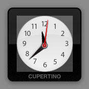

> 导航：[总目录](../../../README.md) · [documentation](../../../_indexes/documentation.md) · [WebKit DOM Programming Topics](index.md)

## Drawing Content

Safari, Dashboard, and WebKit-based applications support the JavaScript _canvas_ object. The canvas allows you to easily draw arbitrary content within your HTML content.

### About the Canvas

A canvas is an HTML tag that defines a custom drawing region within your web content. You can then access the canvas as a JavaScript object and draw upon it using features similar to Quartz’s drawing system. The World Clock Dashboard widget shows a good example, although using a canvas is by no means exclusive to Dashboard.

There are two steps to using a canvas in your webpage: defining a content area, and drawing to the canvas object in the script section of your HTML.

### Defining the Canvas

To use a canvas in your webpage, you first set up the drawing region. The World Clock Dashboard widget designates this region with the following code:

1. `<canvas id="myCanvas" width='172' height='172'></canvas>`

In this context, the attributes of `<canvas>` worth noting are `id`, `width`, and `height`.

The `id` attribute is a custom identifier used to target a particular canvas object when drawing. The `width` and `height` attributes specify the size of the canvas region.

Within the World Clock widget, this area is defined to be the canvas.

__Figure 2-1__The World Clock canvas region

Now that the canvas region has been defined, it is ready to be filled.

### Drawing on a Canvas

Once you have defined the canvas area, you can write code to draw your content. Before you can do this, you need to obtain the canvas and its drawing context. The context handles the actual rendering of your content. The World Clock widget does this in its `drawHands()` function:

1. `function drawHands (hoursAngle, minutesAngle, secondsAngle)`
2. `{`
3. `var canvas = document.getElementById("myCanvas");`
4. `var context = canvas.getContext("2d");`

This function draws the hour, minute, and second hands on the face of the World Clock. As parameters, it takes the angles at which the three hands should be rotated as passed in by its caller.

You first query the JavaScript environment for the previously defined canvas, using its unique identifier: the `id` attribute in the `<canvas>` tag.

Once your script has acquired the canvas, you need to obtain its context. Using the `getContext("2d")` method, assign the canvas’ draw context it to the `context` variable. From this point on, you call all operations intended for the canvas on `context`.

The first operation you perform empties the canvas. As the `drawHands()` function is called every second, it is important to empty it each time, so that the previously drawn configuration doesn’t simply draw on top of the new configuration. The entire region, as defined by standard coordinates in the `<canvas>` tag, is cleared:

1. `context.clearRect(0, 0, 172, 172);`

Next, you save the state of the original context space so that you can restore later. In the original context, the origin (the 0,0 coordinate) of the canvas is in the top left corner. Upon completion of the upcoming drawing code, you want to return to this context. Use the context’s save method to do so:

1. `context.save();`

Since you want the hands of the clock to rotate around the center of the clock, translate the origin of the context space to the center of the canvas:

1. `context.translate(172/2, 172/2);`

Then draw the hour hand on the face of the clock. You copy the current context (with the origin at the center of the clock face), so that it can restored later. Then, you rotate the entire context, so that the y-axis aligns itself with the angle that the hour hand should point towards. Next, you draw the hour hand image (created in the code as a JavaScript `Image` object). The method `drawImage()` has five parameters: the image to be drawn, the x and y coordinate for the bottom left hand corner of the image, and the width and height of the image. Remember that while you draw the image as going straight up within the graphics context, you rotated the context to be at the correct angle for the hour hand:

1. `context.save();`
2. `context.rotate(hoursAngle);`
3. `context.drawImage(hourhand, -4, -28, 9, 25);`
4. `context.restore();`

Once you draw the hand, you restore the last saved context. This means that the context that you saved four lines prior, with its origin at the center of the canvas but not yet rotated, will be the active context again.

Use a similar procedure to draw the minute hand on the face of the clock. The differences this time are in the angle you rotate the context to and the size of the minute hand. Note that you save and rotate the context again, and then you restore it to its previous state, so that you can draw the next element independent of the rotation needed for the minute hand:

1. `context.save();`
2. `context.rotate (minutesAngle);`
3. `context.drawImage (minhand, -8, -44, 18, 53);`
4. `context.restore();`

Finally, draw the second hand. Note that this time, the context should not be saved and restored. Since this is the last time anything will be drawn in this particular context (with the origin at the center of the canvas), it is not necessary for you to save and restore again:

1. `context.rotate (secondsAngle);`
2. `context.drawImage (sechand, -4, -52, 8, 57);`
3. `context.restore();`
4. `}`

Now that the clock face has been drawn, you should restore the context to its original state, as saved before any drawing occurred. This prepares the canvas for any future drawing that will occur, and gives you a consistent origin (the top-left corner of the canvas) to work from.

Remember, all of these techniques can be applied to a canvas object within any WebKit-based application. For more information on the canvas, see _[HTMLCanvasElement Class Reference](https://developer.apple.com/documentation/webkitjs/htmlcanvaselement)_.

### Accessing and Manipulating Canvas Data

Safari supports direct manipulation of the pixels of a canvas. You can obtain the raw pixel data of a canvas with the `getImageData()` function, and create a new buffer for manipulated pixels with the `createImageData()` function:

1. `var canvas = document.getElementById("myCanvas");`
2. `var context = canvas.getContext("2d");`
3. `var currentPixels = context.getImageData(0, 0, canvas.width, canvas.height);`
4. `var newPixels = context.createImageData(canvas.width, canvas.height);`

The `getImageData()` and `createImageData()` functions both return an `ImageData` object that contains pixel information in its `data` property. The `data` property is an array that contains four values between `0` and `255` for every pixel in the canvas. These values correspond to the red, green, blue, and alpha components of the pixel.

The following example loops through the `data` array of the `currentPixels` variable. For each pixel, it subtracts each color component’s value from `255` and assigns the result to the corresponding cell in the `data` array of the `newPixels` variable, thus creating an inverted copy of the image. The alpha value of every pixel is copied over without any manipulation. Finally, the `newPixels` variable is passed to the `putImageData()` function, which applies the new pixel values to the canvas.

1. `for (var y = 0; y < newPixels.height; y += 1) {`
2. `for (var x = 0; x < newPixels.width; x += 1) {`
3. `for (var c = 0; c < 3; c += 1) {`
4. `var i = (y*newPixels.width + x)*4 + c;`
5. `newPixels.data[i] = 255 - currentPixels.data[i];`
6. `}`
7. `var alphaIndex = (y*newPixels.width + x)*4 + 3;`
8. `newPixels.data[alphaIndex] = currentPixels.data[alphaIndex];`
9. `}`
10. `}`
11. `context.putImageData(newPixels, 0, 0);`

You can also obtain a data URL representation of the image of a canvas with the `toDataURL()` function. This function returns a PNG encoding of the image when no parameters are passed. You can obtain other image formats by passing in a string indicating the desired format, such as `image/jpg` or `image/gif`.

### Other Resources

For more detailed information about canvas, including how to optimize your canvas for the Retina display, read _[Safari HTML5 Canvas Guide](../../Audio%20Video/Safari%20HTML5%20Canvas%20Guide/About%20Canvas.md#apple-f4xwc4dqnrsv64tfmyxwi33df52wszbpkridimbqgeydknbs)_.

[Using the Document Object Model](DOM.md#apple-f4xwc4dqnrsv64tfmyxwi33df52wszbpgmydambrgiztolkciffeosskifea)

[Cutting, Copying, and Pasting](CopyAndPaste.md#apple-f4xwc4dqnrsv64tfmyxwi33df52wszbpgmydambrgiztilkciffeosskifea)
