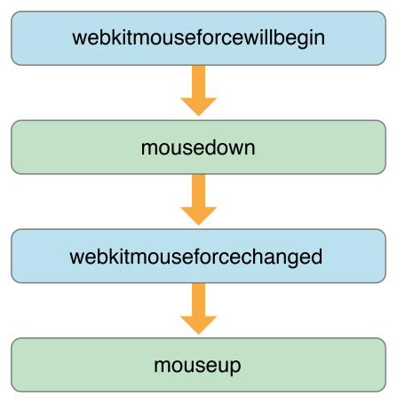
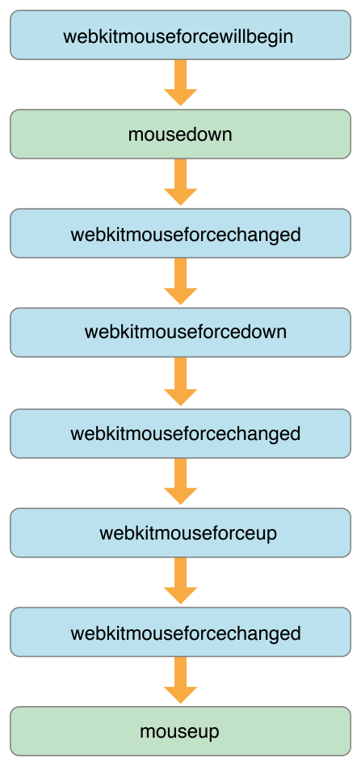

> 导航：[总目录](../../../README.md) · [documentation](../../../_indexes/documentation.md) · [WebKit DOM Programming Topics](index.md)

## Responding to Force Touch Events

Safari, Dashboard, and WebKit-based applications include support for responding to Force Touch events from within HTML pages. You can use these events to provide custom behaviors in response to actions such as force clicks and changes in pressure. For example, your webpage might open a link in a new window when the user force clicks the link, or play an embedded video faster as the user presses harder.

> [!NOTE]
> 

### JavaScript Force Touch Operations

Mouse events occur when the user performs an action with a mouse or trackpad, such as pressing down (`mousedown`) or releasing (`mouseup`). Force Touch events complement mouse events and occur when pressure changes on a Force Touch trackpad. Trackpads without Force Touch capability provide a `webkitForce` click value that is equivalent to `MouseEvent.WEBKIT_FORCE_AT_MOUSE_DOWN` on `mousedown`, `mouseup`, and click events.

### Force Touch Events

The DOM supports the following Force Touch events.

__Table 5-1__WebKit DOM Force Touch events

| Event name | Description |
| --- | --- |
| `webkitmouseforcewillbegin` | This event occurs immediately before the `mousedown` event. It allows you to prevent the default system behavior, such as displaying a dictionary window when force clicking on a word, in order to perform a custom action instead. To prevent the default system behavior, call the `preventDefault()` method on the event. |
| `webkitmouseforcedown` | This event occurs after the `mousedown` event, once enough force has been applied to register as a force click. The user receives haptic feedback representing the force click when this event occurs. |
| `webkitmouseforceup` | This event occurs after a `webkitmouseforcedown` event, once enough force has been released to exit the force click operation. The user receives haptic feedback representing the exit from force click when this event occurs. |
| `webkitmouseforcechanged` | This event occurs whenever a change in trackpad force is detected between the `mousedown` and `mouseup` events. |

### Force Touch Event Progression

The progression of Force Touch events is as follows. Figure 5-1 shows the progression of events when the user applies enough force to perform a normal click. Figure 5-2 shows the progression of events when the user applies enough force to perform a force click.

__Figure 5-1__Force Touch events during a normal click

__Figure 5-2__Force Touch events during a force click

### Listening for Force Touch Events

To listen for Force Touch events, call the `addEventListener()` method on an element. Pass it the name of the event to listen for, the name of a function to call when the event occurs, and a boolean indicating whether to perform the event at bubbling (`false`) or capturing (`true`). See Listing 5-1.

> [!NOTE]
> 

__Listing 5-1__Listening for and responding to Force Touch events

1. `function prepareForForceClick(event)`
2. `{`
3. `// Cancel the system's default behavior`
4. `event.preventDefault()`
5. `// Perform any other operations in preparation for a force click`
6. `}`
8. `function enterForceClick(event)`
9. `{`
10. `// Perform operations in response to entering force click`
11. `}`
13. `function endForceClick(event)`
14. `{`
15. `// Perform operations in response to exiting force click`
16. `}`
18. `function forceChanged(event)`
19. `{`
20. `// Perform operations in response to changes in force`
21. `}`
23. `function setupForceClickBehavior(someElement)`
24. `{`
25. `// Attach event listeners in preparation for responding to force clicks`
26. `someElement.addEventListener("webkitmouseforcewillbegin", prepareForForceClick, false);`
27. `someElement.addEventListener("webkitmouseforcedown", enterForceClick, false);`
28. `someElement.addEventListener("webkitmouseforceup", endForceClick, false);`
29. `someElement.addEventListener("webkitmouseforcechanged", forceChanged, false);`
30. `}`

### Gauging Levels of Force

The `webkitmouseforcechanged` event occurs when force changes between `mousedown` and `mouseup` events. However, you can determine the level of force at any time from any mouse event—including `mousedown`, `mousemove`, and `mouseup`—by checking the `webkitForce` property of the event. Compare this number value against the mouse event constants `MouseEvent.WEBKIT_FORCE_AT_MOUSE_DOWN` and `MouseEvent.WEBKIT_FORCE_AT_FORCE_MOUSE_DOWN` to determine whether the user has entered or is nearing a regular click or force click, as shown in Table 5-2 and Listing 5-2.

__Table 5-2__Levels of force

| Force level | Description |
| --- | --- |
| `MouseEvent.WEBKIT_FORCE_AT_MOUSE_DOWN` | Represents the amount of force required to perform a regular click. |
| `MouseEvent.WEBKIT_FORCE_AT_FORCE_MOUSE_DOWN` | Represents the force required to perform a force click. |

__Listing 5-2__Retrieving the force value of a Force Touch event

1. `function getEventData(event)`
2. `{`
3. `// Check to see if the event has a force property`
4. `if ("webkitForce" in event)`
5. `{`
6. `// Retrieve the force level`
7. `var forceLevel = event["webkitForce"];`
9. `// Retrieve the force thresholds for click and force click`
10. `var clickForce = MouseEvent.WEBKIT_FORCE_AT_MOUSE_DOWN;`
11. `var forceClickForce = MouseEvent.WEBKIT_FORCE_AT_FORCE_MOUSE_DOWN;`
13. `// Check for force level within the range of a normal click`
14. `if (forceLevel >= clickForce && forceLevel < forceClickForce)`
15. `// Perform operations in response to a normal click`
17. `// Check for force level within the range of a force click`
18. `} else if (forceLevel >= forceClickForce) {`
19. `// Perform operations in response to a force click`
20. `}`
21. `}`
22. `}`

> [!NOTE]
> 

### Other Resources

See [WWDC 2015: What's New in Web Development in WebKit and Safari](https://developer.apple.com/videos/wwdc/2015/?id=501).

[Dragging and Dropping](DragAndDrop.md#apple-f4xwc4dqnrsv64tfmyxwi33df52wszbpgmydambrgiztglkciffeosskifea)

[Fetching with XMLHttpRequest](XHR.md#apple-f4xwc4dqnrsv64tfmyxwi33df52wszbpkridimbqga3demrxfvjvomi)
