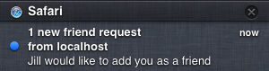
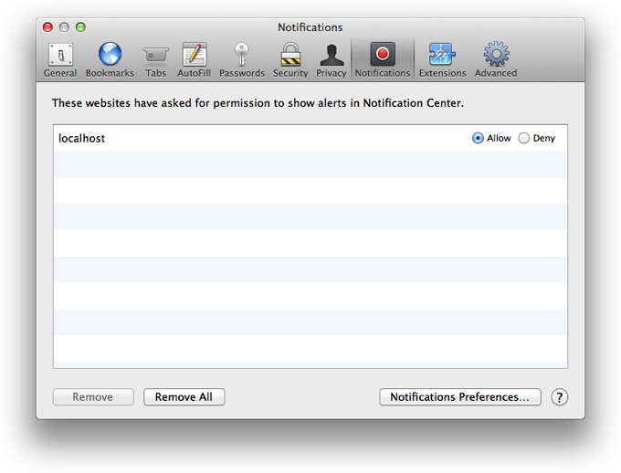
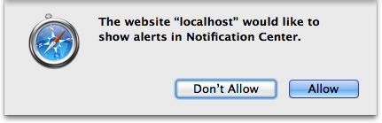

> 导航：[总目录](../../../README.md) · [documentation](../../../_indexes/documentation.md) · [WebKit DOM Programming Topics](index.md)

## Sending Notifications

Web pages in Safari can post notifications to the systemwide notification system known as _Notification Center_. Notifications are dispatched by the WebKit `Notification` object and follow the implementation outlined by the [W3C specification](http://dev.w3.org/2006/webapi/WebNotifications/publish/Notifications.html).

### Setting Notification Preferences

Users can set notification preferences for Safari in two places. Notifications from Safari respect the user’s system setting in the Notifications pane of System Preferences. Some users might want Safari’s notifications to display as alerts, which stay on the screen until dismissed, while others might choose not to display notifications at all. Additionally, users can set their notification preference on a per-domain basis in the Notifications pane in Safari’s preferences, as shown in Figure 7-1, granting permission for some websites to send notifications while denying permission to others.

__Figure 7-1__Notification preference pane in Safari

Because some users may have configured their system or browser to block your notifications, be sure you present only information that is informative—but not crucial.

### Requesting Permission

> [!NOTE]
> 

Because your website’s visitors could be running other operating systems, you should first determine whether notifications are supported by their browser. You can do this by asserting that the `window.Notification` object is not undefined.

If the `window.Notification` object does indeed exist, you can continue to check for permissions by accessing the `permission` property. There are three possible states `permission` can return:

- `default`: The user has not yet specified whether they approve of notifications being sent from this domain
- `granted`: The user has given permission for notifications to be sent from this domain
- `denied`: The user has denied permission for notifications to be sent from this domain

If the permission level is `default`, it is likely that the user hasn’t yet been prompted to grant access to notifications from your domain. Prompt your users with the Safari native dialog box, as shown in Figure 7-2, by calling the `requestPermission()` function. This function accepts one parameter, a callback function, which executes when the user grants or denies permission.

__Figure 7-2__Dialog box prompting for permission

### Creating and Interacting with Notifications

Creating a notification is as simple as creating a new object.

1. `var n = new Notification(in String`
2. `title`
3. `[, in Object`
4. `options`
5. `]);`

The only required parameter is the title. Available keys that can be included in the `options` object are as follows:

- `body`: The notification’s subtitle.
- `tag`: The notification’s unique identifier. This prevents duplicate entries from appearing in Notification Center if the user has multiple instances of your website open at once.

The notification is placed in a queue and will be shown when no notifications precede it. The subtitle is always the domain or extension name from which the notification originated, and the icon is always the Safari icon.

> [!NOTE]
> 

The notification stays in Notification Center until the user explicitly clears all notifications from Safari, or until you close the notification programmatically. To close notifications programmatically, call the `close()` function on the notification object. If you want to, for example, remove notifications from Notification Center immediately after they are clicked, call `close()` in the notification’s `onclick` event handler. The `onclick` event handler, among others, are further described in Table 7-1.

To add functionality to notifications, attach functions to event listeners on the notification objects. The following events are available.

__Table 7-1__Available notification events

| Event handler | Description |
| --- | --- |
| `onshow` | An event that fires when the notification is first presented onscreen. |
| `onclick` | An event that fires if the user clicks on the notification as an alert, a banner, or in Notification Center. By default, clicking a notification brings the receiving window into focus, even if another application is in the foreground. |
| `onclose` | An event that fires when the notification is dismissed, or closed in Notification Center. Calling `close()` on the notification object will trigger the `onclose` event handler. |
| `onerror` | An event that fires when the notification cannot be presented to the user. This event is fired if the permission level is set to `denied` or `default`. |

Listing 7-1 illustrates how to send a notification while adhering to the user’s permission level.

__Listing 7-1__JavaScript implementation of notification support

1. `var notify = function() {`
2. `// check for notification compatibility`
3. `if(!window.Notification) {`
4. `// if browser version is unsupported, be silent`
5. `return;`
6. `}`
7. `// log current permission level`
8. `console.log(Notification.permission);`
9. `// if the user has not been asked to grant or deny notifications from this domain`
10. `if(Notification.permission === 'default') {`
11. `Notification.requestPermission(function() {`
12. `// callback this function once a permission level has been set`
13. `notify();`
14. `});`
15. `}`
16. `// if the user has granted permission for this domain to send notifications`
17. `else if(Notification.permission === 'granted') {`
18. `var n = new Notification(`
19. `'1 new friend request',`
20. `{`
21. `'body': 'Jill would like to add you as a friend',`
22. `// prevent duplicate notifications`
23. `'tag' : 'unique string'`
24. `}`
25. `);`
26. `// remove the notification from Notification Center when it is clicked`
27. `n.onclick = function() {`
28. `this.close();`
29. `};`
30. `// callback function when the notification is closed`
31. `n.onclose = function() {`
32. `console.log('Notification closed');`
33. `};`
34. `}`
35. `// if the user does not want notifications to come from this domain`
36. `else if(Notification.permission === 'denied') {`
37. `// be silent`
38. `return;`
39. `}`
40. `};`

[Fetching with XMLHttpRequest](XHR.md#apple-f4xwc4dqnrsv64tfmyxwi33df52wszbpkridimbqga3demrxfvjvomi)

[Cross-Document Messaging](Cross-documentmessaging.md#apple-f4xwc4dqnrsv64tfmyxwi33df52wszbpkridimbqga4dcnzvfvjvomi)
