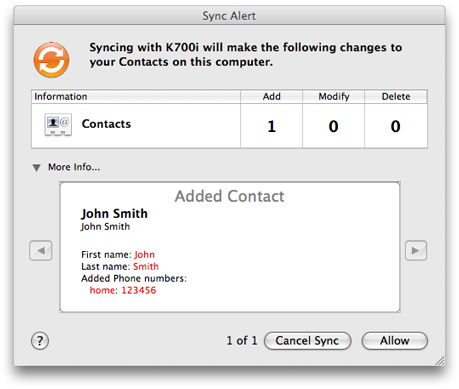

> 导航：[总目录](../../../README.md) · [documentation](../../../_indexes/documentation.md) · [iSync Manual Test Suite Guide](Introduction%20to%20iSync%20Manual%20Test%20Suite%20Guide.md)

[Next](General%20Tests.md)[Previous](Introduction%20to%20iSync%20Manual%20Test%20Suite%20Guide.md)

# Common Steps

This chapter covers some common steps when testing iSync plug-ins. Before running any tests the device needs to connected to the computer. It is also recommended that you turn Sync Alert panels on so you can observe what records are being synced. You also need to be familiar with running Apple Applications such as iCal and Address Book. Some tests also use the Syncrospector developer tool.

If the device uses USB only, then connect the USB cable to the device and computer before running any tests. There is no other setup required to use USB.

If the device uses Bluetooth only, then pair the device with the computer before running any tests. This step needs to be done only once per device. Use the Bluetooth pane in System Preferences to pair a Bluetooth device. Choose Help > System Preferences Help to learn more about setting up a Bluetooth connection.

If the device uses both Bluetooth and USB, then run some of the tests using Bluetooth and others using USB. Note that if you pair a Bluetooth device with the computer, you can no longer use the USB connection. Therefore, for devices that support both, delete the device from the Bluetooth pane in System Preferences before using the USB connection.

Before running any of the tests in this document, you should configure the iSync preferences so an alert appears each time the device changes the state of the truth—each time the device adds, modifies, or deletes records—as follows:

- _To set the data change alert to “any” in iSync_, choose iSync > Preferences, enable the “Show Data Change Alert when” option, and choose “any” from the adjacent pop-up menu.

  When a Sync Alert panel appears as shown in Figure 1-1, click the triangle at the bottom of the panel to reveal more information about the changes. Use this panel to verify the changes and optionally, cancel the sync session.

  __Figure 1-1__  Sync Alert panel

  

Some of the steps described in this document involve running Apple applications and tools to set up the records on the computer. You are expected to be able to perform common tasks such as adding records to the computer and syncing the device. You should be familiar with these Apple applications before running these tests:

- Use iSync to sync the device.

  For example, assuming your iSync plug-in is installed, launch iSync and choose Devices > Add Device. Double-click the device in the Add Device window to add it to iSync. Select the device in the iSync window to configure options such as which databases to sync to the device. Choose Sync Devices to sync the device.

  Choose Help > iSync Help to learn more about iSync.
- Use Address Book to add, delete, and modify contacts on the computer.

  For example, launch Address Book and click the plus button at the bottom of the Name column to add a contact. Choose Help > Address Book to learn more about Address Book.
- Use iCal to add, delete, and modify events and tasks on the computer.

  For example, launch iCal and double-click anywhere in the calendar view to create an event. Use the information sheet that appears on the right side of the iCal window to edit the fields of an event.

  Choose Help > iCal to learn more about iCal.

Note that most tests in this document assume that when you add a record, you populate all fields for that record.

Some of the tests require you to use this developer tool, Syncrospector, located in `/Developer/Applications/Utilities`, to help debug your sync sessions. You can use Syncrospector during testing to force sync modes such as slow, fast, or reset. Read _Sync Services Tutorial_ to learn more about Syncrospector.

[Next](General%20Tests.md)[Previous](Introduction%20to%20iSync%20Manual%20Test%20Suite%20Guide.md)

