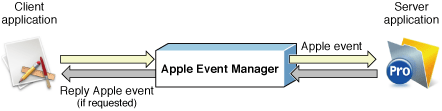
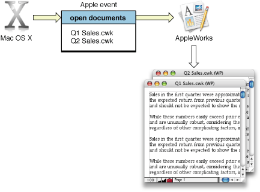

> 导航：[总目录](../../../README.md) · [documentation](../../../_indexes/documentation.md) · [Apple Events Programming Guide](Introduction%20to%20Apple%20Events%20Programming%20Guide.md)

[Next](Building%20an%20Apple%20Event.md)[Previous](Introduction%20to%20Apple%20Events%20Programming%20Guide.md)

# About Apple Events

This chapter provides an overview of when and how applications use Apple events, with links to more detailed information on those topics. It also provides a brief description of the framework and language support available for working with Apple events in Mac OS X.

An _Apple event_ is a type of interprocess message that can encapsulate commands and data of arbitrary complexity. Apple events provide a data transport and event dispatching mechanism that can be used within a single application, between applications on the same computer, and between applications on different computers connected to a network. The Mac OS uses Apple events to communicate with applications.

Apple events are part of the _Open Scripting Architecture (OSA)_, which provides a standard and extensible mechanism for interapplication communication in Mac OS X. The OSA is described in _[AppleScript Overview](../AppleScript%20Overview/Introduction%20to%20AppleScript%20Overview.md#apple-f4xwc4dqnrsv64tfmyxwi33df52wszbpgeydambqge2tm2i)_.

Apple events are designed to provide a flexible mechanism for interprocess communication. An Apple event specifies a target application (or other process) and provides a detailed description of an operation to perform. The operating system locates the target, delivers the event and, if necessary, delivers a reply Apple event back to the sender. While simple in concept, this mechanism provides a basis for powerful interaction between processes and for automating tasks that use multiple applications.

An application is most likely to work with Apple events for the following reasons:

- To respond to Apple events received from the Mac OS.

  For applications that present a graphical user interface, Mac OS X sends Apple events to initiate certain operations, such as launching or quitting the application.

  For Cocoa applications, most of the work of responding to these events happens automatically. Carbon applications need to provide more of their own implementation—for details, see [Handling Apple Events Sent by the Mac OS](Responding%20to%20Apple%20Events.md#apple-f4xwc4dqnrsv64tfmyxwi33df52wszbpkridimbqgaytinbzfvbuqmrqgywuerkkijcekr2j).
- To make its services or data available to other processes.

  Most applications that provide services through Apple events are scriptable applications—they provide a scripting terminology that lets users write AppleScript scripts to access the application’s operations and data. When a script is executed, some of its statements result in Apple events being sent to the application. Other applications can also send Apple events directly to scriptable applications.

  Scriptable applications make it possible for users to automate their work. And starting in Mac OS X version 10.4, your scriptable application can also provide users with Automator actions. (Automator is an application that lets users work in a graphical interface to put together complex, automated workflows, made up of actions that perform discrete operations.)

  Scriptable Carbon applications can use the techniques for working with Apple events that are described throughout this document. For information on scriptable Cocoa applications, see [Framework and Language Support](#apple-f4xwc4dqnrsv64tfmyxwi33df52wszbpkridimbqgaytinbzfvbuqmrqgiwugrkhjfeugqsi).

  For information on designing and creating scriptable applications, and on creating Automator actions, see the learning paths in _Getting Started with AppleScript_.
- To communicate directly with other applications.

  An application can send an Apple event to ask another application to perform an operation or return data. For example, you might create a scriptable server application, running locally or remotely. Your other applications create Apple events and send them to the scriptable server to access its services. This is, in effect, another way to factor your code, with the shared functionality made available through Apple events.
- To support recording in a scriptable application.

  _Recording_ refers to the assembling of Apple events that represent a user’s actions into a script. Users can turn on recording in the Script Editor application, then perform actions with scriptable applications that support recording. Any Apple events generated by those actions are recorded into an AppleScript script. To support recording as fully as possible, you can take these steps:

  - Factor code that implements the user interface in your application from code that actually performs operations—this is a standard approach for applications that follow the model-view-controller design paradigm.
  - Send Apple events within the application to connect these two parts of your application. The Apple Event Manager provides a mechanism for doing this with a minimum of overhead, described in [Addressing an Apple Event for Direct Dispatching](Creating%20and%20Sending%20Apple%20Events.md#apple-f4xwc4dqnrsv64tfmyxwi33df52wszbpkridimbqgaytinbzfvbuqmrqhewueqkciveuuq2b).
  - Make sure that any significant action within your application generates an Apple event that can be recorded in a script.

  Recording is beyond the scope of this document, but you can read more about it in the sections [“Recordable Applications”](https://developer.apple.com/documentation/mac/IAC/IAC-20.html#HEADING20-0) and [“Making Your Application Recordable”](https://developer.apple.com/documentation/mac/IAC/IAC-295.html#HEADING295-0) in [Inside Macintosh: Interapplication Communication](https://developer.apple.com/documentation/mac/IAC/IAC-2.html).

A scriptable application specifies the terminology that can be used in scripts that target the application. There are currently three formats for this information:

- _aete:_ This is the original dictionary format and is still used in Carbon applications. The name comes from the Resource Manager resource type in which the information is stored (`'aete'`).
- _script suite:_ This is the original format used by Cocoa applications. A script suite contains a pair of information property list (plist) files.
- _sdef:_ “sdef” is short for “scripting definition.” This XML-based format is a superset of the other two formats and supports additional features.

For more information on these formats, including pointers to additional documentation, see "Scriptable Applications" in [Open Scripting Architecture](https://developer.apple.com/library/archive/documentation/AppleScript/Conceptual/AppleScriptX/Concepts/osa.html#//apple_ref/doc/uid/TP40001571) in _[AppleScript Overview](../AppleScript%20Overview/Introduction%20to%20AppleScript%20Overview.md#apple-f4xwc4dqnrsv64tfmyxwi33df52wszbpgeydambqge2tm2i)_.

Applications typically use Apple events to request services and information from other applications or to provide services and information in response to such requests. In client-server terms, the _client application_ sends an Apple event to request a service or information from the _server application_. The recipient of an Apple event is also known as the _target application_ because it is the target of the event. A client application must know which kinds of Apple events the server supports.

__Figure 1-1__  Client and server applications communicating with Apple events

Figure 1-1 shows two applications communicating with Apple events. The client uses Apple Event Manager functions to create and send an Apple event to the server, the FileMaker Pro database application. The event might, for example, request employee information from a payroll database. FileMaker Pro uses other Apple Event Manager functions to extract information from the event and identify the requested operation. Depending on the event, FileMaker Pro may need to add a record, delete a record, or return specified information in a reply Apple event.

The most common Apple event client is a script editor application executing an AppleScript script. Statements in a script that target an application may result in Apple events being sent to the application. Another common client is the Mac OS, which sends Apple events to applications to open documents and perform other operations.

The most common servers are scriptable applications and scriptable parts of the Mac OS, such as the Finder and the System Events application (located in `/System/Library/CoreServices`). You can read more about script editors and scriptable applications in _[AppleScript Overview](../AppleScript%20Overview/Introduction%20to%20AppleScript%20Overview.md#apple-f4xwc4dqnrsv64tfmyxwi33df52wszbpgeydambqge2tm2i)_.

Your application should be prepared to respond to Apple events sent by the Mac OS, as well as to other Apple events the application supports. An Apple event typically contains information that specifies the target application, the action to perform, and optionally the objects on which to operate. For example, Figure 1-2 shows an `open documents` Apple event sent by Mac OS X to the AppleWorks application. This type of Apple event provides a list of files for the target application to open.

__Figure 1-2__  The Mac OS sending an open documents Apple event

For an application to handle a specific Apple event such as the `open documents` event, it must register with the Apple Event Manager a function that handles events of that type. The Apple Event Manager dispatches a received Apple event to the handler registered for it. An _Apple event handler_ is an application-defined function that extracts pertinent data from an Apple event, performs the requested action, and if necessary, returns a result.

The steps your application takes in working with Apple events will differ, depending on whether it is responding to Apple events or creating and sending them.

To respond to Apple events in your application, you perform steps like the following:

- Determine which Apple events your application will support.
- Make sure your application can receive Apple events and dispatch them to a function that can handle them.

  - Write functions that handle the Apple events you support.
  - Register the functions with the Apple Event Manager so it can dispatch events to them.
- Call Apple Event Manager functions to extract information from received Apple events and locate specified items in your application.
- Perform the actions specified by received Apple events.
- If necessary, add information to a reply Apple event (sent to you as part of a received Apple event).

  If an error occurs, return an error code; you can also add error information to the reply event.

For guidelines and sample code for performing these steps, see [Apple Event Dispatching](Apple%20Event%20Dispatching.md#apple-f4xwc4dqnrsv64tfmyxwi33df52wszbpkridimbqgaytinbzfvbuqmrqgqwueqkcirauur2c) and [Responding to Apple Events](Responding%20to%20Apple%20Events.md#apple-f4xwc4dqnrsv64tfmyxwi33df52wszbpkridimbqgaytinbzfvbuqmrqgywueqkcirauur2c).

To create and send Apple events in your application, you perform steps like the following:

- Create an Apple event.

  The Apple Event Manager provides functions for building an Apple event in one step and for creating an Apple event and adding information to it as a sequence of steps.
- Send the Apple event.

  The Apple Event Manager provides functions for sending an event with more options and more overhead, or with less options and less overhead.

  You will have to specify information such as

  - the target application to send the Apple event to
  - how to handle a timeout (in case the target doesn’t respond)
  - whether to allow interaction with the user (for example, if the Apple event might result in showing a dialog)

For guidelines and sample code for performing these steps, see [Two Approaches to Creating an Apple Event](Building%20an%20Apple%20Event.md#apple-f4xwc4dqnrsv64tfmyxwi33df52wszbpkridimbqgaytinbzfvbuqmrqgmwugrkhirbumrkk) and [Creating and Sending Apple Events](Creating%20and%20Sending%20Apple%20Events.md#apple-f4xwc4dqnrsv64tfmyxwi33df52wszbpkridimbqgaytinbzfvbuqmrqhewueqkcirauur2c).

You work with Apple events primarily through the API defined by the Apple Event Manager, which is documented in _[Apple Event Manager Reference](https://developer.apple.com/documentation/applicationservices/apple_event_manager)_. This API is implemented by the AE framework, a subframework of the Application Services framework, and is made available through headers written in the C programming language.

Carbon applications that work with Apple events, whether written in C or C++, typically call Apple Event Manager functions directly. Apple also provides C sample code, such as _[MoreOSL](../../../samplecode/MoreOSL/MoreOSL.md#apple-f4xwc4dqnrsv64tfmyxwi33df52wszbpirkfgmjqgaydanrxga)_, to help in the implementation of scriptable Carbon applications.

Cocoa applications are written in Objective-C or Java. The Cocoa application framework provides built-in support for AppleScript scripting that allows many applications to be scriptable without working directly with Apple Event Manager functions. The Cocoa application framework also includes classes such as [NSAppleEventDescriptor](https://developer.apple.com/documentation/foundation/nsappleeventdescriptor), for working with underlying Apple event data structures, and [NSAppleEventManager](https://developer.apple.com/documentation/foundation/nsappleeventmanager), for accessing certain Apple Event Manager functions.

However, because Objective-C is a super set of the C language, Cocoa applications written in Objective-C can call Apple Event Manager functions directly and use any of the mechanisms described in this document. For example, a Cocoa application might use Apple Event Manager functions to perform operations that are not currently supported by the Cocoa framework, such as directly sending an Apple event. For details on writing a scriptable Cocoa application, see _[Cocoa Scripting Guide](../../Cocoa/Cocoa%20Scripting%20Guide/Introduction%20to%20Cocoa%20Scripting%20Guide.md#apple-f4xwc4dqnrsv64tfmyxwi33df52wszbpkridimbqgazdcnru)_.

[Next](Building%20an%20Apple%20Event.md)[Previous](Introduction%20to%20Apple%20Events%20Programming%20Guide.md)

