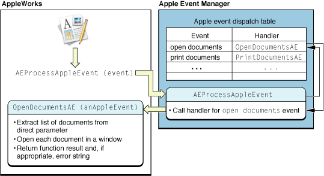

> 导航：[总目录](../../../README.md) · [documentation](../../../_indexes/documentation.md) · [Apple Events Programming Guide](Introduction%20to%20Apple%20Events%20Programming%20Guide.md)


[Next](Working%20With%20the%20Data%20in%20an%20Apple%20Event.md)[Previous](Building%20an%20Apple%20Event.md)

# Apple Event Dispatching

This chapter shows how your application works with the Apple Event Manager to register the Apple events it supports and dispatch those events to the appropriate Apple event handlers. An _Apple event handler_ is an application-defined function that extracts pertinent data from an Apple event, performs the requested action, returns a result code, and if necessary, returns information in a reply Apple event.

Apple event dispatching works by a simple process:

- Your application registers Apple event handler functions with the Apple Event Manager for all the types of Apple events it can work with. A handler may handle just one type of Apple event or multiple types.
- The Apple Event Manager creates an Apple event dispatch table for your application. A _dispatch table_ maps the Apple events your application supports to the Apple event handlers it provides.
- When your application receives an Apple event, it calls an Apple Event Manager function to process the event. If your dispatch table contains an entry for the event, the Apple Event Manager calls the associated handler.

You build an Apple event dispatch table by making calls to the function `AEInstallEventHandler` to register (or install) the events your application can handle and the functions that handle them. An Apple event is uniquely identified by the four-character codes specified by its event class and event ID attributes (described in [Event Class and Event ID](Building%20an%20Apple%20Event.md#apple-f4xwc4dqnrsv64tfmyxwi33df52wszbpkridimbqgaytinbzfvbuqmrqgmwvgvzr)). These codes are the values your application uses to register event handler functions with the Apple Event Manager, and they are the values stored in the dispatch table. For example, a `delete` Apple event has an event class value of `'core'` (represented by the constant `kAECoreSuite`) and an event ID value of `'delo'` (`kAEDelete`).

When you install a handler function for an Apple event, you provide the following information:

- The event class and event ID of the Apple event; you can also specify wildcard values to register a handler for more than one event class or event ID.
- The address of the Apple event handler for the Apple event.
- An optional reference constant for passing additional information to the event handler.
- A Boolean value indicating whether the handler should be installed in the application dispatch table or the system dispatch table (you typically install handlers in the application dispatch table).

If you install a handler and there is already an entry in the dispatch table for the same event class and event ID, the entry is replaced. You can also specifically remove a handler with the function `AERemoveEventHandler` or get a handler (if it is present) with the function `AEGetEventHandler`.

An Apple event handler should return the value `errAEEventNotHandled` if it does not handle an event that is dispatched to it but wants to allow the event to be redispatched to another handler, if one is available.

You have several options in how you install event handlers:

- You can individually register, by event class and event ID, each of the Apple events that your application supports.

  - If you provide a separate event handler for each event, each handler will always knows exactly which type of event was dispatched to it.
  - If you provide the same handler for more than one event, a handler will need to do some work to determine which event it has received.

    For example, you might supply a different refcon value for each registered event type so that the event handler can examine its refcon parameter to determine how to respond.

    Or you might have your handler examine the event ID attribute of the passed Apple event (which requires an additional call to an Apple Event Manager function).
- You can use the `typeWildCard` constant for either the event class or the event ID (or for both), allowing multiple Apple events to be dispatched to a single handler, while minimizing the number of calls to `AEInstallEventHandler`. A handler can then examine the actual event class or event ID attribute of a received event to determine how to respond.

There are several reasons why you might choose to use a wildcard handler. For example, early in the development process, you may want to combine many events in one handler, then add (and register) more specific handlers at a later time. Or your application may support operations on a large number of objects that are nearly identical—rather than install many handlers that duplicate some of their code, you may prefer to install a wildcard handler.

If an Apple event dispatch table contains one entry for an event class and a specific event ID, and another that is identical except that it specifies a wildcard value for the event class or event ID, the Apple Event Manager dispatches to the more specific entry. For example, suppose the dispatch table includes one entry with event class `kAECoreSuite` and event ID `kAEDelete`, and another with event class `kAECoreSuite` and event ID `typeWildCard`. If the application receives a `delete` Apple event, it is dispatched to the handler function associated with the event ID `kAEDelete`.

When you call `AEInstallEventHandler`, you have the option of installing an Apple event handler in the application dispatch table or in the system dispatch table. When an event is dispatched, the Apple Event Manager checks first for a matching handler in the application dispatch table, then in the system dispatch table.

In Mac OS X, you should generally install all handlers in the application dispatch table. For Carbon applications running in Mac OS 8 or Mac OS 9, a handler in the system dispatch table could reside in the system heap, where it would be available to other applications. However, this won’t work in Mac OS X.

To dispatch Apple events in your application, you perform the following steps:

1. Determine which Apple events your application will respond to and write event handler functions for those events.
2. Call the Apple Event Manager function `AEInstallEventHandler` to install your handlers.
3. Make sure your application processes Apple events correctly so that they are dispatched to the appropriate handler.

   The process for this step varies depending on how your application handles events in general.

These steps are described in the following sections.

All applications that present a graphical user interface through the Human Interface Toolbox should respond to certain events sent by the Mac OS, such as the `open application`, `open documents`, and `quit` events. These are described in [Handling Apple Events Sent by the Mac OS](Responding%20to%20Apple%20Events.md#apple-f4xwc4dqnrsv64tfmyxwi33df52wszbpkridimbqgaytinbzfvbuqmrqgywuerkkijcekr2j). These events can also be sent by other applications.

Your application also responds to any Apple events it has specified for working with its commands and data. To handle Apple events that your application defines, it registers handlers for the event class and event ID values you have chosen for those events. As noted, you can register wildcard values to dispatch multiple events to one or more common handlers.

Listing 3-1 shows how your application calls `AEInstallEventHandler` to install an Apple event handler function. The listing assumes that you have defined the function `InstallMacOSEventHandlers` to install handlers for Apple events that are sent by the Mac OS—that function is shown in [Listing 5-6](Responding%20to%20Apple%20Events.md#apple-f4xwc4dqnrsv64tfmyxwi33df52wszbpkridimbqgaytinbzfvbuqmrqgywueqkci5deiscd).

Listing 3-1 also assumes you have defined the functions `HandleGraphicAE` and `HandleSpecialGraphicAE` to handle Apple events that operate on graphic objects used by your application. That function is not shown, but other event handlers are described in [Responding to Apple Events](Responding%20to%20Apple%20Events.md#apple-f4xwc4dqnrsv64tfmyxwi33df52wszbpkridimbqgaytinbzfvbuqmrqgywueqkcirauur2c).

__Listing 3-1__  Installing event handlers for various Apple events

```
static  OSErr   InstallAppleEventHandlers(void)
{
    OSErr   err;

    err = InstallMacOSEventHandlers();
    require_noerr(err, CantInstallAppleEventHandler);

    err = AEInstallEventHandler(kMyGraphicEventClass, kSpecialID,
            NewAEEventHandlerUPP(HandleSpecialGraphicAE), 0, false);// 1
    require_noerr(err, CantInstallAppleEventHandler);

    err = AEInstallEventHandler(kMyGraphicEventClass, typeWildCard,
                NewAEEventHandlerUPP(HandleGraphicAE), 0, false);// 2
    require_noerr(err, CantInstallAppleEventHandler);

CantInstallAppleEventHandler:
    return err;
}
```

In Listing 3-1, the application-defined function `InstallAppleEventHandlers` uses the macro `require_noerr` (defined in `AssertMacros.h`) to check the return value of each function. If an error occurs, it jumps to an error label. The function always returns an error value, which can be `noErr` if no error occurred.

The following descriptions apply to the numbered lines in Listing 3-1:

1. The application-defined function `HandleSpecialGraphicAE` handles Apple events that deal with one specific type of graphic object supported by the application, identified by the event class `kMyGraphicEventClass` and event ID `kSpecialID`.
2. The application-defined function `HandleGraphicAE` handles Apple events that deal with the application’s other graphic objects. It is installed with an event ID of `typeWildCard`, an Apple Event Manager constant that matches any event ID. As a result, the `HandleGraphicAE` function will be called to handle any received Apple event with event class `kMyGraphicEventClass`, except those with the event ID `kSpecialID`.

Both of the numbered calls to `AEInstallEventHandler` provide the event class, event ID, and address of an Apple event handler. The `NewAEEventHandlerUPP` function creates a universal procedure pointer to a handler function. The value of `0` passed for the reference constant indicates the application does not need to pass additional information to the event handler function.

Each call to `AEInstallEventHandler` also passes a Boolean value of `false`, indicating the handler should be installed in the application dispatch table, not the system dispatch table.

How your application processes Apple events depends on how it processes events in general—whether it uses the modern Carbon event model (described in _[Carbon Event Manager Programming Guide](../../Carbon/Carbon%20Event%20Manager%20Programming%20Guide/Introduction%20to%20Carbon%20Event%20Manager%20Programming%20Guide.md#apple-f4xwc4dqnrsv64tfmyxwi33df52wszbpkridgmbqgaydsobz)_), or relies on the older `WaitNextEvent` function. In either case, your application receives events from the operating system, some of which represent Apple events. The application dispatches these events to its Apple event handlers by calling the Apple Event Manager function `AEProcessAppleEvent`.

Figure 3-1 provides a conceptual view of the dispatching mechanism. It shows the flow of control between the AppleWorks application and the Apple Event Manager when the application receives an `open documents` event and calls `AEProcessAppleEvent`.

__Figure 3-1__  An application working with the Apple Event Manager to dispatch an open documents Apple event



The `AEProcessAppleEvent` function takes an event of type `EventRecord` and looks up the Apple event it refers to in the application’s dispatch table. If it finds a handler function for the Apple event, it calls the function, passing the Apple event.

The following sections describe in detail how an application calls the `AEProcessAppleEvent` function.

An application that uses the Carbon event model receives each Apple event as a Carbon event of type `{kEventClassAppleEvent, kEventAppleEvent}`. For applications that call the `RunApplicationEventLoop` function to process Carbon events, the `AEProcessAppleEvent` function is called automatically, and dispatches received Apple events as shown in Figure 3-1.

Applications that use the Carbon event model but do not call `RunApplicationEventLoop` must install a Carbon event handler to process Apple events. Listing 3-2 shows how you might install such a handler—in this case, named `AEHandler`.

__Listing 3-2__  Installing a Carbon event handler to handle Apple events

```
const EventTypeSpec kEvents[] = {{kEventClassAppleEvent, kEventAppleEvent}};

InstallApplicationEventHandler(NewEventHandlerUPP(AEHandler),
    GetEventTypeCount(kEvents), kEvents, 0, NULL);
```

Your Carbon event handler for Apple events must perform these steps:

1. Remove the Carbon event of type `{kEventClassAppleEvent, kEventAppleEvent}` from the event queue before dispatching the Apple Event inside it.

   The process of removing the event from the queue triggers a synchronization with the Apple Event Manager that allows the next call to `AEProcessAppleEvent` to dispatch the Apple event properly. If the handler doesn’t remove the Carbon event from the queue, the application will end up dispatching the wrong Apple event.
2. Call `ConvertEventRefToEventRecord` to get an `EventRecord` to pass to `AEProcessAppleEvent`.
3. Call `AEProcessAppleEvent`.
4. Return `noErr` to indicate the Carbon event has been handled (which does not depend on whether the dispatched Apple event is handled by the application).

Listing 3-3 shows a version of the `AEHandler` function.

__Listing 3-3__  A handler for a Carbon event that represents an Apple event

```
OSStatus AEHandler(EventHandlerCallRef inCaller, EventRef inEvent, void* inRefcon)
{
    Boolean     release = false;
    EventRecord eventRecord;
    OSErr       ignoreErrForThisSample;

    // Events of type kEventAppleEvent must be removed from the queue
    //  before being passed to AEProcessAppleEvent.
    if (IsEventInQueue(GetMainEventQueue(), inEvent))
    {
        // RemoveEventFromQueue will release the event, which will
        //  destroy it if we don't retain it first.
        RetainEvent(inEvent);
        release = true;
        RemoveEventFromQueue(GetMainEventQueue(), inEvent);
    }

    // Convert the event ref to the type AEProcessAppleEvent expects.
    ConvertEventRefToEventRecord(inEvent, &eventRecord);
    ignoreErrForThisSample = AEProcessAppleEvent(&eventRecord);

    if (release)
        ReleaseEvent(inEvent);

    // This Carbon event has been handled, even if no AppleEvent handlers
    //  were installed for the Apple event.
    return noErr;
}
```

If your application has not installed a handler for a received Apple event, the event may be handled by a handler installed by the system. For example, if your application calls `RunApplicationEventLoop`, a simple `quit application` handler is installed automatically. But if you call `AEProcessAppleEvent` for an event for which there is no handler installed, the event is ignored.

A Carbon application that uses the `WaitNextEvent` function, rather than the Carbon event model, receives an Apple event in its event loop as a standard event record (type `EventRecord`), identified by the constant `kHighLevelEvent`. The application passes these events to `AEProcessAppleEvent`, as shown in the following code listings.

Listing 3-4 shows a simplified main event loop function which continually loops, getting events and calling the `HandleEvent` function (in Listing 3-5) to process them.

__Listing 3-4__  A main event loop

```
static void MainEventLoop()
{
    RgnHandle       cursorRgn;
    Boolean         gotEvent;
    EventRecord     event;

    cursorRgn = NULL;
    while(!gQuit)
    {
        gotEvent = WaitNextEvent(everyEvent, &event, 32767L, cursorRgn);

        if (gotEvent)
        {
            HandleEvent(&event);
        }
    }
}
```

Listing 3-5 shows a standard approach for processing event records. When the value in the `what` field of the event record is `kHighLevelEvent`, the function calls `AEProcessAppleEvent`, which dispatches the event as shown in Figure 3-1.

__Listing 3-5__  A function that processes Apple events

```swift
static void HandleEvent(EventRecord *event)
{
    switch (event->what)
    {
        case mouseDown:
            HandleMouseDown(event);
            break;

        case keyDown:
        case autoKey:
            HandleKeyPress(event);
            break;

        case kHighLevelEvent:
            AEProcessAppleEvent(event);
            break;
    }
}
```

Listing 3-4 and Listing 3-5 are based on functions in the Xcode project `AppearanceSample`, located in `/Developer/Examples/Carbon`.

[Next](Working%20With%20the%20Data%20in%20an%20Apple%20Event.md)[Previous](Building%20an%20Apple%20Event.md)

