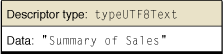
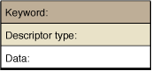
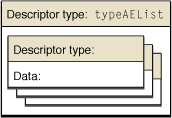
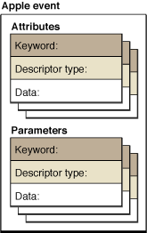
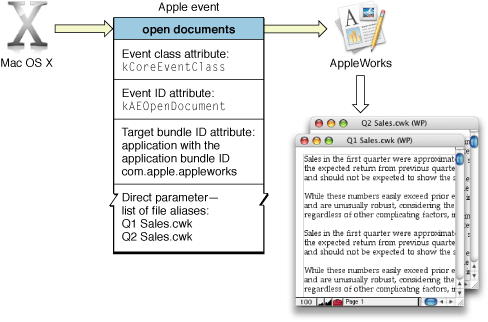
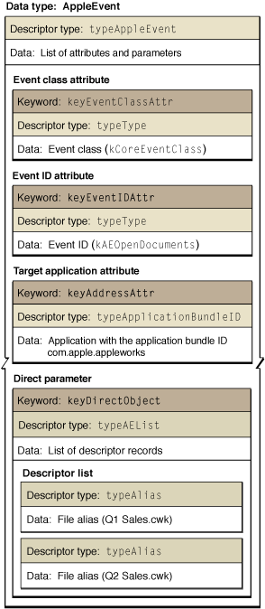

> 导航：[总目录](../../../README.md) · [documentation](../../../_indexes/documentation.md) · [Apple Events Programming Guide](Introduction%20to%20Apple%20Events%20Programming%20Guide.md)


[Next](Apple%20Event%20Dispatching.md)[Previous](About%20Apple%20Events.md)

# Building an Apple Event

This chapter provides an overview of Apple event data structures and describes how to build an Apple event.

An Apple event is capable of describing complex commands and the data necessary to carry them out. For example, an Apple event might request that a database application return data from records that meet certain criteria. An event sent by the Mac OS might request that the receiving application print a specified list of documents. The Apple Event Manager provides a relatively small number of Apple event data structures that together can be used to represent commands of great complexity.

Your application typically works with Apple events and the data they contain when:

- It receives an Apple event and must extract information to figure out what to do with the event.
- In response to a received Apple event, it must add information to a reply event to return to the sender.
- It creates an Apple event from scratch for internal communication or to request data or services from another application.

Working effectively with Apple events in these cases requires some knowledge of the data structures and organization of an Apple event, as well as familiarity with the Apple Event Manager functions you use to create Apple events and manipulate their data.

Understanding a few key concepts can help things go smoothly in creating an Apple event or working with its data:

- Each piece of information in an Apple event is associated with a four-character code (or in some cases, two such codes).
- A descriptor is a data structure that stores data and an accompanying four-character code. All the information you work with in an Apple event is stored in descriptors and lists of descriptors.
- The content of an Apple event is conceptually divided into two kinds of items, both constructed from descriptors:

  - Attributes identify characteristics of the task to be performed by the Apple event.
  - Parameters provide additional data to be used in performing the task.
- To create an Apple event, extract data from an event, or add data to an event, an application calls Apple Event Manager functions and passes the appropriate four-character codes and other information.
- To operate effectively with Apple events, you just need to find the right function for the task at hand.

This section describes the constants and data structures used to construct an Apple event.

The Apple Event Manager uses four-character codes (also referred to as Apple event codes) to identify the data within an Apple event. A four-character code is just four bytes of data that can be expressed as a string of four characters in the Mac OS Roman encoding. For example, `'capp'` is the four-character code that specifies an application.

The Apple Event Manager defines four-character-code constants for many common commands (or verbs) and data objects (or nouns) that can be used in Apple events. These constants are defined primarily in the header files `AppleEvents.h` and `AERegistry.h` in the AE framework. They are documented in _[Apple Event Manager Reference](https://developer.apple.com/documentation/applicationservices/apple_event_manager)_. A subset of these constants is described in [Selected Apple Event Constants](Selected%20Apple%20Event%20Constants.md#apple-f4xwc4dqnrsv64tfmyxwi33df52wszbpkridimbqgaytinbzfvbuqmrrgiwueqkcirauur2c) in this document.

[Listing 2-1](#apple-f4xwc4dqnrsv64tfmyxwi33df52wszbpkridimbqgaytinbzfvbuqmrqgmwueqkciveeorkf) shows some constants from `AERegistry.h`. Each constant definition includes a comment showing the actual numeric value as a hex number.

__Listing 2-1__  Some four-character codes from AERegistry.h

```
enum {
  cApplication                  = 'capp', /*  0x63617070  */
  cArc                          = 'carc', /*  0x63617263  */
  cBoolean                      = 'bool', /*  0x626f6f6c  */
  cCell                         = 'ccel', /*  0x6363656c  */
  cChar                         = 'cha ', /*  0x63686120  */
  cDocument                     = 'docu', /*  0x646f6375  */
  cGraphicLine                  = 'glin', /*  0x676c696e  */
...
};
```

For the Apple event support in your application, you should use existing constants wherever they make sense, rather than defining new constants. For example, if your application supports an Apple event to get the name of a document, you can use the constant `cDocument` to denote a document.

Apple reserves all values that consist entirely of lowercase letters and spaces. You can generally avoid conflicts with Apple-defined constants by including at least one uppercase letter when defining a four-character code.

An Apple event is uniquely identified by its _event class_ and _event ID_ attributes, each of which is an arbitrary four-character code (described in [Apple Event Constants](#apple-f4xwc4dqnrsv64tfmyxwi33df52wszbpkridimbqgaytinbzfvbuqmrqgmwugrkhi5cemrkb)). The Apple Event Manager uses these values in dispatching Apple events to code in your application (described in [Apple Event Dispatching](Apple%20Event%20Dispatching.md#apple-f4xwc4dqnrsv64tfmyxwi33df52wszbpkridimbqgaytinbzfvbuqmrqgqwueqkcirauur2c)).

Apple defines event class and event ID values for standard Apple events, including those that it sends. For example, a `delete` Apple event has an event class value of `'core'` (represented by the constant `kAECoreSuite`) and an event ID value of `'delo'` (`kAEDelete`). For examples and descriptions of Apple-defined event class and event ID values, see [Event Class Constants](Selected%20Apple%20Event%20Constants.md#apple-f4xwc4dqnrsv64tfmyxwi33df52wszbpkridimbqgaytinbzfvbuqmrrgiwvgvzs), [Event ID Constants for Apple Events Sent by the Mac OS](Selected%20Apple%20Event%20Constants.md#apple-f4xwc4dqnrsv64tfmyxwi33df52wszbpkridimbqgaytinbzfvbuqmrrgiwugsceirceirse), and [Event ID Constants for Standard AppleScript Commands](Selected%20Apple%20Event%20Constants.md#apple-f4xwc4dqnrsv64tfmyxwi33df52wszbpkridimbqgaytinbzfvbuqmrrgiwvgvzt).

You define the event class and event ID values for application-specific Apple events your application supports. While these values are arbitrary, you should follow the simple guidelines described in [Apple Event Constants](#apple-f4xwc4dqnrsv64tfmyxwi33df52wszbpkridimbqgaytinbzfvbuqmrqgmwugrkhi5cemrkb) in choosing values.

You can use a common event class for multiple Apple events as a way to group related events that your application supports. For example, many Apple-defined Apple events share a common event class. This can be useful in organizing the name space for your Apple events and may simplify your coding, but it doesn’t result in any special treatment by the Apple Event Manager.

If you want other applications to be able to send Apple events to your application, you must publish event class and event ID values for those events. You should also describe the contents your application expects to find in each type of Apple event.

Similarly, if you want to send Apple events to other applications, you are dependent on those applications to provide the event class, event ID, and any other information you need to construct an Apple event the application can understand. One exception is that most applications, including yours, should be able to handle the Apple events described in [Common Apple Events Sent by the Mac OS](Responding%20to%20Apple%20Events.md#apple-f4xwc4dqnrsv64tfmyxwi33df52wszbpkridimbqgaytinbzfvbuqmrqgywugrkhizdeuqsc). So, for example, you might construct a `quit` Apple event that targets almost any Mac OS X application, and expect the application to handle it.

Descriptors and descriptor lists are the basic structural elements used in Apple events. A _descriptor_ stores data and an accompanying descriptor type to form the basic building block of all Apple Events. The _descriptor type_ is a four-character code that identifies the type of data associated with the descriptor. [Table B-4](Selected%20Apple%20Event%20Constants.md#apple-f4xwc4dqnrsv64tfmyxwi33df52wszbpkridimbqgaytinbzfvbuqmrrgiwugrkhirdesq2g) lists constants for some of the main descriptor types—for a complete list, see _[Apple Event Manager Reference](https://developer.apple.com/documentation/applicationservices/apple_event_manager)_. Figure 2-1 shows the format of a descriptor.

__Figure 2-1__  A descriptor


The data field of a descriptor is opaque—you should not attempt to access it directly. [Table A-1](Selected%20Apple%20Event%20Manager%20Functions.md#apple-f4xwc4dqnrsv64tfmyxwi33df52wszbpkridimbqgaytinbzfvbuqmrrgewugrkhi5fecrcc) lists functions provided by the Apple Event Manager for accessing the data in a descriptor (and related data types).

Figure 2-2 shows a descriptor with a descriptor type of `typeUTF8Text`, which specifies that the descriptor’s data is text in UTF-8 encoding—in this case, the text is “Summary of Sales”.

__Figure 2-2__  A descriptor whose data is a Unicode text string



A _keyword_ is a four-character code used by the Apple Event Manager to identify a specific descriptor within an Apple event. A _keyword-specified descriptor_ combines a keyword with a descriptor. This is the basic type used to specify attributes and parameters, which are described in detail in [Apple Event Attributes and Parameters](#apple-f4xwc4dqnrsv64tfmyxwi33df52wszbpkridimbqgaytinbzfvbuqmrqgmwugrkhi5beeqse). Figure 2-3 shows the format of a keyword-specified descriptor.

__Figure 2-3__  A keyword-specified descriptor



An _address descriptor_ is a descriptor that specifies a target address for an Apple event—that is, it specifies the application or other process to send the event to. The descriptor type can be specified by one of the constants shown in [Table B-5](Selected%20Apple%20Event%20Constants.md#apple-f4xwc4dqnrsv64tfmyxwi33df52wszbpkridimbqgaytinbzfvbuqmrrgiwugrkhijeukrci).

A _descriptor list_ is a descriptor whose data consists of a list of zero or more descriptors (it can be an empty list). A descriptor list can contain other lists, which allows for the construction of complex descriptors, and hence complex Apple events. Figure 2-4 shows the format of a descriptor list.

__Figure 2-4__  A descriptor list



An _Apple event record_ is a descriptor list whose data is a set of keyword-specified descriptors that describe Apple event parameters.

An _Apple event_ is an Apple event record whose contents are conceptually divided into two parts, one for attributes and one for parameters, as shown in [Figure 2-6](#apple-f4xwc4dqnrsv64tfmyxwi33df52wszbpkridimbqgaytinbzfvbuqmrqgmwugrkhjbeuirsk).

Figure 2-5 shows the inheritance for descriptors and related data structures, with the corresponding data types shown in parentheses.

__Figure 2-5__  Hierarchy of Apple event data structures


An Apple Event Manager function that operates on one of these data structures can also operate on any type that inherits from it. For example, Apple events inherit from Apple event records, which inherit from descriptor lists. As a result, you can pass an Apple event to any Apple Event Manager function that expects an Apple event record or a descriptor list. Similarly, you can pass Apple events and Apple event records, as well as descriptor lists and descriptors, to any Apple Event Manager function that expects a descriptor. See [Table A-1](Selected%20Apple%20Event%20Manager%20Functions.md#apple-f4xwc4dqnrsv64tfmyxwi33df52wszbpkridimbqgaytinbzfvbuqmrrgewugrkhi5fecrcc) for a list of functions for working with the various data types.

Every Apple event consists of attributes and, often, parameters, as shown in Figure 2-6. Taken together, the attributes of an Apple event denote the task to be performed, while the parameters provide additional information to be used in performing the task.

__Figure 2-6__  An Apple event, with attributes and parameters



You use Apple Event Manager functions to create an Apple event, to add attributes or parameters to an Apple event, and to extract and examine the attributes or parameters from an Apple event.

An _Apple event attribute_ is a keyword-specified descriptor that identifies a characteristic of an Apple event. For example, every Apple event must include attributes for event class, event ID, and target address:

- The event class and event ID attributes provide a pair of arbitrary four-character codes that together uniquely identify an Apple event. For more information, see [Event Class and Event ID](#apple-f4xwc4dqnrsv64tfmyxwi33df52wszbpkridimbqgaytinbzfvbuqmrqgmwvgvzr).
- The _target address attribute_ specifies the process to send the Apple event to.

Apple events can include other kinds of attributes—see [Table B-6](Selected%20Apple%20Event%20Constants.md#apple-f4xwc4dqnrsv64tfmyxwi33df52wszbpkridimbqgaytinbzfvbuqmrrgiwugrkhjbbukr2h) for a list of keyword constants for Apple event attributes.

An _Apple event parameter_ is a keyword-specified descriptor that contains additional data for the command. Keywords for common Apple event parameters are shown in [Table B-7](Selected%20Apple%20Event%20Constants.md#apple-f4xwc4dqnrsv64tfmyxwi33df52wszbpkridimbqgaytinbzfvbuqmrrgiwugrkhirceessh).

As with attributes, there are various kinds of Apple event parameters. A _direct parameter_ usually specifies the data to be acted upon by the target application. For example, Figure 2-7 shows the main Apple event attributes and the direct parameter for an `open documents` event that targets the AppleWorks application. The direct parameter specifies a descriptor list containing file aliases to the documents to open. An Apple event has at most one direct parameter.

__Figure 2-7__  Main attributes and direct parameter of an open documents event



Apple event parameters can contain standard data types, such as text strings, integers of various lengths, Boolean values, and others, listed in [Table B-4](Selected%20Apple%20Event%20Constants.md#apple-f4xwc4dqnrsv64tfmyxwi33df52wszbpkridimbqgaytinbzfvbuqmrrgiwugrkhirdesq2g).

An Apple event can include other parameters, in addition to the direct parameter. For example, an Apple event that represents an arithmetic operation might contain a direct parameter that specifies a pair of values to operate on, as well as an additional parameter that specifies the operator. A reply Apple event may contain an error number parameter and an error string parameter, added by your application when an error occurs, as described in [Returning Error Information](Responding%20to%20Apple%20Events.md#apple-f4xwc4dqnrsv64tfmyxwi33df52wszbpkridimbqgaytinbzfvbuqmrqgywugrkhizdueqsh).

Your application cannot examine the attributes and parameters of an assembled Apple event directly. Instead, it calls Apple Event Manager functions such as `AEGetAttributeDesc` and `AEGetParamDesc` to request an attribute or parameter by keyword. Because attributes and parameters are descriptors, you can also operate on them by index, using the functions `AEGetNthDesc` or `AEGetNthPtr`. However, that only makes sense if, for example, you are iterating over every descriptor—you should not assume that the parameters or attributes in an Apple event are in any particular order.

Apple event parameters often contain descriptions of Apple event objects within the target application. For example, a `get data` Apple event contains a parameter that describes the Apple event object that contains the requested data. Thus, an event might request, for example, the first paragraph of text from a named document. Apple event objects are described in [“Resolving and Creating Object Specifier Records”](https://developer.apple.com/documentation/mac/IAC/IAC-231.html#HEADING231-0) in [Inside Macintosh: Interapplication Communication](https://developer.apple.com/documentation/mac/IAC/IAC-2.html).

For more information on accessing attributes and parameters in an Apple event, see [Working With the Data in an Apple Event](Working%20With%20the%20Data%20in%20an%20Apple%20Event.md#apple-f4xwc4dqnrsv64tfmyxwi33df52wszbpkridimbqgaytkobsfvbecqseiffeoqq).

An Apple event may be defined so that it has optional parameters. An _optional parameter_ is one that the sending application may or may not include. A target application must be prepared to handle the event whether or not the optional parameter is present. However, it can choose to ignore an optional parameter, even if present. This allows optional parameters to be added to an Apple event retroactively, without breaking existing code.

If an optional parameter is not present, or if your application chooses to ignore it, you should provide the default behavior for the Apple event. To determine if an optional parameter is present, you call a function such as `AEGetParamDesc`, specifying the keyword for the parameter. If the function returns successfully, you can extract information from the parameter and respond accordingly. If the function returns an error, you can assume the parameter is not present and provide the default behavior.

How do you put together the data structures described in this chapter to create an Apple event? The Apple Event Manager provides functions that lend themselves to two main approaches, which you can combine as needed:

- You can create an Apple event with one call, passing all the information needed for a complete Apple event.

  Related functions allow you to create a complex descriptor, attribute, or parameter and add it to an existing Apple event in one step.
- You can create an Apple event sequentially, by first creating a potentially incomplete event, then adding information to it with subsequent calls.

  With this approach, you build descriptors into more complex data structures from the bottom up.

In either case, your application relies on the Apple Event Manager to construct Apple event data structures based on the arguments you pass.

You can call the `AEBuildAppleEvent`function to create an Apple event in one step. To do so, you pass event class, event ID, and other information that is used to create the Apple event’s attributes. The `AEBuildAppleEvent` function includes parameters for specifying the target address—you don’t have to separately create an address descriptor. You may need to prepare data you’ll pass to `AEBuildAppleEvent`—for example, you may need to create aliases to files you will insert into the Apple event as a descriptor list.

In addition, you provide a specially formatted string, similar to the string you might pass to a `printf` function, along with parameters that specify the data that corresponds to items in the format string. As a result, `AEBuildAppleEvent` can also create the parameters for your Apple event, resulting in a full-fledged Apple event.

The Apple Event Manager also provides the `AEBuildDesc` function as a one-step mechanism for adding potentially complex descriptors to an existing Apple event, and the `AEBuildParameters` function for adding parameters or attributes.

The one-step functions are most useful in situations where your application knows in advance all the information needed to create an Apple event or other data structure. They also make it easier to do parameterized substitution of values. For an example of this approach, see [Creating an Apple Event With AEBuildAppleEvent](Creating%20and%20Sending%20Apple%20Events.md#apple-f4xwc4dqnrsv64tfmyxwi33df52wszbpkridimbqgaytinbzfvbuqmrqhewueqkcjbcesssb).

You can create the basic structure for an Apple event by calling the `AECreateAppleEvent` function. You pass information specifying event class, event ID, target address, return ID, and transaction ID; the function creates an Apple event containing the corresponding attributes. However, before you can call `AECreateAppleEvent`, you have to create a target address descriptor to pass to it, using a function such as `AECreateDesc`.

After calling `AECreateAppleEvent`, the resulting Apple event contains attributes for the event but no parameters. To add parameters to the event, you can use the `AEBuildDesc` and `AEBuildParameters` functions described in the previous section, or you can continue to work sequentially. For example, if the direct object of the event you are creating is a list of file aliases, you could create it sequentially by performing the following steps:

1. Call `AECreateDesc` once for each file alias to create a descriptor for it.
2. Call `AECreateList` to create a descriptor list.
3. Call `AEPutDesc` once for each descriptor to add it to the descriptor list.
4. Call `AEPutParamDesc` to add the descriptor list to the Apple event as a parameter.

This sequential approach is most useful for creating simple Apple events, or in situations where your application must factor the creation of an Apple event across several layers of code—for example, where you create an event, then pass it to various subsystems to add data to it.

For an example of how to create an Apple event step by step, see [Creating an Apple Event With AECreateAppleEvent](Creating%20and%20Sending%20Apple%20Events.md#apple-f4xwc4dqnrsv64tfmyxwi33df52wszbpkridimbqgaytinbzfvbuqmrqhewueqkcjjbuorck).

Figure 2-8 shows the main data structures of a complete Apple event, containing a list of keyword-specified descriptors that specify the attributes and parameters of an `open documents` Apple event. Although this is an event sent to your application by the Mac OS, events you create have a similar structure.

The figure includes attributes for the event class, event ID, and target address. It also shows the direct parameter—a keyword-specified descriptor with the keyword `keyDirectObject`. The entire figure corresponds to the `open documents` event shown in [Figure 2-7](#apple-f4xwc4dqnrsv64tfmyxwi33df52wszbpkridimbqgaytinbzfvbuqmrqgmwugrkhjfeecskj).

__Figure 2-8__  Structure of an open documents Apple event



[Next](Apple%20Event%20Dispatching.md)[Previous](About%20Apple%20Events.md)

