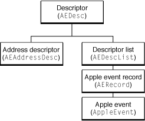

> 导航：[总目录](../../../README.md) · [documentation](../../../_indexes/documentation.md) · [Apple Events Programming Guide](Introduction%20to%20Apple%20Events%20Programming%20Guide.md)

[Next](Selected%20Apple%20Event%20Constants.md)[Previous](Testing%20and%20Debugging%20Apple%20Event%20Code.md)

# Selected Apple Event Manager Functions

This appendix provides a table of functions that you use to work with the data in Apple event data structures. For complete descriptions of these functions (and the underlying data types), see _[Apple Event Manager Reference](https://developer.apple.com/documentation/applicationservices/apple_event_manager)_.

Figure A-1 shows the hierarchy for key Apple event data structures. An Apple Event Manager function that operates on one of these data structures can also operate on any type that inherits from it. For example, the same function that works on a descriptor (`AEDesc`) also works on a descriptor list (`AEDescList`).

__Figure A-1__  Hierarchy of Apple event data structures

However, if there is a specific function for working with a data type, you should use that function. For example, because `AppleEvent` inherits from `AEDesc`, it is theoretically possible to create an Apple event with the `AECreateDesc` function (assuming you have access to the raw data for the Apple event). However, you should instead use the `AEBuild` function or the `AECreateAppleEvent` function, which are designed specifically for creating Apple events. For information on using these functions, see [Two Approaches to Creating an Apple Event](Building%20an%20Apple%20Event.md#apple-f4xwc4dqnrsv64tfmyxwi33df52wszbpkridimbqgaytinbzfvbuqmrqgmwugrkhirbumrkk).

Table A-1 shows some of the functions the Apple Event Manager provides for working with Apple event data structures. Functions listed for structure types higher in the table also work for types lower in the table, though as noted, you should generally use the most specific function available for a type. For structures that are stored by key value (such as Apple event attributes and parameters), you typically use a function that accesses data by key, rather than by index.

Some functions have both a pointer and a descriptor version (for example, `AECoerceDesc` and `AECoercePtr`). The pointer version works with data in a pointed to buffer, while the descriptor version works with data that is in a descriptor.

__Table A-1__  Functions for working with Apple event data structures

| Data type | Operation | Function |
| Descriptor  (`AEdesc`) | create | `AECreateDesc`, `AEBuildDesc` |
|  | dispose of | `AEDisposeDesc` |
|  | get data | `AEGetDescData`, `AEGetDescDataSize`,  `AEGetDescDataRange` (valid for `AEDesc` types only) |
|  | set data | `AEReplaceDescData` |
|  | coerce | `AECoerceDesc`, `AECoercePtr` |
| Descriptor list  (`AEDescList`) | create | `AECreateList` |
|  | count | `AECountItems` |
|  | get by index (base 1) | `AEGetNthDesc`, `AEGetNthPtr` |
|  | delete by index (base 1) | `AEDeleteItem` |
|  | put | `AEPutDesc`, `AEPutPtr`, `AEBuildDesc` |
| Apple event record  (`AERecord`) | get by key | `AEGetKeyDesc`, `AEGetKeyPtr` |
|  | delete by key | `AEDeleteKeyDesc` |
|  | put by key | `AEPutKeyDesc`, `AEPutKeyPtr` |
| Apple event  (`AppleEvent`) | create | `AECreateAppleEvent`,  `AEBuildAppleEvent` |
|  | get by parameter | `AEGetParamDesc`, `AEGetParamPtr` |
|  | get by attribute | `AEGetAttributeDesc`, `AEGetAttributePtr` |
|  | delete by parameter | `AEDeleteParam` |
|  | put by parameter | `AEPutParamDesc`, `AEPutParamPtr`, `AEBuildParameters` |
|  | put by attribute | `AEPutAttributeDesc`, `AEPutAttributePtr`, `AEBuildParameters` |

For the following functions, you can specify the descriptor type of the resulting data; if the actual descriptor type of the attribute or parameter is different from the specified type, the Apple Event Manager attempts to coerce it to the specified type:

- `AEGetParamPtr`
- `AEGetParamDesc`
- `AEGetAttributePtr`
- `AEGetAttributeDesc`
- `AEGetNthPtr`
- `AEGetNthDesc`

[Next](Selected%20Apple%20Event%20Constants.md)[Previous](Testing%20and%20Debugging%20Apple%20Event%20Code.md)

