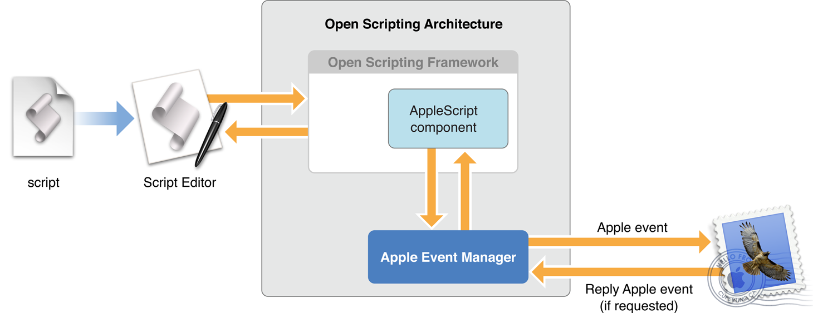

> 导航：[总目录](../../../README.md) · [documentation](../../../_indexes/documentation.md) · [AppleScript Overview](Introduction%20to%20AppleScript%20Overview.md)


[Next](Scripting%20with%20AppleScript.md)[Previous](About%20AppleScript.md)

# Open Scripting Architecture

The _Open Scripting Architecture (OSA)_ provides a standard and extensible mechanism for interapplication communication in OS X. Communication takes place through the exchange of Apple events, a type of message designed to encapsulate commands and data of any complexity.

Apple events provide an event dispatching and data transport mechanism that can be used within a single application, between applications on the same computer, and between applications on different computers. The OSA defines data structures, a set of common terms, and a library of functions, so that applications can more easily create and send Apple events, as well as receive them and extract data from them.

The OSA supports several powerful features in OS X:

- the ability to create scriptable applications (described in [Scriptable Applications](Scriptable%20Applications.md#apple-f4xwc4dqnrsv64tfmyxwi33df52wszbpkridimbqgaytknrzfvbecqsfijdugrq))
- the ability for users to write scripts that combine operations from multiple scriptable applications
- the ability to communicate between applications with Apple events

Applications that need full access to the Open Scripting Architecture can get it by linking with the Carbon framework. Some applications that work with Apple events (especially those with minimal user interface requirements) may be able to obtain all the services they need by linking to the Core Services framework.

The Open Scripting Architecture is made up of the following parts:

- The _Apple Event Manager_ provides an API for sending and receiving Apple events and working with the information they contain. It supplies the underlying support for creating scriptable applications. It is implemented in `AE.framework`, a subframework of `CoreServices.framework`. (Prior to OS X version 10.5, the `AE.framework` was a subframework of `ApplicationServices.framework`.)

  This framework also defines constants that developers can use to support a standard vocabulary for Apple events among different applications.

  For API documentation, see _[Apple Event Manager Reference](https://developer.apple.com/documentation/applicationservices/apple_event_manager)_. For conceptual documentation and code samples, see _[Apple Events Programming Guide](../Apple%20Events%20Programming%20Guide/Introduction%20to%20Apple%20Events%20Programming%20Guide.md#apple-f4xwc4dqnrsv64tfmyxwi33df52wszbpkridimbqgaytinbz)_.
- The _Carbon umbrella framework_ includes the HIToolbox framework, which in turn defines certain functions used in processing and sending Apple events (for example, in the header file `Interaction.h`).
- The _Open Scripting framework_ defines standard data structures, routines, and resources for creating scripting components, which support scripting languages. Because of its standard interface, applications can interact with any scripting component, regardless of its language. This framework provides API for compiling, executing, loading, and storing scripts. It is implemented in `OpenScripting.framework`, a subframework of `Carbon.framework`.

  For documentation, see _Open Scripting Architecture Reference_.
- The AppleScript component (in `System/Library/Components`) implements the AppleScript language, which provides a way for scripts to control scriptable applications.

  The AppleScript language is described in _[AppleScript Language Guide](../AppleScript%20Language%20Guide/Introduction%20to%20AppleScript%20Language%20Guide.md#apple-f4xwc4dqnrsv64tfmyxwi33df52wszbpkridimbqgaydsobt)_, as well as in a number of third-party books.

The Apple event is the basic message for interprocess communication in the Open Scripting Architecture. With Apple events, you can gather all the data necessary to accomplish a high level task into a single package that can be passed across process boundaries, evaluated, and returned with results.

An Apple event consists of a series of nested data structures, each identified by one or more four-character codes (also referred to as Apple event codes). These data structures, as well as the codes and the header files in which they are defined, are described in _[Apple Events Programming Guide](../Apple%20Events%20Programming%20Guide/Introduction%20to%20Apple%20Events%20Programming%20Guide.md#apple-f4xwc4dqnrsv64tfmyxwi33df52wszbpkridimbqgaytinbz)_. That document also provides conceptual information about Apple events and programming examples that work with them. For a list of four-character codes and their related terminology used by Apple, see _[AppleScript Terminology and Apple Event Codes Reference](https://developer.apple.com/library/archive/releasenotes/AppleScript/ASTerminology_AppleEventCodes/TermsAndCodes.html#//apple_ref/doc/uid/TP40004532)_. Your application can reuse these terms and codes whenever it performs an equivalent function.

The Mac OS takes advantage of Apple events to communicate with applications, such as to notify an application that it has been launched or should open or print a list of documents. Applications that present a graphical user interface must be able to respond to whichever of these events make sense for the application. For example, all such applications can be launched and quit, but some may not be able to open or print documents.

For detailed information on the events sent by the Mac OS and how to respond to them, see:

- For Carbon applications: “Handling Events Sent by the Mac OS” in [Responding to Apple Events](https://developer.apple.com/library/archive/documentation/AppleScript/Conceptual/AppleEvents/responding_aepg/responding_aepg.html#//apple_ref/doc/uid/TP40001449-CH206) in _[Apple Events Programming Guide](../Apple%20Events%20Programming%20Guide/Introduction%20to%20Apple%20Events%20Programming%20Guide.md#apple-f4xwc4dqnrsv64tfmyxwi33df52wszbpkridimbqgaytinbz)_.
- For Cocoa applications: [How Cocoa Applications Handle Apple Events](https://developer.apple.com/library/archive/documentation/Cocoa/Conceptual/ScriptableCocoaApplications/SApps_handle_AEs/SAppsHandleAEs.html#//apple_ref/doc/uid/20001239) in _[Cocoa Scripting Guide](../../Cocoa/Cocoa%20Scripting%20Guide/Introduction%20to%20Cocoa%20Scripting%20Guide.md#apple-f4xwc4dqnrsv64tfmyxwi33df52wszbpkridimbqgazdcnru)_.

The Open Scripting Architecture allows users to control multiple applications with scripts written in a variety of scripting languages. Each scripting language has a corresponding scripting component. The AppleScript component supports the AppleScript language. When a scripting component executes a script, statements in the script may result in Apple events being sent to applications.

Although AppleScript is the most widely used language (and the only one provided by Apple), developers are free to use the Open Scripting Architecture to create scripting components for other scripting languages. Depending on the implementation, scripts written in these languages may be able to communicate with scriptable applications.

Figure 1 shows what happens when the [Script Editor](Scripting%20with%20AppleScript.md#apple-f4xwc4dqnrsv64tfmyxwi33df52wszbpkridimbqgaytknryfuytcnjsgm3dk) application executes an AppleScript script that targets the Mail application. Script Editor calls functions in the Open Scripting framework. The Open Scripting framework communicates through the AppleScript component, which in turn uses the Apple Event Manager to send any required Apple events to the Mail application. If a reply is requested, the Mail application returns information in a reply Apple event.

__Figure 1__  How parts of the OSA work together in executing scripts



Applications can also call Apple Event Manager functions directly to send Apple events to other applications and get replies from them (not shown in Figure 1).

Developers can extend AppleScript by creating bundles that provide command handlers and coercion handlers. The bundles can be applications or scripting additions. However, in many cases the best solution for extending AppleScript is to provide features through a faceless background application—that is, a sort of invisible server application.

_Coercion_ is the process of converting the information in an Apple event from one type to another. A _coercion handler_ is a function that provides coercion between two (or possibly more) data types. OS X provides default coercion between many standard types. For a complete listing, see [Default Coercion Handlers](https://developer.apple.com/library/archive/documentation/AppleScript/Conceptual/AppleEvents/appendix3_aepg/appendix3_aepg.html#//apple_ref/doc/uid/TP40001449-CH213) in _[Apple Events Programming Guide](../Apple%20Events%20Programming%20Guide/Introduction%20to%20Apple%20Events%20Programming%20Guide.md#apple-f4xwc4dqnrsv64tfmyxwi33df52wszbpkridimbqgaytinbz)_.

Coercion is available to both scripts and applications. In a script, for example, the following statement coerces the numeric value 1234 to the string value “1234”.

```
set myString to 1234 as text
```

A scriptable application can specify a type when it uses an Apple Event Manager function to extract data from an Apple event. If the data is not already in the specified type, the Apple Event Manager will attempt to coerce it to that type. An application can provide coercion handlers for its own data types, as described in [Writing and Installing Coercion Handlers](https://developer.apple.com/library/archive/documentation/AppleScript/Conceptual/AppleEvents/coercions_aepg/coercions_aepg.html#//apple_ref/doc/uid/TP40001449-CH208) in _[Apple Events Programming Guide](../Apple%20Events%20Programming%20Guide/Introduction%20to%20Apple%20Events%20Programming%20Guide.md#apple-f4xwc4dqnrsv64tfmyxwi33df52wszbpkridimbqgaytinbz)_.

A _scripting addition_ is a file or bundle that provides AppleScript commands or coercions. A single scripting addition can contain multiple handlers. For example, the Standard Additions scripting addition in OS X (filename `StandardAdditions.osax`), includes commands for using the Clipboard, obtaining the path to a file, speaking text, executing shell scripts, and more. The commands provided by the Standard Additions are available to all scripts. To see what terminology a scripting addition provides, you can examine its dictionary, as described in [Displaying Scripting Dictionaries](Scripting%20with%20AppleScript.md#apple-f4xwc4dqnrsv64tfmyxwi33df52wszbpkridimbqgaytknryfuytcnjtgaydm).

Terms introduced by scripting additions exist in the same name space as AppleScript terms and application-defined terms. While this has the advantage of making a service globally available, it also means that terms from scripting additions can conflict with other terms, polluting the global name space. Debugging scripting additions can also be difficult. Because you can not simply set breakpoints in your own code, you may need to use sampling, profiling, and various other tools to determine where a problem lies. (See [Faceless Background Applications](#apple-f4xwc4dqnrsv64tfmyxwi33df52wszbpkridimbqgaytknzrfvjvomi) for an approach that avoids these problems.)

A scripting addition provides its services by installing event handlers (for commands) or coercion handlers (for coercions) in an application’s system dispatch tables. The handlers for the Standard Additions (and for any other scripting additions installed by the Mac OS in `/System/Library/ScriptingAdditions`) get installed if the application calls API in the Open Scripting framework, or if the application specifically loads a scripting addition. An application can also specifically load other scripting additions from other locations.

For information on writing scripting additions, see Technical Note TN1164, [Native Scripting Additions](https://developer.apple.com/technotes/tn/tn1164.html). For information on loading scripting additions, see Technical Q&A QA1070, [Loading Scripting Additions Without Initializing Apple Script in OS X](https://developer.apple.com/qa/qa2001/qa1070.html).

A faceless background application (now more commonly referred to as an agent), is one that, as its name implies, runs in the background and has no visible user interface. By creating a scriptable agent, you can provide services without some of the disadvantages of scripting additions. For example, you can develop and debug in a standard application environment, and any terminology you provide does not pollute the global name space—it is available only within a script’s `tell` statement that targets the agent.

You can install your agent directly, but if it is intended for use with another application, you can put it in the `Resources` folder of the application it supports. That promotes ease of use by allowing a drag-and-drop installation process, and will minimize users stumbling across the agent and asking “What is this for?“ The agent will be launched whenever it is referenced in a `tell` statement. It can be told to quit, and you can also set it up to time out, so it can get unloaded when it is no longer in use.

Apple provides a number of scriptable services through agents, as described in [System Events and GUI Scripting](AppleScript%20Utilities%20and%20Applications.md#apple-f4xwc4dqnrsv64tfmyxwi33df52wszbpkridimbqgaytknzqfuytcnbzga3ti), [Image Events](AppleScript%20Utilities%20and%20Applications.md#apple-f4xwc4dqnrsv64tfmyxwi33df52wszbpkridimbqgaytknzqfuytcnbxhezdc), and [Database Events](AppleScript%20Utilities%20and%20Applications.md#apple-f4xwc4dqnrsv64tfmyxwi33df52wszbpkridimbqgaytknzqfvjvomi). For example, scripts can use the System Events application to perform operations on property list files.

[Next](Scripting%20with%20AppleScript.md)[Previous](About%20AppleScript.md)

